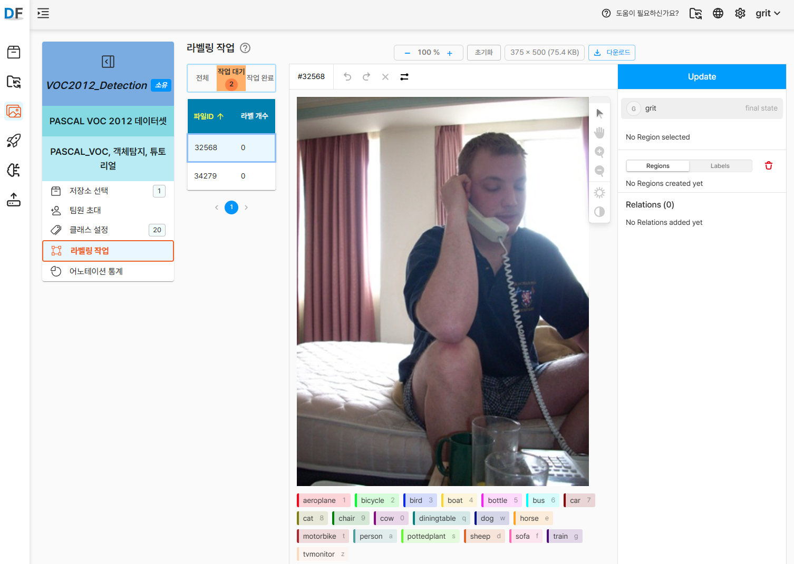
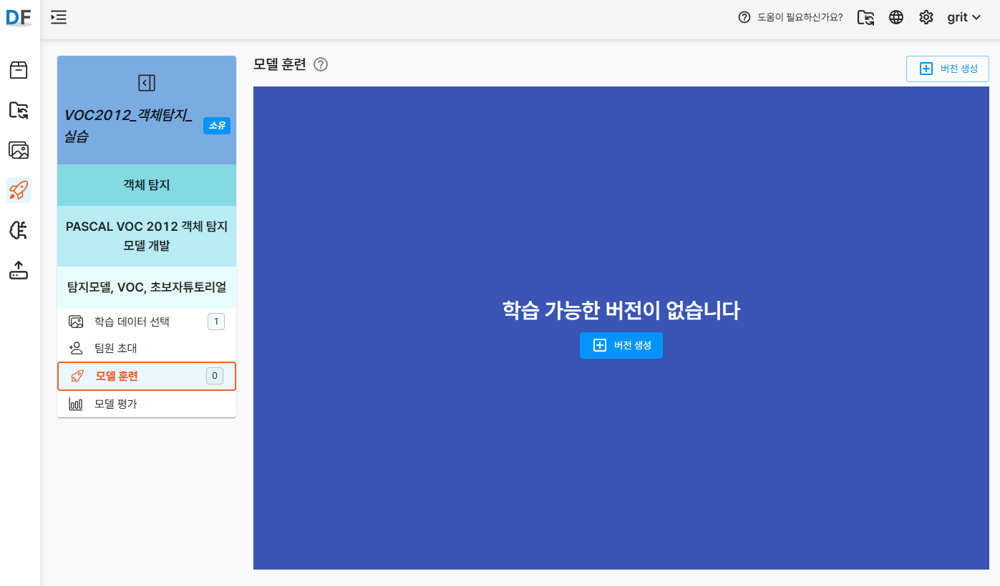
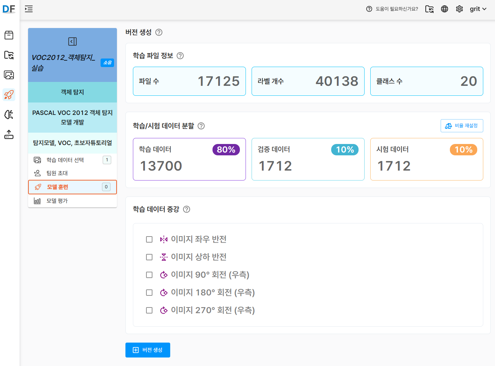
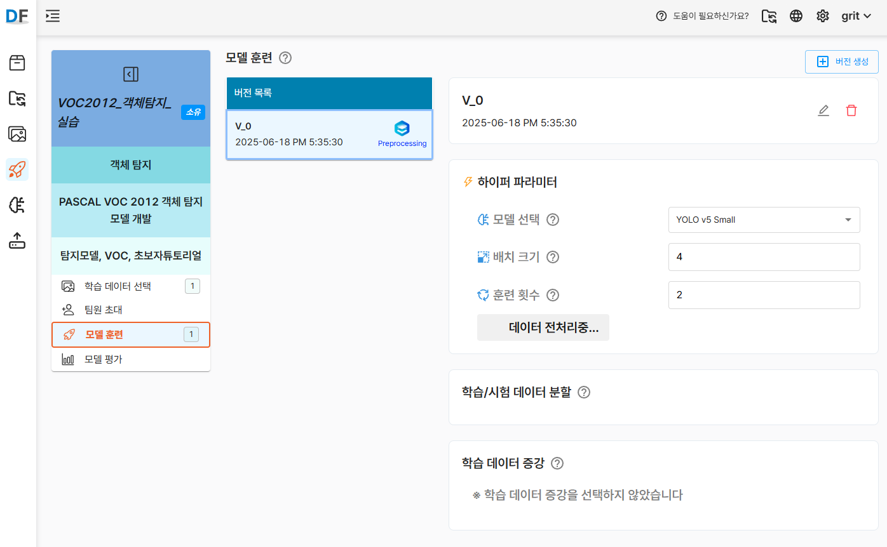

<!-- truncate -->

PASCAL VOC 2012 공개 데이터셋을 활용해 D-Lab Flow에서 **객체 탐지(Object Detection)** 모델을 만드는 방법을 소개합니다. D-Lab Flow는 코드 작성 없이도 학습부터 평가까지 한 번에 진행할 수 있어, 초보자도 손쉽게 비전 AI 프로젝트를 시작할 수 있습니다.

## 시작하기 전에

### D-Lab Flow 계정 발급받기

D-Lab Flow는 현재 **비공개 서비스**로 운영되어, 일반 사용자의 자유 가입이 제한되어 있습니다. 계정 발급을 위해서는 다음 절차를 따라주세요:

:::info 계정 발급 신청
**강원ICT융합연구원**에 문의하여 D-Lab Flow 계정을 발급받으실 수 있습니다.

📞 **문의처**: 강원ICT융합연구원  
📧 **이메일**: gritdevops@gmail.com  
🌐 **웹사이트**: https://grit.gwnu.ac.kr

**신청 시 필요 정보**:
- 신청자 소속 및 성명
- 사용 목적 (연구, 교육, 프로젝트 등)
- 연락처 정보
  :::

계정 발급이 완료되면, 제공받은 로그인 정보로 D-Lab Flow에 접속하여 이번 튜토리얼을 따라하실 수 있습니다.

:::tip 비공개 서비스 이용 안내
- 현재 초청 기반 비공개 서비스로 운영 중이며, 향후 가입 방식이 변경될 수 있습니다
- 비공개 서비스 기간 중에는 일부 기능이 제한되거나 변경될 수 있습니다
- 서비스 문의 및 개선 제안은 gritdevops@gmail.com 로 이메일 부탁드립니다.
  :::

## 1. 데이터 준비

### 1.1 PASCAL VOC 2012 데이터셋 다운로드

    1. PASCAL VOC 2012 데이터셋을 다운로드합니다.
    - [공식 웹사이트](http://host.robots.ox.ac.uk/pascal/VOC/voc2012/)에서 다운로드 (속도느림)
    - [Kaggle](https://www.kaggle.com/datasets/gopalbhattrai/pascal-voc-2012-dataset)에서도 다운로드 가능 (속도빠름)
    - 이미지 수천 장과 XML 형식의 라벨 정보를 포함
    - **CC BY 4.0** 라이선스로 배포 (원 저작자: *Mark Everingham et al.*)
    - 20개 클래스 (사람, 자동차, 자전거, 비행기, 배, 버스, 고양이, 개 등)의 객체 분류 및 탐지용 데이터

2. 다운로드한 압축 파일을 풀면 다음과 같은 구조를 확인할 수 있습니다:
   ```
   VOC2012_train_val
     ├── JPEGImages/         # 원본 이미지 파일들
     ├── Annotations/        # XML 형식의 라벨 파일들
     ├── ImageSets/          # 학습/검증/테스트 데이터 분할 정보
     ├── SegmentationClass/  # 세그멘테이션 Class 마스크 이미지들
     └── SegmentationObject/ # 세그멘테이션 Object 마스크 이미지들
   VOC2012_test_val
     ├── JPEGImages/         # 테스트용 이미지 파일들
     ├── Annotations/        # XML 형식의 라벨 파일들
     └── ImageSets/          # 테스트 데이터 분할 정보
   ```

### 1.2 학습 데이터 확인

D-Lab Flow에서 효율적으로 업로드하기 위해 다음과 같이 데이터를 준비합니다.

1. **필요한 폴더만 선별**: 객체 탐지 모델 학습을 위해서는 `VOC2012_train_val` 폴더안의 `JPEGImages`와 `Annotations` 폴더만 필요합니다.
2. **파일 이름 확인**: 이미지 파일과 XML 라벨 파일의 이름이 정확히 매칭되는지 확인합니다.


## 2. D-Lab Flow 데이터 저장소 및 데이터셋 생성

### 2.1 D-Lab Flow 로그인

발급받은 계정 정보로 D-Lab Flow에 로그인합니다.

1. D-Lab Flow 웹사이트 접속
2. 제공받은 **사용자 ID**와 **비밀번호** 입력
3. 로그인 완료 후 메인 대시보드 확인

:::warning 로그인 관련 주의사항
- 처음 로그인 시 비밀번호 변경을 권장합니다
- 계정 정보는 타인과 공유하지 마세요
- 로그인에 문제가 있을 경우 gritdevops@gmail.com로 이메일 문의 부탁드립니다
  :::

### 2.2 데이터 저장소 생성

먼저 학습 데이터를 체계적으로 관리하기 위한 데이터 저장소를 생성해야 합니다.

1. D-Lab Flow 메인 화면에서 **데이터 저장소** 메뉴로 이동
2. `저장소 생성` 버튼을 클릭
3. 다음 정보를 입력:
   - **저장소 이름**: PASCAL_VOC_2012 (명확하고 구분 가능한 이름)
   - **해시태그**: VOC, 객체탐지, 공개데이터 (검색 및 식별용 키워드)
   - **파일 타입**: 이미지 (현재 지원되는 유일한 타입)

데이터 저장소 생성에 관한 상세 매뉴얼은 [D-Lab Flow 공식 문서](https://grit-docs.github.io/dlabflow/docs/data_management/data_storage#%EC%A0%80%EC%9E%A5%EC%86%8C-%EC%83%9D%EC%84%B1)를 참고하세요.


### 2.3 이미지 파일 업로드

생성한 데이터 저장소에 PASCAL VOC 2012 이미지들을 업로드합니다.

1. 생성된 저장소 선택
2. `업로드` 버튼 클릭
3. 업로드 방식 선택:
    - **업로드 파일**: JPEGImages 폴더의 이미지들을 개별적으로 선택
    - **업로드 폴더**: JPEGImages 폴더를 한 번에 업로드 (권장)

:::tip 업로드 팁
- 지원 포맷: .jpg, .png, .bmp
- 대용량 파일의 경우 안정적인 네트워크 환경에서 업로드
- 업로드 진행률을 확인하며 중단되지 않도록 주의
- 한 번에 최대 10,000개 파일, 총 1.5GB까지 업로드할 수 있습니다.
  :::

이미지 파일 업로드에 관한 상세 매뉴얼은 [D-Lab Flow 공식 문서](https://grit-docs.github.io/dlabflow/docs/data_management/data_upload#%EC%97%85%EB%A1%9C%EB%93%9C-%EA%B8%B0%EB%8A%A5)를 참고하세요.


### 2.4 데이터셋 생성

업로드된 이미지들을 하나의 데이터셋으로 구성합니다.

1. `데이터셋 생성` 버튼 클릭
2. 데이터셋 정보 입력:
    - **데이터셋 이름**: VOC2012_Detection
    - **해시태그**: PASCAL_VOC, 객체탐지, 튜토리얼
    - **메모**: PASCAL VOC 2012 데이터셋

데이터셋 생성에 관한 상세 매뉴얼은 [D-Lab Flow 공식 문서](https://grit-docs.github.io/dlabflow/docs/manage_dataset/manage_dataset#%EB%8D%B0%EC%9D%B4%ED%84%B0%EC%85%8B-%EC%83%9D%EC%84%B1)를 참고하세요.


## 3. 라벨링 정보 업로드 및 처리

### 3.1 라벨 정보 파일 업로드

PASCAL VOC 포맷의 XML 라벨 파일들을 D-Lab Flow에 업로드합니다.

1. 저장소 선택 화면의 조작영역에서 라벨링 정보 업로드 아이콘 클릭
2. `Annotations` 폴더 또는 개별 XML 파일들을 선택하여 업로드
3. **중요 설정**:
    - `자동 클래스 생성` 옵션 체크 ✅
    - 이 옵션을 활성화하면 XML 파일에 정의된 모든 클래스가 자동으로 등록됩니다.

:::warning 주의사항
- XML 파일명과 이미지 파일명이 정확히 일치해야 매칭됩니다
- 대소문자 구분에 유의하세요
- 확장자를 제외한 파일명이 동일해야 합니다 (예: image001.jpg ↔ image001.xml)
  :::


### 3.2 클래스 정보 확인 및 편집

라벨 파일 업로드가 완료되면 자동으로 추출된 클래스 정보를 확인합니다.

1. **자동 생성된 클래스 목록 확인**:
    - person, car, bicycle, aeroplane, boat, bus, cat, dog 등 20개 클래스
    - 각 클래스별 라벨 개수 확인


2. **어노테이션 통계 정보 확인**:
   - 파일수, 라벨 개수, 클래스 수
   - 각 항목별 수량 확인


### 3.3 라벨링 검증 및 보완

업로드된 라벨링 정보를 검토하고 필요시 수정합니다.


1. **라벨링 작업** 도구 접속

2. **시각적 검증**:
    - 각 이미지의 바운딩 박스가 올바르게 표시되는지 확인
    - 클래스 라벨이 정확히 매칭되었는지 검토
    - 누락된 객체나 잘못된 라벨링이 있는지 점검

3. **수동 보완 작업** (필요시):
    - 마우스 드래그로 바운딩 박스 수정
    - 클래스 라벨 변경
    - 누락된 객체에 대한 라벨링 추가



4. **변경사항 저장**: 수정 완료 후 반드시 `업데이트` 버튼 클릭

## 4. 프로젝트 및 버전 생성

### 4.1 AI 프로젝트 생성

데이터셋을 기반으로 실제 AI 모델 학습을 위한 프로젝트를 생성합니다.

1. **프로젝트** 메뉴로 이동
2. `프로젝트 생성` 버튼 클릭
3. 프로젝트 설정:
    - **프로젝트명**: VOC2012_객체탐지_실습
    - **프로젝트 타입**: 객체 탐지 선택
    - **해시태그**: 탐지모델, VOC, 초보자튜토리얼
    - **메모**: PASCAL VOC 2012 객체 탐지 모델 개발

:::info 프로젝트 타입 선택
- **객체 탐지**: 이미지 내 여러 객체의 위치와 클래스를 동시에 예측
- 이 튜토리얼에서는 **객체 탐지**를 사용합니다
  :::


4.**데이터셋 연결**: 앞서 생성한 "VOC2012_Classification" 데이터셋 선택


### 4.2 학습 버전 생성

프로젝트 내에서 구체적인 학습 설정을 담은 버전을 생성합니다.

1. 생성된 프로젝트 상세 화면에서 `버전 생성` 버튼 클릭



2. 학습 파일 정보 확인
3. 학습/시험 데이터 부할 확인
4. 학습 데이터 증강 선택
5. 버전 생성 버튼 클릭



6. 데이터 전처리 진행 확인




### 4.3 상세 학습 설정

버전 생성 페이지에서 다양한 학습 옵션을 설정할 수 있습니다.

#### 4.3.1 학습 파일 정보 확인
- **총 이미지 수**: 17,125장 (실제 업로드된 수량에 따라 변동)
- **라벨 개수**: 약 40,000개 (하나의 이미지에 여러 객체가 포함될 수 있음)
- **클래스 수**: 20개
- **매칭된 파일 수**: XML과 이미지 파일이 정상적으로 매칭된 수량

#### 4.3.2 데이터 분할 설정
- **학습 데이터**: 70% (모델 훈련용)
- **검증 데이터**: 20% (훈련 중 성능 모니터링용)
- **테스트 데이터**: 10% (최종 평가용)

:::tip 데이터 분할 권장사항
- 데이터가 충분한 경우: 학습 60%, 검증 20%, 테스트 20%
- 데이터가 제한적인 경우: 학습 70%, 검증 20%, 테스트 10%
- 초보자의 경우 기본 설정값 사용 권장
  :::

#### 4.3.3 데이터 증강 옵션
학습 데이터의 다양성을 높이기 위한 증강 기법들을 선택할 수 있습니다:

- ✅ **좌우 반전** (Horizontal Flip): 50% 확률로 이미지를 좌우로 뒤집음
- ✅ **회전** (Rotation): ±15도 범위 내에서 랜덤 회전
- ✅ **밝기 조정** (Brightness): ±20% 범위 내에서 밝기 변경
- ⬜ **상하 반전** (Vertical Flip): 객체 분류에서는 보통 비활성화
- ⬜ **크롭** (Crop): 필요에 따라 선택

4. 모든 설정 완료 후 `버전 생성` 버튼 클릭

_학습 설정 화면 스크린샷 자리_

## 5. 모델 학습 및 실시간 모니터링

### 5.1 학습 파라미터 설정

데이터 전처리가 완료되면 `인공지능 학습 시작` 버튼이 활성화됩니다.

1. **모델 선택**:
    - **ResNet50** (권장): 중간 수준의 복잡도와 안정적인 성능
    - **EfficientNet-B0**: 효율적인 연산과 우수한 성능의 균형
    - **MobileNetV2**: 빠른 추론 속도가 필요한 경우

2. **주요 하이퍼파라미터**:
    - **배치 크기**: 16 (GPU 메모리에 따라 조정 가능)
    - **훈련 횟수 (Epochs)**: 50회 (초기 실습용, 충분한 학습을 위해서는 100+ 권장)
    - **학습률**: 0.001 (기본값 사용 권장)

:::warning 하이퍼파라미터 설정 가이드
- **배치 크기**: 클수록 학습 속도 향상, 하지만 메모리 사용량 증가
- **훈련 횟수**: 너무 많으면 과적합, 너무 적으면 성능 저하
- 초보자는 기본값 사용 후 점진적으로 조정 권장
- 비공개 서비스 기간 중 학습 시간에 제한이 있을 수 있습니다
  :::

### 5.2 학습 시작 및 실시간 모니터링

1. `학습 시작` 버튼 클릭
2. **실시간 모니터링 대시보드**에서 다음 정보를 확인할 수 있습니다:

    - **Loss 그래프**:
        - Training Loss (파란색): 학습 데이터에 대한 손실값
        - Validation Loss (주황색): 검증 데이터에 대한 손실값
        - 두 선이 함께 감소하면 정상적인 학습 진행

    - **Accuracy 그래프**:
        - Training Accuracy: 학습 데이터 정확도
        - Validation Accuracy: 검증 데이터 정확도
        - 지속적으로 상승하는 추세여야 함

    - **학습 진행 상태**:
        - 현재 에폭 수 / 전체 에폭 수
        - 남은 예상 시간
        - 현재 배치 처리 속도

### 5.3 학습 중 주의사항

- **과적합 징후 감지**: Validation Loss가 증가하기 시작하면 조기 종료 고려
- **학습 안정성**: Loss가 급격히 변동한다면 학습률 조정 필요
- **리소스 사용량**: GPU/CPU 사용률과 메모리 사용량 모니터링

_학습 진행 모니터링 화면 스크린샷 자리_

## 6. 모델 성능 평가 및 분석

### 6.1 기본 성능 지표

학습이 완료되면 `평가` 탭에서 다양한 성능 지표를 확인할 수 있습니다.

#### 주요 성능 지표:

1. **평균 정밀도 (Mean Average Precision, mAP)**:
    - 전체 클래스에 대한 정밀도의 평균
    - 0.0 ~ 1.0 사이의 값, 높을수록 좋음
    - 일반적으로 0.5 이상이면 실용적인 성능

2. **정밀도 (Precision)**:
    - 모델이 Positive로 예측한 것 중 실제로 Positive인 비율
    - False Positive를 얼마나 잘 줄였는지를 나타냄
    - Precision = TP / (TP + FP)

3. **재현율 (Recall)**:
    - 실제 Positive 중에서 모델이 올바르게 Positive로 예측한 비율
    - False Negative를 얼마나 잘 줄였는지를 나타냄
    - Recall = TP / (TP + FN)

4. **F1-Score**:
    - Precision과 Recall의 조화평균
    - F1 = 2 × (Precision × Recall) / (Precision + Recall)

### 6.2 상세 분석 도구

#### 6.2.1 혼동 행렬 (Confusion Matrix)

클래스별 예측 성능을 시각적으로 확인할 수 있는 중요한 도구입니다.

_혼동 행렬 예시 스크린샷 자리_

- **대각선 요소**: 올바른 예측 (높을수록 좋음)
- **비대각선 요소**: 잘못된 예측 (낮을수록 좋음)
- **자주 헷갈리는 클래스 조합 파악**: 예) cat ↔ dog, car ↔ bus

#### 6.2.2 클래스별 성능 분석

각 클래스별로 상세한 성능을 확인할 수 있습니다:

| 클래스명 | Precision | Recall | F1-Score | 이미지 수 |
|---------|-----------|--------|----------|-----------|
| person  | 0.85     | 0.78   | 0.81     | 4,528     |
| car     | 0.92     | 0.88   | 0.90     | 1,201     |
| cat     | 0.78     | 0.82   | 0.80     | 1,080     |
| dog     | 0.75     | 0.79   | 0.77     | 1,025     |
| ...     | ...      | ...    | ...      | ...       |

#### 6.2.3 예측 결과 시각화

실제 테스트 이미지에 대한 예측 결과를 시각적으로 확인할 수 있습니다.

- **올바른 예측 사례**: 모델이 정확하게 분류한 이미지들
- **오분류 사례**: 모델이 잘못 분류한 이미지들과 원인 분석
- **신뢰도 점수**: 각 예측에 대한 모델의 확신 정도 (0~100%)

_예측 결과 시각화 화면 스크린샷 자리_

### 6.3 성능 개선 방안

모델 성능이 기대에 미치지 못할 경우 다음과 같은 방법들을 고려해볼 수 있습니다:

#### 6.3.1 데이터 관련 개선
- **데이터 품질 향상**: 잘못된 라벨링 수정, 저품질 이미지 제거
- **데이터 증강 강화**: 더 다양한 증강 기법 적용
- **클래스 불균형 해결**: 데이터가 부족한 클래스에 대한 추가 수집

#### 6.3.2 모델 및 학습 설정 개선
- **모델 변경**: 더 복잡한 모델 (ResNet101, EfficientNet-B3 등) 시도
- **학습률 조정**: 더 작은 학습률로 세밀한 학습 진행
- **에폭 수 증가**: 충분한 학습을 위해 훈련 횟수 증가

#### 6.3.3 전이학습 활용
- **사전훈련된 모델**: ImageNet으로 사전훈련된 모델 weights 활용
- **Fine-tuning**: 마지막 레이어만 학습하거나 전체 네트워크를 미세조정

## 7. 모델 배포 및 실제 활용

### 7.1 모델 내보내기

학습이 완료된 모델을 실제 애플리케이션에서 사용하기 위해 내보낼 수 있습니다.

1. **모델 포맷 선택**:
    - **ONNX**: 다양한 플랫폼에서 호환성이 좋음
    - **TensorFlow**: TensorFlow/Keras 환경에서 사용
    - **PyTorch**: PyTorch 환경에서 사용

2. **모델 최적화 옵션**:
    - **양자화**: 모델 크기 감소 및 추론 속도 향상
    - **프루닝**: 불필요한 가중치 제거

:::info 비공개 서비스 제한사항
현재 비공개 서비스 기간 중에는 모델 내보내기 기능이 제한될 수 있습니다.  
자세한 내용은 gritdevops@gmail.com로 이메일 문의 부탁드립니다.
:::

### 7.2 추론 API 활용

D-Lab Flow에서 제공하는 REST API를 통해 실시간 추론이 가능합니다.

```javascript
// 예시: JavaScript를 사용한 API 호출
const formData = new FormData();
formData.append('image', imageFile);

fetch('https://api.d-lab-flow.com/v1/predict/{model_id}', {
    method: 'POST',
    headers: {
        'Authorization': 'Bearer YOUR_API_KEY'
    },
    body: formData
})
.then(response => response.json())
.then(data => {
    console.log('예측 결과:', data.predictions);
    console.log('신뢰도:', data.confidence);
});
```
