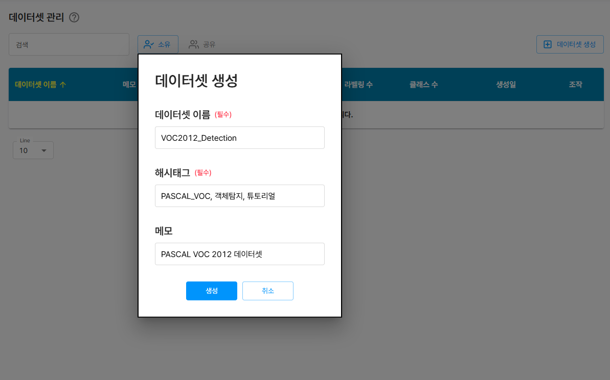
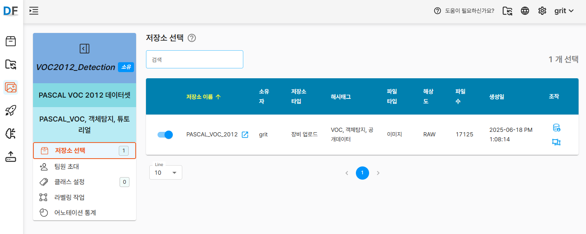

<div style={{display: 'flex', justifyContent: 'space-between', alignItems: 'center', marginBottom: '20px'}}>
  <span>PASCAL VOC 2012 공개 데이터셋을 활용해 D-Lab Flow에서 객체 탐지(Object Detection) 모델을 만드는 방법을 소개합니다. D-Lab Flow는 코드 작성 없이도 학습부터 평가까지 한 번에 진행할 수 있어, 초보자도 손쉽게 비전 AI 프로젝트를 시작할 수 있습니다.</span>
</div>

<!-- truncate -->

## 시작하기 전에

컴퓨터 비전 분야에서 널리 사용되는 PASCAL VOC 2012 공개 데이터셋을 활용하여 **객체 탐지(Object Detection)** AI 모델을 만들어 봅니다. 

D-Lab Flow 플랫폼을 사용하면 복잡한 코드 작성 없이도 데이터 준비부터 모델 학습, 평가까지 전체 과정을 직관적인 인터페이스로 진행할 수 있습니다.

완성된 모델은 이미지 내 다양한 객체(사람, 자동차, 동물 등)를 인식하고 정확한 위치를 찾아내는 기능을 갖추게 됩니다. 

이 과정을 통해 D-Lab Flow의 기본 사용 방법을 이해하고, 실제 프로젝트에 적용할 수 있는 실무 경험을 쌓을 수 있습니다.


### D-Lab Flow 계정 발급받기

D-Lab Flow는 현재 **비공개 서비스**로 운영되어, 일반 사용자의 자유 가입이 제한되어 있습니다. 계정 발급을 위해서는 다음 절차를 따라주세요:

:::info 계정 발급 신청
**강원ICT융합연구원**에 문의하여 D-Lab Flow 계정을 발급받으실 수 있습니다.

📞 **문의처**: 강원ICT융합연구원  
📧 **이메일**: gritdevops@gmail.com  
🌐 **웹사이트**: https://grit.gwnu.ac.kr

**신청 시 필요 정보**:
- 신청자 소속 및 성명
- 사용 목적 (연구, 교육, 프로젝트 등)
- 연락처 정보
  :::

계정 발급이 완료되면, 제공받은 로그인 정보로 D-Lab Flow에 접속하여 이번 튜토리얼을 따라하실 수 있습니다.

:::tip 비공개 서비스 이용 안내
- 현재 초청 기반 비공개 서비스로 운영 중이며, 향후 가입 방식이 변경될 수 있습니다
- 비공개 서비스 기간 중에는 일부 기능이 제한되거나 변경될 수 있습니다
- 서비스 문의 및 개선 제안은 gritdevops@gmail.com 로 이메일 부탁드립니다.
  :::

## 1. 데이터 준비

### 1.1 PASCAL VOC 2012 데이터셋 다운로드

    1. PASCAL VOC 2012 데이터셋을 다운로드합니다.
       - [**공식 웹사이트**](http://host.robots.ox.ac.uk/pascal/VOC/voc2012/)에서 다운로드 (속도느림)
       - [**Kaggle**](https://www.kaggle.com/datasets/gopalbhattrai/pascal-voc-2012-dataset)에서도 다운로드 가능 (속도빠름)
       - **약 17,000장의 이미지**와 XML 형식의 라벨 정보 포함
       - **CC BY 4.0** 라이선스로 배포 (원 저작자: *Mark Everingham et al.*)
       - **20개 클래스** (사람, 자동차, 자전거, 비행기, 배, 버스, 고양이, 개 등)의 객체 분류 및 탐지용 데이터

2. 다운로드한 압축 파일을 풀면 다음과 같은 구조를 확인할 수 있습니다:
   ```
   VOC2012_train_val
     ├── JPEGImages/         # 원본 이미지 파일들
     ├── Annotations/        # XML 형식의 라벨 파일들
     ├── ImageSets/          # 학습/검증/테스트 데이터 분할 정보
     ├── SegmentationClass/  # 세그멘테이션 Class 마스크 이미지들
     └── SegmentationObject/ # 세그멘테이션 Object 마스크 이미지들
   VOC2012_test_val
     ├── JPEGImages/         # 테스트용 이미지 파일들
     ├── Annotations/        # XML 형식의 라벨 파일들
     └── ImageSets/          # 테스트 데이터 분할 정보
   ```

### 1.2 학습 데이터 확인

D-Lab Flow에서 효율적으로 업로드하기 위해 다음과 같이 데이터를 준비합니다.

1. **필요한 폴더만 선별**: 객체 탐지 모델 학습을 위해서는 `VOC2012_train_val` 폴더안의 `JPEGImages`와 `Annotations` 폴더만 필요합니다.
2. **파일 이름 확인**: 이미지 파일과 XML 라벨 파일의 이름이 정확히 매칭되는지 확인합니다.


## 2. D-Lab Flow 데이터 저장소 및 데이터셋 생성

### 2.1 D-Lab Flow 로그인

발급받은 계정 정보로 D-Lab Flow에 로그인합니다.

1. D-Lab Flow 웹사이트 접속
2. 제공받은 **사용자 ID**와 **비밀번호** 입력
3. 로그인 완료 후 메인 대시보드 확인

:::warning 로그인 관련 주의사항
- 처음 로그인 시 비밀번호 변경을 권장합니다
- 계정 정보는 타인과 공유하지 마세요
- 로그인에 문제가 있을 경우 gritdevops@gmail.com로 이메일 문의 부탁드립니다
  :::

### 2.2 데이터 저장소 생성

먼저 학습 데이터를 체계적으로 관리하기 위한 데이터 저장소를 생성해야 합니다.

1. D-Lab Flow 메인 화면에서 **데이터 저장소** 메뉴로 이동
2. `저장소 생성` 버튼을 클릭
3. 다음 정보를 입력:
   - **저장소 이름**: PASCAL_VOC_2012 (명확하고 구분 가능한 이름)
   - **해시태그**: VOC, 객체탐지, 공개데이터 (검색 및 식별용 키워드)
   - **파일 타입**: 이미지 (현재 지원되는 유일한 타입)

데이터 저장소 생성에 관한 상세 매뉴얼은 [D-Lab Flow 공식 문서](https://grit-docs.github.io/dlabflow/docs/data_management/data_storage#%EC%A0%80%EC%9E%A5%EC%86%8C-%EC%83%9D%EC%84%B1)를 참고하세요.


### 2.3 이미지 파일 업로드

생성한 데이터 저장소에 PASCAL VOC 2012 이미지들을 업로드합니다.

1. 생성된 저장소 선택
2. `업로드` 버튼 클릭
3. 업로드 방식 선택:
    - **업로드 파일**: JPEGImages 폴더의 이미지들을 개별적으로 선택
    - **업로드 폴더**: JPEGImages 폴더를 한 번에 업로드 (권장)

:::tip 업로드 팁
- 지원 포맷: .jpg, .png, .bmp
- 대용량 파일의 경우 안정적인 네트워크 환경에서 업로드
- 업로드 진행률을 확인하며 중단되지 않도록 주의
- 한 번에 최대 10,000개 파일, 총 1.5GB까지 업로드할 수 있습니다.
- 파일 수나 용량이 초과되는 경우, 폴더를 분할하여 나눠서 업로드해 주세요.
  :::

이미지 파일 업로드에 관한 상세 매뉴얼은 [D-Lab Flow 공식 문서](https://grit-docs.github.io/dlabflow/docs/data_management/data_upload#%EC%97%85%EB%A1%9C%EB%93%9C-%EA%B8%B0%EB%8A%A5)를 참고하세요.


### 2.4 데이터셋 생성

업로드된 이미지들을 하나의 데이터셋으로 구성합니다.

1. `데이터셋 생성` 버튼 클릭
2. 데이터셋 정보 입력:
    - **데이터셋 이름**: VOC2012_Detection
    - **해시태그**: PASCAL_VOC, 객체탐지, 튜토리얼
    - **메모**: PASCAL VOC 2012 데이터셋

데이터셋 생성에 관한 상세 매뉴얼은 [D-Lab Flow 공식 문서](https://grit-docs.github.io/dlabflow/docs/manage_dataset/manage_dataset#%EB%8D%B0%EC%9D%B4%ED%84%B0%EC%85%8B-%EC%83%9D%EC%84%B1)를 참고하세요.



## 3. 라벨링 정보 업로드 및 처리

### 3.1 라벨 정보 파일 업로드

PASCAL VOC 포맷의 XML 라벨 파일들을 D-Lab Flow에 업로드합니다.

1. 저장소 선택 화면의 조작영역에서 라벨링 정보 업로드 아이콘 클릭
2. `Annotations` 폴더 또는 개별 XML 파일들을 선택하여 업로드
3. **중요 설정**:
    - `자동 클래스 생성` 옵션 체크 ✅
    - 이 옵션을 활성화하면 XML 파일에 정의된 모든 클래스가 자동으로 등록됩니다.

:::warning 주의사항
- XML 파일명과 이미지 파일명이 정확히 일치해야 매칭됩니다
- 대소문자 구분에 유의하세요
- 확장자를 제외한 파일명이 동일해야 합니다 (예: image001.jpg ↔ image001.xml)
  :::

라벨링 정보 업로드에 관한 상세 매뉴얼은 [D-Lab Flow 공식 문서](https://grit-docs.github.io/dlabflow/docs/manage_dataset/manage_resource)를 참고하세요.




### 3.2 클래스 정보 확인 및 편집

라벨 파일 업로드가 완료되면 자동으로 추출된 클래스 정보를 확인합니다.

클래스 설정에 관한 상세 매뉴얼은 [D-Lab Flow 공식 문서](https://grit-docs.github.io/dlabflow/docs/manage_dataset/manage_class)를 참고하세요.

1. **자동 생성된 클래스 목록 확인**:
    - person, car, bicycle, aeroplane, boat, bus, cat, dog 등 20개 클래스
    - 각 클래스별 라벨 개수 확인


2. **어노테이션 통계 정보 확인**:
   - 파일수, 라벨 개수, 클래스 수
   - 각 항목별 수량 확인


### 3.3 라벨링 검증 및 보완

업로드된 라벨링 정보를 검토하고 필요시 수정합니다.

라벨링 작업에 관한 상세 매뉴얼은 [D-Lab Flow 공식 문서](https://grit-docs.github.io/dlabflow/docs/manage_dataset/manage_labeling)를 참고하세요.


1. **라벨링 작업** 도구 접속

2. **시각적 검증**:
    - 각 이미지의 바운딩 박스가 올바르게 표시되는지 확인
    - 클래스 라벨이 정확히 매칭되었는지 검토
    - 누락된 객체나 잘못된 라벨링이 있는지 점검

3. **수동 보완 작업** (필요시):
    - 마우스 드래그로 바운딩 박스 수정
    - 누락된 객체에 대한 라벨링 추가


4. **변경사항 저장**: 수정 완료 후 반드시 `업데이트` 버튼 클릭

## 4. 프로젝트 및 버전 생성

### 4.1 AI 프로젝트 생성

데이터셋을 기반으로 실제 AI 모델 학습을 위한 프로젝트를 생성합니다.

프로젝트 생성에 관한 상세 매뉴얼은 [D-Lab Flow 공식 문서](https://grit-docs.github.io/dlabflow/docs/manage_ai_learning/ai_project/generate_project)를 참고하세요.

1. **프로젝트** 메뉴로 이동
2. `프로젝트 생성` 버튼 클릭
3. 프로젝트 설정:
    - **프로젝트명**: VOC2012_객체탐지_실습
    - **프로젝트 타입**: 객체 탐지 선택
    - **해시태그**: 탐지모델, VOC, 초보자튜토리얼
    - **메모**: PASCAL VOC 2012 객체 탐지 모델 개발

:::info 프로젝트 타입 선택
- **객체 탐지**: 이미지 내 여러 객체의 위치와 클래스를 동시에 예측
- 이 튜토리얼에서는 **객체 탐지**를 사용합니다
  :::


4.**데이터셋 연결**: 앞서 생성한 "VOC2012_Detection" 데이터셋 선택


### 4.2 학습 버전 생성

프로젝트 내에서 구체적인 학습 설정을 담은 버전을 생성합니다.

학습 버전 생성에 관한 상세 매뉴얼은 [D-Lab Flow 공식 문서](https://grit-docs.github.io/dlabflow/docs/manage_ai_learning/ai_project/generate_version)를 참고하세요.


1. 생성된 프로젝트 상세 화면에서 `버전 생성` 버튼 클릭

2. 학습 파일 정보 확인
    - 선택된 데이터셋의 전체 이미지 수, 라벨 수, 클래스 수 등 요약 정보를 확인합니다.
3. 학습/시험 데이터 부할 확인
    - 기본값은 학습 80%, 검증 10%, 시험 10% 입니다.
    - 비율 재설정 버튼을 통해 원하는 비율로 조정할 수 있습니다.
4. 학습 데이터 증강 선택
    - 모델의 성능 향상을 위해 이미지에 다양한 증강(좌우 반전, 회전 등)을 적용할 수 있습니다.
    - 복수 선택 가능하며, 필요 시 체크박스를 활성화합니다.
5. 버전 생성 버튼 클릭
    - 모든 설정을 완료한 후 버전 생성을 클릭하여 새로운 버전을 생성합니다.

6. 데이터 전처리 진행 확인
    - 버전 생성 직후 자동으로 데이터 전처리가 시작되며, 진행 상태을 확인할 수 있습니다.
    - 전처리가 완료되어야 인공지능 학습을 시작할 수 있습니다.

:::warning 전처리에 소요되는 시간
- 학습 파일 수가 많거나 증강 옵션을 많이 적용하면 전처리 시간이 크게 늘어날 수 있습니다.
  :::

### 4.3 상세 학습 설정

버전 생성 페이지에서 다양한 학습 옵션을 설정할 수 있습니다.

버전 생성에 관한 상세 매뉴얼은 [D-Lab Flow 공식 문서](https://grit-docs.github.io/dlabflow/docs/manage_ai_learning/ai_project/generate_version#%EB%B2%84%EC%A0%84-%EC%83%9D%EC%84%B1)를 참고하세요.

#### 4.3.1 학습 파일 정보 확인
- **총 이미지 수**: 17,125장 (실제 업로드된 수량에 따라 변동)
- **라벨 개수**: 약 40,000개 (하나의 이미지에 여러 객체가 포함될 수 있음)
- **클래스 수**: 20개

#### 4.3.2 데이터 분할 설정 (기본값)
- **학습 데이터**: 80% (모델 훈련용)
- **검증 데이터**: 10% (훈련 중 성능 모니터링용)
- **테스트 데이터**: 10% (최종 평가용)

:::tip 데이터 분할 권장사항
- 학습 60%, 검증 20%, 테스트 20% : 데이터가 풍부한 경우 성능 평가를 더 정밀하게 하기 위해
- 학습 70%, 검증 20%, 테스트 10% : 데이터가 적은 경우 검증에 조금 더 많이 활용
- 초보자의 경우 기본 설정값 사용 권장
  :::

#### 4.3.3 데이터 증강 옵션
학습 데이터의 다양성을 높이기 위한 증강 기법들을 선택할 수 있습니다:

- ✅ **좌우 반전** : 이미지를 좌우 반전 시킵니다.
- ✅ **상하 반전** : 이미지를 상하 반전 시킵니다.
- ✅ **이미지 90° 회전(우측)** : 우측 90° 회전시킵니다.
- ✅ **이미지 180° 회전(우측)** : 우측 180° 회전시킵니다.
- ✅ **이미지 270° 회전(우측)** : 우측 270° 회전시킵니다.

4. 모든 설정 완료 후 `버전 생성` 버튼 클릭


## 5. 모델 학습 및 추가 지표 확인

### 5.1 학습 파라미터 설정

데이터 전처리가 완료되면 `인공지능 학습 시작` 버튼이 활성화됩니다.

학습 파라미터 설정에 관한 상세 매뉴얼은 [D-Lab Flow 공식 문서](https://grit-docs.github.io/dlabflow/docs/manage_ai_learning/ai_project/train_model#%ED%95%98%EC%9D%B4%ED%8D%BC-%ED%8C%8C%EB%9D%BC%EB%AF%B8%ED%84%B0-%EC%84%A4%EC%A0%95)를 참고하세요.

1. **모델 선택**:
   - **YOLO** (권장): 객체 감지를 위한 신경망 기반 알고리즘으로, 이미지를 한 번에 처리하여 객체를 식별합니다.
   - **EfficientDet**: 다양한 크기와 자원 제약에 맞게 조정 가능하며 높은 정확도와 효율적인 계산 성능을 제공합니다.

2. **주요 하이퍼파라미터**:
    - **배치 크기 (Batch Size)**: 16 (GPU 메모리에 따라 조정 가능)
    - **훈련 횟수 (Epochs)**: 50회 (초기 실습용, 충분한 학습을 위해서는 100+ 권장)

:::tip 추천 배치 사이즈 (모델/데이터 기준)

| 모델 | 이미지 크기 | 추천 배치 크기 |
|------|-------------|----------------|
| YOLOv5s | 416×416 | 16~64 |
| YOLOv5m | 640×640 | 16~32 |
| YOLOv5l | 640×640 | 8~16 |
| YOLOv5x | 640×640 | 4~8 |

배치 크기가 클수록 학습 속도는 빨라지지만, 메모리 사용량도 함께 증가합니다.
D-Lab Flow의 서버(GPU) 사양에 따라 사용 가능한 메모리가 제한되므로, 과도한 배치 크기 설정 시 학습 오류가 발생할 수 있습니다.
안정적인 학습을 위해 적절한 값을 설정해 주세요.

:::

:::tip 훈련 횟수 설정

| 모델 종류 | 기본 Epoch 수           |
|-----------|----------------------|
| YOLOv5 | 100 Epochs           |
| YOLOv8 | 일반적으로 50~100 Epochs  |
| MobileNet, EfficientDet 등 | 일반적으로 50~100 Epochs  |

- 데이터 양이 적다: 더 많은 epoch (100~300)
- 데이터가 많다 (수천 장 이상): 50~100이면 충분
- Overfitting 우려 있을 때: Early stopping 또는 50 이내로 제한
- 실시간 성능 모델 목적 (모바일, IoT): 30~50도 충분

:::


:::warning 하이퍼파라미터 설정 가이드
- **배치 크기**: 클수록 학습 속도 향상, 하지만 메모리 사용량 증가
- **훈련 횟수**: 너무 많으면 과적합, 너무 적으면 성능 저하
- 초보자는 기본값 사용 후 점진적으로 조정 권장
  :::

### 5.2 학습 시작 및 결과 확인

1. **학습 시작** 버튼을 클릭하면 아래와 같이 학습이 진행되는 것을 확인할 수 있습니다.
   

:::warning 학습에 소요되는 시간
- 데이터 크기, 모델 복잡도, 하드웨어(GPU) 성능에 따라 학습 시간은 수 분에서 수 시간까지 달라질 수 있습니다.
  :::

2. 학습이 완료된 후, **추가 지표** 탭에서 다음 정보를 확인할 수 있습니다:
   

#### ✅ 검증 데이터 추론 결과

검증용 이미지에 대해 모델이 예측한 **바운딩 박스**와 **신뢰도**를 시각적으로 확인할 수 있습니다.

:::tip
추론 결과를 통해 모델이 실제 데이터를 얼마나 잘 인식하는지 직관적으로 판단할 수 있습니다.
:::

#### 📉 로스(Loss) 차트

**Train Loss**(파란색)와 **Validation Loss**(주황색)의 변화를 에폭 단위로 시각화합니다.

:::tip
일반적으로 두 값이 감소하는 방향이면 학습이 정상적으로 진행된 것입니다.
:::


## 6. 모델 성능 평가 및 분석

### 6.1 기본 성능 지표

학습이 완료되면 `모델 평가` 메뉴에서 다양한 성능 지표를 확인할 수 있습니다.

모델 성능 평가에 관한 상세 매뉴얼은 [D-Lab Flow 공식 문서](https://grit-docs.github.io/dlabflow/docs/manage_ai_learning/ai_project/evaluate_model)를 참고하세요.


#### 주요 성능 지표:

1. **평균 정밀도 (Mean Average Precision, mAP)**:
    - 전체 클래스에 대한 정밀도의 평균
    - 0.0 ~ 1.0 사이의 값, 높을수록 좋음
    - 일반적으로 0.5 이상이면 실용적인 성능

2. **정밀도 (Precision)**:
    - 모델이 Positive로 예측한 것 중 실제로 Positive인 비율
    - False Positive를 얼마나 잘 줄였는지를 나타냄
    - Precision = TP / (TP + FP)

3. **재현율 (Recall)**:
    - 실제 Positive 중에서 모델이 올바르게 Positive로 예측한 비율
    - False Negative를 얼마나 잘 줄였는지를 나타냄
    - Recall = TP / (TP + FN)


## 7. 모델 배포 및 실제 활용

### 7.1 모델 다운로드

학습이 완료된 모델을 실제 애플리케이션에서 사용하기 위해 다운로드 할 수 있습니다.

모델 다운로드에 관한 상세 매뉴얼은 [D-Lab Flow 공식 문서](https://grit-docs.github.io/dlabflow/docs/manage_ai_learning/manage_ai_model#ai-%EB%AA%A8%EB%8D%B8-%EA%B0%80%EC%A4%91%EC%B9%98-%EB%8B%A4%EC%9A%B4%EB%A1%9C%EB%93%9C)를 참고하세요.


YOLO 학습을 완료하면 보통 두 가지 체크포인트 파일이 생성됩니다

:::tip last.pt 파일
최종 에폭(마지막 학습 반복)을 마친 시점의 가중치입니다.
- 장점: 전체 학습 과정을 그대로 반영
- 단점: 가장 마지막 모델이 반드시 검증 성능이 가장 좋은 것은 아님
  :::

:::tip best.pt 파일
학습 중 검증(validation) 데이터에 대한 성능(예: mAP)이 가장 좋았던 순간의 가중치입니다.
- 장점: 검증 지표 기준으로 최적화된 모델을 바로 사용할 수 있음
- 단점: 간혹 검증셋에만 과적합(overfit)된 경우가 있을 수 있음
  :::

:::warning 언제 무엇을 쓰면 좋을까?
- 실제 추론(inference)용: 보통 best.pt 를 권장
- 추가 학습(fine-tuning)이나 비교 실험용: last.pt 를 불러와 에폭을 더 돌리거나 다른 설정으로 이어서 학습
  :::
