<div style={{display: 'flex', justifyContent: 'space-between', alignItems: 'center', marginBottom: '20px'}}>
  <span>직관적인 웹 인터페이스를 통해 누구나 손쉽게 이미지를 분류하고, 객체를 표시하여 AI 학습에 필요한 고품질 데이터를 손쉽게 만들 수 있습니다. 어노테이션(라벨링) 기능을 200% 활용해 보세요.</span>
</div>

<!-- truncate -->

## 개념 익히기

데이터 **어노테이션은** AI 모델이 이미지를 이해하고 학습할 수 있도록, **각 데이터에 의미 있는 정보를 추가**하는 작업입니다. 

**이미지 라벨링**은 데이터 어노테이션의 한 종류로, 이미지 데이터에 특화된 어노테이션 작업입니다.

예를 들어, 이미지 속 헬멧에 '헬멧'이라는 라벨을 붙이거나, 이미지의 특정 객체를 표시하는 과정을 말합니다. 

이렇게 어노테이션이 적용된 데이터는 인공지능이 정확하게 패턴을 학습하고, 실제 상황에서 올바른 예측을 할 수 있도록 돕는 핵심 자원이 됩니다.


### 라벨링 작업을 위한 준비

어노테이션을 위해서는 저장소와 해당 저장소를 사용하기위한 데이터셋이 필요합니다.

:::tip 준비절차
- D-Lab Flow 사이트에 접속후 데이터 저장소에서 `저장소생성 버튼`을 통해 저장소(리소스)를 만들어 주세요. 
 
- 데이터 업로드 페이지에서 생성한 저장소를 클릭후 `업로드 버튼`을 통해 라벨링 작업에 사용될 이미지를 업로드 해주세요.

- 데이터셋 관리 페이지에서 해당 저장소를 사용하기 위해 `테이터셋생성 버튼`을 통해 데이터셋을 생성해 주세요.

- 생성된 데이터셋 클릭후 원하는 저장소의 `토글을 활성화` 시키면 해당 저장소를 사용할 수 있습니다. 

- 이것으로 라벨링 작업을 위한 준비가 완료되었습니다.
:::

  

## 1. 저장소 선택 기능 활용하기

### 1.1 라벨 정보 업로드

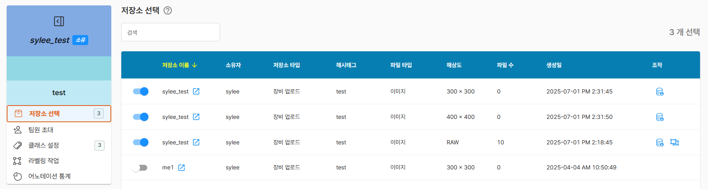

       - 토글 활성화시 조작에 `라벨링 정보 업로드 버튼`이 표시
       - 라벨 정보 업로드는 해상도가 RAW인 경우만 가능
       - **이미지파일명과 일치하는 XML 파일을 준비**
         ```
          AAA.jpg  // 저장소에 업로드된 파일
          AAA.xml  // 위 파일에 대한 라벨링 정보
         ```
          :::warning 주의
           - 이미지와 라벨 정보를 정확하게 연결하기 위해, 각 이미지 파일명과 라벨 파일명이 반드시 일치해야 합니다.
           - 파일명과 일치하지 않는 라벨파일은 업로드 하여도 반영되지 않습니다.
          :::


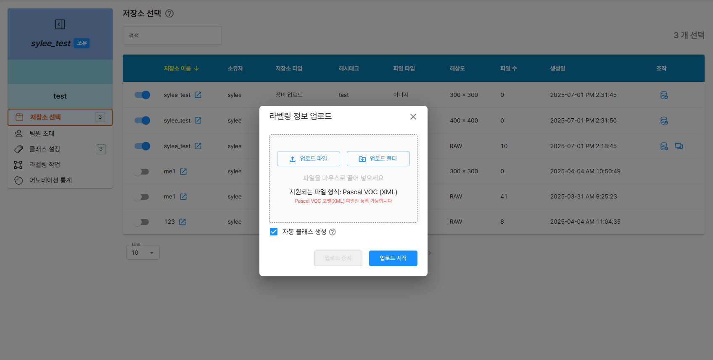

       - 업로드 팝업창을 통해 XML 파일을 업로드 하면 이미지에 라벨링 정보를 추가
       - **자동 클래스 생성** : 정의되어 있지 않은 클래스 정보가 파일에 있다면 클래스에 추가
         :::warning 선택하지 않을시
          - 사전에 정의된 클래스와 일치하는 라벨정보만 업로드 됩니다.
         :::


### 1.2 라벨정보 다운로드
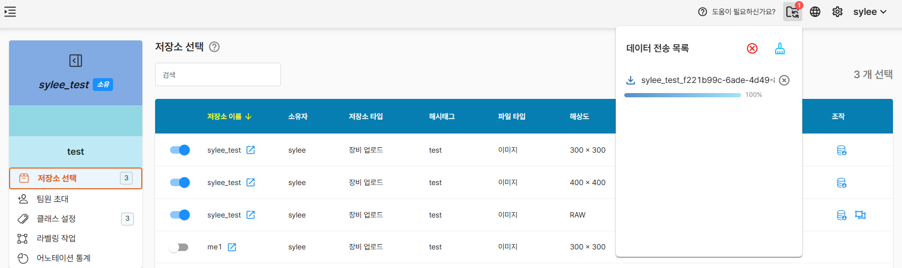

       - 토글 활성화시 조작에 `라벨링 정보 다운로드 버튼`이 표시
       - 해당 저장소에 있는 파일에 대한 **라벨링 정보를 다운**
       - 압축파일 형태로 제공, 데이터 전송 목록에서 확인


## 2. 팀원 초대 기능 활용하기

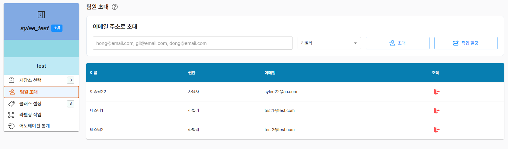

       - 이메일 주소를 입력하여 사용자와 라벨러로 구분하여 `초대`
       - `나가기 버튼`을 통해 데이터셋에서 제외
         ```
          라벨러 : 해당 데이터셋에 라벨링 작업할 수 있음
          사용자 : 해당 데이터셋을 ai 학습에 활용할 수 있음  // 라벨 작업에대한 권한은 없음
         ```

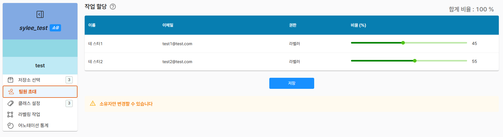

       - 작업할당 기능을 통해 초대한 라벨러에게 작업량을 분할하여 할당
         ```
         총 작업이 10개이고 50:50 비율로 설정한다면
         라벨러1  5개부여
         라벨러2  5개부여
         ```
:::tip 팁
- 비율에 합계는 100%여야 합니다.
- 작업물은 지정한 비율에 맞춰 각 라벨러에게 자동으로 할당되어, 효율적인 분배가 이루어집니다.
- 데이터셋 소유자는 모든 작업에 관여할 수 있습니다.
:::
:::info **라벨러 시점**
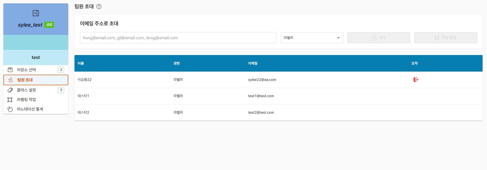
- **라벨러**는 초대, 작업 할당, 클래스 설정 등 주요 관리 기능은 제한되며, 라벨링 업무에만 전념할 수 있는 환경이 제공됩니다.
- **라벨러**는 `나가기 버튼`을 통해 스스로 해당 데이터셋에서 제외될 수 있습니다.
:::


## 3. 클래스 설정 활용하기

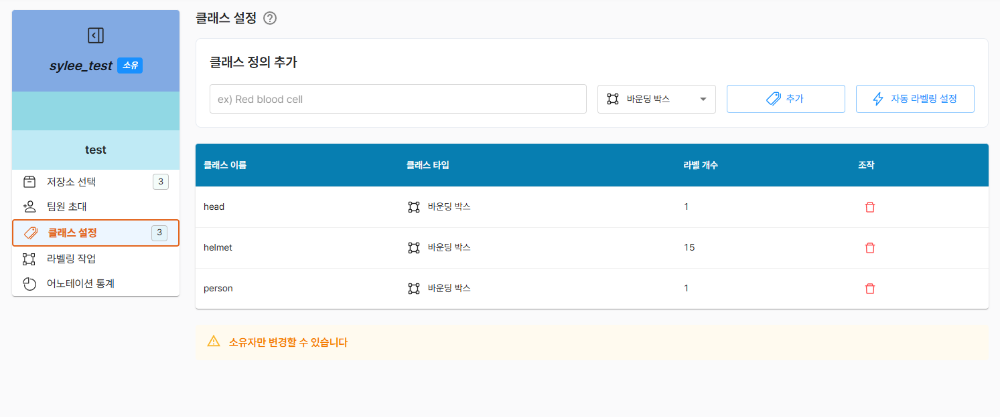

       - 원하는 이름으로 클래스명을 지정하고 바운딩박스와 폴리곤 박스로 구분하여 추가

         :::tip 팁
         - 클래스 = 바운딩박스에 붙는 객체의 이름(종류)
         - 바운딩박스 = 객체의 위치와 크기를 표시하는 사각형
         - 폴리곤박스 = 현재 지원하지 않습니다.
         :::
         :::info 자동 라벨링 설정
         - 현재 해당 기능은 구현예정 입니다.
         :::


## 4. 라벨링 작업 활용하기

라벨링 작업 페이지에서는 생성된 클래스를 통해 작업을 수행 하거나 수정할 수 있습니다.

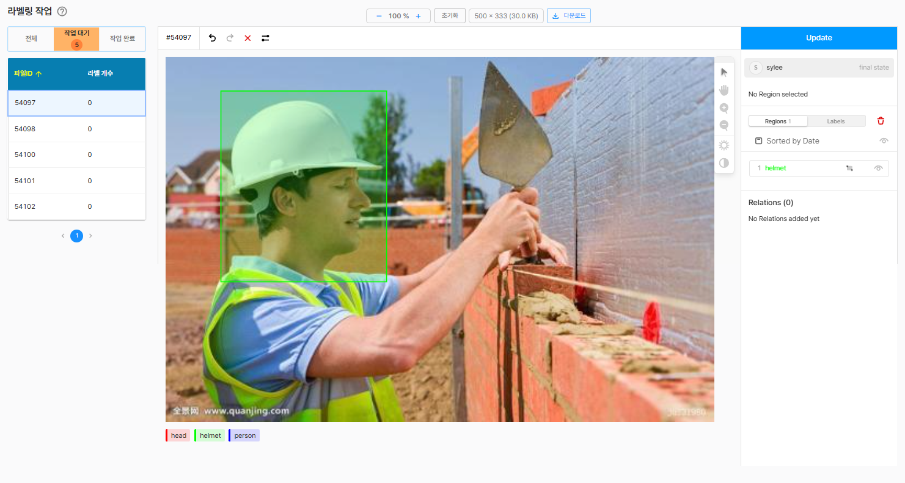

### 4.1 작업 리스트
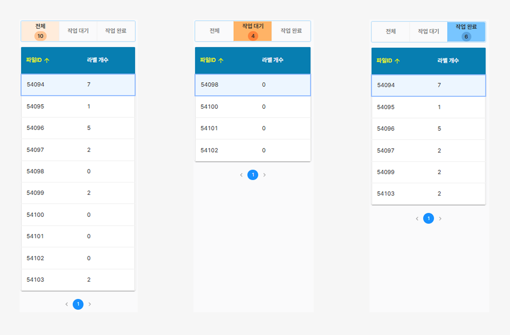

          - **전체** : 데이터셋에 활성화된 저장소의 모든 파일
          - **작업대기** : 라벨링정보가 없는 파일
          - **작업완료** : 라벨링정보가 있는 파일
          :::info 라벨러 시점
          - 라벨러로 초대받은 유저는 **데이터셋 관리** - **공유**에서 데이터셋 정보를 확인할 수 있습니다.
          - 라벨러는 소유자가 작업할당에서 지정한 비율에 따라 작업대기와 작업완료 화면이 나타납니다.
          - 전체에서는 모두 볼수있고 할당받지 않은 작업에 대해서도 선택하여 라벨링 작업을 진행할 수 있습니다. ( 단, 본인의 작업대기와 작업완료에 추가되지는 않습니다.)
          :::

### 4.2 라벨링


          - 라벨링할 파일을 선택하고 하단에 클래스를 선택
          - 이미지 위에서 마우스 한번 클릭시 박스 생성시작
          - 마우스 이동후 마우스 한번 클릭시 박스 생성종료
          :::tip 팁
            - 생성된 박스를 마우스로 클릭하여 위치이동이 가능합니다. ( 예: 드래그 )
            - 생성된 박스를 한번 클릭시 점이 나타나고 박스의 크기조정이 가능합니다.
            - 가장 상단의 점을 클릭하면 박스를 회전시킬 수 있습니다.
            - 박스를 선택후 다른 박스를 그리면 선택한 박스와 같은 클래스로 선택됩니다.
            - 객체의 클래스 정보를 변경하고 싶다면 박스선택후 하단에 클래스를 선택하여 변경할수 있습니다.
            - 박스생성시 시작지점은 다른 박스영역외에 부분을 선택하기때문에 작은 박스부터 생성하길 추천합니다.
            - `업데이트 버튼` 클릭시 라벨링 정보가 반영되고 다음작업으로 넘어갑니다.
          :::
          :::warning 반드시! 작업후 우측에 `업데이트 버튼`을 눌러주세요
            - 업데이트 버튼을 누르시 않으면 해당 라벨작업 정보는 반영되지 않습니다.
          :::


### 4.2.1 라벨링 보조 기능
라벨링 작업 화면 상단에 표시되는 기능을 설명합니다.

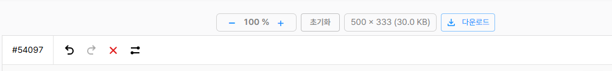

<span style={{ display: 'inline-flex', marginTop:0, verticalAlign: 'middle'}}>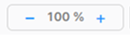</span>  : 이미지 전체를 축소 및 확대 

<span style={{ display: 'inline-flex', marginTop:0, verticalAlign: 'middle'}}>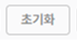</span>  : 확대 - 축소한 이미지를 원본 크기로 초기화

<span style={{ display: 'inline-flex', marginTop:0, verticalAlign: 'middle'}}>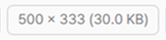</span>  : 원본 크기

<span style={{ display: 'inline-flex', marginTop:0, verticalAlign: 'middle'}}>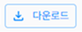</span>  : 이미지 다운로드 ( 라벨정보 X )

<span style={{ display: 'inline-flex', marginTop:0, verticalAlign: 'middle'}}>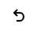</span>  : 작업상태를 이전으로 되돌리기

<span style={{ display: 'inline-flex', marginTop:0, verticalAlign: 'middle'}}></span>  : 되돌린 작업을 다시 실행하기

<span style={{ display: 'inline-flex', marginTop:0, verticalAlign: 'middle'}}>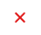</span>  : 작업상태 초기화

<span style={{ display: 'inline-flex', marginTop:0, verticalAlign: 'middle'}}>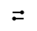</span>  : 설정
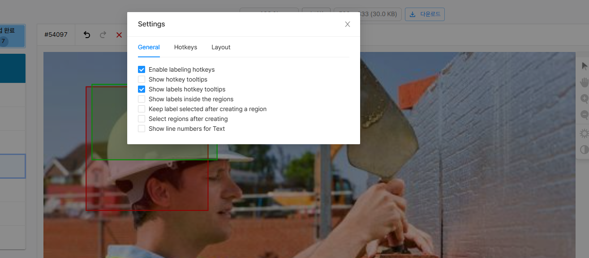

이러한 설정 옵션들은 라벨링 효율성, 작업 속도, 시각적 편의성을 높이기 위해 제공되는 세부 설정입니다.
세밀한 사용자 맞춤 설정을 통해 다양한 데이터 라벨링 작업을 더욱 직관적이고 빠르게 할 수 있습니다.


- ✅ **Enable labeling hotkeys** : 라벨링 작업 시 단축키(핫키) 사용을 활성화합니다.
- ✅ **Show hotkey tooltips** : 하단과 선택된 라벨 정보(우측)에 연결된 단축키 정보를 보여줍니다.
- ✅ **Show labels hotkey tooltips** : 하단 라벨에만 연결된 단축키 정보를 보여줍니다.

:::tip 단축키를 적극 활용하세요!
- 하단 클래스 옆에 단축키 번호가 있어 쉽게 클래스를 선택할 수 있습니다.
         ```
        예 : 키보드 1번 누르면 head 클래스 선택, 2번 누르면 helmet 클래스 선택
         ```
- `ctrl + c` `ctrl + v` 를 사용하여 객체를 복사하고 붙여넣기 기능이 가능합니다.
- `Backspace` 클릭시 박스를 삭제할수 있습니다.
  :::


- ✅ **Show labels inside the regions** : 생성한 박스에 라벨 이름을 표시합니다.
- ✅ **Keep label selected after creating a region** : 박스생성 후에도 선택했던 라벨이 유지됩니다.
- ✅ **Select regions after creating** : 박스를 생성한 직후, 그 영역이 자동으로 선택됩니다.
- ✅ **Show line numbers for Text** : 현재는 지원하지 않습니다.

:::tip 설정을 통해 편리하게 이용하세요!
- 여러 개의 박스를 연속으로 만들어야 할 때는 `Keep label selected after creating a region` 기능을 켜두면 편리합니다.
  동일한 클래스의 객체를 반복해서 라벨링할 때, 매번 라벨을 다시 선택할 필요 없이 작업 속도가 크게 향상됩니다.
- 바운딩 박스 생성 후 바로 크기 조정이나 위치 이동이 필요하다면 `Select regions after creating` 옵션을 활용하세요.
  박스를 그리자마자 바로 수정할 수 있어 반복 작업이 효율적입니다.
:::

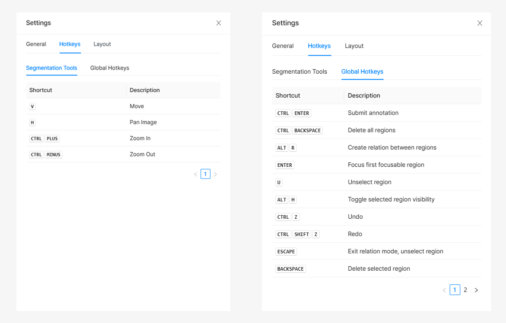
- Hotkeys에는 단축키 정보가 있습니다.


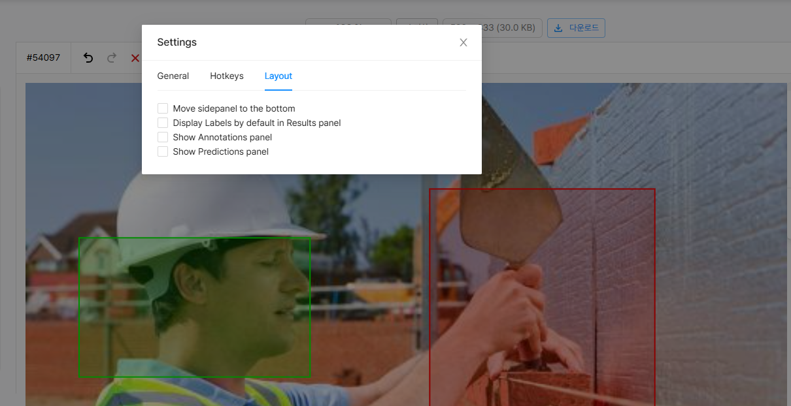

- ✅ **Move sidepanel to the bottom** : 사이드 패널을 화면 하단으로 이동시킵니다.
- ✅ **Display Labels by default in Results panel** : 패널정보에 기본값을 Labels로 지정합니다.
- ✅ **Show Annotations panel** : 현재 지원하지 않습니다.
- ✅ **Show Predictions panel** : 현재 지원하지 않습니다.


### 4.2.2 라벨링 보조 기능
라벨링 작업 화면 우측에 표시되는 기능을 설명합니다.


<span style={{ display: 'inline-flex', marginTop:0, verticalAlign: 'middle'}}></span>  : 선택 또는 이동 

<span style={{ display: 'inline-flex', marginTop:0, verticalAlign: 'middle'}}></span>  : 화면 영역 이동

<span style={{ display: 'inline-flex', marginTop:0, verticalAlign: 'middle'}}></span>  : 이미지 부분 확대

<span style={{ display: 'inline-flex', marginTop:0, verticalAlign: 'middle'}}></span>  : 이미지 부분 축소

<span style={{ display: 'inline-flex', marginTop:0, verticalAlign: 'middle'}}>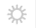</span>  : 밝기 조절

<span style={{ display: 'inline-flex', marginTop:0, verticalAlign: 'middle'}}></span>  : 명암 조절
:::tip
- `ctrl + 마우스 휠`을 사용해 이미지위에서 확대 축소가 가능합니다.
  :::


### 4.3 패널
라벨링된 모든 객체(helmet, person, head 등)의 정보를 한눈에 확인할 수 있습니다. 각 라벨의 종류와 색상, 생성 순서가 리스트로 정리되어 있으며, 
클릭 시 해당 객체가 이미지에서 하이라이트됩니다. 표시/숨김, 수정, 삭제 등 다양한 관리 기능도 바로 사용할 수 있습니다.

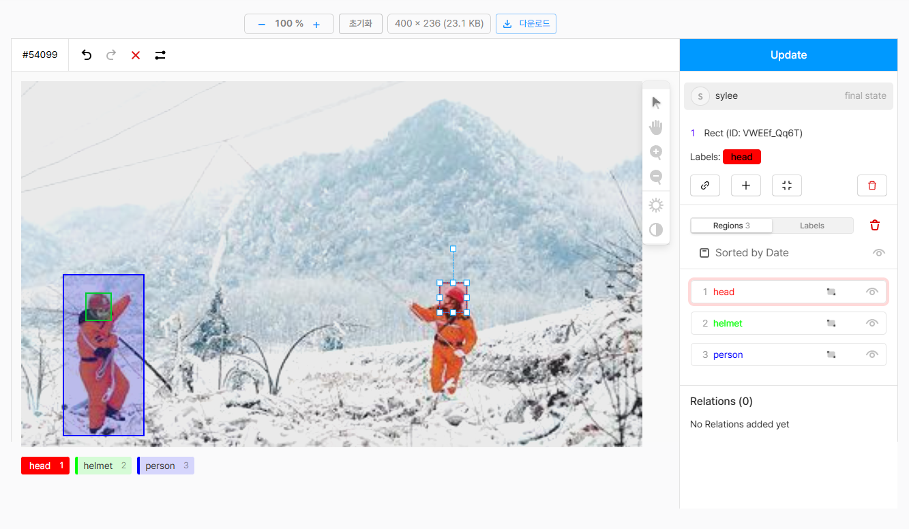


<span style={{ display: 'inline-flex', marginTop:0, verticalAlign: 'middle'}}>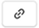</span>  : Create relation between regions - 현재 지원하지 않습니다.

<span style={{ display: 'inline-flex', marginTop:0, verticalAlign: 'middle'}}>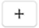</span>  : Add Meta information - 현재 지원하지 않습니다.

<span style={{ display: 'inline-flex', marginTop:0, verticalAlign: 'middle'}}>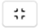</span>  : Unselect region - 객체선택을 해제합니다.

<span style={{ display: 'inline-flex', marginTop:0, verticalAlign: 'middle'}}>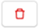</span>  : Delete selected region - 해당 객체를의 라벨 정보를 삭제합니다.

<span style={{ display: 'inline-flex', marginTop:0, verticalAlign: 'middle'}}>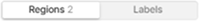</span>  : 라벨정보를 보여줍니다.
:::tip
- `Regions` : 라벨정보를 순서대로 나열해서 보여줍니다.
- `Labels` : 라벨정보를 클래스 별로 묶어서 보여줍니다.
:::

<span style={{ display: 'inline-flex', marginTop:0, verticalAlign: 'middle'}}>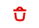</span>  : Delete All Regions - 모든 라벨 정보를 삭제합니다.

<span style={{ display: 'inline-flex', marginTop:0, verticalAlign: 'middle'}}></span>  : 박스를 시각적으로 보여줄지 결정합니다.
:::tip
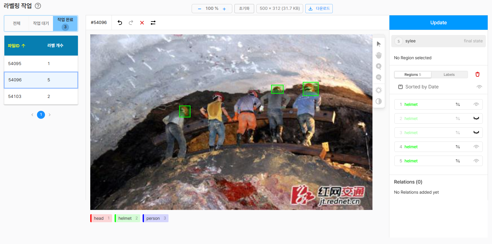
- 모든 박스 또는 단일 박스 숨김 기능이 가능합니다.
- 박스가 너무 많은 경우, 시각적으로 구분하기 힘든 경우, 박스안에 박스를 그려넣을 경우 사용하면 유용합니다.
:::
:::warning 주의
- 박스가 화면에서 보이지 않더라도, 실제 데이터에서 정보가 삭제되는 것은 아닙니다.
  즉, 단순히 시각적으로 숨겨진 것일 뿐, 라벨링 정보(위치, 클래스 등)는 그대로 유지됩니다.
:::


## 5. 어노테이션 통계 활용하기
통계 페이지는 데이터셋의 전체 파일 수, 라벨 개수, 클래스 수 등 핵심 지표를 한눈에 보여줍니다.
클래스별 라벨 분포와 비율을 차트로 시각화해 데이터의 편중이나 불균형 여부를 쉽게 파악할 수 있습니다.
라벨링 현황을 빠르게 점검해 보세요.

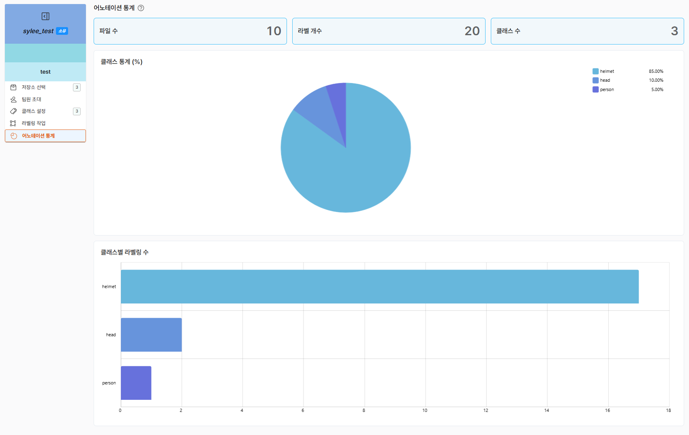


