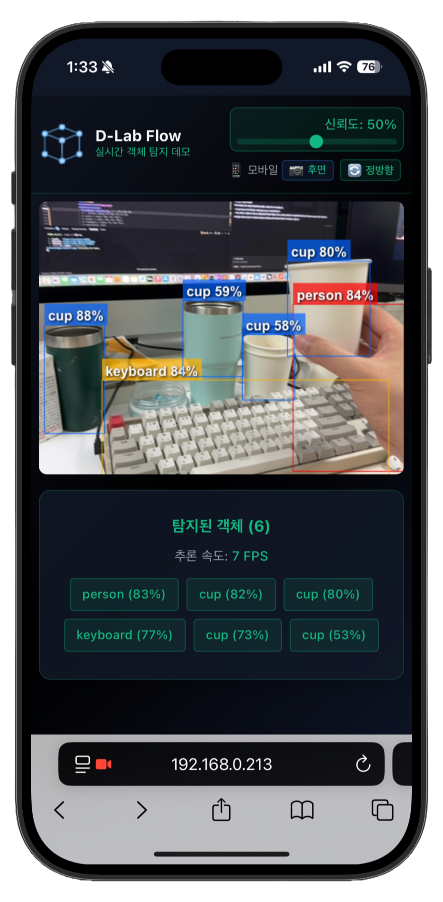
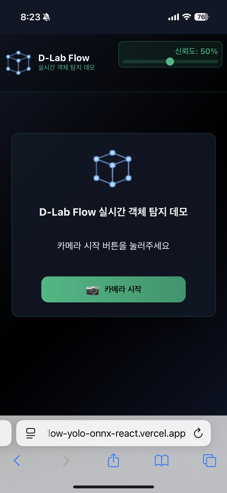
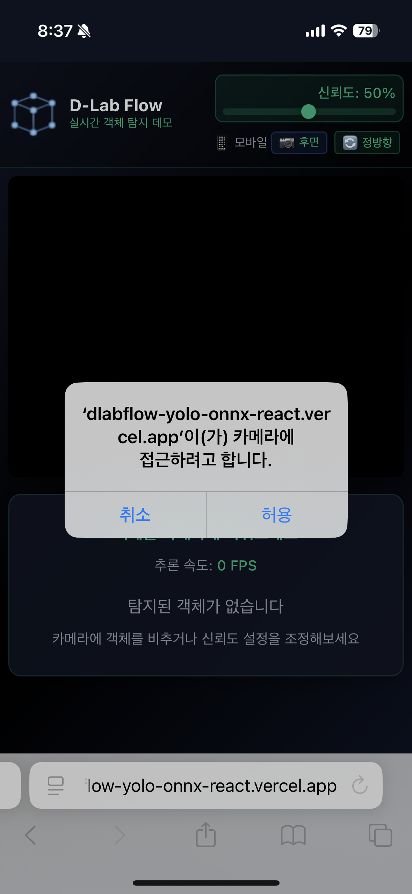
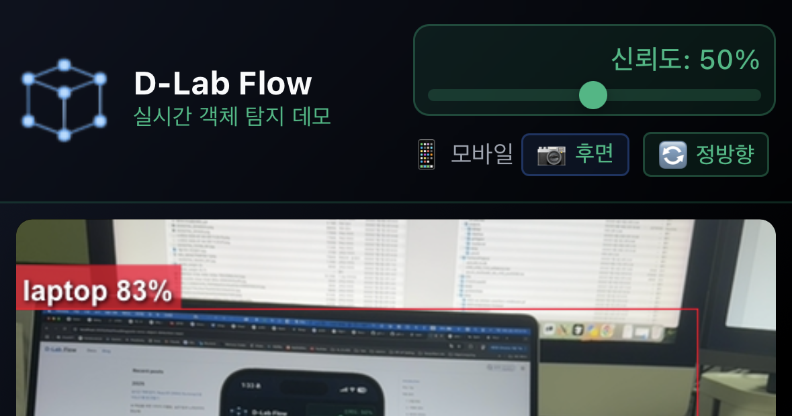
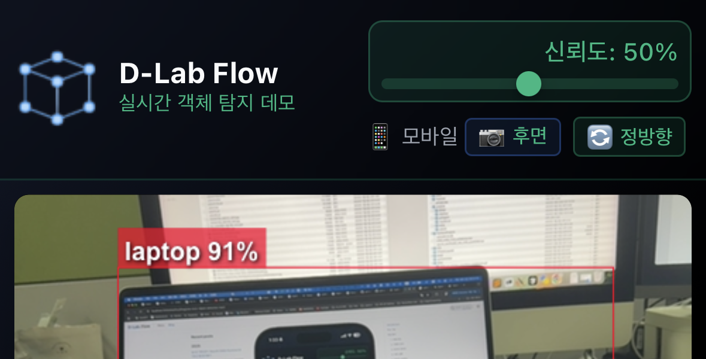
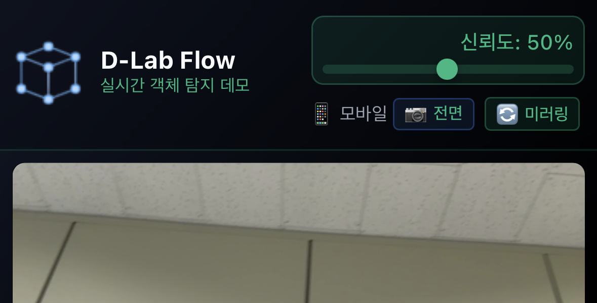
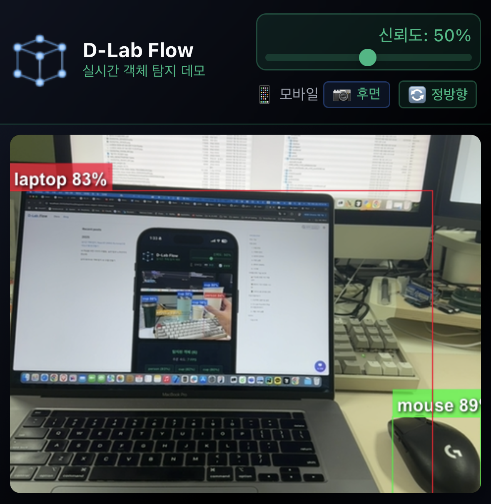
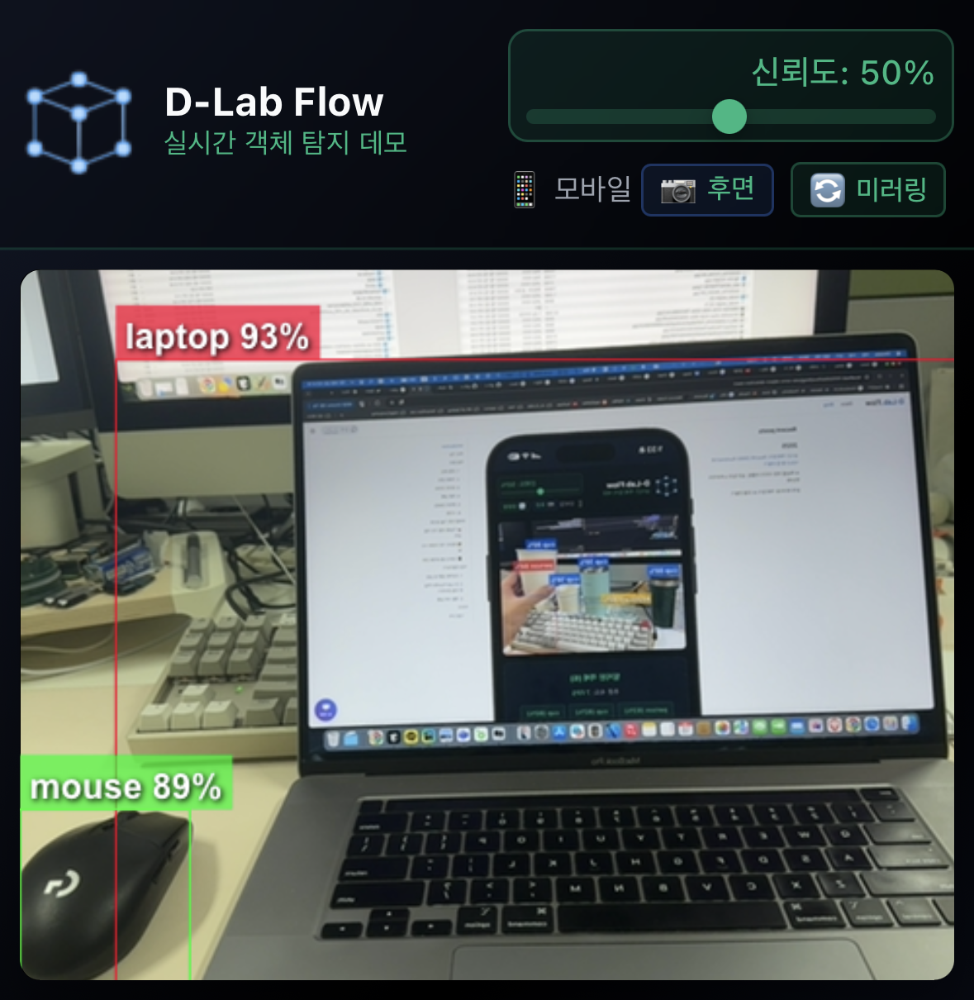

# 브라우저에서 실시간 객체 탐지: React와 ONNX Runtime으로 나만의 YOLO 웹 앱 만들기

서버나 복잡한 백엔드 설정 없이, 순수 웹 기술만으로 실시간 AI를 구현할 수 있습니다. 사용자의 웹캠을 이용해 눈앞의 사물을 즉시 인식하는 마법 같은 경험을 선사하는 방법을 알려드립니다.

<!--truncate-->

## Introduction

최근 웹 기술의 발전은 정말 놀랍습니다. WebAssembly와 ONNX Runtime Web 같은 기술들이 등장하면서, 브라우저는 이제 단순한 문서 뷰어를 넘어 강력한 연산 플랫폼으로 진화했습니다. 복잡한 머신러닝 모델도 이제 브라우저에서 직접 실행할 수 있게 되었죠.

`dlabflow-yolo-onnx-react` 프로젝트는 바로 이런 가능성을 보여주는 완벽한 예시입니다. React와 ONNX Runtime을 사용하여 브라우저에서 직접 YOLO 모델을 실행하는 실시간 객체 탐지 데모로, 서버 없이도 사용자의 카메라로 실시간 객체 인식을 수행합니다.

이 글을 통해 여러분은:
- 브라우저 기반 AI의 작동 원리를 이해할 수 있습니다.
- D-Lab Flow에서 학습한 모델을 웹에서 직접 테스트하는 방법을 배울 수 있습니다.
- 실제로 동작하는 실시간 객체 탐지 웹 앱을 만들어볼 수 있습니다.

<div className="image-row">



</div>

*dlabflow-yolo-onnx-react 모바일에서의 실시간 객체 탐지 화면 - [라이브 데모 바로 가기](https://dlabflow-yolo-onnx-react.vercel.app/)*

## 주요 기능

- **🚀 실시간 추론**
  - 브라우저 내 처리로 지연시간 최소화
  - 서버 인프라 불필요

- **🔄 다양한 YOLO 모델 지원**
  - YOLOv3, YOLOv5, YOLOv8, YOLOv11 호환
  - 출력 형식 자동 감지
  - 코드 수정 없이 모델 교체 가능

- **📱 모바일 지원**
  - 데스크톱/모바일 반응형 디자인
  - 후면 카메라 지원

- **🎛️ 직관적인 UI**
  - 신뢰도 조절 슬라이더
  - 실시간 결과 반영

## 작동 원리

복잡해 보이지만, 사실 명확한 단계들로 이루어져 있습니다. 카메라에서 이미지를 가져와 모델이 이해할 수 있는 형태로 만들고, 결과를 다시 화면에 그려주는 과정입니다.

<!--  -->
<!-- *dlabflow-yolo-onnx-react의 데이터 처리 파이프라인* -->

### 1. 모델 로딩
애플리케이션이 시작되면 먼저 ONNX 모델을 로드합니다. ONNX Runtime Web은 WebAssembly를 기반으로 동작하여 브라우저에서 고성능 추론을 가능하게 합니다. 

**모델 로딩 과정:**
- 디바이스 타입 감지 후 최적의 실행 백엔드 선택
  - 데스크톱: WebGPU→WebGL→CPU
  - 모바일: WebGL→CPU
- `public/models/model.onnx` 파일을 비동기적으로 로드
- 클래스 정보를 `classes.json` 파일에서 우선 로드, 실패 시 모델 메타데이터에서 바이트 단위 파싱으로 추출
- ONNX Runtime 세션 생성 및 그래프 최적화 설정 적용
- 첫 추론 시점에 모델 구조 자동 감지

**YOLO 기본 클래스 예제 (`classes.json`)**:
```json
[
  "person", "bicycle", "car", "motorcycle", "airplane", 
  "bus", "train", "truck", "boat", "traffic light",
  "fire hydrant", "stop sign", "parking meter", "bench", "bird",
  "cat", "dog", "horse", "sheep", "cow",
  "elephant", "bear", "zebra", "giraffe", "backpack",
  "umbrella", "handbag", "tie", "suitcase", "frisbee",
  "skis", "snowboard", "sports ball", "kite", "baseball bat",
  "baseball glove", "skateboard", "surfboard", "tennis racket", "bottle",
  "wine glass", "cup", "fork", "knife", "spoon",
  "bowl", "banana", "apple", "sandwich", "orange",
  "broccoli", "carrot", "hot dog", "pizza", "donut",
  "cake", "chair", "couch", "potted plant", "bed",
  "dining table", "toilet", "tv", "laptop", "mouse",
  "remote", "keyboard", "cell phone", "microwave", "oven",
  "toaster", "sink", "refrigerator", "book", "clock",
  "vase", "scissors", "teddy bear", "hair drier", "toothbrush"
]
```

### 2. 카메라 준비
`react-webcam` 라이브러리를 사용해 디바이스에 최적화된 카메라 설정을 자동으로 구성합니다.

**카메라 초기화 과정:**
- User Agent 기반 디바이스 타입 자동 감지 (모바일/데스크톱)
- 디바이스별 최적 카메라 설정: 데스크톱은 전면 카메라, 모바일은 후면 카메라로 시작
- 스마트 미러링 시스템: 전면 카메라는 미러링, 후면 카메라는 정방향 표시, 수동 전환 지원
- 카메라 전환 기능 (모바일): 전면/후면 카메라 간 원활한 전환 지원
- 리소스 누수 방지를 위한 스트림 관리 및 Webcam 컴포넌트 강제 리마운트

### 3. 데이터 전처리
성능 최적화를 위해 비디오 프레임을 단계적으로 스케일링한 후 YOLO 모델 입력으로 변환합니다.

**전처리 단계:**
- 성능 최적화: 비디오 프레임을 40% 크기로 먼저 축소하여 연산량 감소
- Canvas 2D Context 설정 최적화 (`willReadFrequently: true`, `alpha: false`, `desynchronized: true`)
- `drawImage()`를 사용하여 축소된 프레임을 직접 640×640으로 리사이즈
- 캐시 친화적 픽셀 데이터 변환: RGB 채널별로 순차 처리하여 메모리 접근 최적화
- RGB 픽셀 값을 0~1 범위로 정규화 및 NCHW 형태 (1×3×640×640)로 텐서 변환
- 메모리 효율성을 위한 재사용 가능한 임시 Canvas 활용

### 4. 추론 실행
안정성과 성능을 위한 정교한 추론 관리 시스템을 통해 모델을 실행합니다.

**추론 과정:**
- 추론 중복 방지: 고유 ID 기반 활성 추론 세션 관리 (동시 실행 1개 제한)
- 60fps 제한을 통한 결과 반영 최적화 (16ms 간격)
- 카메라 전환 중에는 추론 자동 일시 중지
- 첫 추론 시 모델 구조 실시간 감지: 출력 텐서 차원 분석으로 모델 구조 자동 판별
- `session.run()` 비동기 실행으로 UI 블로킹 방지
- WebAssembly, WebGL, WebGPU 백엔드를 통한 하드웨어 가속

### 5. 후처리 (NMS)
모델 구조에 따른 동적 처리와 Non-Maximum Suppression을 적용하여 최종 탐지 결과를 생성합니다.

**NMS 처리 단계:**
- 모델 타입별 데이터 파싱: transpose 여부, YOLOv5s/v8/Custom 모델 대응
- 좌표 정규화 자동 감지: 0~1 범위는 캔버스 크기로 스케일링, 이미 픽셀 단위는 모델 크기 기준 변환
- 신뢰도 계산: YOLOv5s는 objectness × class_prob, YOLOv8은 class_prob 직접 사용
- 사용자 설정 임계값(기본 0.5) 기반 신뢰도 필터링
- IoU 0.45 기준 클래스별 중복 제거
- 메모리 기반 부드러운 바운딩 박스: 3프레임 동안 사라진 객체도 유지하여 깜빡임 방지

### 6. 시각화
Canvas 오버레이를 통해 비디오 위에 탐지 결과를 실시간으로 렌더링합니다.

**렌더링 과정:**
- HTML5 Canvas를 비디오와 완전히 동일한 크기로 오버레이 배치
- 스마트 좌표 변환: 전면 카메라는 CSS 미러링에 맞춰 x좌표 반전, 후면 카메라는 정방향 유지
- 클래스별 고유 색상으로 바운딩 박스 및 라벨 렌더링
- 메모리 기반 부드러운 애니메이션: 이전 프레임 탐지 결과를 3프레임 동안 유지
- requestAnimationFrame 기반 독립적인 draw loop로 추론과 렌더링 분리
- 터치 이벤트 비활성화로 모바일에서의 성능 최적화

## 주목할 만한 기술 포인트

실제 프로덕션 환경에서 안정적으로 동작하기 위한 정교한 기술적 해결책들이 구현되어 있습니다.

### 🎯 지능형 모델 구조 자동 감지

이 프로젝트의 핵심은 첫 추론 시점에 모델의 출력 구조를 실시간으로 분석하여 적절한 후처리 전략을 자동 선택한다는 것입니다.

**지원하는 모델 형식:**

YOLOv3부터 YOLOv11까지 모든 주요 YOLO 버전을 폭넓게 지원합니다. 각 모델의 다양한 출력 형식(`[1, 25200, 85]`, `[1, 84, 8400]` 등)과 구조적 차이점(objectness 유무, transpose 여부)을 자동으로 감지하여 적절한 후처리를 적용합니다. 또한 사용자 정의 클래스로 학습된 Custom 모델도 클래스 개수에 따라 동적으로 처리 가능합니다.

로드된 클래스 개수와 출력 텐서 차원을 교차 분석하여 모델 타입을 명확히 판별합니다. 모호한 경우에는 크기 비교 방식으로 안전하게 fallback 처리하죠.

### 🎞️ 메모리 기반 안정화 시스템  

실시간 탐지에서 발생하는 바운딩 박스 깜빡임을 방지하기 위해 `detectionMemoryRef`를 활용한 정교한 메모리 시스템이 구현되어 있습니다.

**동작 원리:**
- 최신 탐지 결과 + 이전 3프레임의 결과를 메모리에 보관
- 객체가 일시적으로 탐지되지 않아도 `MAX_MISSED_FRAMES` 동안 유지
- 카메라 전환이나 설정 변경 시 메모리 자동 초기화로 잘못된 결과 방지

이를 통해 마치 전문적인 비디오 분석 도구처럼 안정적이고 부드러운 탐지 결과를 제공합니다.

### 📱 디바이스별 최적화 전략

모바일과 데스크톱 환경의 차이를 고려한 세밀한 최적화가 적용되어 있습니다:

- **백엔드 선택**
  - **데스크톱**: WebGPU→WebGL→CPU
  - **모바일**: WebGL→CPU
- **성능 조절**: 모든 디바이스에서 40% 스케일링으로 통일하여 안정성 확보
- **카메라 전환**: 모바일에서 전면/후면 카메라 간 원활한 전환 지원
- **스마트 미러링**: 전면/후면 카메라에 따른 자동, 수동 미러링 설정

## 직접 만들어보기

이제 직접 이 멋진 웹 앱을 만들어보겠습니다. 단계별로 차근차근 따라해보시면 금세 여러분만의 실시간 객체 탐지 웹 앱을 갖게 될 것입니다.

### 1. 프로젝트 클론 및 설정

먼저 GitHub에서 프로젝트를 클론하고 필요한 의존성을 설치합니다:

```bash
git clone https://github.com/grit-docs/dlabflow-yolo-onnx-react.git
cd dlabflow-yolo-onnx-react
npm install
```

### 2. D-Lab Flow에서 학습한 모델 준비하기

이 단계가 가장 중요합니다. D-Lab Flow에서 학습한 모델을 웹에서 사용할 수 있도록 ONNX 형식으로 변환해야 합니다.

#### 2-1. Python 가상환경 설정

먼저 독립적인 Python 환경을 만들어 의존성 충돌을 방지합니다.

**가상환경 생성**
```bash
python -m venv yolo-env
```

**가상환경 활성화**

Windows:
```bash
yolo-env\Scripts\activate
```

macOS/Linux:
```bash
source yolo-env/bin/activate
```

가상환경이 활성화되면 프롬프트 앞에 `(yolo-env)`가 표시됩니다.

#### 2-2. YOLOv5 저장소 준비

가상환경이 활성화된 상태에서 YOLOv5 저장소를 클론하고 의존성을 설치합니다:

```bash
git clone https://github.com/ultralytics/yolov5
cd yolov5
pip install -r requirements.txt
pip install "numpy<2"
```

#### 2-3. 모델 변환
D-Lab Flow에서 학습한 `.pt` 가중치 파일을 YOLOv5 폴더에 복사한 후, 다음 명령어로 ONNX 형식으로 변환합니다:

```bash
python export.py --weights your_model.pt --include onnx
```

<!--  -->
<!-- *YOLOv5의 `export.py`를 사용해 .pt 모델을 ONNX 형식으로 변환* -->

#### 2-4. 모델 파일 배치
변환된 `.onnx` 파일을 프로젝트의 `public/models/` 디렉토리에 `model.onnx`라는 이름으로 복사합니다:

```bash
mkdir -p public/models/
cp your_model.onnx public/models/model.onnx
```

**선택사항**: 더 명확한 클래스 이름을 원한다면 `classes.json` 파일을 생성하여 같은 디렉토리에 넣어주세요:

```json
[
  "person",
  "bicycle", 
  "car",
  "motorcycle",
  // ... 여러분의 클래스 이름들
]
```

### 3. 개발 서버 실행

이제 모든 준비가 완료되었습니다. 개발 서버를 실행해보겠습니다:

```bash
npm run dev
```

<!--  -->
<!-- *개발 서버를 실행하고 브라우저에서 앱에 접속한 초기 화면* -->

터미널에 출력된 URL(보통 `https://localhost:5173`)로 브라우저에서 접속하면 "카메라 시작" 버튼이 보이는 화면을 만날 수 있습니다.

카메라 권한을 허용하고 버튼을 클릭하면, 바로 여러분만의 실시간 객체 탐지 웹 앱이 동작하는 것을 확인할 수 있습니다!

## 웹 앱 사용법 가이드

웹 앱이 성공적으로 실행되었다면, 이제 다양한 기능들을 활용해보세요.

### 🎥 기본 사용법

**1. 카메라 시작하기**
- "카메라 시작" 버튼을 클릭하여 실시간 탐지를 시작합니다.
- 브라우저에서 카메라 권한을 요청하면 "허용"을 선택해주세요.

<div className="image-row">





</div>

**2. 실시간 탐지 결과 확인**
- 탐지된 객체는 컬러풀한 바운딩 박스로 표시됩니다.
- 각 객체 위에는 클래스명과 신뢰도(%)가 함께 표시됩니다.
- 화면 하단에서 탐지된 객체 목록과 전체 FPS를 확인할 수 있습니다.

<div className="image-row">


</div>

### 🎛️ 고급 기능 활용

**신뢰도 조절**
- 화면 우상단의 슬라이더로 탐지 민감도를 실시간 조절할 수 있습니다.
- 낮은 값(1-50%): 더 많은 객체 탐지, 오탐지 가능성 증가
- 높은 값(60-100%): 확실한 객체만 탐지, 놓치는 객체 증가
- 권장값: 50-60% (일반적인 환경에서 최적)

<div className="image-row cropped">



</div>

**모바일에서 카메라 전환**
- 📱 모바일 기기에서는 전면/후면 카메라 전환이 가능합니다.
- 화면의 카메라 전환 버튼을 탭하여 변경할 수 있습니다.
- 후면 카메라: 주변 환경 탐지에 최적
- 전면 카메라: 셀프 모드, 자동 미러링 적용

<div className="image-row cropped">





</div>

**스마트 카메라 미러링 시스템**
- 카메라 방향에 따라 자동으로 최적의 표시 방식이 적용됩니다.
- 후면 카메라는 실제 환경과 동일한 정방향으로, 전면 카메라는 거울처럼 미러링되어 표시됩니다.
- 화면의 미러링 전환 버튼을 클릭하여 언제든지 정방향과 미러링 모드를 수동으로 변경할 수 있습니다.
- 바운딩 박스와 라벨이 각 카메라 모드에 맞춰 정확한 위치에 자동 배치되며, 수동 전환 시에도 실시간으로 정확하게 조정됩니다.
- 자동 설정과 수동 조절을 통해 개인 선호도나 특정 상황에 맞춘 최적화된 UI/UX를 제공합니다.

<div className="image-row cropped">





</div>

### 💡 최적 사용 팁

**성능 최적화**
- 충분한 조명이 있는 환경에서 사용하면 탐지 정확도가 높아집니다.
- 너무 빠른 움직임보다는 안정적인 각도에서 객체를 비춰주세요.
- 모바일에서는 가로 모드보다 세로 모드가 더 안정적입니다.

**정확도 향상**
- 객체가 화면의 중앙에 위치할 때 가장 정확한 탐지가 이루어집니다.
- 여러 객체가 겹쳐있을 때는 약간의 거리를 두고 촬영하면 더 정확합니다.
- 배경이 복잡하지 않은 환경에서 더 좋은 결과를 얻을 수 있습니다.

**문제 해결**
- 카메라가 작동하지 않는다면: 브라우저 설정에서 카메라 권한을 확인해주세요.
- 탐지가 느리다면: 신뢰도를 조금 높여서 연산량을 줄여보세요.
- 모바일에서 화면이 깨진다면: 페이지를 새로고침한 후 다시 시도해보세요.

## 마무리

브라우저 기반 AI의 가능성은 정말 무궁무진합니다. 서버 인프라의 제약 없이, 사용자의 기기에서 직접 AI가 동작한다는 것은 단순히 기술적 진보를 넘어 새로운 사용자 경험의 패러다임을 제시합니다.

`dlabflow-yolo-onnx-react` 프로젝트는 D-Lab Flow 사용자들에게 특별한 가치를 제공합니다. 여러분이 정성스럽게 학습한 모델을 즉시 웹에서 테스트하고, 동료들과 공유하며, 실제 환경에서의 성능을 바로 확인할 수 있습니다. 

더 이상 복잡한 배포 과정을 거치거나 서버를 관리할 필요가 없습니다. 단순히 브라우저 URL 하나만 공유하면, 누구나 여러분의 AI 모델을 경험할 수 있습니다.

### 다음 단계

- **라이브 데모**: [https://dlabflow-yolo-onnx-react.vercel.app/](https://dlabflow-yolo-onnx-react.vercel.app/)에서 바로 체험해보세요.
- **GitHub 저장소**: [https://github.com/grit-docs/dlabflow-yolo-onnx-react](https://github.com/grit-docs/dlabflow-yolo-onnx-react)에서 전체 소스코드를 확인하실 수 있습니다.

여러분도 직접 시도해보시고, D-Lab Flow에서 학습한 여러분만의 모델로 멋진 웹 데모를 만들어보세요. 궁금한 점이나 피드백이 있으시면 언제든 GitHub Issues나 D-Lab Flow 커뮤니티를 통해 공유해주시기 바랍니다. 

함께 웹 기반 AI의 새로운 가능성을 탐험해나가요! 🚀 