# 브라우저에서 실시간 객체 탐지: React와 ONNX Runtime으로 나만의 YOLO 웹 앱 만들기

본 포스트에서는 D-Lab Flow에서 학습한 **YOLO 기반 적혈구 탐지 모델**을 ONNX 형식으로 변환하고,  
이를 **브라우저에서 실시간 객체 탐지**로 구현하는 방법을 소개합니다.

<!--truncate-->

## 결과물 소개

이 글을 통해 아래 내용을 학습할 수 있습니다

- D-Lab Flow를 활용한 객체 탐지 모델 생성
- YOLO 모델을 ONNX로 변환하여 웹에서 활용하기
- React 기반 실시간 적혈구 탐지 웹 애플리케이션 구현

<div className="image-row">

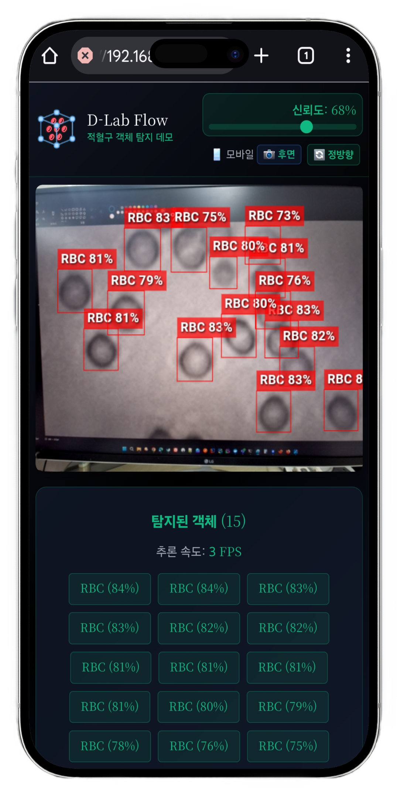

</div>

*[라이브 데모 링크 열기](https://dlabflow-yolo-onnx-react-rbc.vercel.app/)*

스마트폰으로 접속 후 아래 이미지를 카메라로 비추면 적혈구 탐지가 실시간으로 실행됩니다.

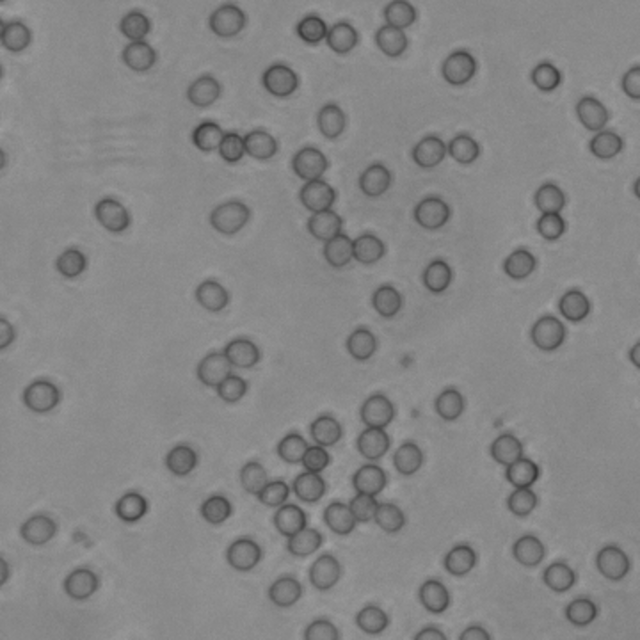

촬영 거리를 조절하며 탐지 변화를 확인해보세요.

## D-Lab Flow에서 모델 생성 하기

### 1. 저장소 생성
이미지 형식으로 저상소를 생성합니다.

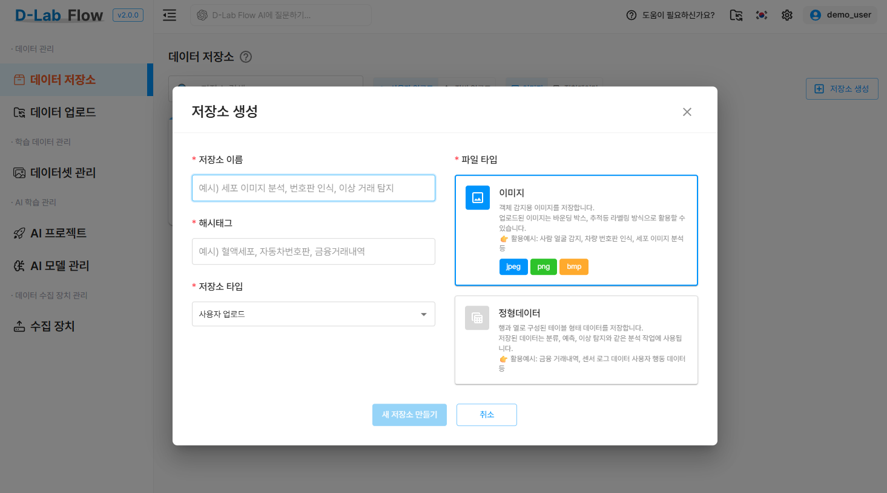

### 2. 이미지 파일 업로드
아래 데이터셋을 다운로드하여 `RBC_images` 폴더를 업로드합니다.

[적혈구 객체탐지 데이터셋 다운로드 링크](./img/RBC_dataset.zip)

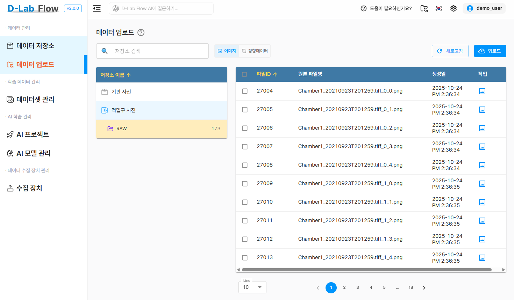

### 3. 데이터셋 생성
이미지 유형으로 데이터셋을 생성합니다.

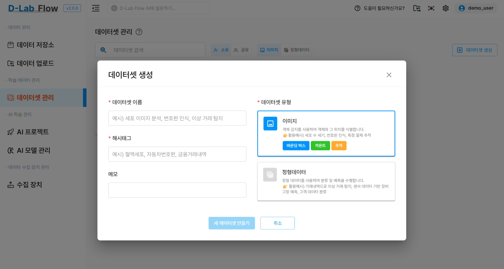

### 4. 라벨링 파일 업로드 및 라벨링 작업
첨부된 `RBC_annotations` 폴더를 업로드합니다.

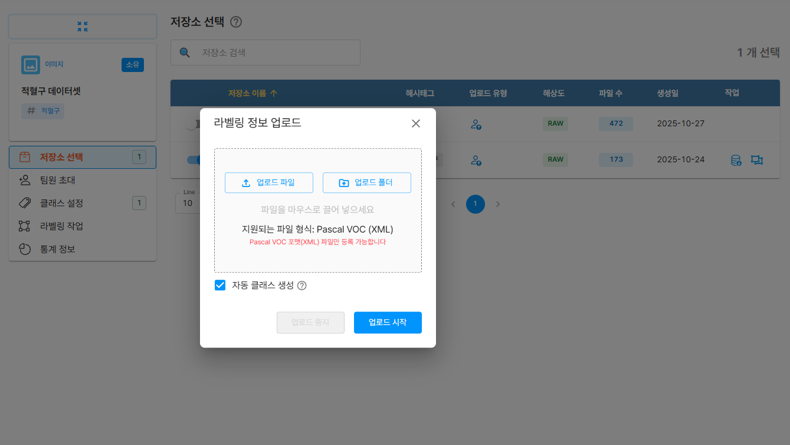

라벨링 상태를 확인합니다.

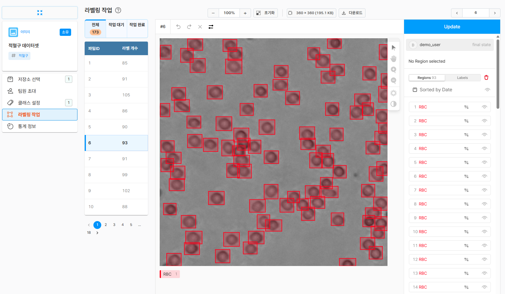

### 5. 프로젝트 생성
객체탐지 타입의 프로젝트를 생성합니다.

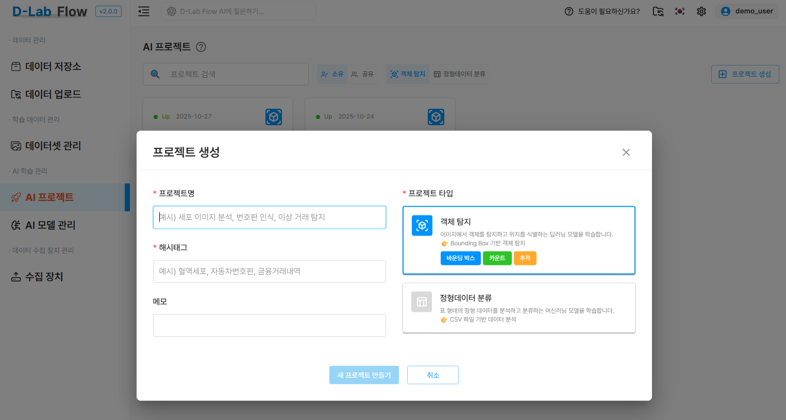

### 6. 인공지능 학습
학습할 버전을 생성하고 모델을 지정하여 학습을 진행합니다.

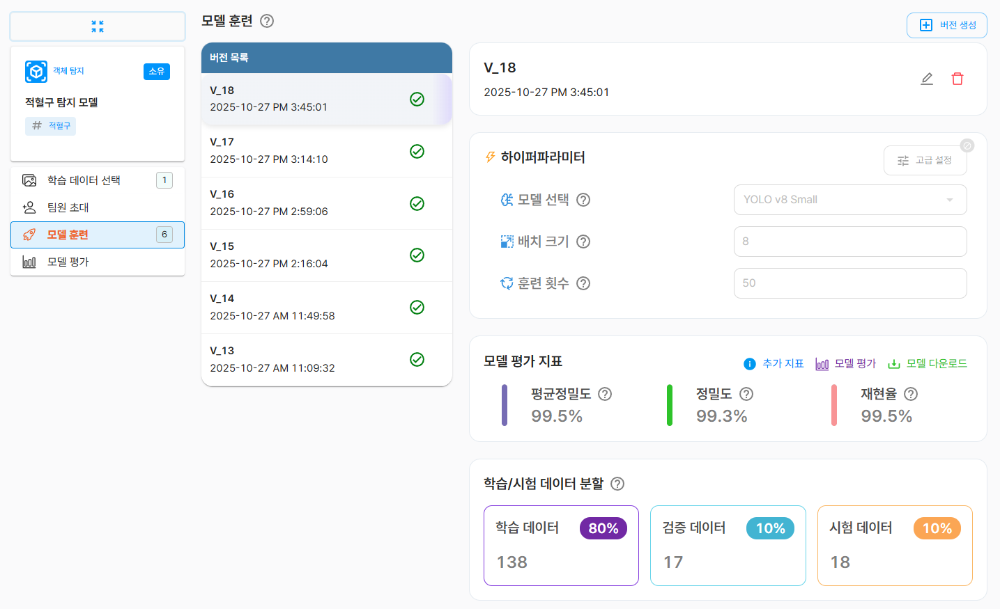

하이퍼파라미터 설정 값 및 다양한 모델을 사용하여 학습을 해보고 성능지표를 비교합니다.

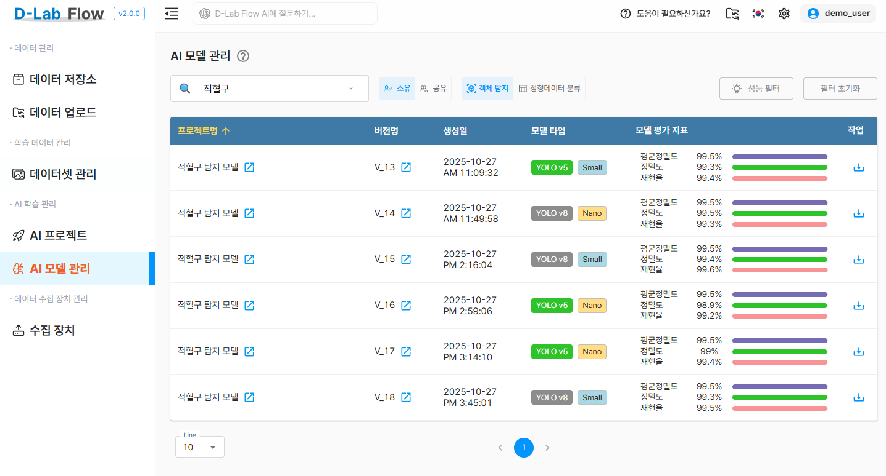


## 적혈구 객체탐지 데모 만들기

### 1. 모델 가중치를 onnx 파일로 변환
D-Lab Flow에서 학습 완료된 best.pt 모델을 다운로드합니다.
Ultralytics 저장소를 클론하여 ONNX 변환을 수행합니다.

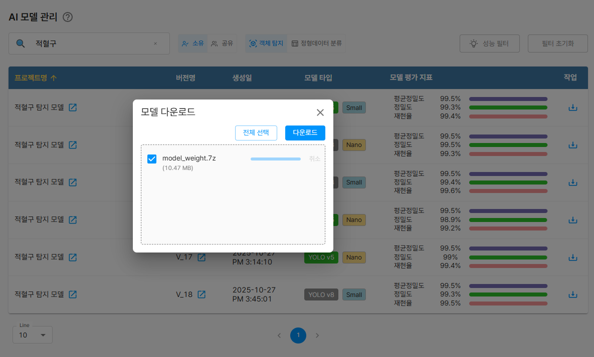


아래 절차는 YOLOv8 이후 모델(YOLOv8, v9, v11) 모두 지원합니다.

```bash
git clone https://github.com/ultralytics/ultralytics.git
cd ultralytics
pip install ultralytics onnx onnxruntime
```

CLI 방식으로 변환

```bash
yolo export model=best.pt format=onnx
```

### 2. 데모 프로젝트 다운로드
실시간 객체 탐지 데모 프로젝트를 클론하고 필요한 의존성을 설치합니다

```bash
git clone https://github.com/grit-docs/dlabflow-yolo-onnx-react.git
cd dlabflow-yolo-onnx-react
npm install
```

변환된 onnx 모델 파일을 복사 후 이름을 model.onnx 로 변경하여 아래 경로에 저장합니다

```bash
public/models/model.onnx
```

웹앱을 실행합니다.
```bash
npm run dev
```

완성된 적혈구 객체 탐지 데모 GitHub 저장소

```bash
https://github.com/grit-docs/dlabflow-yolo-onnx-react-rbc.git
```


