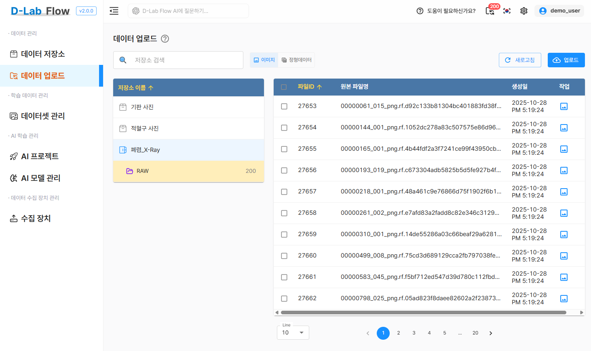
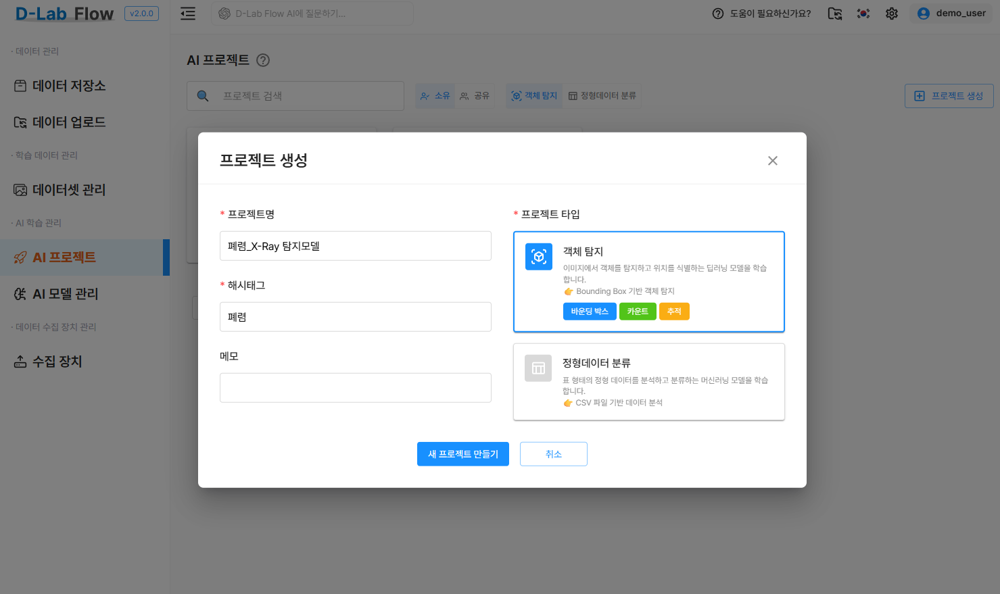
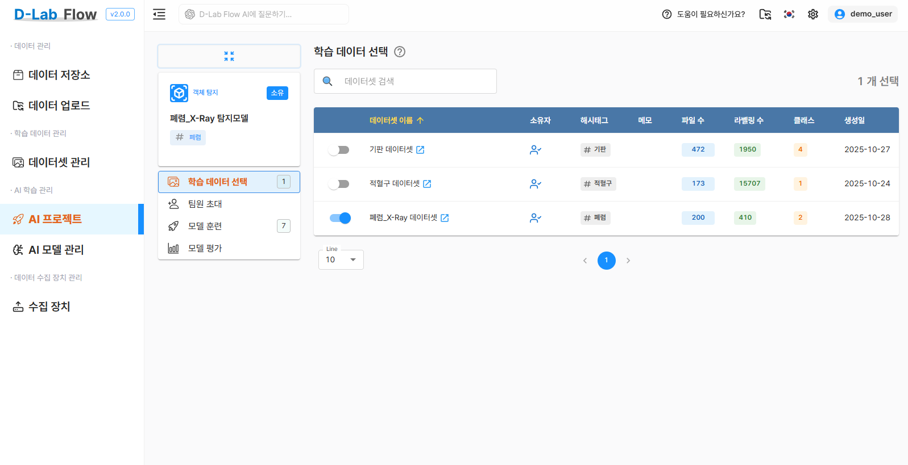
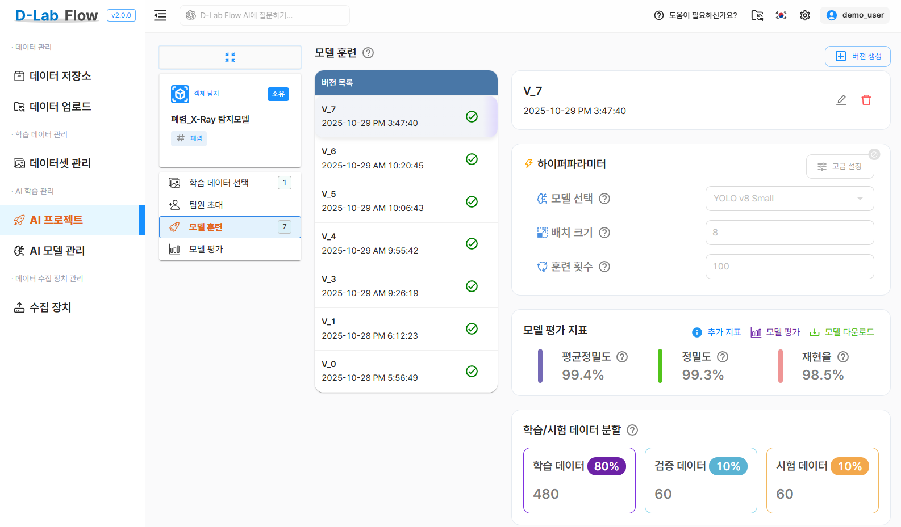
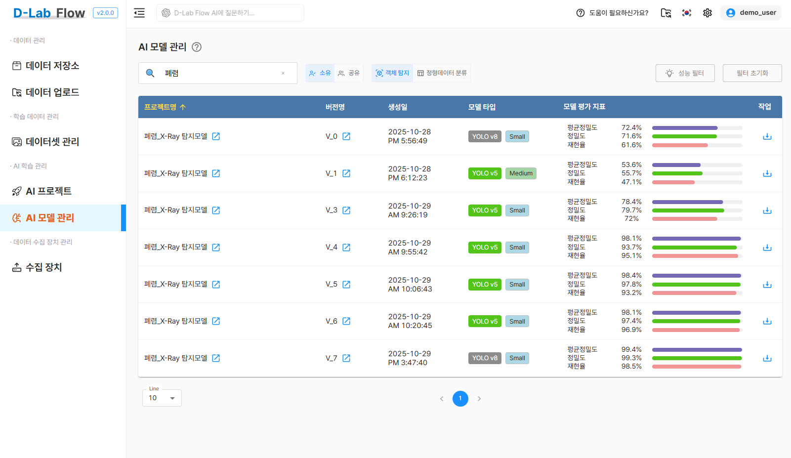
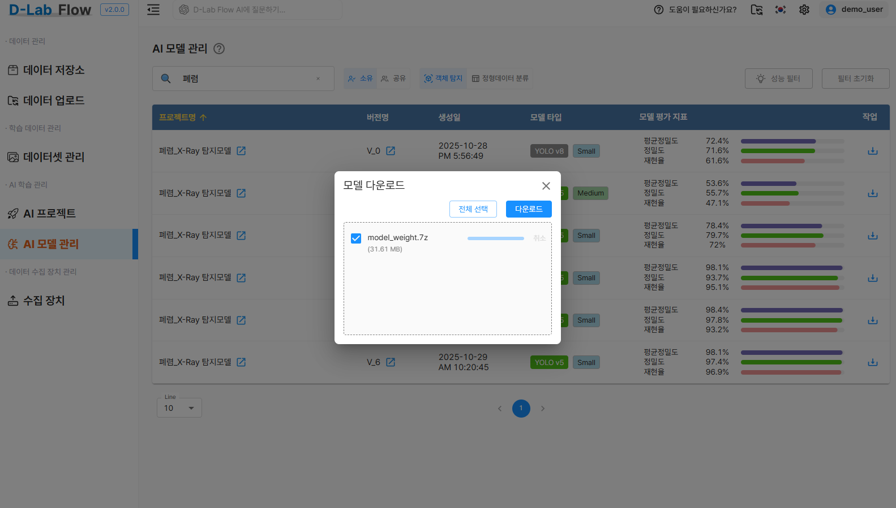

본 포스트에서는 D-Lab Flow에서 학습한 **YOLO 기반 폐렴 탐지 모델**을 ONNX 형식으로 변환하고,  
이를 **브라우저에서 객체 탐지**로 구현하는 방법을 소개합니다.

<!--truncate-->

## 결과물 소개

이 글을 통해 아래 내용을 학습할 수 있습니다

- D-Lab Flow를 활용한 객체 탐지 모델 생성
- YOLO 모델을 ONNX로 변환하여 웹에서 활용하기
- React 기반 폐렴 탐지 웹 애플리케이션 구현

<div className="image-row">


</div>

*[라이브 데모 링크 열기](https://dlabflow-yolo-onnx-react-pneumonia.vercel.app/)*

브라우저를 통해 접속 후 sample 또는 파일 선택 버튼을 클릭하여 탐지에 사용될 이미지를 선택하면 폐렴 탐지가 실행됩니다.


### ※ 카메라 방식 VS 이미지 선택 방식


왼쪽은 실시간 카메라이고 오른쪽은 이미지 선택 입니다. 신뢰도와 객체를 탐지하는 부분에서 큰 차이를 보이고 있습니다. 


실시간 카메라 영상은 해상도, 촬영 각도, 조명 조건 등이 일정하지 않아 영상 품질이 변동될 수 있어, 정확한 폐렴 탐지에는 한계가 있을 수 있습니다.
반면, 이미지 선택 방식은 환자의 X-ray나 CT 영상 등 고품질 의료 이미지를 직접 시스템에 제출하여 AI 모델의 정밀한 추론을 수행할 수 있습니다.
이미지 상에 객체의 상태가 명확히 보이지 않는 폐렴 같은 특정 의료 데이터셋의 경우, 실시간 카메라를 통한 탐지보다 이미지 선택 방식을 활용하는 것이 더 적합할 수 있습니다.

따라서 폐렴 진단처럼 민감하고 정확도가 중요한 의료 영상 분석에서는 실시간 영상보다 환자의 정밀 이미지 업로드를 통한 탐지 방식이 더 효과적이고 현실적인 방법이라고 할 수 있습니다.

:::tip 카메라를 통한 실시간 객체 탐지
실시간 카메라를 이용한 객체탐지 웹 애플리케이션을 구현하고 싶다면 아래링크에 있는 블로그 글을 참고하시면 됩니다.

*[실시간 적혈구 탐지 데모 링크 열기](https://grit-docs.github.io/dlabflow/blog/yolo-onnx-object-detection-react-rbc)*

*[실시간 탐지 웹 앱 링크 열기](https://grit-docs.github.io/dlabflow/blog/yolo-onnx-object-detection-react)*
:::


## 시작하기
## D-Lab Flow에서 모델 생성 하기

### 1. 저장소 생성
이미지 형식으로 저상소를 생성합니다.


### 2. 이미지 파일 업로드 수정필요
아래 데이터셋을 다운로드하여 `Pneumonia_images` 폴더를 업로드합니다.

[폐렴 객체탐지 데이터셋 다운로드 링크 ⬇️](./img/Pneumonia_dataset.zip)



### 3. 데이터셋 생성
이미지 유형으로 데이터셋을 생성합니다.


### 4. 라벨링 파일 업로드 및 라벨링 작업
첨부된 `Pneumonia_annotations` 폴더를 업로드합니다.


라벨링 상태를 확인합니다.


:::tip 라벨링 확인
- 라벨링 작업은 전체, 작업대기, 작업완료로 표시되며 `작업대기`에서 라벨링 정보가 없는 파일을 확인할 수 있습니다.
  :::

### 5. 프로젝트 생성
객체탐지 타입의 프로젝트를 생성합니다.



### 6. 인공지능 학습
학습에 사용할 데이터셋을 활성화 합니다.



버전을 생성하고 모델을 지정하여 학습을 진행합니다.



하이퍼파라미터 설정 값 및 다양한 모델을 사용하여 학습을 해보고 성능지표를 비교합니다.



:::tip
- 버전생성시 전처리나 학습데이터 증강 선택을 통해 학습데이터의 품질을 높이거나 양과 다양성을 증가시킬수 있습니다.
- 버전생성후 하이퍼파라미터에서 다양한 모델선택이 가능하고, 배치크기나 훈련횟수를 조정해 모델의 성능을 높일수 있습니다.
  :::


## 폐렴 객체탐지 데모 만들기

### 1. 모델 가중치를 onnx 파일로 변환
D-Lab Flow에서 학습 완료된 best.pt 모델을 다운로드합니다.
Ultralytics 저장소를 클론하여 ONNX 변환을 수행합니다.
:::info 
- 모델을 다운받고 압축을 풀면 best.pt 파일이 있습니다.
:::



아래 절차는 YOLOv8 이후 모델(YOLOv8, v9, v11) 모두 지원합니다.

가중치 파일 변환을 위한 과정을 진행합니다.
```bash
// 작업환경을 준비
git clone https://github.com/ultralytics/ultralytics.git
cd ultralytics

// 가상환경 활성화 및 의존성 설치
python -m venv yolo-env
yolo-env\Scripts\activate
pip install ultralytics onnx onnxruntime

// onnx 형태로 변환
yolo export model=best.pt format=onnx
```
:::info
- 위 과정을 완료하면 `ultralytics` 폴더에 best.onnx 파일이 생성됩니다.
  :::


### 2. 데모 프로젝트 다운로드
실시간 객체 탐지 데모 프로젝트를 클론하고 필요한 의존성을 설치합니다

```bash
git clone https://github.com/grit-docs/dlabflow-yolo-onnx-react-Pneumonia.git
cd dlabflow-yolo-onnx-react-Pneumonia
npm install
```

변환된 best.onnx 파일을 복사 후 이름을 model.onnx 로 변경하여 아래 경로에 저장합니다.

```bash
public/models/model.onnx
```

샘플이미지를 변경하고 싶다면 원하는 이미지를 `img1.jpg`, `img2.jpg`, `img3.jpg` 이름으로 변경하여 아래 경로에 저장합니다.

```bash
public/samples/
```

웹앱을 실행합니다.
```bash
npm run dev
```

완성된 폐렴 객체 탐지 데모 GitHub 저장소

```bash
https://github.com/grit-docs/dlabflow-yolo-onnx-react-Pneumonia.git
```


