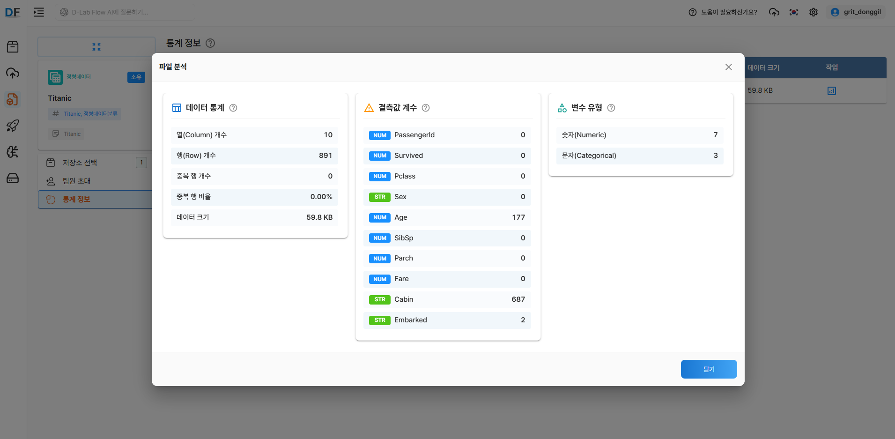
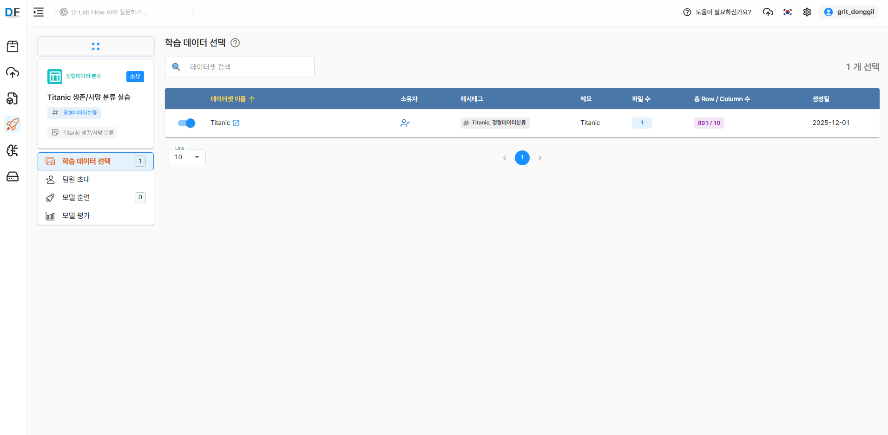
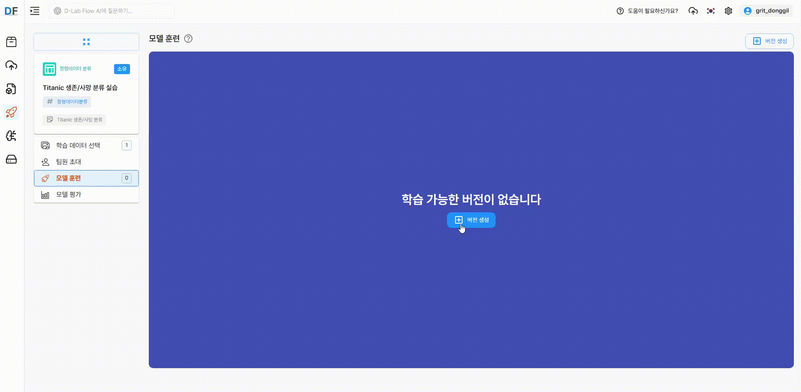
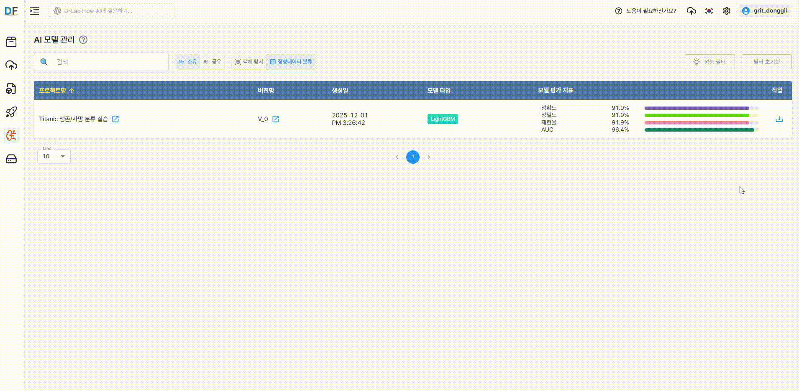

본 포스트에서는 D-Lab Flow에서 **지도학습 기반의 정형 데이터 분류 모델**을 구축하는 방법을 소개합니다.

<!--truncate-->

## 1. 데이터 준비

### 1.1 데이터 다운로드

**지도 학습(Supervised Learning)** 기반의 정형 데이터 분류 모델을 구축하기 위해, 머신러닝 입문자부터 실무자까지 널리 활용하는 **Kaggle Titanic 생존자 예측 데이터**를 사용합니다. 해당 데이터셋은 승객의 개인 정보 및 탑승 정보를 포함하며, 이를 기반으로 **생존 여부(Survived)**를 예측하는 **이진 분류(Binary Classification)** 문제를 다룹니다.

데이터는 Kaggle에서 공개적으로 제공되며 아래 링크에서 다운로드 할 수 있습니다.

:::info Kaggle 로그인 필요

*[Kaggle Titanic 데이터 링크 열기](https://www.kaggle.com/competitions/titanic/data)*

데이터 파일 구성은 다음과 같습니다.

- **train.csv** : 학습용 데이터로, 각 승객의 생존 여부(Survived)가 포함되어 있어 모델 학습에 사용됩니다.
- **test.csv** : 테스트용 데이터로, 생존 여부가 포함되지 않아 학습된 모델의 예측(추론)에 활용됩니다.
:::

### 1.2 데이터 확인

## 2. D-Lab Flow 데이터 저장소 및 데이터 생성

### 2.1 D-Lab Flow 로그인

발급받은 계정 정보로 D-Lab Flow에 로그인합니다.

1. D-Lab Flow 웹사이트 접속
2. 제공받은 **사용자 ID**와 **비밀번호** 입력
3. 로그인 완료 후 메인 대시보드 확인

:::warning 로그인 관련 주의사항
- 처음 로그인 시 비밀번호 변경을 권장합니다
- 계정 정보는 타인과 공유하지 마세요
- 로그인에 문제가 있을 경우 gritdevops@gmail.com로 이메일 문의 부탁드립니다
  :::

### 2.2 데이터 저장소 생성

먼저 학습 데이터를 체계적으로 관리하기 위한 데이터 저장소를 생성해야 합니다.

1. D-Lab Flow 메인 화면에서 **데이터 저장소** 메뉴로 이동
2. `저장소 생성` 버튼을 클릭
3. 다음 정보를 입력:
   - **저장소 이름**: Titanic(명확하고 구분 가능한 이름)
   - **해시태그**: 생존, 사망 분류(검색 및 식별용 키워드)
   - **저장소 타입**: 사용자 업로드
   - **파일 타입**: 정형데이터

### 2.3 정형 데이터 파일 업로드

생성한 데이터 저장소에 Kaggle Titanic 데이터를 업로드합니다.

1. 생성된 저장소 선택
2. `업로드` 버튼 클릭
3. 업로드 방식 선택:
   - **업로드 파일**: 정형 데이터 폴더의 파일들을 개별적으로 선택
   - **업로드 폴더**: 정형 데이터 폴더를 한 번에 업로드

:::tip 업로드 팁
- 지원 포맷: .csv
- 대용량 파일의 경우 안정적인 네트워크 환경에서 업로드
  :::

### 2.4 업로드 결과 미리보기

정형 데이터 파일을 업로드한 후, 화면의 작업 메뉴에서 **미리보기** 버튼을 클릭하면 데이터의 행·열 구성과 각 컬럼의 상세 정보를 확인할 수 있습니다.

### 2.5 데이터셋 생성

업로드된 데이터들을 하나의 데이터셋으로 구성합니다.

1. `데이터셋 생성` 버튼 클릭
2. 데이터셋 정보 입력:
    - **데이터셋 이름**: Titanic
    - **해시태그**: Titanic, 정형데이터분류
    - **메모**: Titanic
    - **데이터셋 유형**: 정형데이터

### 2.6 저장소 선택 및 통계 정보 확인

1. 저장소 선택 메뉴에서 저장소 이름 확인 후 선택
2. 통계 정보의 작업 메뉴에서 **분석정보** 버튼을 클릭하여 데이터의 통계, 결측값 개수, 변수 유형을 확인할 수 있습니다.

## 3. 프로젝트 및 버전 생성

### 3.1 AI 프로젝트 생성

데이터셋을 기반으로 실제 AI 모델 학습을 위한 프로젝트를 생성합니다.

프로젝트 생성에 관한 상세 매뉴얼은 [D-Lab Flow 공식 문서](https://grit-docs.github.io/dlabflow/docs/manage_ai_learning/ai_project/generate_project)를 참고하세요.

1. **프로젝트** 메뉴로 이동
2. `프로젝트 생성` 버튼 클릭
3. 프로젝트 설정:
    - **프로젝트명**: Titanic 생존/사망 분류 실습
    - **프로젝트 타입**: 정형데이터분류
    - **해시태그**: 정형데이터분류, 튜토리얼
    - **메모**: Titanic 생존/사망 분류

### 3.2 학습 데이터 선택

앞서 생성한 `Titanic 데이터`를 선택합니다.

### 3.3 학습 버전 생성

프로젝트 내에서 정형데이터 분류 모델에 사용할 학습 데이터를 생성합니다.

1. 생성된 프로젝트 상세 화면에서 `버전 생성` 버튼 클릭
2. 학습 파일 정보 확인
    - 선택된 데이터셋의 파일 수, 행(Row) 개수, 열(Column) 개수 등 요약 정보를 확인합니다.
3. 학습/시험 데이터 분할
    - 기본값은 학습 80%, 검증 10%, 시험 10% 입니다.
    - 비율 재설정 버튼을 통해 원하는 비율로 조정할 수 있습니다.
4. 데이터 전처리
    - 수치형 변환, 결측치 처리, 이상치 처리를 진행 할 수 있습니다.
    - 각 옵션에서 수치형 변환과 결측치 처리가 선택되지 않은 변수가 있을 경우, 다음 단계로 진행할 수 없습니다.

:::warning 데이터 전처리에 소요되는 시간
- 학습 파일의 크기와 데이터의 행·열 수에 따라 전처리 시간은 크게 달라질 수 있습니다.
  :::

## 4. 모델 훈련 및 추가 지표 확인

### 4.1 하이퍼파라미터 설정

데이터 전처리가 완료되면 `인공지능 학습 시작` 버튼이 활성화됩니다.

1. **모델 선택**
    - **LightGBM**: 대용량 데이터에 최적화된 고속·고성능 그래디언트 부스팅 모델입니다.
    - **Gradient Boosting**: 약한 예측기를 순차적으로 결합해 예측 성능을 높이는 전통적 부스팅 모델입니다.
    - **AdaBoost**: 오분류된 데이터에 가중치를 높여 학습하는 적응형 부스팅 모델입니다.
2. **종속 변수**: 반드시 하나의 변수만 선택해야 합니다.
3. **독립 변수**: 종속 변수로 선택된 변수를 제외한 나머지 변수들 중 복수 선택이 가능합니다.

### 4.2 훈련 시작 및 결과 확인

`인공지능 학습 시작` 버튼을 클릭하면 아래와 같이 학습이 진행되는 것을 확인할 수 있습니다.

:::warning 훈련에 소요되는 시간
- 데이터 크기, 모델 복잡도, 하드웨어(GPU) 성능에 따라 훈련 시간은 크게 달라질 수 있습니다.
  :::

훈련이 완료된 후, **추가 지표** 탭에서 다음 정보를 확인할 수 있습니다.

#### 훈련 vs 검증 정확도 차트

반복횟수 50번을 기준으로 Train Accuracy(파란색)와 Validation Accuracy(주황색)의 변화를 확인할 수 있습니다.

:::tip
1.0(100%)에 가까울수록 훈련 성능이 우수하다고 판단할 수 있습니다.
  :::

#### 변수 중요도 차트

각 변수의 값이 높을 수록 해당 변수가 모델 추론(예측)에 더 큰 영향을 미칩니다.

## 5. 모델 성능 평가 및 분석

### 5.1 기본 성능 지표

학습이 완료되면 `모델 평가` 메뉴에서 다양한 성능 지표를 확인할 수 있습니다.

#### 주요 성능 지표

1. **정확도(Accuracy)**
    - 모델이 전체 데이터에서 얼마나 정확하게 예측했는지를 나타내는 지표로, 전체 예측 중 올바르게 맞춘 비율입니다.
    - Accuracy = (TP + TN) / (TP + TN + FP + FN)
2. **정밀도(Precision)**
    - 모델이 Positive로 예측한 것 중 실제로 Positive인 비율로, False Positive를 얼마나 잘 줄였는지를 나타냅니다.
    - Precision = TP / (TP + FP)
3. **재현율(Recall)**
    - 실제 Positive 중에서 모델이 올바르게 Positive로 예측한 비율로, False Negative를 얼마나 잘 줄였는지를 나타냅니다.
    - Recall = TP / (TP + FN)
4. **AUC(Area Under the Curve)**
    - ROC 곡선(Receiver Operating Characteristic Curve) 아래 면적을 의미하는 지표로, 모델이 Positive와 Negative를 잘 구분하는 능력을 나타냅니다.
    - 1에 가까울수록 모델 성능이 좋다고 볼 수 있습니다.

## 6. 모델 배포 및 실제 활용

### 6.1 모델 다운로드

학습이 완료된 모델을 실제 애플리케이션에서 사용하기 위해 다운로드 할 수 있습니다.

모델을 다운로드하면 한 개의 체크포인트 파일이 생성됩니다.

:::tip lightgbm_model.pkl 파일
학습이 완료된 모델을 그대로 불러와 예측, 평가, 추가 학습(Fine-tuning) 가능합니다.
  :::

:::warning 언제 사용하면 좋을까?
학습을 마친 후 예측만 하고 싶을 때 사용할 수 있으며, 이미 학습된 모델을 기존 데이터에 이어 학습하거나, 새로운 데이터로 업데이트할 수 있습니다.
  :::