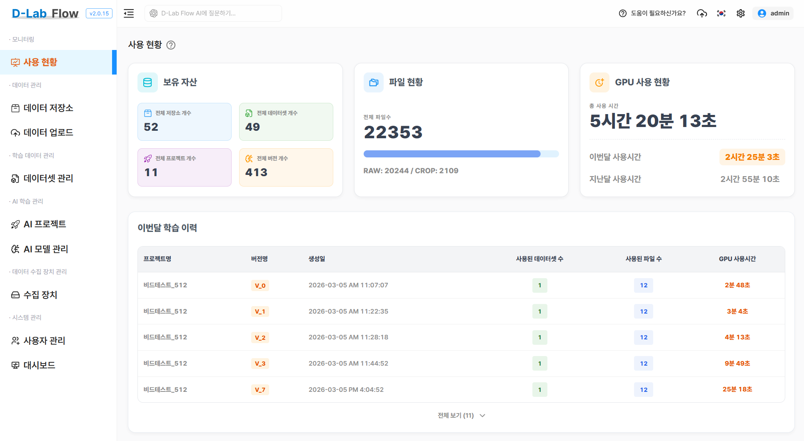
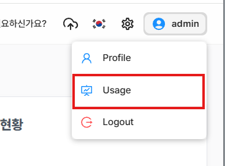
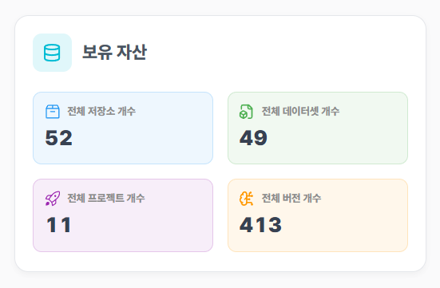
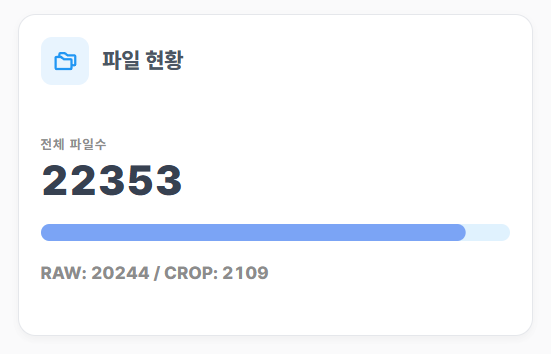
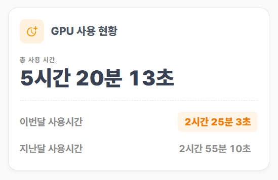
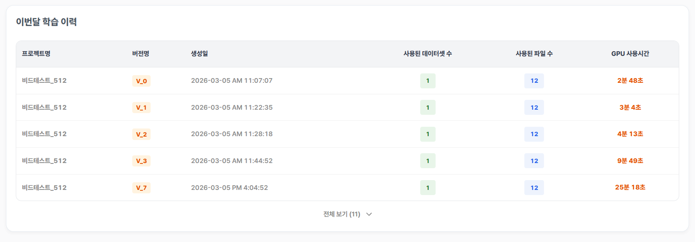
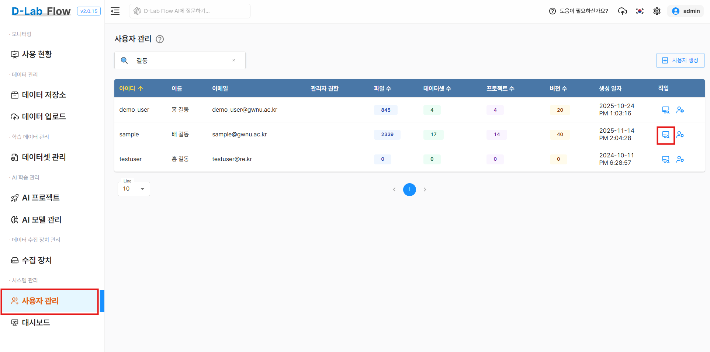
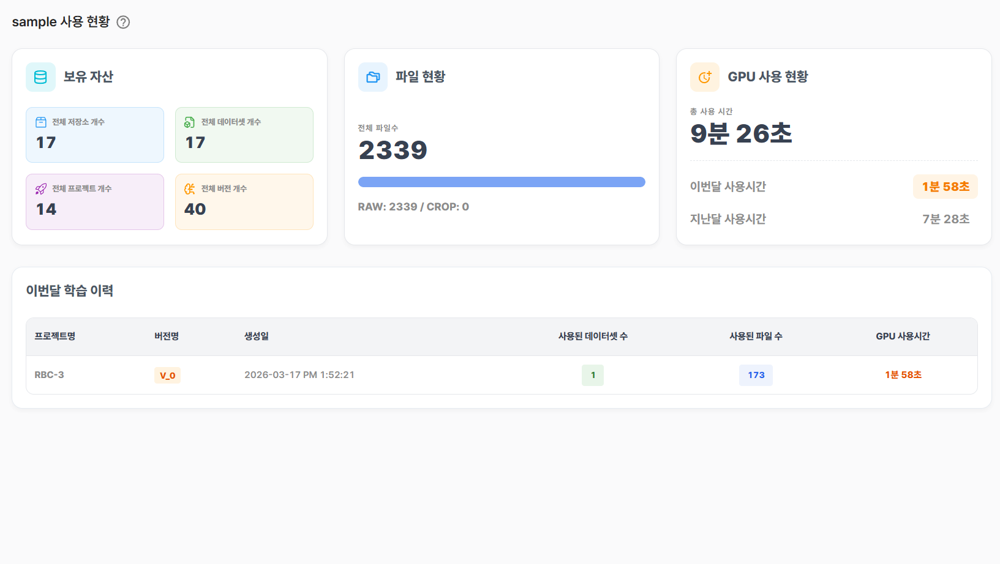

본 포스트에서는 D-Lab Flow의 **사용 현황(Usage) 대시보드**를 구성하는 주요 지표들을 상세히 파헤쳐 보고,
이 대시보드를 활용하여 프로젝트 전반의 자원 흐름을 한눈에 모니터링하는 방법을 소개합니다.

<!--truncate-->

## 사용 현황

이 글을 통해 아래 내용을 모니터링할 수 있습니다.

- 보유 자산 : `저장소` `데이터셋` `프로젝트` `버전`
- 파일 현황 : `RAW - 원본파일` `CROP-커스텀파일`
- GPU 사용 현황 : 모델 학습에 사용된 실제 `GPU 사용 시간`
- 이번달 학습 이력 : 당월에 성공적으로 학습된 `버전의 목록`

:::tip 접근 방법
- 좌측 사이드 메뉴바의 모니터링 영역에서 `사용 현황` 버튼을 통해 접근합니다.
- 우측 상단 프로필 탭 메뉴에서 `Usage` 버튼을 통해 접근합니다.

  :::

### 1. 자산 현황
현재 생성된 데이터 저장소, 데이터셋, 프로젝트, 모델 버전의 총개수를 보여줍니다.

- 전체 저장소 개수 : 사용자와 장비로부터 생성된 이미지 타입(RAW, CROP), 정형데이터 타입의 모든 저장소 수
- 전체 데이터셋 개수 : 사용자가 소유한 이미지와 정형데이터 타입의 모든 데이터셋 수
- 전체 프로젝트 개수 : 사용자가 소유한 이미지와 정형데이터 타입의 모든 프로젝트 수
- 전체 버전 개수 : 프로젝트에서 생성된 모든 버전 수(모델학습을 진행하지 않거나 에러가난 모든 버전을 포함)

:::info
- 각 항목의 생성 및 삭제시 실시간으로 반영됩니다.
:::

### 2. 파일 현황
시스템에 업로드된 총 이미지 파일 수와 함께, 원본 데이터(RAW)와 가공된 데이터(CROP)의 비율을 직관적인 프로그레스 바(Progress Bar) 형태로 제공합니다.

- 전체 파일 수 : 원본 데이터(RAW) + 가공된 데이터(CROP)
- RAW : 원본 데이터
- CROP : 가공된 데이터(커스텀 데이터)

:::info
- 정형데이터의 경우 원본 데이터만 존재하기 때문에 RAW 데이터에 포함됩니다.
:::

### 3. GPU 사용 현황
AI 학습에서 가장 중요하고 비용이 많이 드는 자원인 GPU의 사용 시간을 제공합니다.

- 총 사용 시간 : 총 누적된 GPU 사용 시간
- 이번달 사용시간 : 당월에 사용한 총 GPU 시간
- 지난달 사용시간 : 지난달에 사용한 총 GPU 시간

:::info
- 예시 : 4월 10일에 데이터를 조회 시
- 이번달 사용시간 : 4월 1일 ~ 4월 10일 
- 지난달 사용시간 : 3월 1일 ~ 3월 31일
  :::

:::warning GPU 알림
- 버전 생성일이 아닌 모델 학습을 시작한 시간을 기준으로 합니다.
- 학습에 성공한 버전의 시간만 포함합니다.
:::

### 4. 이번달 학습 이력
학습 이력 테이블은 자원이 어디에 쓰였는지에 대한 상세한 정보를 제공합니다.

- 프로젝트명 : 해당 버전이 속한 프로젝트의 이름 
- 버전명 : 버전 이름
- 생성일 : 해당 버전이 생성된 시간
- 사용된 데이터셋 수 : 해당 버전 학습에 사용된 데이터셋 수
- 사용된 파일 수 : 해당 버전 학습에 사용된 파일 수
- GPU 사용시간 : 해당 버전 학습에 소요된 GPU 사용시간

:::info
- 테이블 하단에 `전체보기` 버튼을 통해 이번달에 학습된 버전의 수를 표시하고, 확장/접기 기능을 제공합니다.
- 학습에 성공한 버전만 표시합니다.
- 테이블의 생성일은 학습과 관계없이 버전이 생성된 시간이며, 시간의 흐름에 따라 가장 최근 날짜가 하단에 존재합니다.
:::

:::tip
- **실전 활용 예시:** `V_1` 버전에 파일 1,000개를 넣어 학습했을 때 GPU가 20분 소모되었고, `V_2` 버전에 데이터를 증강하여 5,000개를 넣었을 때 1시간 30분이 소모되었다면?
이 테이블을 통해 **데이터 투입량 대비 학습 시간의 변화**를 직관적으로 비교하고, 다음 버전 학습 시 소요 시간을 합리적으로 예측해 볼 수 있습니다.
:::

### 5. 관리자 기능
관리자 권한으로 접속 시, 시스템 내 모든 사용자의 사용 현황을 확인할 수 있습니다.

- 접근방법 : 사용자 관리 메뉴 > 작업 > `데이터 통계` 버튼
- 관리자는 사용자 관리페이지에서 사용자별 파일, 데이터셋, 프로젝트, 버전 수를 간략하게 파악할 수 있습니다.
- `데이터 통계` 버튼을 통해 접근시 상단에는 해당 사용자의 ID가 추가로 표현되고, 해당 사용자의 사용 현황을 볼 수 있습니다.

## 마치며

D-Lab Flow의 사용 현황 대시보드는 단순히 숫자를 보여주는 화면이 아닙니다. **사용자에게는 효율적인 프로젝트 관리의 나침반이 되고, 관리자에게는 한정된 AI 자원을 최적화할 수 있는 강력한 모니터링 도구**입니다.

지금 바로 사용 현황에 접속하여, 여러분의 데이터와 자원이 얼마나 효율적으로 움직이고 있는지 직접 확인해 보세요!