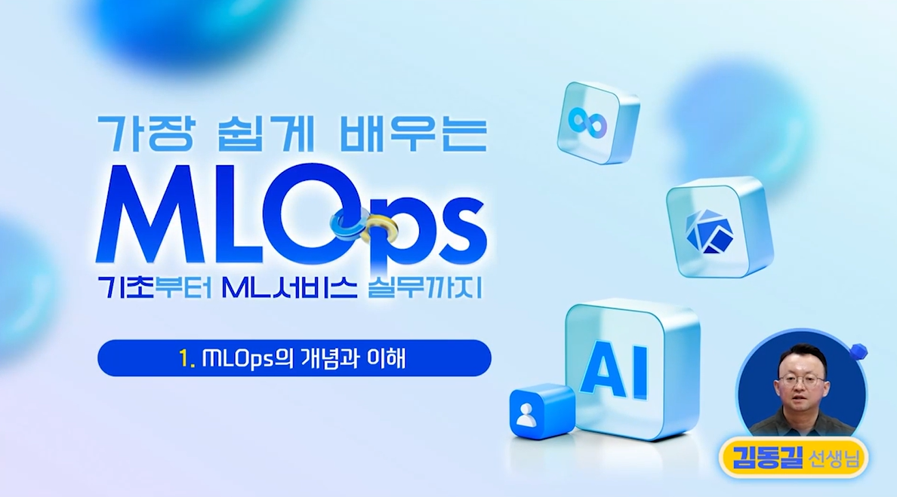
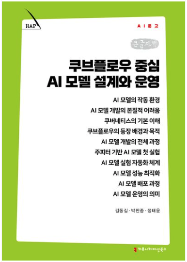

import MlopsJourney from './img/mlops-journey.svg';

AI 모델 개발은 코드를 작성하고 모델을 한 번 학습하는 것으로 끝나지 않습니다. 같은 결과를 다시 만들어낼 수 있어야 하고, 반복되는 실험을 관리하며, 제한된 컴퓨팅 자원을 효율적으로 사용해야 합니다. 데이터 준비부터 학습, 평가와 운영까지 이어지는 전체 과정을 체계적으로 관리하는 것이 <strong>MLOps(Machine Learning Operations)</strong>의 역할입니다.

강원ICT융합연구원은 D-Lab Flow 개발 이전부터 쿠브플로우(Kubeflow)를 중심으로 MLOps 기술을 연구해 왔습니다. 김동길 선임연구원은 관련 연구의 주축으로 참여해 왔으며, 연구원이 축적한 경험과 전문 지식은 D-Lab Flow의 AI 학습 백엔드를 설계하고 개발하는 데 활용됐습니다. 이러한 전문성은 온라인 강의와 전문 도서로도 이어졌습니다.

<!--truncate-->

<MlopsJourney
  role="img"
  aria-label="쿠브플로우 연구가 D-Lab Flow, 온라인 강의, 전문 도서로 이어지는 기술 여정"
/>

## D-Lab Flow 이전부터 이어진 연구원의 쿠브플로우 연구

AI 모델의 성능만큼 중요한 것은 모델을 만드는 과정의 <strong>재현성</strong>입니다. 같은 코드가 있더라도 데이터 전처리 방식, 라이브러리 버전, 실행 환경과 실험 순서가 기록되지 않으면 같은 결과를 다시 만들기 어렵습니다. 여러 사용자가 동시에 학습을 실행하는 환경에서는 GPU와 스토리지 같은 자원을 안정적으로 할당하고, 각 작업의 상태와 결과를 관리하는 문제도 함께 해결해야 합니다.

강원ICT융합연구원은 이러한 문제를 해결하기 위해 D-Lab Flow 개발 이전부터 쿠브플로우와 MLOps 백엔드 시스템을 연구했습니다. 김동길 선임연구원을 중심으로 수행한 주요 연구 분야는 다음과 같습니다.

- 반복 가능한 AI 모델 학습 파이프라인
- GPU를 비롯한 컴퓨팅 자원의 효율적인 관리
- AI 학습 작업과 인프라 모니터링
- 데이터 전처리와 모델 학습 자동화
- 안정적이고 확장 가능한 AI 백엔드 시스템 설계

### 관련 연구

쿠브플로우와 MLOps에 관한 연구는 객체 탐지 모델 학습, 모델 배포, 라벨링 자동화와 GPU 자원 관리 등으로 이어져 왔습니다.

- [MLOps 기반 Kubeflow 환경에 최적화된 객체 탐지 모델 개발](https://www.kci.go.kr/kciportal/ci/sereArticleSearch/ciSereArtiView.kci?sereArticleSearchBean.artiId=ART003093570)
  - 쿠브플로우 환경에 적합한 객체 탐지 모델 학습
- [Kubeflow 시스템에서 AI 모델 배포 전략: BentoML 중심으로](https://www.kci.go.kr/kciportal/ci/sereArticleSearch/ciSereArtiView.kci?sereArticleSearchBean.artiId=ART003173993)
  - 모델 패키징, 버전 관리와 API 배포
- [Kubeflow 기반 다양한 어노테이션 포맷 통합 및 자동화된 객체 탐지 라벨링 시스템 개발](https://www.kci.go.kr/kciportal/ci/sereArticleSearch/ciSereArtiView.kci?sereArticleSearchBean.artiId=ART003211711)
  - 어노테이션 형식 통합과 자동 라벨링 파이프라인
- [딥러닝 시스템에서 MIG 기반 GPU 자원의 효율적 활용을 위한 Kubeflow 연계 방안](https://www.kci.go.kr/kciportal/landing/article.kci?arti_id=ART003331182)
  - GPU 분할, 워크플로 단위 자원 할당과 다중 학습 작업

쿠브플로우는 쿠버네티스(Kubernetes) 위에서 AI 플랫폼을 구축할 수 있도록 모델 학습, 파이프라인, 실험 최적화와 모델 관리 등에 필요한 도구를 모듈 형태로 제공합니다. 개인의 일회성 실험을 반복하고 관리할 수 있는 작업으로 전환하고, 데이터 준비부터 모델 학습과 운영까지 이어지는 과정을 하나의 흐름으로 연결하는 것이 핵심입니다.

:::tip MLOps가 필요한 이유

좋은 모델을 한 번 만드는 것만으로는 실제 운영까지 이어지기 어렵습니다. 데이터와 실행 환경, 학습 조건 및 결과를 함께 기록하고 반복할 수 있어야 모델이 개인의 실험을 넘어 조직의 기술 자산이 됩니다.

👉 [쿠브플로우 공식 소개 살펴보기](https://www.kubeflow.org/docs/started/introduction/)

:::

## 연구 지식이 D-Lab Flow 개발에 기여하다

[D-Lab Flow](/)는 데이터 관리와 라벨링부터 AI 프로젝트 생성, 모델 학습과 평가, 학습 모델 관리까지 지원하는 AI 개발·운영 플랫폼입니다. 사용자는 복잡한 인프라를 직접 구성하지 않고도 웹 환경에서 AI 모델 개발 과정을 단계적으로 수행할 수 있습니다.

D-Lab Flow의 AI 학습 백엔드는 쿠브플로우를 기반으로 구성되어 있습니다. 연구원이 이전부터 축적해 온 쿠브플로우 연구 경험은 이 백엔드의 설계와 개발 과정에 활용됐습니다.

| D-Lab Flow에서 수행하는 작업 | 백엔드에서 필요한 기술적 역할 |
| --- | --- |
| 데이터셋을 선택해 학습 버전 생성 | 학습 작업에 필요한 데이터와 실행 조건 구성 |
| AI 모델 학습 실행 | 쿠브플로우 기반 학습 작업 실행과 상태 관리 |
| 여러 학습 버전 관리 | 반복되는 실험과 결과의 체계적인 관리 |
| GPU 기반 모델 학습 | 컴퓨팅 자원 할당과 사용 현황 관리 |
| 모델 성능 평가 | 학습 결과와 모델 산출물 관리 |

사용자에게는 하나의 버튼과 진행 상태로 보이는 기능도 백엔드에서는 데이터, 실행 환경, 컴퓨팅 자원과 학습 결과를 연결해야 하는 복합적인 과정입니다. D-Lab Flow는 이 복잡성을 플랫폼 내부에서 처리해 사용자가 AI 모델과 데이터에 집중할 수 있도록 돕습니다.

## 쿠브플로우와 MLOps 지식을 온라인 강의로

김동길 선임연구원은 축적한 전문 지식을 멀티캠퍼스 온라인 과정 <strong>「가장 쉽게 배우는 MLOps, 기초부터 ML서비스 실무까지!」</strong>를 통해 공유했습니다.

이 강의는 MLOps의 기본 개념에서 시작해 쿠브플로우 개발 환경 구성, 데이터 연동과 전처리, 모델 학습·평가·추론, 배포와 최적화, 버전 관리와 모니터링까지 다루는 8시간·16차시 과정입니다.

:::info 맛보기 강의

썸네일을 선택하거나 아래 링크를 누르면 멀티캠퍼스 학습창에서 <strong>「MLOps의 개념과 이해」</strong> 맛보기 강의를 시청할 수 있습니다.

▶ [MLOps 맛보기 강의 시청하기](https://learning.multicampus.com/lrn/common/commCrsPreview?lrnTypeCd=P&code=EB24HL)

:::

강의의 주요 흐름은 다음과 같습니다.

1. MLOps의 개념과 AI 워크플로 이해
2. 쿠브플로우 설치와 개발 환경 구성
3. 데이터 스토리지 설정, 연동과 전처리
4. AI 학습 데이터 생성과 모델 훈련
5. 모델 검증, 평가와 추론
6. 모델 배포, 최적화, 버전 관리와 모니터링

:::tip 이런 분께 추천합니다

쿠브플로우를 처음 접하거나, 쿠버네티스 기반 환경에서 데이터 전처리부터 모델 학습·평가·배포까지 이어지는 MLOps 워크플로를 실무 중심으로 학습하고 싶은 분께 추천합니다.

👉 [멀티캠퍼스 MLOps 강의 살펴보기](https://m.multicampus.com/course/crsDetail?corsCd=EB24HL)

:::

## 축적된 연구가 전문 도서로 이어지다

오랫동안 축적한 연구와 교육 경험은 2026년 5월 출간된 <strong>『쿠브플로우 중심 AI 모델 설계와 운영』</strong>으로도 이어졌습니다.

이 책은 단순히 쿠브플로우의 설치 방법이나 명령어를 설명하는 데 머물지 않습니다. AI 모델을 일회성 결과물이 아니라 반복하고 기록하며 운영할 수 있는 시스템으로 바라보고, 다음과 같은 주제를 하나의 흐름으로 설명합니다.

- AI 모델의 실행 환경과 개발 과정의 어려움
- 쿠버네티스의 기본 개념과 쿠브플로우의 역할
- 주피터 기반의 초기 모델 실험
- 반복 가능한 AI 실험 자동화
- 모델 성능 최적화
- 학습 모델의 배포와 지속적인 운영

:::info 책이 던지는 질문

같은 코드로 학습했는데 결과가 달라지는 이유는 무엇일까요? 실험 환경과 학습 조건을 어떻게 기록하고, 검증된 과정을 어떻게 자동화할 수 있을까요? 이 책은 이러한 질문에서 출발해 데이터 전처리, 모델 학습, 실험 관리, 배포와 운영을 하나의 흐름으로 연결하는 방법을 설명합니다.

:::

### 도서 정보

| 항목 | 내용 |
| --- | --- |
| 도서명 | 쿠브플로우 중심 AI 모델 설계와 운영 |
| 저자 | 김동길, 박판종, 정태윤 |
| 출판사 | 커뮤니케이션북스 |
| 발행일 | 2026년 5월 18일 |
| 주요 주제 | 쿠브플로우, 쿠버네티스, MLOps, AI 모델 운영 |

👉 [출판유통통합전산망에서 도서 정보 확인하기](https://bnk.kpipa.or.kr/home/v3/addition/adiPromoMetaDataView01/seq_20260508165808651564)

## 연구에서 플랫폼, 교육과 출판으로

강원ICT융합연구원의 쿠브플로우 연구는 하나의 방향에서 출발해 서로 다른 형태의 성과로 이어졌습니다.

| 영역 | 의미 |
| --- | --- |
| 쿠브플로우·MLOps 연구 | 기술 전문성과 문제의식의 출발점 |
| D-Lab Flow | 축적된 연구 지식이 실제 플랫폼 개발에 활용된 사례 |
| 온라인 강의 | 쿠브플로우와 MLOps 실무 지식을 전달하는 교육 콘텐츠 |
| 전문 도서 | AI 모델 설계와 운영에 관한 관점과 원칙을 정리한 결과 |

연구는 기술에 대한 깊이를 만들고, 플랫폼은 그 기술이 실제 현장에서 작동하도록 합니다. 강의는 실무 방법을 전달하고, 책은 그 과정에서 축적한 관점과 원칙을 더 많은 독자와 공유합니다.

## 마치며

강원ICT융합연구원의 쿠브플로우 연구는 D-Lab Flow 개발 이전부터 이어져 왔으며, 김동길 선임연구원은 그 중심에서 연구와 기술 개발에 참여해 왔습니다. 연구원이 축적한 전문성은 D-Lab Flow의 쿠브플로우 기반 AI 학습 백엔드를 설계하고 개발하는 데 도움이 됐으며, 온라인 강의와 전문 도서를 통해 개발자와 연구자에게도 공유되고 있습니다.

강원ICT융합연구원은 앞으로도 연구 성과를 실제 플랫폼과 교육 콘텐츠로 연결하며, 누구나 신뢰할 수 있는 AI 개발 환경을 활용할 수 있도록 기술을 발전시켜 나가겠습니다.
