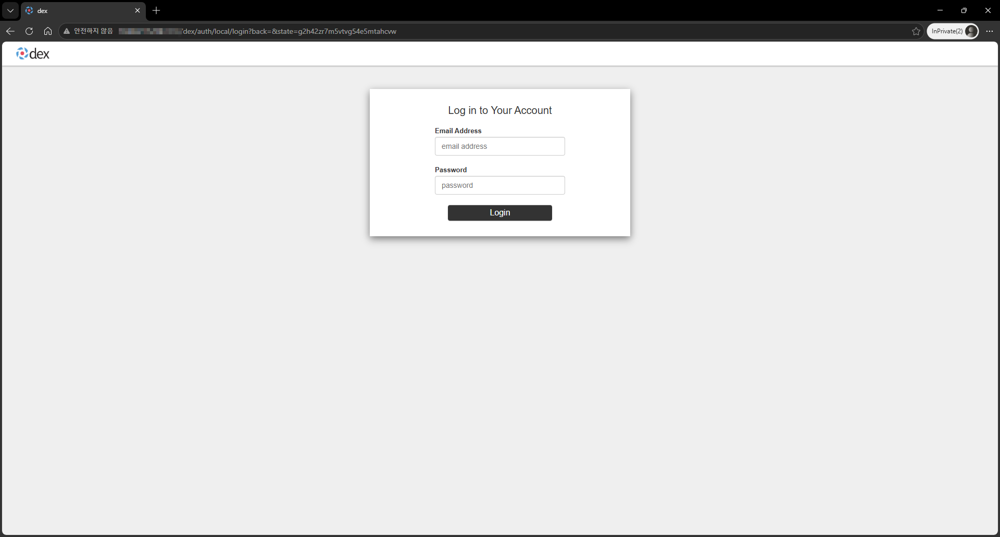
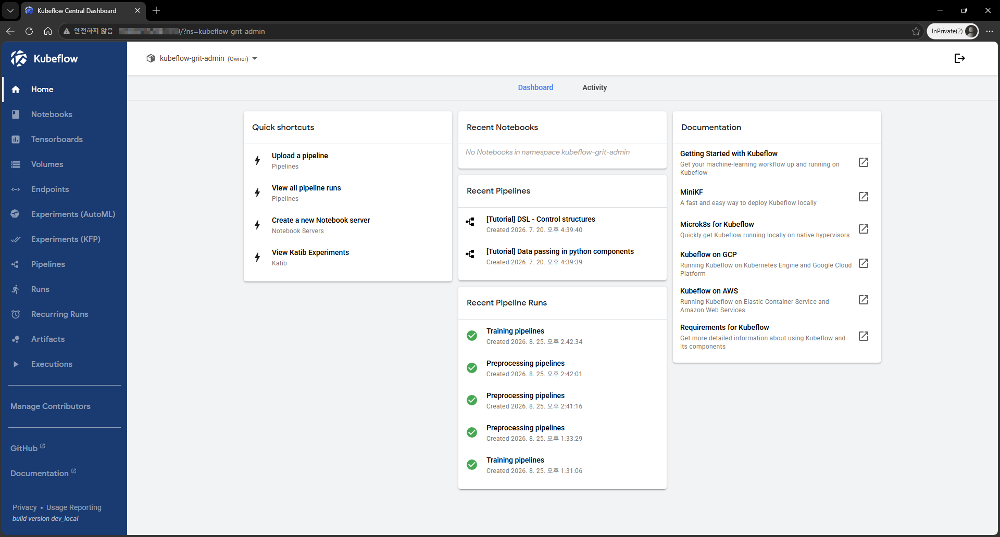
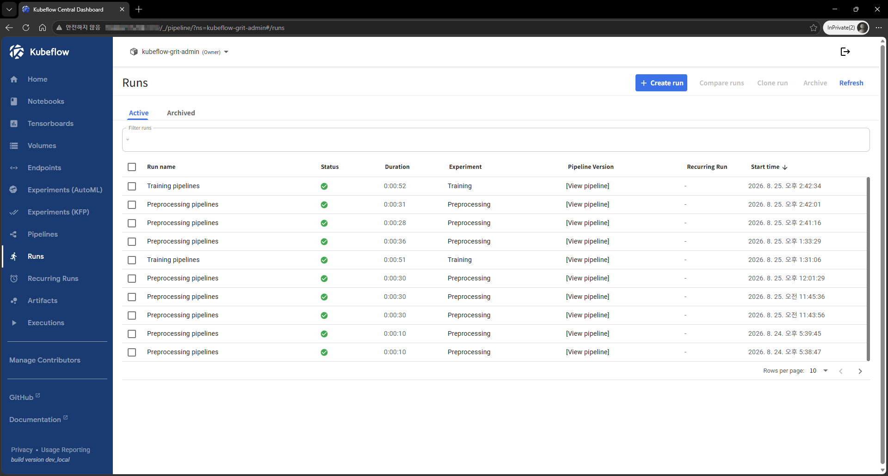
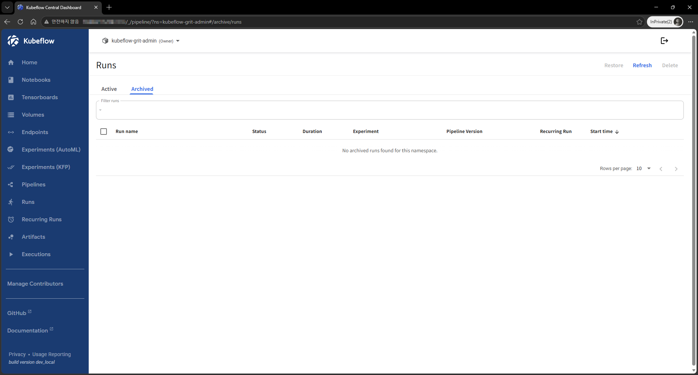
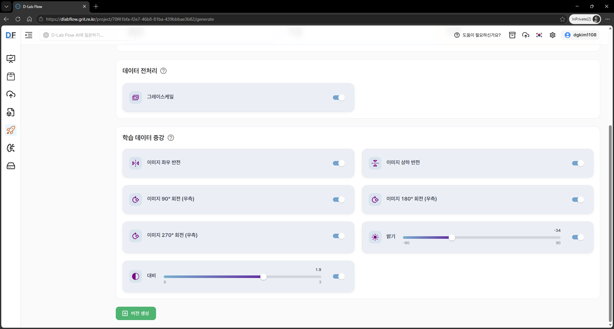
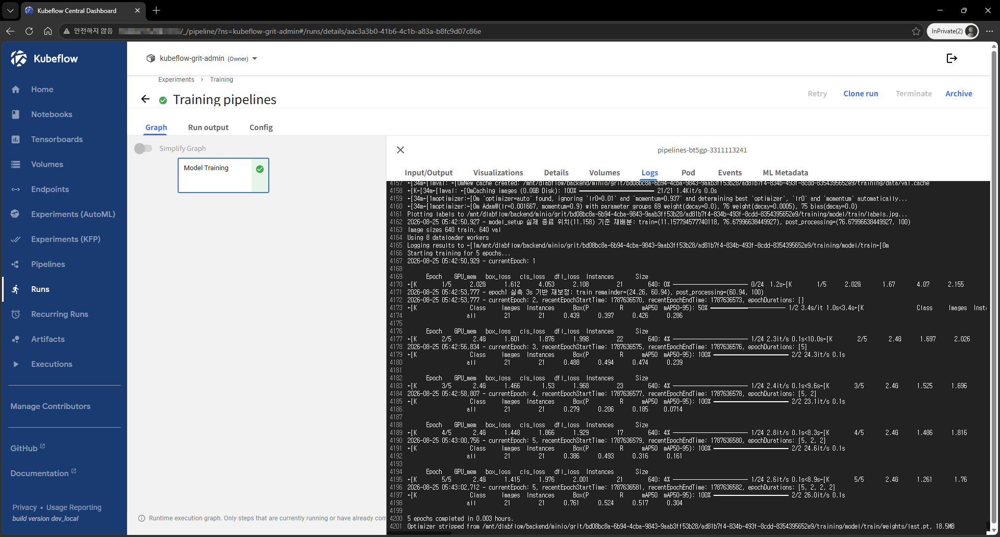
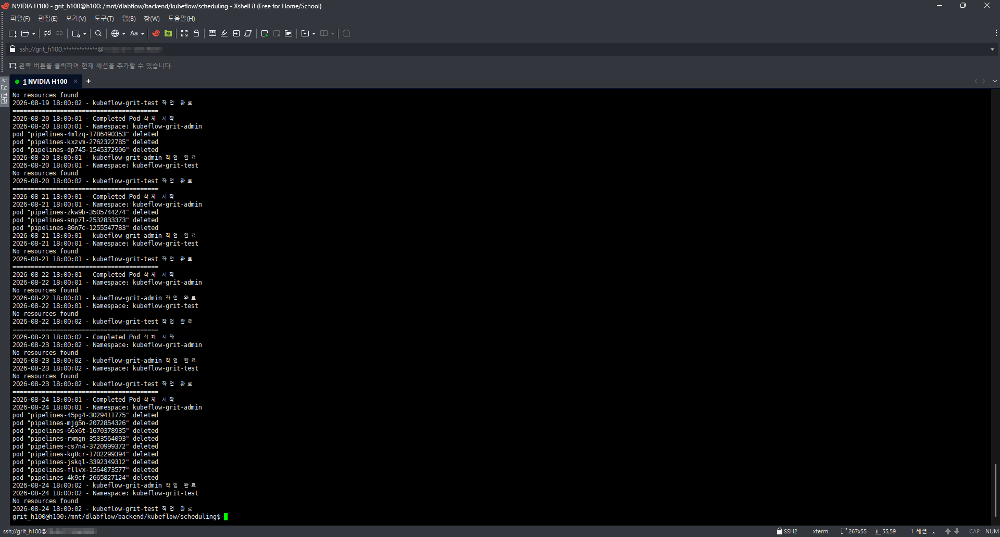

본 포스트에서는 D-Lab Flow에서 AI 프로젝트를 실행하기 위한 백엔드 시스템인 Kubeflow에 대해 소개합니다.

<!--truncate-->

# 1. Kubeflow 로그인

D-Lab Flow에서는 연구원용 `kubeflow-grit-admin@service.com` 계정과 기업용 `kubeflow-grit-test@service.com` 계정을 각각 운영하고 있습니다.

:::warning 로그인 관련 주의사항
- Kubeflow 접속 주소는 D-Lab Flow 서비스가 실행 중인 서버의 IP 주소와 포트(기본 8080)로 구성됩니다.
- 계정의 권한에 따라 Kubeflow에서 이용할 수 있는 기능이나 리소스가 다를 수 있습니다.
- 로그인에 문제가 있거나 계정 권한이 필요한 경우 관리자(dgkim1108@kangwon.ac.kr)에게 문의해 주시기 바랍니다.
  :::

# 2. Kubeflow Dashboard

## 2.1 첫 화면

Kubeflow에 로그인하면 Home 화면에서 현재 실행 중인 Pod의 상태, 이름, 실행 시간 등의 기본 정보를 확인할 수 있습니다. Pod의 상세 정보 및 AI 프로젝트의 실행 상태는 Kubeflow Dashboard의 **Runs** 메뉴 또는 Home 화면의 **Recent Pipeline Runs** 영역에서 확인할 수 있으며, 해당 실행 항목을 선택하면 세부 실행 정보를 확인할 수 있습니다.

:::tip Kubeflow 주요 메뉴
- Home: 현재 실행 중인 Pod의 상태, 이름, 실행 시간 등 기본 정보를 확인할 수 있습니다.
- Runs: 실행된 AI 프로젝트 및 Pipeline Run의 상세 정보를 확인할 수 있습니다. 각 실행 항목을 선택하면 실행 상태와 세부 정보를 확인할 수 있습니다.
- Recent Pipeline Runs: Home 화면에서 최근 실행된 Pipeline Run을 최대 5개까지 확인할 수 있습니다.
  :::

## 2.2 Pod 상태 조회

Pod의 실행 상태에 따라 **Active**와 **Archived** 상태로 구분하여 확인할 수 있습니다.

### 2.2.1 Pod Active

**Active 상태**에서는 현재 실행 중인 Pod의 정보를 확인할 수 있습니다.

생성된 Pod의 이름, 상태, 실행 시간 등의 정보를 확인할 수 있으며, 해당 Pod를 선택하면 상세 정보를 확인할 수 있습니다.

### 2.2.2 Pod Archived

**Archived 상태**에서는 실행이 완료되었거나 종료된 Pod의 정보를 확인할 수 있습니다.

이전에 실행된 Pod의 기록과 상태를 확인할 수 있으며, 필요한 경우 해당 Pod를 선택하여 실행 결과 및 상세 정보를 확인할 수 있습니다.

## 2.3 Pod 로그 확인

Kubeflow에서 실행되는 Pod은 [D-Lab Flow 웹 서비스 버전 생성 예제](https://dlabflow.grit.re.kr)와 같이 서비스를 실행하는 과정에서 자동으로 생성됩니다.

생성된 Pod의 실행 과정과 상태를 상세하게 확인하려면 **Logs** 메뉴에서 해당 Pod의 로그를 조회할 수 있습니다.

Logs 화면에서는 Pod에서 실행 중인 작업의 진행 상황과 학습 과정에서 출력되는 메시지를 확인할 수 있습니다. 실행 중에는 로그가 실시간으로 출력되며, 작업이 완료된 후에도 실행 결과와 주요 메시지를 다시 확인할 수 있습니다.

Pod 로그를 통해 다음과 같은 내용을 확인할 수 있습니다.

:::tip Pod 로그에서 확인할 내용
- 작업이 정상적으로 시작되었는지 확인
- 학습 및 서비스 실행 과정의 진행 상황 확인
- 작업 수행 중 발생한 경고 및 오류 메시지 확인
- 오류가 발생한 시점과 원인 파악
  :::

특히 Pipeline 실행 중 오류가 발생한 경우 Logs에서 오류 메시지와 관련된 로그를 확인하면 문제의 발생 위치와 원인을 파악하는 데 도움이 됩니다. 따라서 Pod의 실행 상태를 점검하거나 작업이 정상적으로 수행되지 않을 때 원인을 분석하기 위한 주요 확인 항목으로 활용할 수 있습니다.

# 3. Kubeflow Pod 삭제 스케줄

Kubeflow Pipeline 실행이 반복되면서 작업이 완료된 Pod가 지속적으로 누적될 경우, Kubernetes 클러스터에서 불필요한 리소스와 관리 대상이 증가할 수 있습니다. 이를 방지하기 위해 **매일 저녁 6시에 Pod 상태를 점검하고, 실행이 완료된 Pod 중 더 이상 사용되지 않는 Pod를 정리**하도록 삭제 스케줄을 운영하고 있습니다.

Pod의 실행 상태는 **RUNNING**, **FINISH**, **ERROR** 등으로 구분하여 확인할 수 있으며, 이 중 현재 실행 중인 Pod는 삭제 대상에서 제외합니다. 작업이 완료되었거나 오류로 인해 더 이상 실행되지 않는 Pod는 주기적으로 삭제하여 불필요한 Pod의 누적을 방지하고 클러스터 리소스를 효율적으로 관리합니다.

현재 삭제되는 Pod은 kubeflow-grit-admin 및 kubeflow-grit-test Namespace를 대상으로 하며, 삭제 작업의 실행 결과는 별도의 로그 파일(`/mnt/dlabflow/backend/kubeflow/scheduling/pod_delete.log`)에 기록되며, 해당 로그를 통해 Pod 삭제 작업의 정상 수행 여부와 오류 발생 여부를 확인할 수 있습니다.