본 포스트에서는 D-Lab Flow에서 **인스턴스 분할 모델**을 구축하는 방법을 소개합니다.

<!--truncate-->

# 1. 데이터 준비

인스턴스 분할(Instance Segmentation) 실습에 사용할 예제 데이터를 준비합니다.

실습에 필요한 샘플 데이터는 아래 링크에서 다운로드할 수 있습니다.

[인스턴스 분할 데이터 샘플 다운로드](https://raw.githubusercontent.com/donggil1382/dataset/main/polygon_example.zip)

다운로드한 `polygon_example.zip 파일`에는 이번 실습에 사용할 이미지와 인스턴스 분할에 필요한 어노테이션 데이터가 포함되어 있습니다.

# 2. 데이터 관리

## 2.1 데이터 저장소 생성

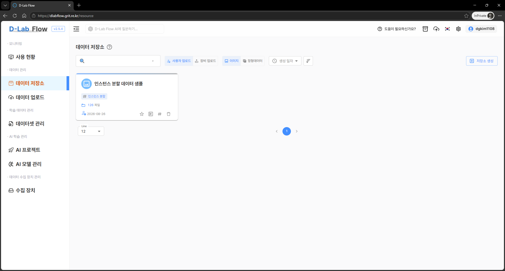

다운로드한 실습 데이터를 관리하기 위한 `인스턴스 분할 데이터 샘플` 저장소를 생성합니다.

데이터 저장소는 실습에 사용할 이미지와 어노테이션 데이터를 한곳에서 관리하고, 이후 인스턴스 분할 학습 및 데이터셋 구성에 활용하기 위한 공간입니다.

## 2.2 데이터 업로드

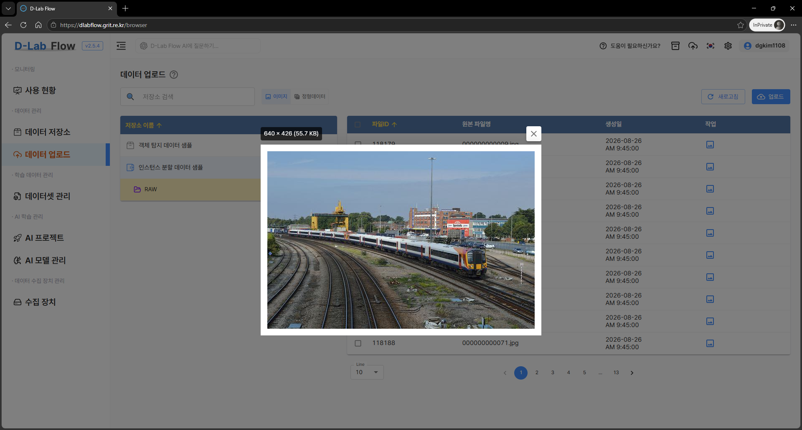

다운로드한 **polygon_example.zip 파일**을 압축 해제한 후, `인스턴스 분할 데이터 샘플` 저장소에 업로드합니다.

업로드가 완료되면 업로드된 이미지 중 1개를 임의로 선택하여 이미지의 해상도와 파일 크기를 확인합니다.

이 과정에서는 다음 항목을 함께 확인하는 것이 좋습니다.

:::info 데이터 업로드 항목
- 파일ID: 업로드된 파일을 식별할 수 있습니다.
- 원본 파일명: 업로드한 원본 이미지의 파일명을 확인할 수 있습니다.
- 생성일: 파일이 저장소에 등록된 날짜 및 시간을 확인할 수 있습니다.
- 작업: 업로드된 이미지를 시각화하여 정상적으로 표시되는지 확인할 수 있습니다.
:::

# 3. 학습 데이터 관리

# 3.1 데이터셋 생성

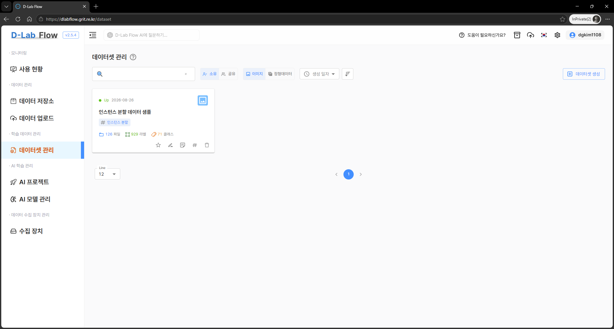

AI 학습 모델에 사용하기 위한 `인스턴스 분할 데이터 샘플` 데이터셋을 생성합니다.

데이터셋은 학습에 필요한 이미지와 해당 이미지의 인스턴스 분할 어노테이션을 하나의 학습 단위로 구성하여 관리하기 위한 공간입니다.

저장소에 파일을 업로드하는 것과 달리, 데이터셋을 생성하면 **실제 모델 학습에 사용할 데이터를 선별하고 구성**할 수 있습니다.

# 3.2 학습 데이터 선택

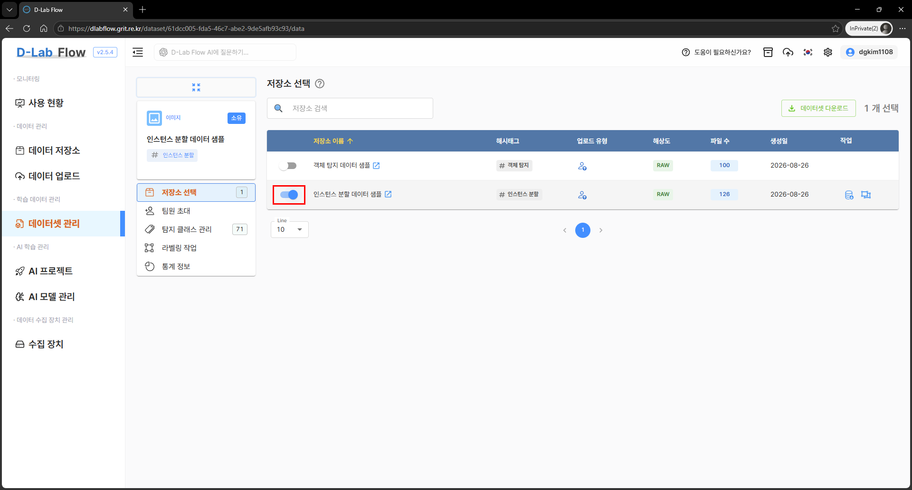

생성한 인스턴스 분할 데이터 샘플 데이터셋에서 AI 모델 학습에 사용할 데이터를 선택합니다.

이 과정에서 학습 데이터 선택 기능을 활성화하면 **라벨링 정보 업로드 버튼이 화면에 표시**되며, 이를 통해 인스턴스 분할 학습에 필요한 라벨링 정보를 업로드할 수 있습니다.

# 3.3 라벨링 정보 업로드

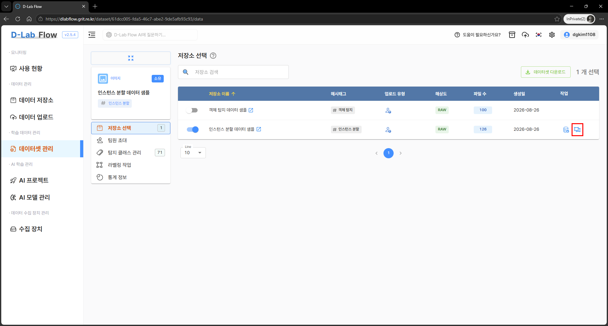

**라벨링 정보 업로드 버튼**을 클릭하여 학습에 사용할 라벨링 파일을 업로드합니다.

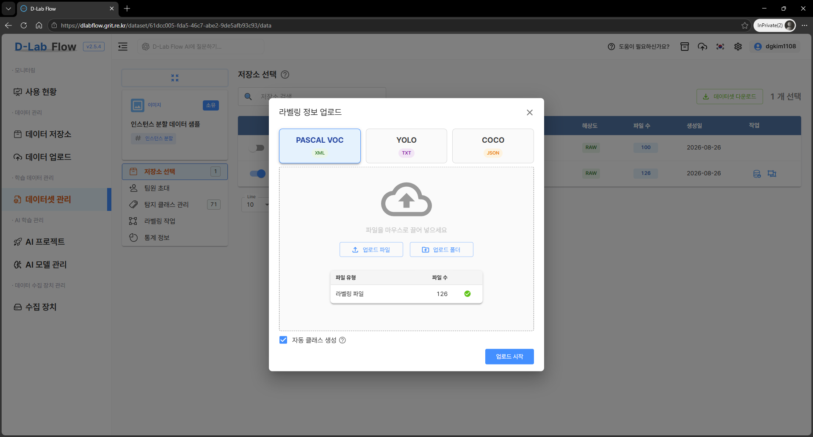

업로드에 필요한 라벨링 정보는 **1. 데이터 준비** 단계에서 다운로드한 `polygon_example.zip 파일`에서 확인할 수 있습니다.

:::info 라벨링 업로드 순서
- 라벨링 정보 업로드 버튼을 클릭합니다.
- 업로드할 라벨링 파일의 형식에 따라 PASCAL VOC(XML), YOLO(TXT), COCO(JSON) 중 해당하는 형식을 선택합니다.
- 라벨링 파일을 선택한 후, 자동 클래스 생성 옵션을 선택하고, 업로드 시작 버튼을 클릭합니다.
- 업로드가 완료되면 업로드 결과를 확인하여 라벨링 정보가 정상적으로 등록되었는지 확인합니다.
:::

# 3.4 탐지 클래스 확인

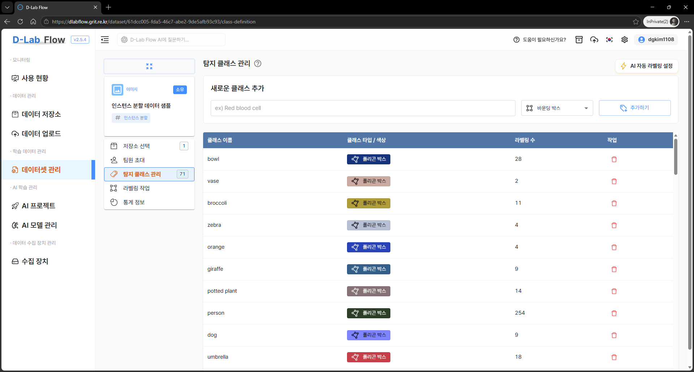

라벨링 정보 업로드가 완료되면 등록된 **탐지 클래스**를 확인합니다.

탐지 클래스는 라벨링 정보에 포함된 객체의 종류를 의미하며, 이후 인스턴스 분할 모델이 학습할 대상이 됩니다.

탐지 클래스 목록에서 제공되는 다음 항목을 확인하여 클래스가 정상적으로 등록되었는지 확인합니다.

:::info 데이터 클래스 항목
- 클래스 이름: 등록된 클래스 이름을 확인할 수 있습니다.
- 클래스 타입/색상: 각 클래스에 설정된 타입과 색상을 확인할 수 있습니다.
- 라벨링 수: 클래스별 등록된 라벨링 개수를 확인할 수 있습니다.
- 삭제: 불필요하거나 잘못 생성된 클래스를 삭제할 수 있습니다.
:::

# 3.5 라벨링 업로드 결과 확인

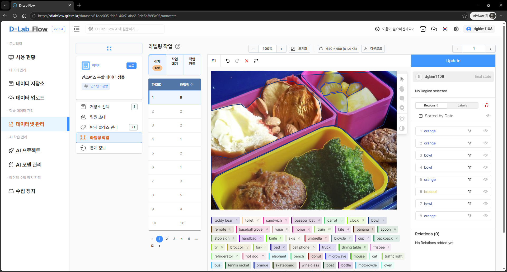

라벨링 결과를 확인하여 객체 영역과 클래스 정보가 이미지에 정상적으로 표시되면, 인스턴스 분할 모델 학습에 필요한 데이터 구성이 완료됩니다.

라벨링 영역이 잘못 표시되거나 누락된 경우에는 해당 라벨링 정보를 확인하고 수정해야 하며, 수정 사항이 있는 경우 Update 버튼을 클릭하여 변경 내용을 반영합니다.

# 4. AI 학습 관리

## 4.1 AI 프로젝트

### 4.1.1 프로젝트 생성

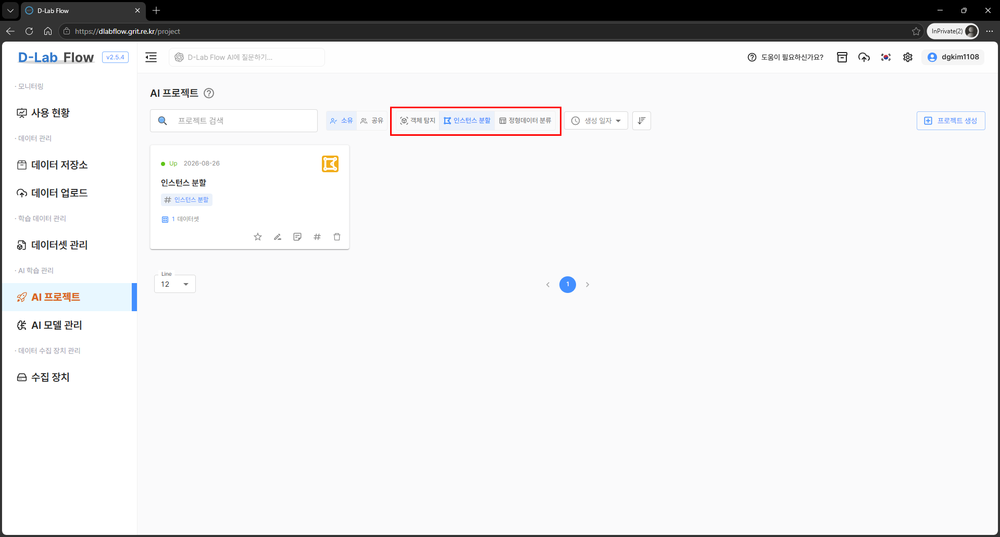

앞에서 구성한 **인스턴스 분할 데이터 샘플 데이터셋**을 기반으로 AI 모델 학습을 진행하기 위한 `인스턴스 분할` 프로젝트를 생성합니다.

생성된 프로젝트는 화면 상단 탭 메뉴(객체 탐지, 인스턴스 분할, 정형데이터 분류)에 확인할 수 있습니다.

프로젝트는 AI 모델 학습에 필요한 데이터셋과 학습 설정을 하나의 단위로 관리하고, 데이터 전처리, 모델 훈련 등의 과정을 수행하기 위한 공간입니다.

### 4.1.2 학습 데이터 선택

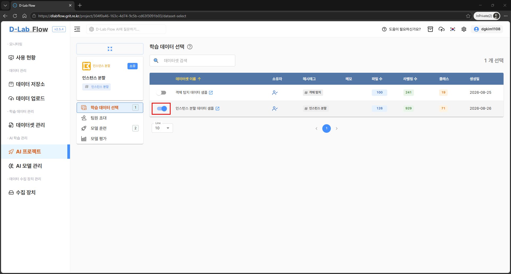

생성한 인스턴스 분할 프로젝트에서 AI 모델 학습에 사용할 데이터를 선택합니다.

이 과정에서 학습 데이터 선택 기능을 활성화하면 **라벨링 정보 업로드 버튼이 화면에 표시**되며, 이를 통해 인스턴스 분할 학습에 필요한 라벨링 정보를 업로드할 수 있습니다.

### 4.1.3 버전 생성

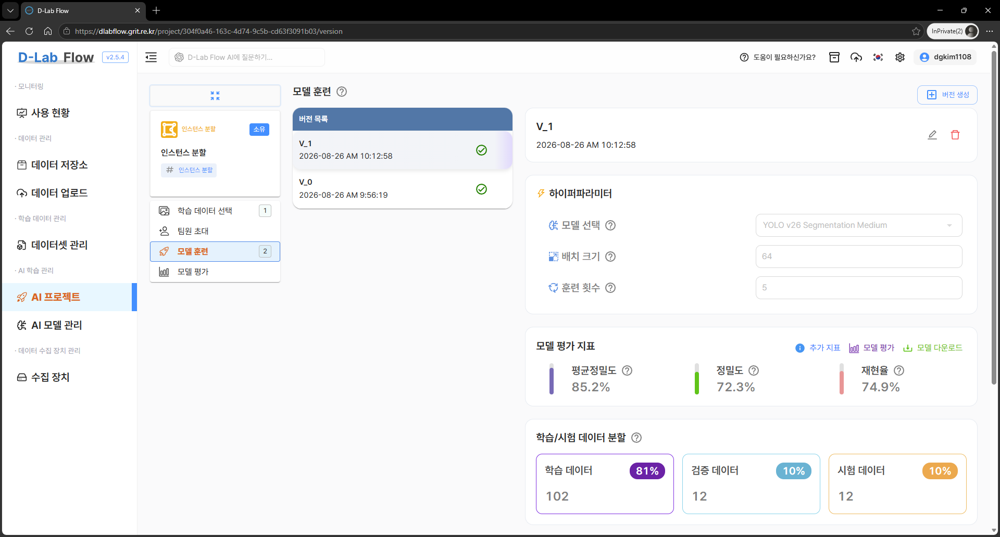

**버전 생성 버튼**은 모델 훈련 메뉴에서 확인할 수 있습니다.

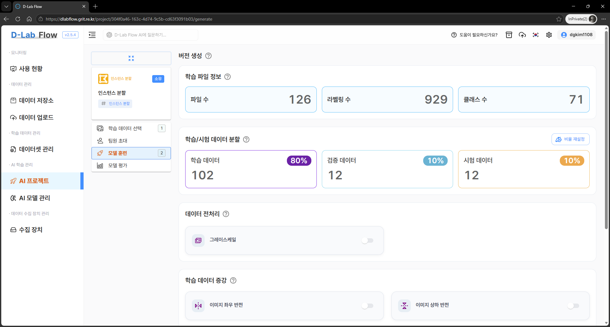

버전 생성 시 학습에 사용할 데이터를 구성하기 위해 **학습/시험 데이터 분할** → **데이터 전처리** → **데이터 증강** 순서로 설정을 진행합니다.

**데이터 분할**은 전체 데이터셋을 학습 데이터, 검증 데이터, 시험 데이터로 나누는 과정입니다.

:::info 데이터 분할 옵션
- 학습 데이터: AI 모델의 학습에 사용되는 데이터입니다.
- 검증 데이터: 학습 과정에서 모델의 성능을 검증하고 학습 상태를 확인하는데 사용되는 데이터입니다.
- 시험 데이터: 학습이 완료된 모델의 성능을 최종적으로 평가하는데 사용되는 데이터입니다.
:::

**데이터 전처리**는 이미지의 형태나 특성을 변환하여 학습에 적합한 데이터로 구성하는 과정입니다.

필요에 따라 전처리 옵션을 선택할 수 있으며, 선택한 전처리 설정은 버전 생성 시 해당 데이터에 적용됩니다.

:::info 데이터 전처리 옵션
- 그레이스케일: 이미지의 색상 정보를 제거하고 흑백 이미지로 변환할 수 있습니다.
:::

**데이터 증강**은 기존 학습 이미지를 다양한 형태로 변형하여 학습 데이터의 다양성을 높이는 과정입니다.

:::info 데이터 증강 옵션
- 이미지 좌우 반전: 이미지를 좌우 방향으로 반전합니다.
- 이미지 상하 반전: 이미지를 상하 방향으로 반전합니다.
- 이미지 90도 회전: 이미지를 시계 방향으로 90도 회전합니다.
- 이미지 180도 회전: 이미지를 시계 방향으로 180도 회전합니다.
- 이미지 270도 회전: 이미지를 시계 방향으로 270도 회전합니다.
- 이미지 밝기: 이미지 전체를 더 밝게 또는 어둡게 변경합니다.
- 이미지 대비: 이미지에서 밝은 부분과 어두운 부분의 차이를 크게 또는 작게 변경합니다.
:::

### 4.1.4 모델 훈련

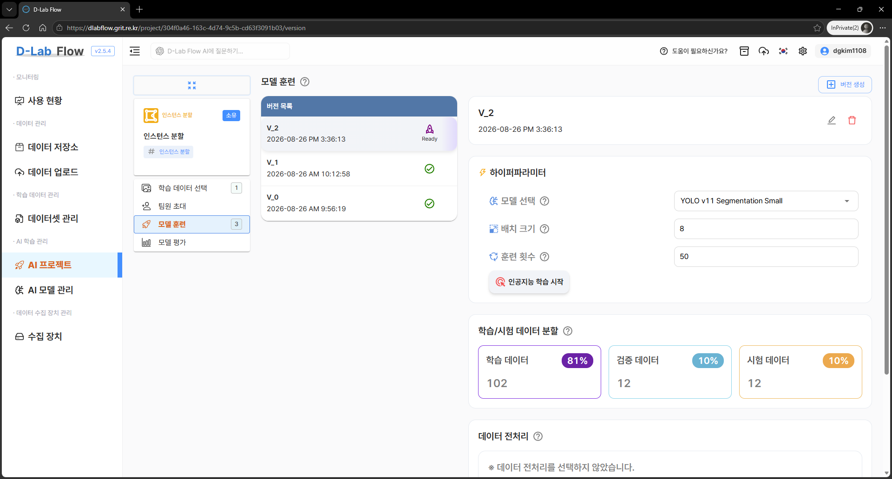

버전 생성이 완료되면 생성된 버전을 기반으로 **모델 훈련**을 진행할 수 있습니다.

일반적인 객체 탐지 모델이 객체를 사각형 형태의 박스(Bounding Box)로 찾는 것과 달리, **인스턴스 분할 모델은 객체의 형태에 맞춰 픽셀 단위로 영역을 구분**합니다.

인스턴스 분할 모델 훈련에서는 **YOLO v11 Segmentation**과 **YOLO v26 Segmentation** 모델을 사용할 수 있으며, 각 모델은 **Nano**, **Small**, **Medium**, **Large**, **XLarge**의 5가지 크기로 제공됩니다.

:::info 인스턴스 분할 모델 크기 종류
- Nano: 가장 작은 모델로, 빠른 학습과 추론이 필요한 경우 적합합니다.
- Small: Nano보다 많은 특징을 학습할 수 있으며, 처리 속도와 성능의 균형을 제공합니다.
- Medium: 모델의 성능과 처리 속도를 균형 있게 고려한 모델입니다.
- Large: 더 많은 특징을 학습할 수 있어 높은 성능을 기대할 수 있지만, 학습에 더 많은 시간과 자원이 필요합니다.
- XLarge: 가장 큰 모델로, 복잡한 객체의 특징을 보다 많이 학습할 수 있지만 학습 시간과 필요한 자원이 가장 많습니다.
:::

또한, 모델 훈련 시 **배치 크기(Batch Size)**와 **훈련 횟수(Epoch)**를 설정할 수 있습니다.

이러한 하이퍼파라미터 설정을 모두 입력하면 **인공지능 학습 시작 버튼**을 클릭하여 설정한 조건에 따라 모델 훈련을 시작할 수 있습니다. 

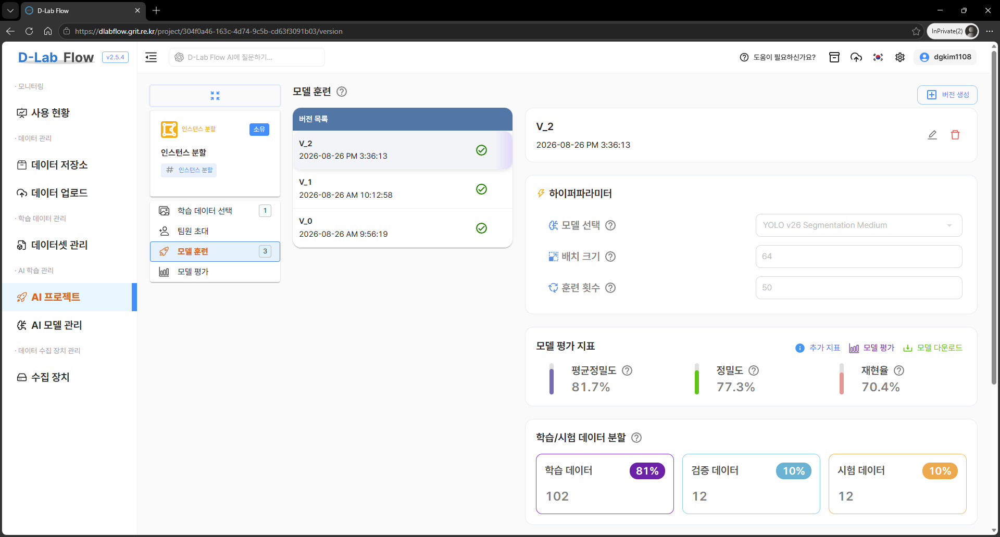

모델 훈련이 완료되면 mAP, Precision, Recall과 같은 **평가 지표가 화면에 표시**됩니다.

또한 **추가 지표** 기능을 통해 모델의 성능을 다양한 측면에서 확인하고, **모델 평가** 기능을 이용하여 훈련된 모델의 성능을 상세하게 확인할 수 있으며, 훈련이 완료된 모델은 **모델 다운로드** 기능을 통해 다운로드하여 활용할 수 있습니다.

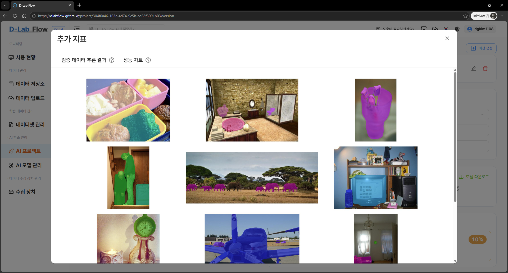

추가 지표의 **검증 데이터 추론 결과**에서는 검증 데이터에 대해 모델이 수행한 추론 결과를 확인할 수 있습니다.

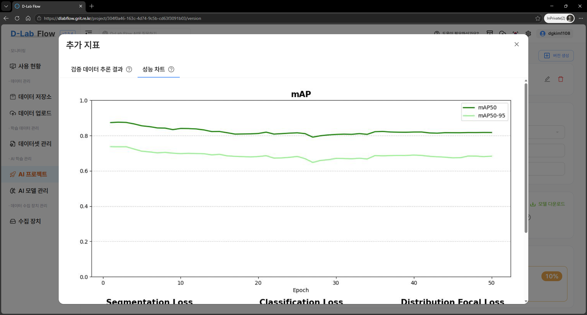

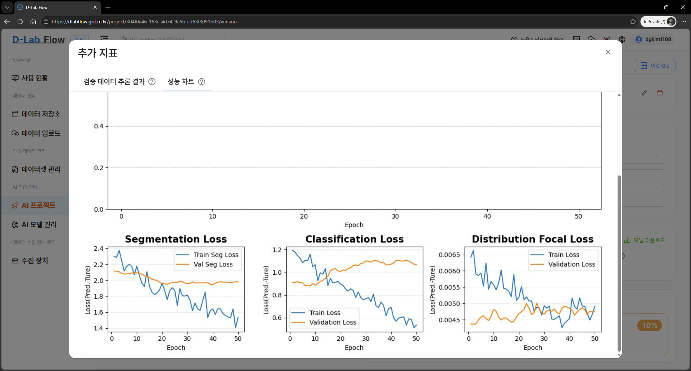

추가 지표의 **성능 차트**에서는 훈련 과정에서의 모델 성능 변화를 차트 형태로 확인할 수 있으며, **mAP**, **segmentation Loss**, **Classification Loss**, **Distribution Focal Loss** 지표를 통해 모델의 손실 변화 추이를 종합적으로 확인할 수 있습니다.

### 4.1.5 모델 평가

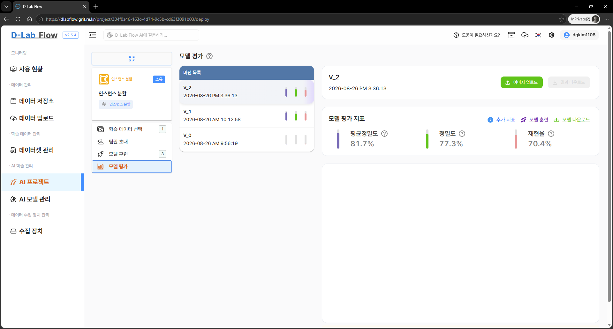

모델 평가 화면의 **버전 목록**에서 훈련이 완료된 모델을 선택한 후, **이미지 업로드 버튼**을 클릭하여 추론에 사용할 이미지를 업로드하면 해당 모델을 기반으로 추론이 시작됩니다.

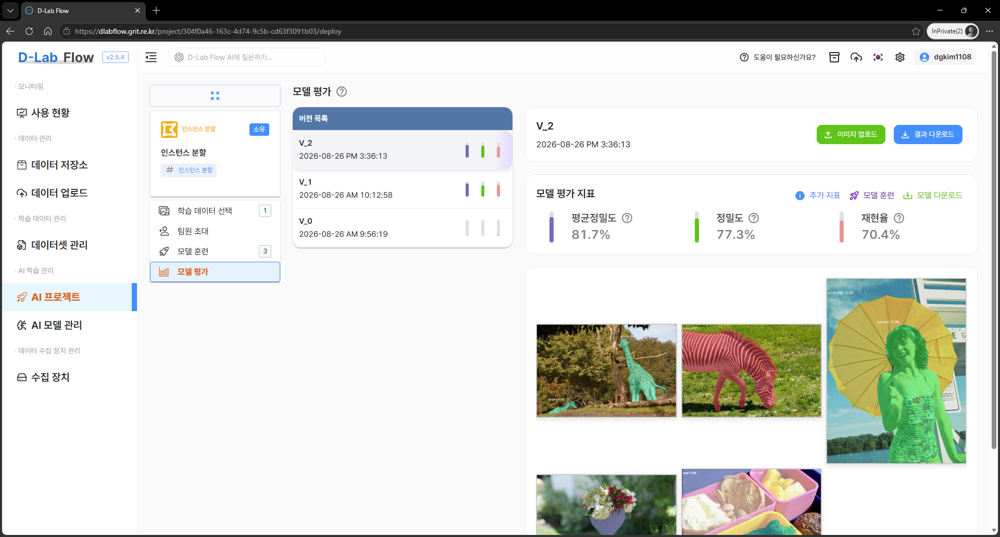

추론이 완료되면 화면에 추론 결과가 표시되며, 결과를 확인한 후, 활성화된 **다운로드 버튼**을 클릭하면 추론 결과를 파일로 다운로드할 수 있습니다.

## 4.2 AI 모델 관리

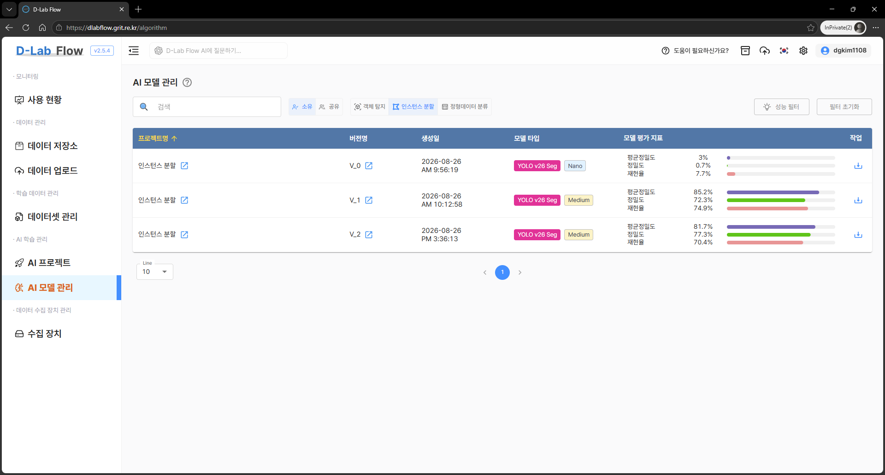

**AI 모델 관리**에서는 학습된 모델의 가중치를 다양한 형식으로 변환하여 다운로드할 수 있으며, 모델 목록의 **작업 메뉴**에서 다운로드 버튼을 클릭하여 진행할 수 있습니다.

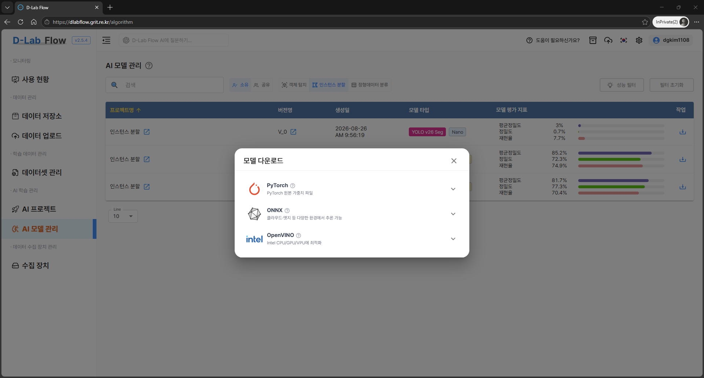

모델 다운로드 종류는 **PyTorch**, **ONNX**, **OpenVINO** 3가지 형식을 제공합니다.

각 형식은 한 번에 하나씩 선택할 수 있으며, 형식을 선택한 후 **내보내기 버튼**을 클릭하면 해당 가중치가 ZIP 파일로 다운로드됩니다.

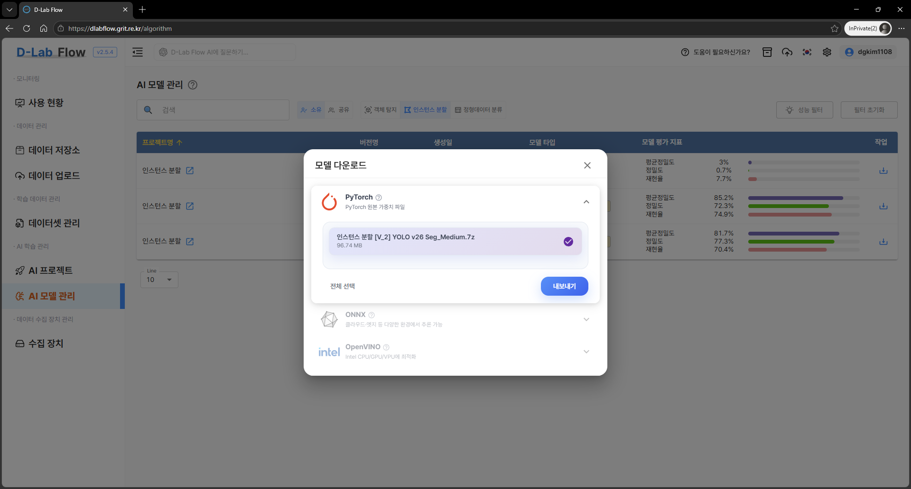

PyTorch 가중치는 별도의 설정 없이 학습된 객체 탐지 모델을 **PyTorch 형식(*.pt)**으로 저장하여 ZIP 파일로 제공합니다.

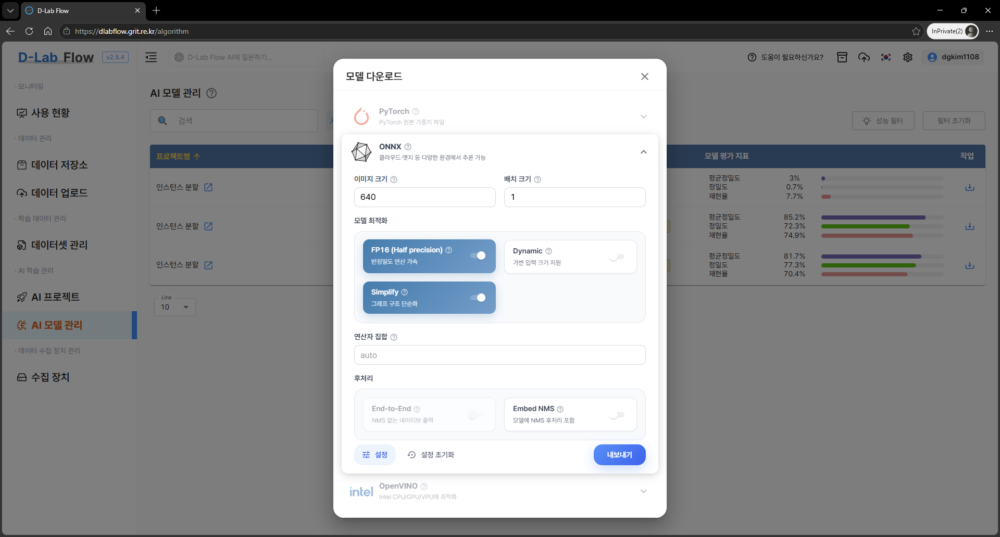

ONNX 가중치는 이미지 크기, 모델 최적화, 연산자 집합, 후처리 옵션을 설정한 후 학습된 딥러닝 모델을 **ONNX(Open Neural Network Exchange) 형식(*.onnx)**으로 변환하여 ZIP 파일로 제공합니다.

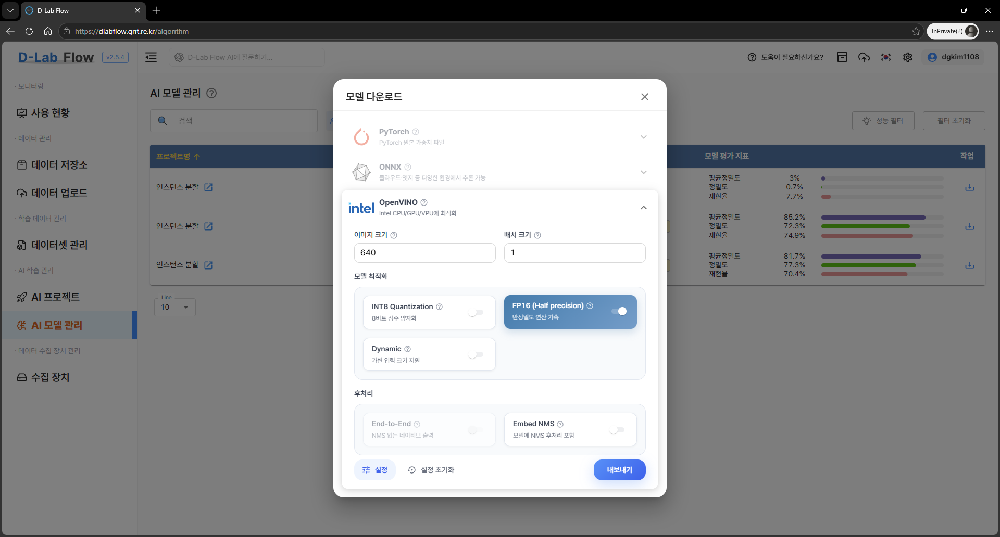

OpenVINO 가중치는 이미지 크기, 모델 최적화, 후처리 옵션을 설정한 후 학습된 딥러닝 모델을 **OpenVINO IR 형식(*.xml, *.bin)**으로 변환하여 ZIP 파일로 제공합니다.