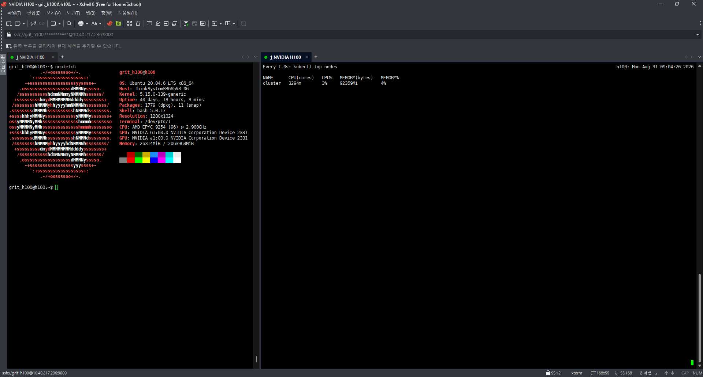
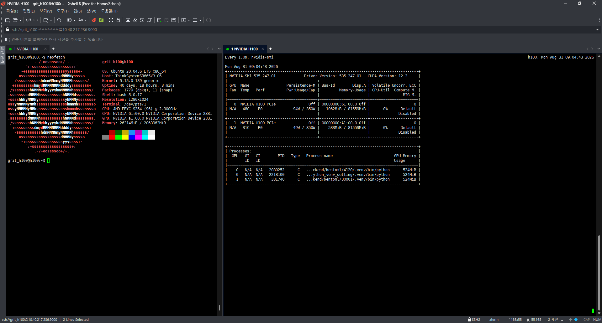

본 포스트에서는 D-Lab Flow가 실행되고 있는 환경에서 **CPU와 RAM 사용량, NVIDIA GPU 사용 현황**을 확인하는 방법을 소개합니다.

현재 D-Lab Flow의 Kubernetes 클러스터는 **1개의 노드**로 구성되어 있으며, 여기서 확인하는 노드의 사용량은 D-Lab Flow가 실행되는 서버의 현재 자원 사용량을 확인하는데 활용할 수 있습니다.

CPU와 메모리 사용량은 Kubernetes 명령어를 통해 확인하고, GPU가 장착된 경우에는 NVIDIA에서 제공하는 명령어를 통해 GPU 상태를 확인할 수 있습니다.

<!--truncate-->

# 1. Kubernetes 노드 사용 현황 확인

D-Lab Flow가 실행되고 있는 서버의 CPU와 메모리 사용량은 다음 명령어로 확인할 수 있습니다.

```python
kubectl top nodes
```



현재 D-Lab Flow 환경은 하나의 노드로 구성되어 있기 때문에, 명령어를 실행하면 D-Lab Flow가 실행되는 서버의 사용량을 확인할 수 있습니다.

사용량을 계속 확인하고 싶다면 watch 명령어를 사용하여 명령어를 반복해서 입력하지 않아도 결과가 자동으로 갱신되도록 할 수 있습니다.

:::info Kubernetes 노드 주요 항목
- NAME: D-Lab Flow가 실행되고 있는 서버의 이름입니다.
- CPU(cores): 현재 사용하고 있는 CPU의 양입니다.
- CPU(%): 서버의 CPU가 전체 용량 중 얼마나 사용되고 있는지 보여줍니다.
- MEMORY(bytes): 현재 사용하고 있는 메모리의 양입니다.
- MMORY(%): 서버의 메모리가 전체 용량 중 얼마나 사용되고 있는지 보여줍니다.
:::

# 2. NVIDIA GPU 사용 현황 확인

D-Lab Flow에서 GPU를 사용하는 작업이 실행되고 있다면 NVIDIA GPU의 현재 상태도 확인할 수 있습니다.

GPU 상태는 다음 명령어로 확인합니다.

```python
nvidia-smi
```



GPU가 장착된 노드에서는 nvidia-smi를 사용하여 GPU 상태를 확인할 수 있으며, watch 명령어를 사용하면 명령어 결과를 주기적으로 갱신할 수 있습니다.

사용량을 계속 확인하고 싶다면 watch 명령어를 사용하여 명령어를 반복해서 입력하지 않아도 결과가 자동으로 갱신되도록 할 수 있습니다.

:::info NVIDIA GPU 주요 항목
- GPU: 해당 프로그램이 사용하고 있는 GPU 번호입니다.
- PID: 실행 중인 프로그램을 구분하기 위한 번호입니다.
- Process name: GPU를 사용하고 있는 프로그램의 이름입니다.
- GPU Memory: 해당 프로그램이 사용하고 있는 GPU 메모리의 양입니다.
:::

# 3. 문제가 발생했을 때 확인 방법

D-Lab Flow에서 작업이 느리거나 정상적으로 실행되지 않는 경우에는 먼저 서버와 GPU의 사용량을 확인해 볼 수 있습니다.

| 확인 항목 | 명령어 | 확인할 내용 |
| --- | --- | --- |
| CPU 사용량 | `kubectl top nodes` | CPU 사용률이 계속 높은지 확인 |
| 메모리 사용량 | `kubectl top nodes` | 메모리 사용률이 계속 높은지 확인 |
| GPU 사용률 | `nvidia-smi` | GPU가 실제 작업에 사용되고 있는지 확인 |
| GPU 메모리 | `nvidia-smi` | GPU 메모리가 부족하지 않은지 확인 |
| GPU 사용 프로그램 | `nvidia-smi` | 어떤 프로그램이 GPU를 사용하고 있는지 확인 |

예를 들어 GPU 작업이 정상적으로 실행되지 않는다면 다음 순서로 확인할 수 있습니다.

1. `nvidia-smi`를 실행합니다.
2. GPU가 정상적으로 표시되는지 확인합니다.
3. `Memory-Usage`를 확인하여 GPU 메모리가 부족하지 않은지 확인합니다.
4. `GPU-Util`을 확인하여 GPU가 실제로 사용되고 있는지 확인합니다.
5. `Processes` 영역에서 GPU를 사용하고 있는 프로그램을 확인합니다.

CPU나 메모리 문제로 의심되는 경우에는 `kubectl top nodes`에서 사용률을 확인합니다.
