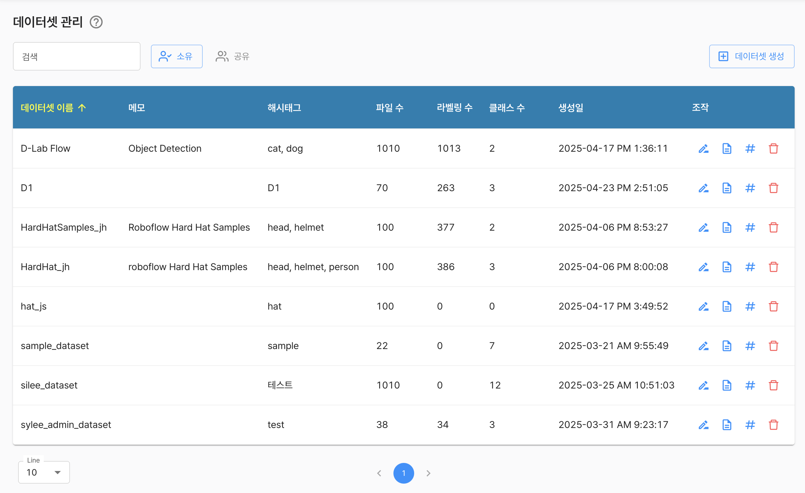
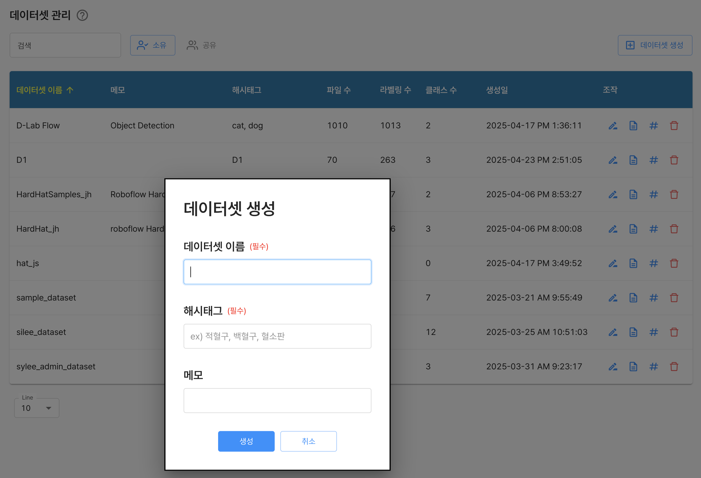
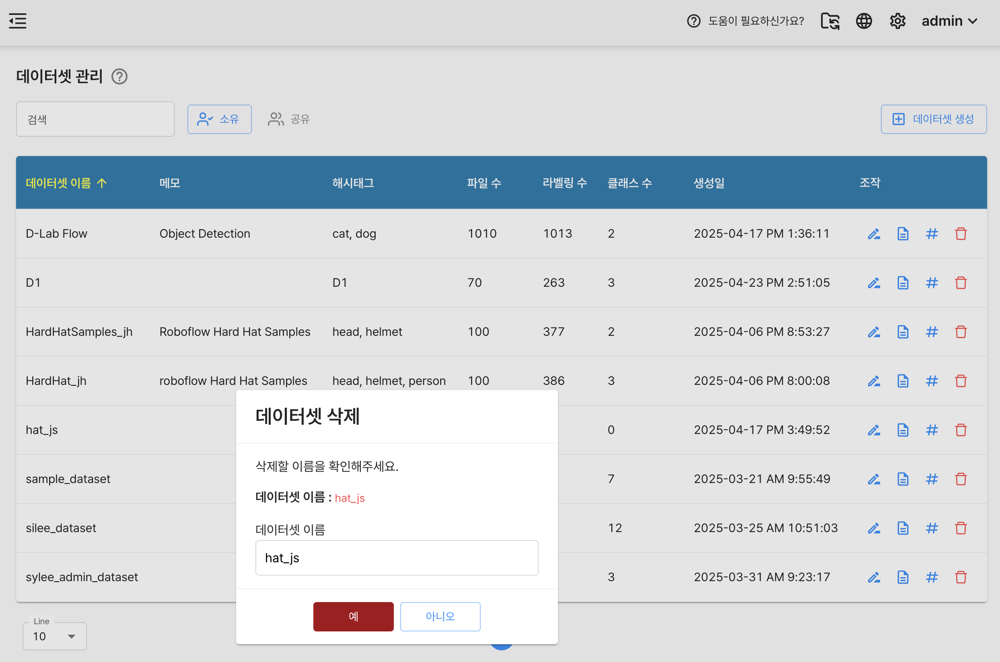
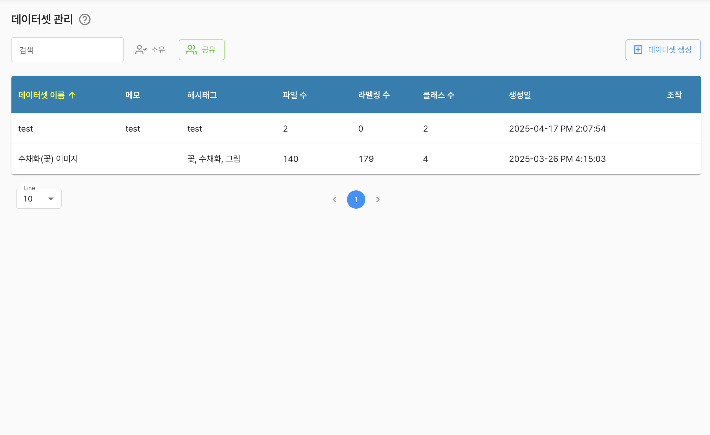

# 데이터셋 관리

모델이 학습하고 성능을 평가하는데 사용하는 **데이터 모음**으로, AI 개발의 가장 핵심적인 요소로 적절하게 관리 운영함을 목표로 합니다.

데이터 관리의 데이터 저장소를 이용한 사용할 데이터를 구성할 수있으며, 이렇게 구성된 데이터셋은 **AI 프로젝트**단계에서 학습에 활용할 수 있습니다.

## 데이터셋(소유)

기본적으로 테이블 형테의 탐색 기능을 제공 하며, 좌측 상단의 검색입력박스를 통해 키워드를 기반으로한 검색 기능을 제공 합니다.

데이터셋의 속성을 유추해 볼 수 있는 기본적인 정보를 제공 합니다.
- 이름
- 관련 메모
- 관련 헤시테그
- 포함된 파일 수
- 라벨링 수
- 정의된 클래스 수

각 항목에 대해서 다음과 같은 기능을 제공합니다.
- `(조작) 데이터셋 이름 변경`
- `(조작) 관련 메모 수정`
- `(조작) 관련 헤시테그 수정`
- `(조작) 삭제`




## 데이터셋 생성

사용자는 우측 상단의 `데이터셋 생성` 버튼을 통해 데이터셋을 생성할 수 있습니다.

기본적인 정보 입력만으로 데이터셋을 생성할 수 있습니다.




## 데이터셋 삭제

사용자는 표시되는 데이터셋 목록 중에 삭제하고자 하는 데이터셋이 있으면, 가장 우측의 `삭제` 버튼을 통해 삭제할 수 있습니다.

삭제 절차는 데이터셋 이름을 확인하는 것으로 진행 됩니다.

다음과 같은 조건에서는 데이터셋을 삭제할 수 없습니다.

```
- 데이터셋에서 특정 저장소를 선택하고 있는 경우
- AI 프로젝트에서 삭제하고자하는 데이터셋을 선택하고 있는 경우
```



***

## 데이티셋(공유)

검색창 바로 우측의 `소유`, `공유` 버튼을 통해 조회 대상을 선택할 수 있습니다.

기본적인 형태는 `소유`와 동일하며 권한에 맞게 목록 우측의 조작행위는 수행할 수 없습니다.



