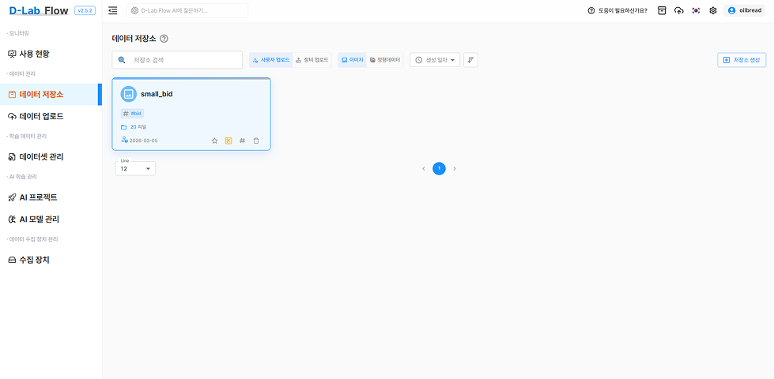
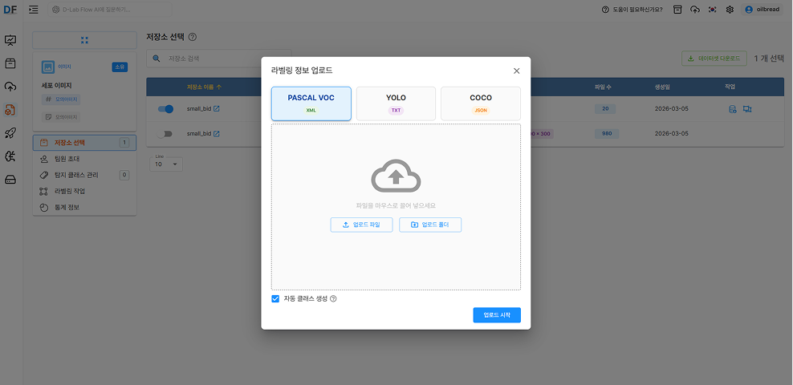

# 데이터셋 저장소 관리

데이터셋을 구성하는 기본 요소중 하나로 데이터셋에 사용될 파일 저장소를 `선택`할 수 있습니다.

기본적으로 사용자가 보유한 저장소가 리스트로 표현되며, 각 리스트 좌측의 `슬라이드 버튼을 통해 선택하거나 해제`할 수 있습니다.

목록에는 기본적인 저장소에 대한 정보를 확인할 수 있습니다.

- 저장소 이름
- 소유자
- 저장소 타입
- 해시태그
- 파일 타입
- 해상도
- 파일수

각 항목에 대해서 다음과 같은 기능을 제공합니다.

- `(저장소 이름) 이동하기 : 해당 저장소의 데이터 업로드 화면으로 이동`
- `(조작) 데이터셋 라벨링 업로드 : 해당저장소에 저장된 파일에 대한 라벨링 정보를 수동으로 업로드`



***

## 라벨링 업로드

소유한 저장소 파일에 대한 라벨링 정보를 시스템에 반영할 수 있는 기술을 제공합니다.

특정 저장소에 보관된 파일에 대한 라벨링정보를 한번에 업로드 하는 기능이며, 보관된 파일이름과, 업로드하는 라벨링내에 존재하는 파일명을 활용해 매칭합니다.

`자동 클래스 생성` 버튼을 통해 사전에 정의 되지 않은 클래스에 대한 라벨링 정보도 자동으로 반영할 수 있습니다. : 클래스 자동 생성

라벨링 업로드에 대한 절차는 다음과 같습니다.

```
    데이터 저장소에 사용 하고자하는 파일 데이터를 저장
    데이터 셋의 저장소 관리에서 해당되는 데이터 저장소 를 선택
    라벨링 정보 업로드 기능을 통해 라벨링 정보를 업로드 
```

**지원 라벨링 정보**

`현재는 PascalVOC 형태의 라벨링 업도르 기능만을 제공하며 추후 단계적으로 업데이트 예정`




## 지원 라벨링 형식

이미지 객체 탐지 데이터셋에서 널리 사용되는 **Pascal VOC, YOLO, COCO** 라벨링 형식을 지원합니다.

각 형식은 동일한 객체 탐지 정보를 표현하지만, **파일 구성 방식과 Bounding Box 좌표 표현 방법**에 차이가 있습니다.

---

## Pascal VOC

> **이미지마다 XML 파일을 생성하여 이미지 정보, 객체 클래스, Bounding Box 좌표 등을 구조화하여 저장하는 형식**

### 📁 파일 구성

```text
000001.jpg
000001.xml
```

이미지 파일과 동일한 이름의 XML 파일을 함께 사용합니다.

### 🏷️ 라벨 예시

```xml
<annotation>
    <filename>000001.jpg</filename>

    <size>
        <width>416</width>
        <height>416</height>
        <depth>3</depth>
    </size>

    <object>
        <name>helmet</name>

        <pose>Unspecified</pose>
        <truncated>0</truncated>
        <difficult>0</difficult>
        <occluded>0</occluded>

        <bndbox>
            <xmin>149</xmin>
            <ymin>94</ymin>
            <xmax>192</xmax>
            <ymax>160</ymax>
        </bndbox>
    </object>

    <object>
        <name>helmet</name>

        <pose>Unspecified</pose>
        <truncated>0</truncated>
        <difficult>0</difficult>
        <occluded>0</occluded>

        <bndbox>
            <xmin>94</xmin>
            <ymin>161</ymin>
            <xmax>113</xmax>
            <ymax>194</ymax>
        </bndbox>
    </object>
</annotation>
```

하나의 XML 파일 안에 `<object>`를 여러 개 작성하여 **한 이미지에 포함된 여러 객체를 표현**할 수 있습니다.

### 📌 주요 정보

| 항목           | 설명                     |
| ------------ | ---------------------- |
| `filename`   | 대상 이미지 파일명             |
| `size`       | 이미지의 너비, 높이, 채널 정보     |
| `object`     | 이미지에 포함된 객체 정보         |
| `name`       | 객체의 클래스명               |
| `pose`       | 객체의 자세 정보              |
| `truncated`  | 객체가 이미지 경계에 의해 잘렸는지 여부 |
| `difficult`  | 객체가 탐지하기 어려운 객체인지 여부   |
| `occluded`   | 다른 객체 등에 의해 가려졌는지 여부   |
| `xmin, ymin` | Bounding Box의 좌상단 좌표   |
| `xmax, ymax` | Bounding Box의 우하단 좌표   |

**파일 형식:** `.xml`

> 💡 **특징:** 사람이 XML 구조를 통해 내용을 쉽게 확인할 수 있으며, 객체의 클래스명과 Bounding Box 좌표를 직관적으로 표현할 수 있습니다.

---

## YOLO

> **이미지마다 TXT 파일을 생성하여 객체의 클래스 ID와 Bounding Box 정보를 한 줄씩 저장하는 간결한 형식**

### 📁 파일 구성

```text
000001.jpg
000001.txt
```

이미지 파일과 동일한 이름의 TXT 파일을 사용합니다.

### 🏷️ 라벨 예시

```text
0 0.409856 0.305288 0.103365 0.158654
0 0.248798 0.426683 0.045673 0.079327
```

한 줄이 하나의 객체를 의미하며, 여러 객체가 있는 경우 여러 줄로 작성합니다.

### 📌 데이터 형식

```text
class_id  x_center  y_center  width  height
```

| 항목         | 설명                     |
| ---------- | ---------------------- |
| `class_id` | 객체 클래스 번호              |
| `x_center` | Bounding Box 중심점의 X 좌표 |
| `y_center` | Bounding Box 중심점의 Y 좌표 |
| `width`    | Bounding Box의 너비       |
| `height`   | Bounding Box의 높이       |

> 💡 **좌표값은 이미지의 너비와 높이를 기준으로 0~1 사이로 정규화됩니다.**
>
> 예를 들어 이미지의 가로 길이가 416px인 경우, Bounding Box의 중심 X 좌표가 208px이라면 `x_center = 0.5`로 표현합니다.

**파일 형식:** `.txt`

---

## COCO

> **하나의 JSON 파일에서 이미지, 객체 Annotation, 클래스(Category) 정보를 ID로 연결하여 관리하는 형식**

### 📁 파일 구성

```text
images/
└── 000001.jpg

annotations/
└── annotations.json
```

Pascal VOC나 YOLO와 달리 **여러 이미지의 Annotation 정보를 하나의 JSON 파일에서 통합 관리**할 수 있습니다.

### 🏷️ 라벨 예시

```json
{
  "images": [
    {
      "id": 1,
      "file_name": "000001.jpg",
      "width": 416,
      "height": 416
    }
  ],

  "annotations": [
    {
      "id": 1,
      "image_id": 1,
      "category_id": 1,
      "bbox": [149, 94, 43, 66],
      "area": 2838,
      "iscrowd": 0
    }
  ],

  "categories": [
    {
      "id": 1,
      "name": "helmet"
    }
  ]
}
```

COCO에서는 `id`를 이용해 **이미지 → Annotation → Category**를 연결합니다.

예를 들어:

```text
images
  └─ id: 1
       ↓
annotations
  └─ image_id: 1
       └─ category_id: 1
              ↓
categories
  └─ id: 1
     name: helmet
```

### 📌 주요 정보

| 항목            | 설명                                       |
| ------------- | ---------------------------------------- |
| `images`      | 이미지 ID, 파일명, 이미지 크기 등의 정보                |
| `annotations` | 이미지에 포함된 객체의 Annotation 정보               |
| `image_id`    | Annotation이 어떤 이미지에 속하는지 나타내는 ID         |
| `category_id` | 객체의 클래스를 나타내는 ID                         |
| `bbox`        | `[x, y, width, height]` 형식의 Bounding Box |
| `area`        | Bounding Box 또는 객체 영역의 면적                |
| `iscrowd`     | 군집 객체 여부                                 |
| `categories`  | 클래스 ID와 클래스명 정보                          |

**파일 형식:** `.json`

> 💡 **특징:** 객체 탐지뿐만 아니라 Segmentation, Keypoint 등 다양한 Annotation 정보를 확장하여 표현할 수 있어 대규모 데이터셋에서 널리 사용됩니다.

---

## 형식별 비교

| 구분               | Pascal VOC               | YOLO                                | COCO                  |
| ---------------- | ------------------------ | ----------------------------------- | --------------------- |
| **라벨 파일**        | XML                      | TXT                                 | JSON                  |
| **파일 구성**        | 이미지별 XML                 | 이미지별 TXT                            | Annotation 통합 JSON    |
| **클래스 표현**       | 클래스명                     | 클래스 ID                              | Category ID           |
| **Bounding Box** | `xmin, ymin, xmax, ymax` | `x_center, y_center, width, height` | `x, y, width, height` |
| **좌표 방식**        | 절대 좌표 (픽셀)               | 0~1 정규화 좌표                          | 절대 좌표 (픽셀)            |
| **여러 객체 표현**     | 여러 `<object>`            | 여러 줄                                | 여러 `annotations`      |
| **주요 특징**        | 구조화된 XML                 | 간결하고 경량                             | 통합 관리 및 확장성           |
| **주요 활용**        | 객체 탐지 데이터셋               | YOLO 기반 학습                          | 대규모 비전 데이터셋           |

### 💡 한눈에 이해하기

같은 `helmet` 객체를 표현하더라도 형식에 따라 저장 방식이 달라집니다.

```text
                  동일한 객체
                      │
            ┌─────────┼─────────┐
            ▼         ▼         ▼
        Pascal VOC   YOLO      COCO
            │         │         │
            ▼         ▼         ▼
          XML       TXT       JSON
            │         │         │
            ▼         ▼         ▼
      클래스명 +    클래스 ID +   Category ID +
      픽셀 좌표     정규화 좌표    픽셀 좌표
```

즉, **Pascal VOC는 사람이 읽기 쉬운 구조화된 XML**, **YOLO는 학습에 효율적인 경량 TXT**, **COCO는 다양한 Annotation을 통합 관리하기 위한 JSON**이라는 차이가 있습니다.
