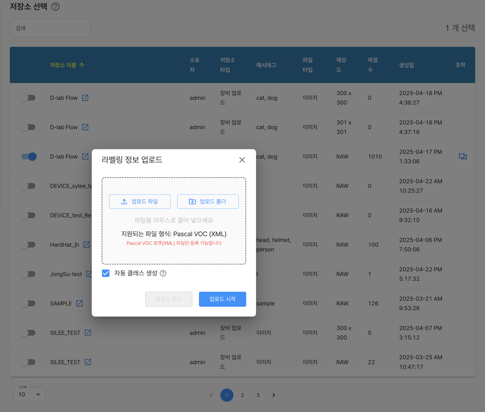

# 데이터셋 저장소 관리

데이터셋을 구성하는 기본 요소중 하나로 데이터셋에 사용될 파일 저장소를 `선택`할 수 있습니다.

기본적으로 사용자가 보유한 저장소가 리스트로 표현되며, 각 리스트 좌측의 `슬라이드 버튼을 통해 선택하거나 해제`할 수 있습니다.

목록에는 기본적인 저장소에 대한 정보를 확인할 수 있습니다.

- 저장소 이름
- 소유자
- 저장소 타입
- 헤시테크
- 파일 타입
- 해상도
- 파일수

각 항목에 대해서 다음과 같은 기능을 제공합니다.

- `(저장소 이름) 이동하기 : 해당 저장소의 데이터 업로드 화면으로 이동`
- `(조작) 데이터셋 라벨링 업로드 : 해당저장소에 저장된 파일에 대한 라벨링 정보를 수동으로 업로드`


***

# 라벨링 업로드

소유한 저장소 파일에 대한 라벨링 정보를 시스템에 반영할 수 있는 기술을 제공합니다.

특정 저장소에 보관된 파일에 대한 라벨링정보를 한번에 업로드 하는 기능이며, 보관된 파일이름과, 업로드하는 라벨링내에 존재하는 파일명을 활용해 매칭합니다.

`자동 클래스 생성` 버튼을 통해 사전에 정의 되지 않은 클래스에 대한 라벨링 정보도 자동으로 반영할 수 있습니다. : 클래스 자동 생성

라벨링 업로드에 대한 절차는 다음과 같습니다.

```
    데이터 저장소에 사용 하고자하는 파일 데이터를 저장
    데이터 셋의 저장소 관리에서 해당되는 데이터 저장소 를 선택
    라벨링 정보 업로드 기능을 통해 라벨링 정보를 업로드 
```

**지원 라벨링 정보**

`현재는 PascalVOC 형태의 라벨링 업도르 기능만을 제공하며 추후 단계적으로 업데이트 예정`





**PascalVOC** 라벨링 형태 샘플

```pascalvoc.xml 샘플
<annotation>
	<folder></folder>
	<filename>000001_jpg.rf.126f6b8cfbd73d7029f2ea9b666b4b83.jpg</filename>
	<path>000001_jpg.rf.126f6b8cfbd73d7029f2ea9b666b4b83.jpg</path>
	<source>
		<database>roboflow.com</database>
	</source>
	<size>
		<width>416</width>
		<height>416</height>
		<depth>3</depth>
	</size>
	<segmented>0</segmented>
	<object>
		<name>helmet</name>
		<pose>Unspecified</pose>
		<truncated>0</truncated>
		<difficult>0</difficult>
		<occluded>0</occluded>
		<bndbox>
			<xmin>149</xmin>
			<xmax>192</xmax>
			<ymin>94</ymin>
			<ymax>160</ymax>
		</bndbox>
	</object>
	<object>
		<name>helmet</name>
		<pose>Unspecified</pose>
		<truncated>0</truncated>
		<difficult>0</difficult>
		<occluded>0</occluded>
		<bndbox>
			<xmin>94</xmin>
			<xmax>113</xmax>
			<ymin>161</ymin>
			<ymax>194</ymax>
		</bndbox>
	</object>
</annotation>

```