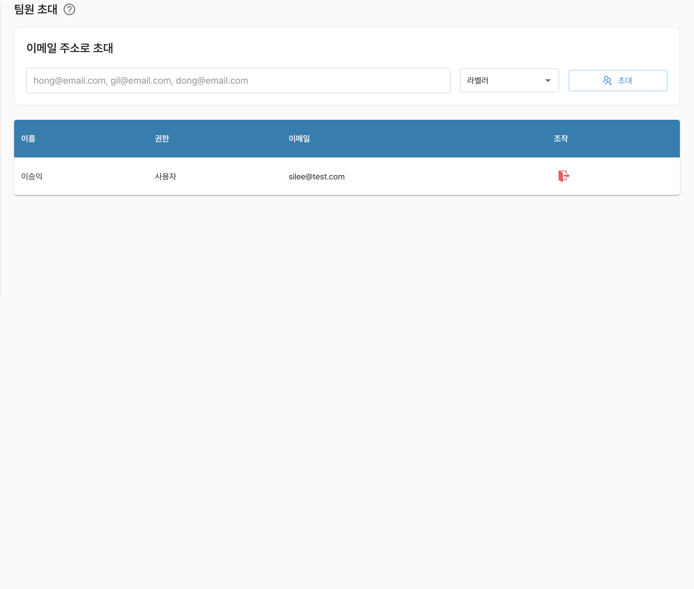
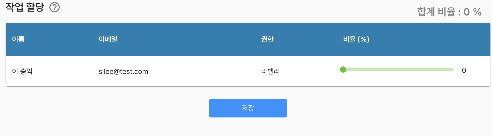

# 데이터셋 팀원 초대

데이터셋에 대한 팀원 관리 기능으로 데이터셋을 확용하거나 라벨링할 수 있는 멤버를 구성할 수 있습니다.

`초대`는 데이터셋 소유자만 가능합니다.

시스템에 등록된 `e-mail 주소`를 입력하고, `권한`을 선택후 `초대`버튼을 통해 팀원 계정을 추가할 수 있습니다.

- 소유자 : 데이터셋을 생성하고 소유한 계정
- 라벨러 : 데이터셋의 라벨링정보를 수정할 수 있는 계정
- 사용자 : 데이터셋을 AI 학습에 활용할 수 있는 계정

소유자를 제외한 팀원의 기본적인 정보를 제공 합니다.

만약, 소유자가 아닌 계정으로 접근한 경우 자기 자신에 대한 정보만 표시 됩니다.

- 이름
- 권한
- 이메일

각 항목에 대해서 다음과 같은 기능을 제공합니다.
- `(조작) 나가기 : 소유자 이거나, 자기 자신 계정에 대해서만 가능합니다.`



***

# 데이터셋 작업 할당

**작업**이란 라벨링 즉 어노테이션을 의미 합니다.

작업 할당이란, 다시말해 데이터셋이 포함된 정보에 대하여 라벨링을 작업에 대한 할당을 의미합니다.

**라벨러** 권한으로 포함된 사용자 목록이 표시되며 각 사용자의 우측 비율바를 통해 작업 비율을 할당할 수 있습니다.

`라벨러 권한은 작업 할당을 통해 비율 지정 여부와 관계 없이, 데이터셋에 포함된 전체 데이터에 대하여 라벨링 정보를 수정할 수 있습니다.`


작업 할당 시나리오
```
    데이터셋의 작업 할당은 전체 100% 입니다.
    작업 할당을 위해서는 표시된 각 사용자의 비율(%)의 합이 0 또는 100일 경우에만 저장 가능합니다.
    비율을 기반으로 데이터셋이 포함된 파일에대한 라벨링 업무를 분담하게 됩니다.
    
    작업 할당 비율이 지정된 사용자는 라벨링 페이지에서 할당된 작업에 대하여 구분하여 식별 가능해 집니다.
```



