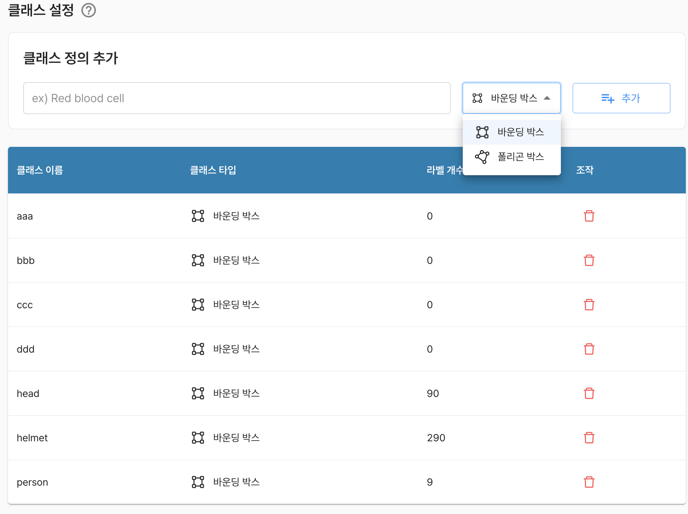

# 클래스 설정

클래스 설정은 해당 데이터셋에서 사용되는 클래스 정보를 관리하는 기능을 제공합니다.

```
    클래스(class)는 데이터가 속하는 범주(label)을 의미함
    
    본 시스템에서는 이미지 학습에 사용되는 데이터를 구성함에 있어, 데이터셋을 통해 학습하고자 하는 객체의 범주를 뜻합니다.
```

기본적으로 테이블 형태의 탐색 기능을 제공 하며, 상단 `클래스 정의 추가` 기능을 통해 사용자는 추가적인 클래스를 정의할 수 있습니다.

클래스의 속성을 유추해볼 수 있는 기본적인 정보를 제공 합니다.
- 이름
- 타입
- 라벨 개수

각 항목에 대해서 다음과 같은 기능을 제공합니다.
- `(조작) 삭제 : 라벨 개수가 1개 이상인경우, 클래스 정보를 삭제할 수 없습니다.`


**타입**이란 오브젝트 영역을 식별하는 방식으로 바운딩바스, 폴리곤 박스를 제공합니다.


