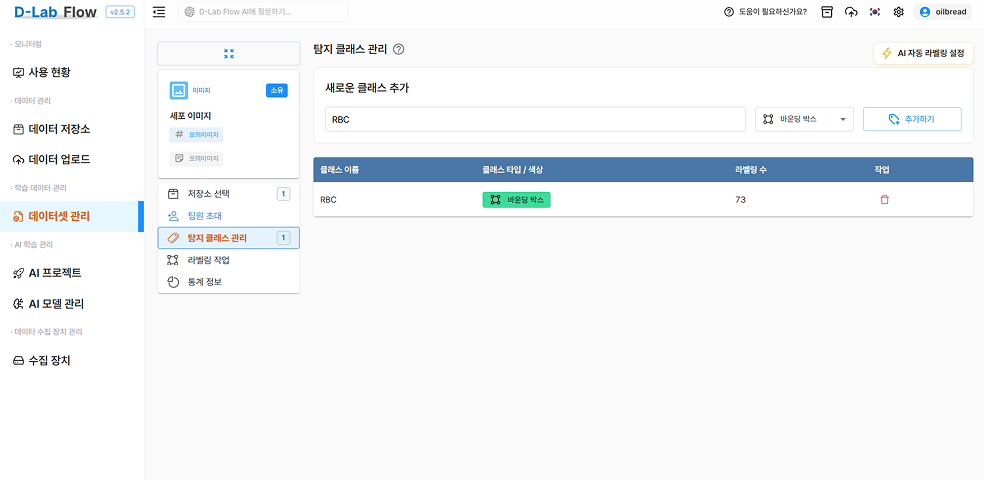
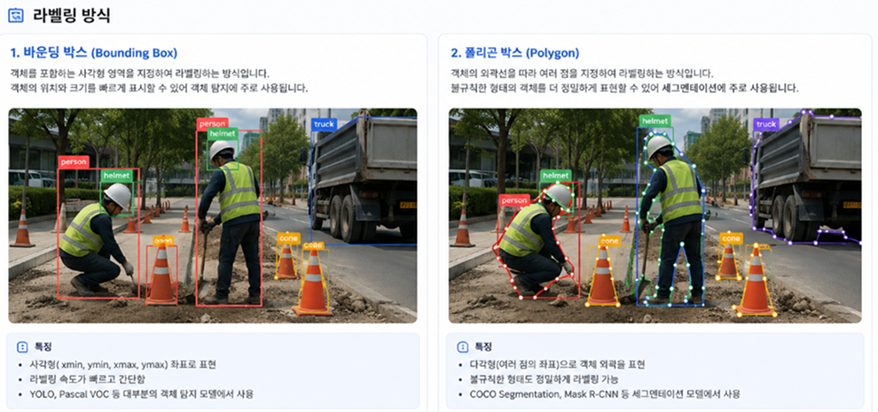

# 클래스 설정

클래스 설정은 해당 데이터셋에서 사용되는 클래스 정보를 관리하는 기능을 제공합니다.

```
    클래스(class)는 데이터가 속하는 범주(label)을 의미함
    
    본 시스템에서는 이미지 학습에 사용되는 데이터를 구성함에 있어, 데이터셋을 통해 학습하고자 하는 객체의 범주를 뜻합니다.
```
## 객체의 클래스 관리

기본적으로 테이블 형태의 탐색 기능을 제공 하며, 상단 `클래스 정의 추가` 기능을 통해 사용자는 추가적인 클래스를 정의할 수 있습니다.

클래스의 속성을 유추해볼 수 있는 기본적인 정보를 제공 합니다.
- 이름
- 타입
- 라벨 개수

각 항목에 대해서 다음과 같은 기능을 제공합니다.
- `(조작) 삭제 : 라벨 개수가 1개 이상인경우, 클래스 정보를 삭제할 수 없습니다.`


**타입**이란 오브젝트 영역을 식별하는 방식으로 바운딩박스, 폴리곤 박스를 제공합니다.




## 객체의 영역 표현 차이

***

**바운딩 박스**와 **폴리곤 박스**는 객체의 영역을 표시하는 방식에 차이가 있습니다.

- **바운딩 박스** : 객체를 감싸는 `사각형` 형태로 영역을 지정합니다. 좌상단, 우하단 두 좌표만으로 표현이 가능해 작업 속도가 빠르나, 객체의 실제 외곽선과는 차이가 있어 배경 영역이 함께 포함될 수 있습니다.
- **폴리곤 박스** : 객체의 외곽선을 따라 `다각형`으로 영역을 지정합니다. 여러 개의 좌표점으로 객체의 실제 형태를 정밀하게 표현할 수 있어, 불규칙한 형태의 객체나 정밀한 세그멘테이션이 필요한 경우에 활용됩니다.

