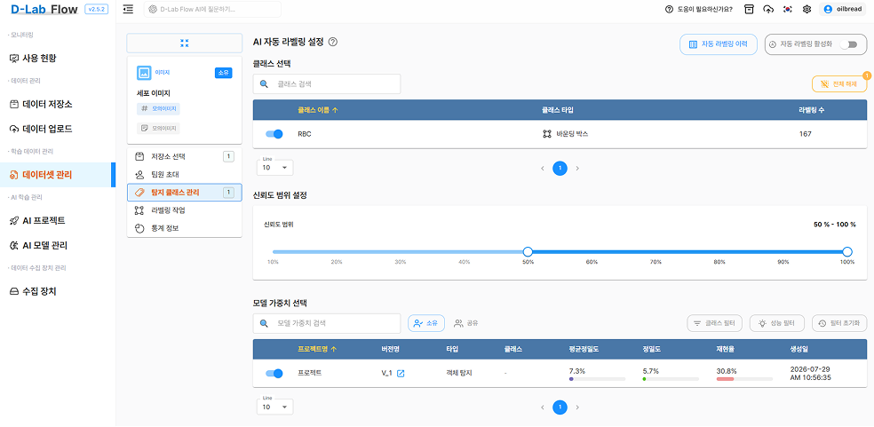
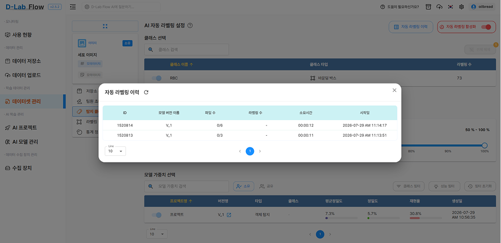

# AI 자동 라벨링

사전에 학습된 **AI 모델 가중치**를 활용하여, 선택한 클래스에 대한 라벨링을 자동으로 수행할 수 있는 기능입니다.

> ⚠️ **자동 라벨링을 사용하기 위해서는 사용자가 소유하고 있거나 공유받은 모델 가중치가 반드시 하나 이상 존재해야 합니다.**

### 클래스 선택

자동 라벨링을 적용할 클래스를 선택합니다. 좌측 검색창을 통해 원하는 클래스를 검색할 수 있으며, 각 클래스 좌측의 `슬라이드 버튼`을 통해 활성화 여부를 선택할 수 있습니다.

클래스 목록에서는 다음과 같은 정보를 확인할 수 있습니다.
- 클래스 이름
- 클래스 타입
- 라벨링 수

### 신뢰도 범위 설정

AI 모델이 예측한 결과 중, **어느 범위의 신뢰도(Confidence)를 가진 결과까지 라벨링에 반영할지** 설정할 수 있습니다.

슬라이더를 통해 최소~최대 범위(%)를 지정하며, 지정된 범위를 벗어나는 예측 결과는 자동 라벨링에서 제외됩니다.

### 모델 가중치 선택

자동 라벨링에 사용할 AI 모델 가중치를 선택합니다. 검색창을 통해 원하는 모델을 검색할 수 있으며, `소유` / `공유` 버튼을 통해 조회 대상을 필터링할 수 있습니다.

모델 목록에서는 다음과 같은 정보를 확인할 수 있습니다.
- 프로젝트명
- 버전명
- 타입
- 클래스
- 평균정밀도
- 정밀도
- 재현율
- 생성일

`클래스 필터`, `성능 필터` 기능을 통해 원하는 조건에 맞는 모델 가중치만 조회할 수도 있습니다.

### 자동 라벨링 활성화

우측 상단의 `자동 라벨링 활성화` 토글을 통해 설정된 조건(클래스, 신뢰도 범위, 모델 가중치)으로 자동 라벨링 기능을 켜고 끌 수 있습니다.

### 자동 라벨링 이력

`자동 라벨링 이력` 버튼을 통해 그동안 수행된 자동 라벨링 작업 내역을 확인할 수 있습니다.

이력에서는 다음과 같은 정보를 제공합니다.
- ID
- 모델 버전 이름
- 파일 수
- 라벨링 수
- 소요시간
- 시작일

