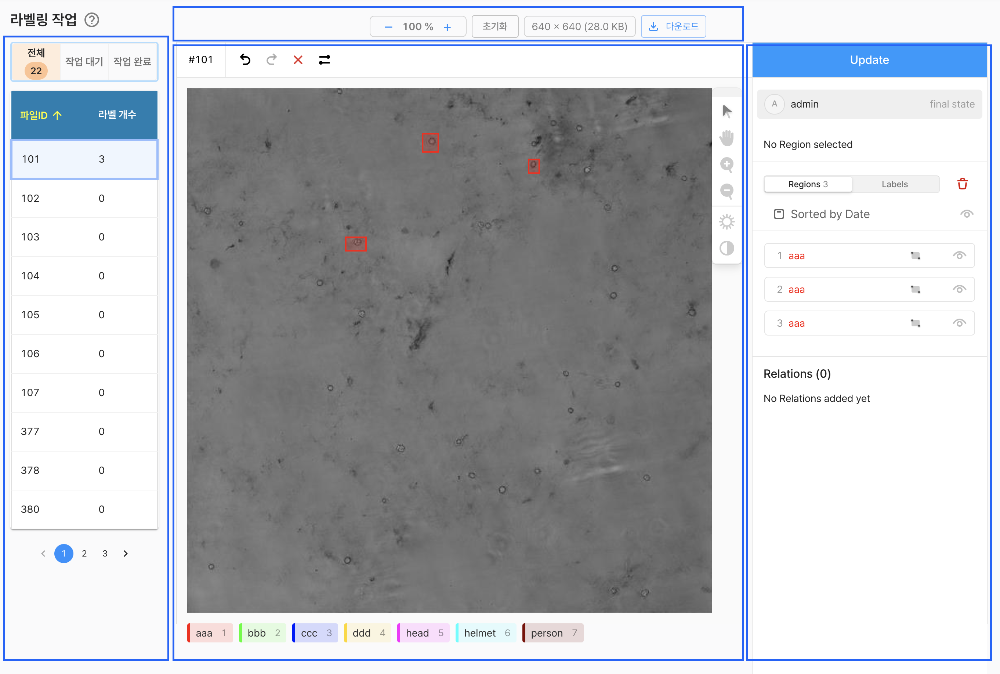

# 라벨링 작업

데이터셋에 포함된 저장소의 파일을 대상으로 정의된 클래스에 맞게 라벨링 하거나 라벨링 된 결과를 확인하고 관리할 수 있습니다.




## 좌측 사이드

라벨링의 대상이되는 파일 리스트르 선택할 수 있는 탐색기 기능을 제공 합니다.

- 전체 : 데이터셋에 포함된 전에 파일을 탐색
- 작업 대기 : 데이터셋에 포함되어 있지만, 라벨링 정보가 없는 파일을 탐색
- 작업 완료 : 데이터셋에 포함되어 있지만, 라벨링 정보가 있는 파일을 탐색

각 탭 상단에는 대상이 되는 파일 수를 확인할 수 있습니다.

`데이터셋 소유자에 의해 데이터셋에 초대된 계정으로 접근하였고, 작업 할당 범주가 적용되어 있다면 '작업 대기', '작업 완료'에서는 지정된 작업 범주의 파일만 조회 됩니다.`


## 중앙 상단

이미지의 크기 배율(축소, 확대, 초기화), 이미지의 정보(해상도 및 크기), 다운로드 기능을 제공 합니다.

## 중앙

실제 라벨링을 수행할수 있는 도구(Tool) 기능을 제공합니다.

기본적으로 표출 되는 정보는 다음과 같습니다.
- 이미지 ID
- 이미지
- 정의 가능한 클래스 목록

제공되는 기능은 다음과 같습니다.
- `실행 취소(undo)`
- `다시 실행(redo)`
- `초기화(reset) : 최초 로딩 상태로 되돌림`
- `화살표(Move Tool/Selection Tool) : 객체를 선택하거나 이동 시킬 수 있음`
- `손모양(Hand Tool) : 화면 영역을 이동`
- `확대(Zoom In)`
- `축소(Zoom Out)`
- `밝기(Brightness)`
- `명암(Contrast)`


## 우측 사이드

라벨링 정보 업데이트 기능 또는 기입된 라발렝 정보를 제공 합니다.
- `업데이트 버튼 : 현재 시점 라벨링 정보를 시스템에 반영`
- `기입된 라벨링 목록을 조회가능 'Regions(영역별 독립으로 표시)', 'Labels(클래스별 그룹 표시)'`

```
    본 서비스는 Label Studio 기능을 활용 했으며, 일부 기능은 동작하지 않습니다.
    예) Relations    
```


