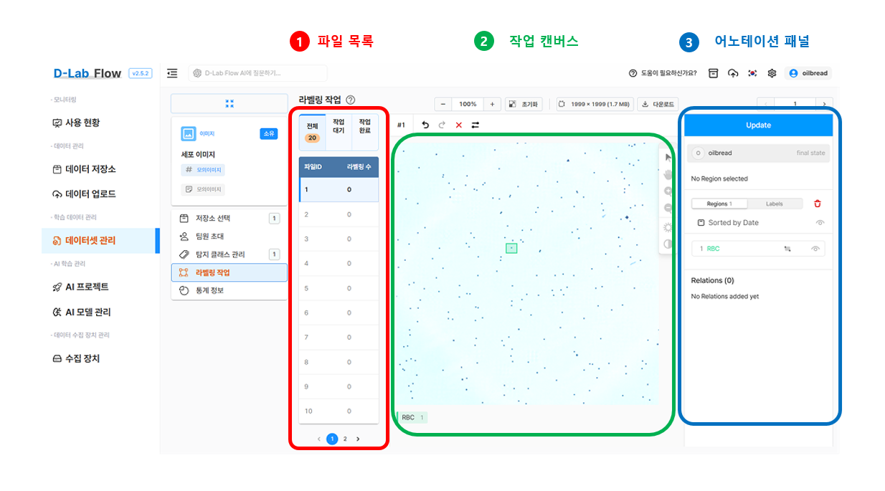

# 라벨링 작업

저장소에 포함된 파일을 대상으로 실제 라벨링(어노테이션) 작업을 수행하는 화면입니다. 화면은 크게 **파일 목록**, **작업 캔버스**, **어노테이션 패널** 세 영역으로 구성되어 있습니다.

## 파일 목록

좌측에는 라벨링 대상 파일 목록이 표시됩니다.

- `전체` : 저장소에 포함된 전체 파일 수
- `작업 대기` : 아직 라벨링이 진행되지 않은 파일
- `작업 완료` : 라벨링이 완료된 파일

각 파일ID를 클릭하면 해당 파일이 중앙 캔버스에 표시되며, 우측의 `라벨링 수`를 통해 파일별로 몇 개의 객체가 라벨링 되어 있는지 확인할 수 있습니다.

## 작업 캔버스

선택한 파일을 실제로 라벨링하는 작업 영역입니다.

**상단 툴바**
- 확대/축소 버튼 및 배율(%) 표시
- `초기화` : 확대/축소 및 화면 위치를 원래 상태로 되돌림
- 파일 크기 정보 (해상도, 용량) 표시
- `다운로드` : 현재 파일 원본 다운로드
- 하단의 페이지 번호를 통해 이전/다음 파일로 이동 가능

**좌측 도구 모음**

캔버스 좌측에는 라벨링 작업에 필요한 편집 도구들이 제공됩니다.

- `선택 도구` : 이미 그려진 영역(Region)을 선택 및 수정
- `이동 도구` : 화면을 드래그하여 이동
- `확대/축소 도구` : 캔버스 확대 및 축소
- 이 외에도 영역을 그리기 위한 도구(바운딩 박스/폴리곤 등)가 제공되며, 클래스 설정에서 지정한 타입에 따라 사용 가능한 도구가 달라집니다.

캔버스 하단에는 현재 이미지에 그려진 라벨의 클래스명과 개수(예: `RBC 1`)가 표시됩니다.

## 어노테이션 패널

우측에는 현재 선택된 파일의 라벨링 정보를 확인하고 수정하는 패널이 제공됩니다.

- `Update` 버튼 : 현재까지 작업한 라벨링 내용을 저장
- 작업자 정보 및 `final state` 등 현재 파일의 라벨링 상태 표시
- 캔버스에서 특정 영역을 선택하지 않은 경우 `No Region selected` 로 표시됨
- `Regions` / `Labels` 탭 : `Regions`는 현재 이미지에 그려진 개별 영역 목록을, `Labels`는 등록된 클래스 목록을 전환하여 표시
- `삭제` 아이콘을 통해 선택한 영역 삭제 가능
- `Sorted by Date` : 영역 목록을 생성일 기준으로 정렬
- `Relations` : 라벨링된 객체 간의 관계 정보를 표시 (관계가 없을 경우 `No Relations added yet` 로 표시)
