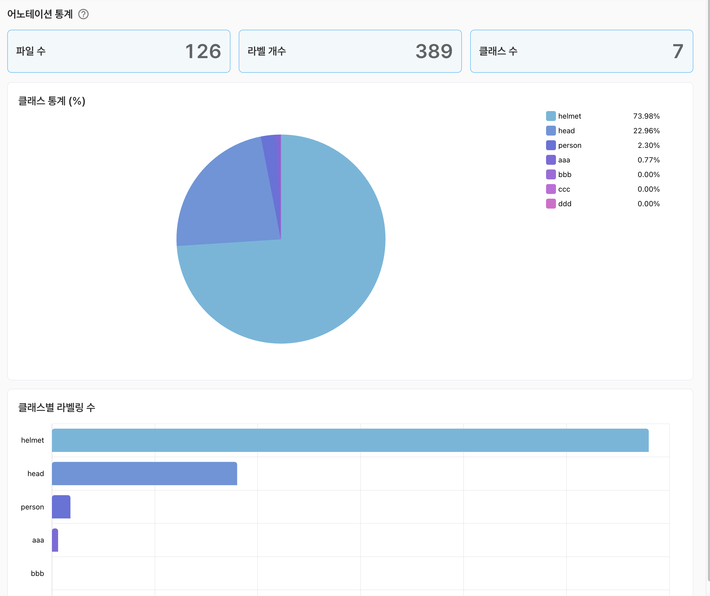

# 어노테이션 통계

데이터셋 라벨링 작업 결과의 통계적 지표를 제공합니다.

- 파일수 : 데이터셋에 포함된 파일의 전체 수를 표현
- 라벨 개수 : 데이터셋에 라벨링된 전체 수를 표현
- 클래스 수 : 데이터셋에 정의된 클래스 전체 수를 표현

**클래스 통계**는 각 클래스별 라벨링 데이터의 비율을 파이형태로 표현 하였습니다.

**클래스별 라벨링 수**는 각 클래스별 라벨링 수를 가로 바 형태로 표현 하였습니다.

