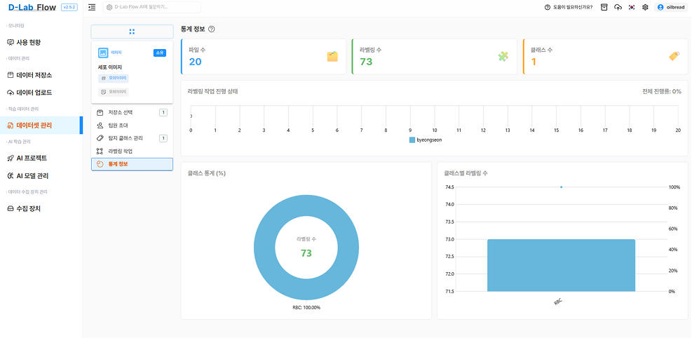

# 어노테이션 통계

데이터셋 라벨링 작업 결과의 통계적 지표를 제공합니다.

## 요약 정보

화면 상단에는 데이터셋의 전반적인 현황을 파악할 수 있는 세 가지 요약 지표가 제공됩니다.

- **파일 수** : 데이터셋에 포함된 파일의 전체 수를 표현
- **라벨링 수** : 데이터셋에 라벨링된 전체 수를 표현
- **클래스 수** : 데이터셋에 정의된 클래스 전체 수를 표현

## 라벨링 작업 진행 상태

데이터셋에 포함된 전체 파일 수를 기준으로, 팀원별 라벨링 작업 진행 현황을 누적 그래프로 표현합니다.

- 가로축은 데이터셋에 포함된 파일 수(0 ~ 전체 파일 수)를 의미하며, 세로축은 각 팀원이 누적으로 완료한 라벨링 파일 수를 의미합니다.
- 우측 상단의 `전체 진행률`을 통해 데이터셋 전체 기준 라벨링 완료 비율을 확인할 수 있습니다.
- 하단 범례에는 라벨링 작업에 참여한 팀원의 이름이 표시되며, 팀원별 그래프 선을 통해 개인별 작업 속도와 진행 상황을 비교할 수 있습니다.

## 클래스 통계

**클래스 통계**는 데이터셋에 라벨링된 전체 라벨 중, 각 클래스가 차지하는 비율을 도넛(파이) 형태로 표현합니다.

- 중앙에는 데이터셋 전체의 라벨링 수 합계가 표시됩니다.
- 하단에는 각 클래스명과 함께 전체 라벨링 수 대비 비율(%)이 함께 표시됩니다.

## 클래스별 라벨링 수

**클래스별 라벨링 수**는 각 클래스에 실제로 라벨링된 개수를 가로 바 그래프 형태로 표현합니다.

- 가로축은 클래스명을, 세로축은 해당 클래스의 라벨링 수를 의미합니다.
- 클래스가 여러 개인 경우, 클래스별 라벨링 수를 막대 길이로 비교하여 데이터 분포의 불균형 여부를 한눈에 파악할 수 있습니다.

