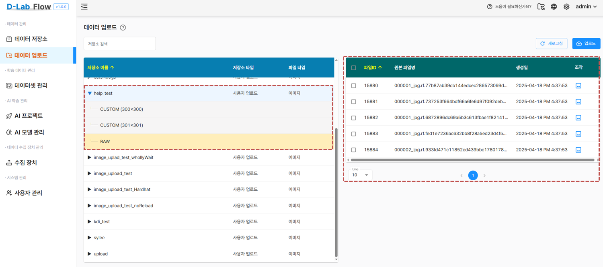
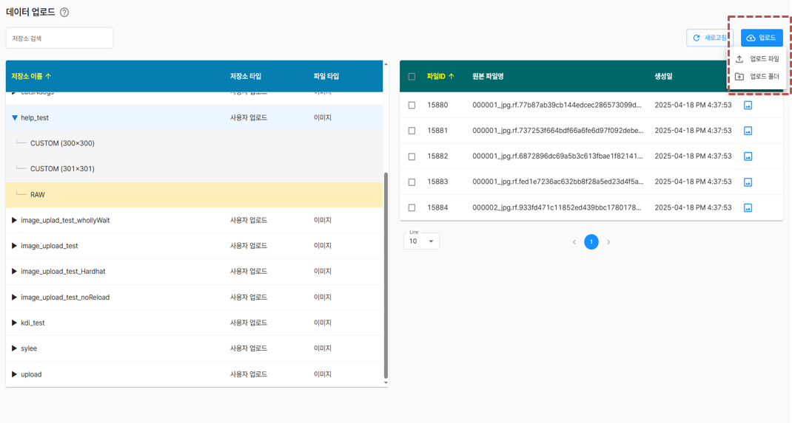
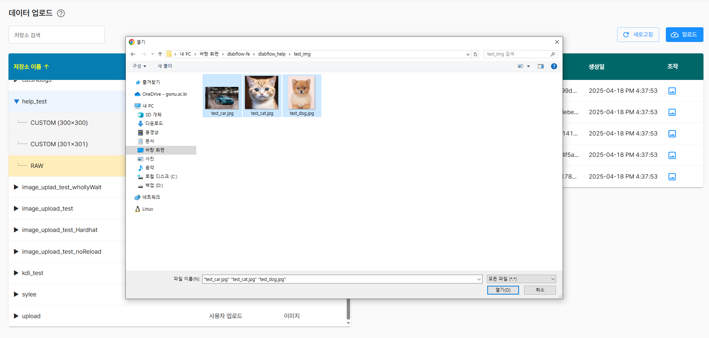
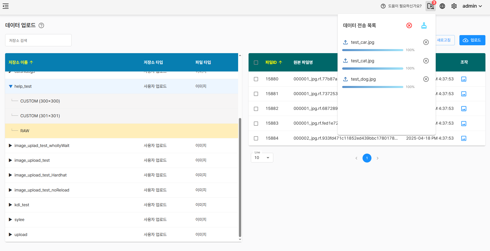
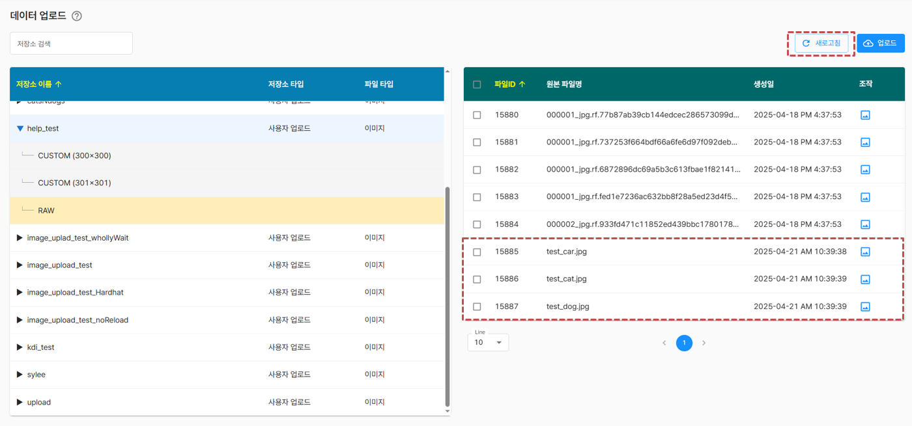
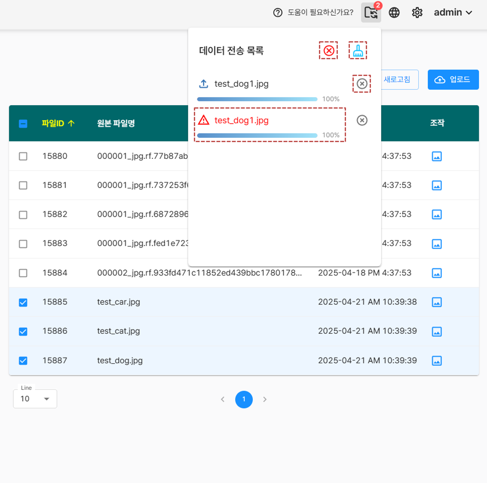
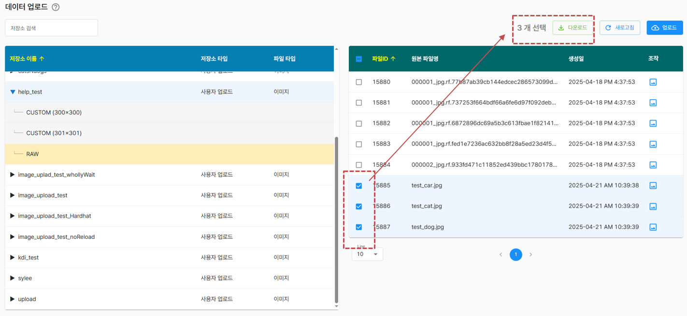
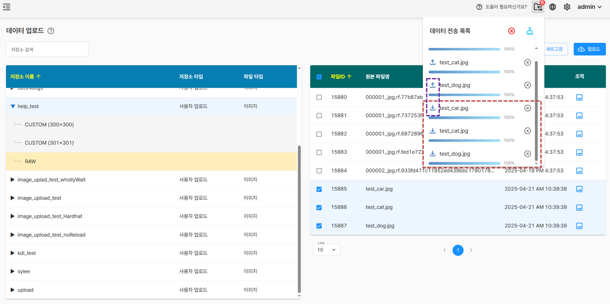
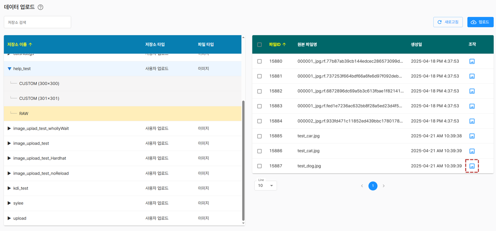

# 데이터 업로드

선택한 저장소에 필요한 데이터를 업로드하고 업로드된 파일을 한눈에 관리할 수 있습니다.

PC에서 새로운 파일을 업로드하거나 기존 파일을 다운로드할 수 있으며, 미리보기 기능을 통해 파일의 내용을 빠르게 검토할 수 있어 정확하고 효율적인 데이터 구성이 가능합니다.

## 저장소 정보
저장소 목록을 보여주고 해당 저장소를 클릭시 파일 목록을 화면 우측에 표시합니다.

- CUSTOM(300x300) : 데이터 저장소에서 크롭 기능을 통해 만든 분할된 이미지 파일 목록
- RAW : 해당 저장소의 전체 파일 목록

## 업로드 기능

저장소 목록에서 특정 저장소를 선택하면, 파일목록 상단에 <Highlight color="rgb(24, 144, 255)">새로고침</Highlight>과 <Highlight color="rgb(24, 144, 255)">업로드</Highlight> 버튼이 표시됩니다.

업로드 방식은 개별 파일 업로드와 폴더 단위 업로드 두 가지로 나누어져 있습니다. (지원하는 파일형식 : jpeg, png, bmp)
- 파일 업로드: 한개 또는 여러 개의 파일을 선택하여 한 번에 업로드
- 폴더 업로드: 폴더 전체를 업로드 (대량의 데이터에 유용)

업로드 진행 상황은 우측 상단에서 [
<Highlight color="rgb(24, 144, 255)"></Highlight>
 : 데이터 전송 목록 ] 버튼을 눌러 확인이 가능하며, 완료시 <Highlight color="rgb(24, 144, 255)">새로고침</Highlight> 버튼을 눌러 업로드된 파일을 확인할 수 있습니다.

알림에 대한 설명은 다음과 같습니다.
-   : 전체 취소 버튼으로 클릭 시점 기준으로 더이상 업로드가 진행되지 않습니다.
-   : 클릭시 전체 알림을 제거합니다.
-   : 클릭시 완료된 해당 항목의 알림을 제거합니다.
-   : 중복된 파일명은 업로드가 불가능하며 오류 아이콘을 표시합니다.

## 다운로드 기능

체크박스를 선택하면 다운로드할 파일의 개수가 표시되며, <Highlight color="rgb(24, 144, 255)">다운로드</Highlight> 버튼을 통해 선택한 파일을 한 번에 다운로드할 수 있습니다.

<Highlight color="rgb(24, 144, 255)">다운로드</Highlight> 버튼 클릭시 우측 상단에 다운로드 상태가 표시되며 아이콘으로 업로드와 다운로드를 구분하여 나타냅니다.
-   : 업로드 아이콘
-   : 다운로드 아이콘
- 다운로드된 파일은 브라우저의 최근 다운로드 기록이나 내 pc -> 다운로드 에서 확인 확인할 수 있습니다.

## 미리보기 기능

[ <Highlight color="rgb(24, 144, 255)"></Highlight> 
 : 미리보기 ] 버튼을 클릭하면 모달 창이 열리며, 미리보기 기능이 제공됩니다. 이를 통해 업로드된 파일을 확인할 수 있고, 다운로드하기 전에 파일을 확인할수 있습니다.

export const Highlight = ({children, color}) => (

{children}

);
