# 데이터 업로드

선택한 저장소에 **이미지 및 정형 데이터 파일**을 업로드하고, 업로드된 데이터를 한눈에 확인하고 관리할 수 있습니다.

## 저장소 정보

저장소 목록에서 원하는 저장소를 선택하면 해당 저장소에 업로드된 **파일 목록이 화면 오른쪽에 표시**됩니다.

파일 목록은 데이터의 유형과 생성 방식에 따라 다음과 같이 구분됩니다.

- RAW: 해당 저장소에 업로드된 원본 파일 전체 목록입니다.
- CROP (폭 × 높이): 데이터 저장소의 크롭 기능을 통해 원본 이미지에서 분할·생성된 이미지 파일 목록입니다. 

## 업로드 기능

### 이미지 업로드

저장소 목록에서 특정 저장소를 선택하면, 파일목록 상단에 <Highlight color="rgb(24, 144, 255)">새로고침</Highlight>과 <Highlight color="rgb(24, 144, 255)">업로드</Highlight> 버튼이 표시됩니다.

업로드 기능은 개별 파일 업로드와 폴더 단위 업로드 두 가지 방식을 제공하며, 지원되는 파일 형식은 JPEG, PNG, BMP입니다.

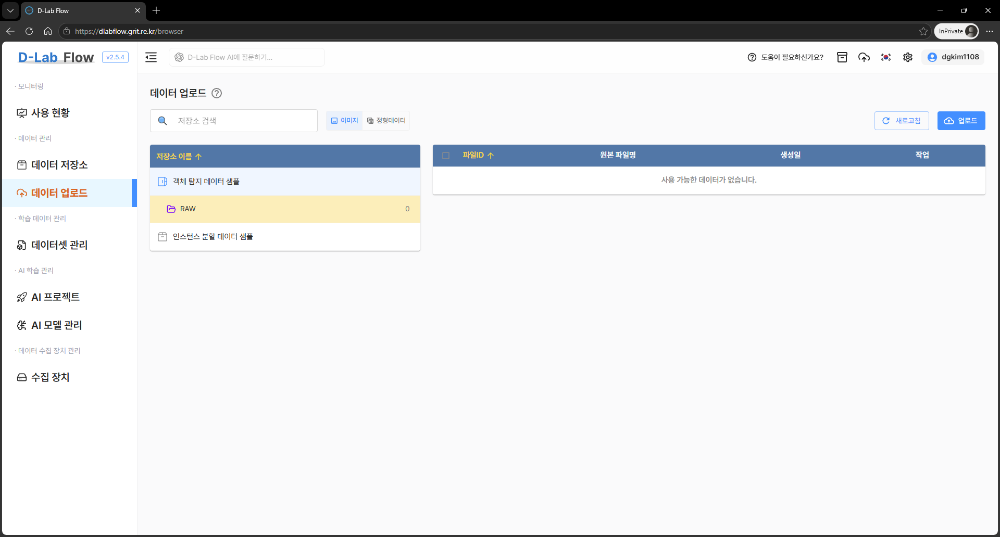

**파일 업로드**는 하나 이상의 파일을 선택하여 한 번에 업로드할 수 있습니다.

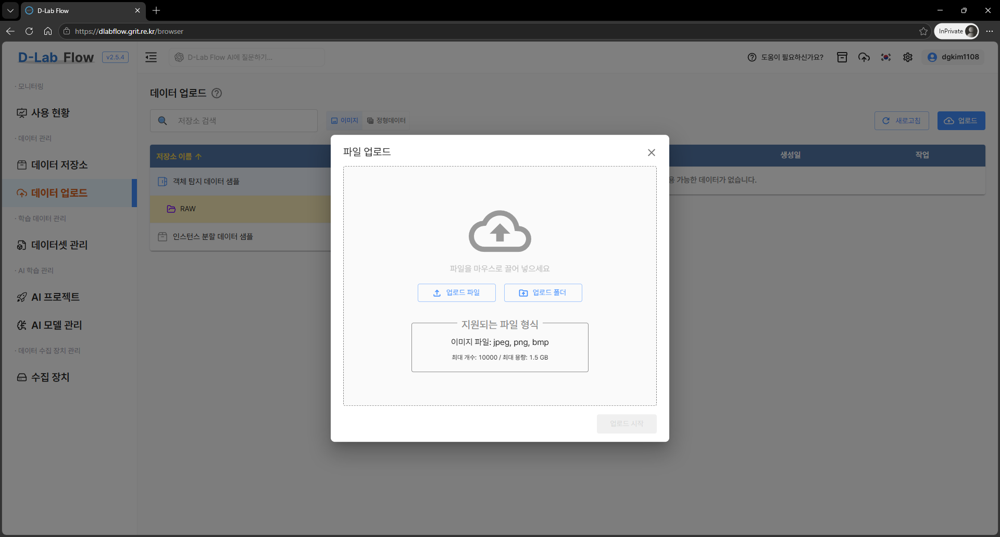

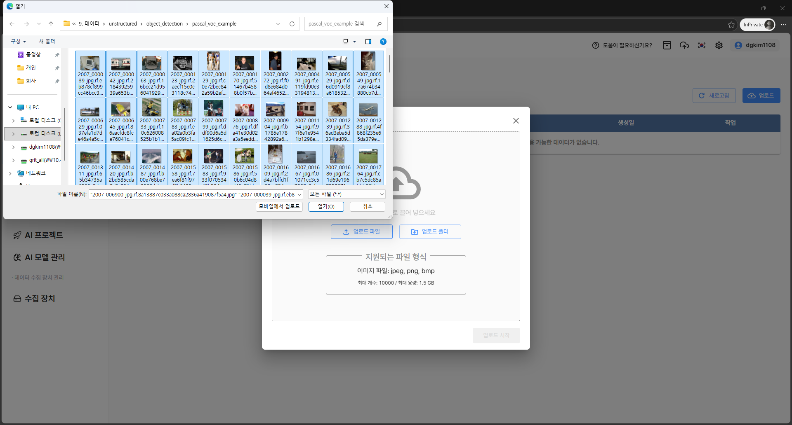

**폴더 업로드**는 폴더 전체를 한 번에 업로드할 수 있어 대량의 이미지 데이터를 등록할 때 유용합니다.

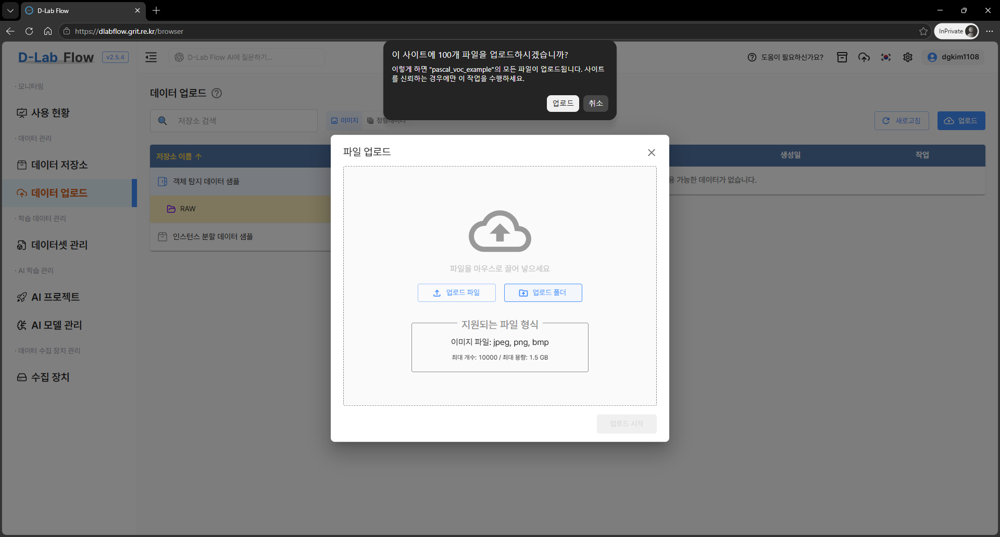

업로드할 파일 또는 폴더를 선택한 후, <Highlight color="rgb(24, 144, 255)">업로드 시작</Highlight> 버튼을 클릭하면 선택한 파일 또는 폴더의 업로드가 시작됩니다.

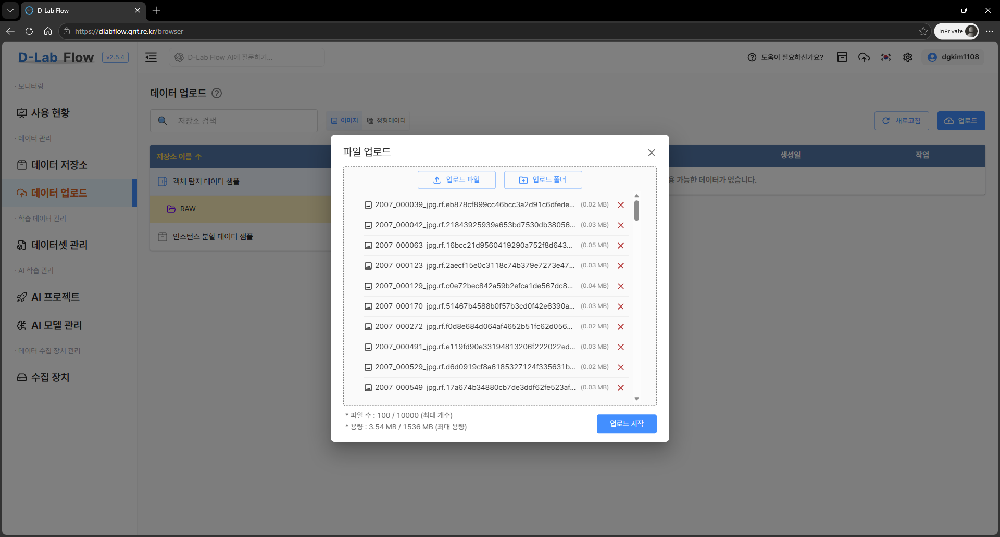

업로드 진행 상황은 우측 상단에서 [
<Highlight color="rgb(24, 144, 255)"></Highlight>
 : 데이터 전송 목록 ] 버튼을 눌러 확인이 가능하며, 완료시 <Highlight color="rgb(24, 144, 255)">새로고침</Highlight> 버튼을 눌러 업로드된 파일을 확인할 수 있습니다.

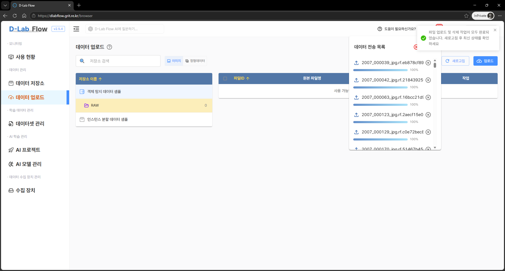

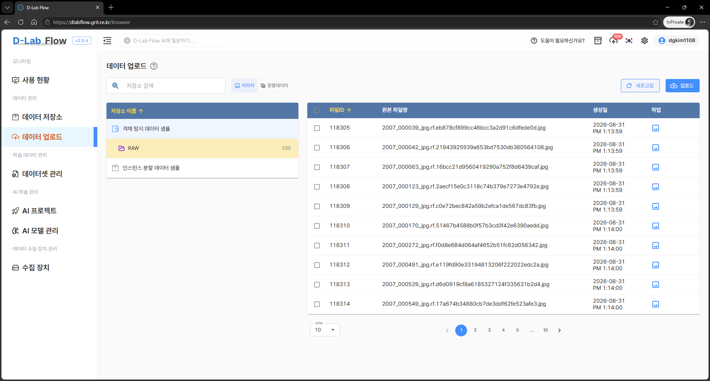

알림에 대한 설명은 다음과 같습니다.
-   : 전체 취소 버튼으로 클릭 시점 기준으로 더이상 업로드가 진행되지 않습니다.
-   : 클릭시 전체 알림을 제거합니다.
-   : 클릭시 완료된 해당 항목의 알림을 제거합니다.
-   : 중복된 파일명은 업로드가 불가능하며 오류 아이콘을 표시합니다.

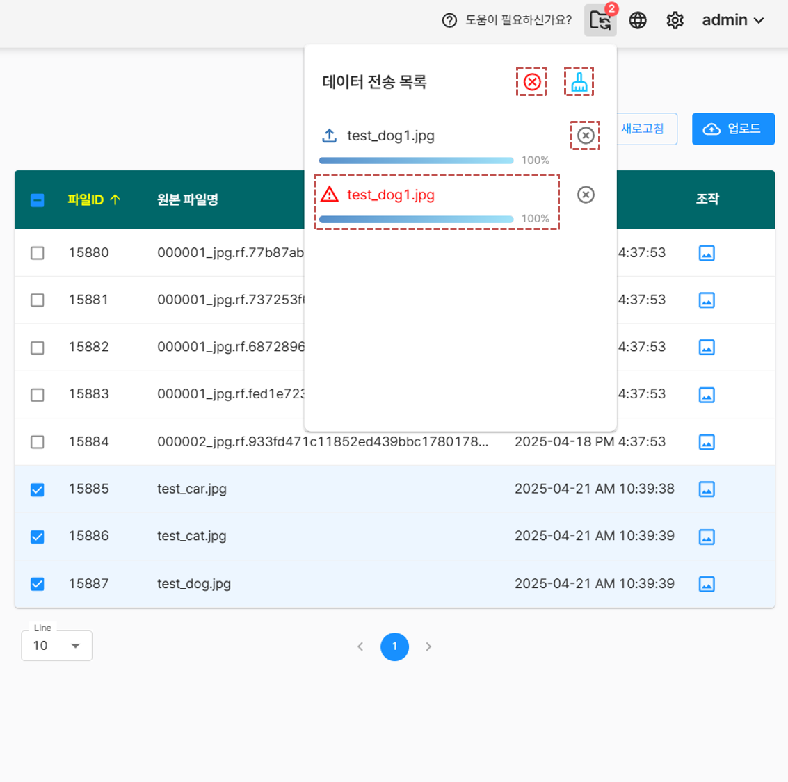

### 정형 데이터 업로드

저장소 목록에서 특정 저장소를 선택하면, 파일목록 상단에 <Highlight color="rgb(24, 144, 255)">새로고침</Highlight>과 <Highlight color="rgb(24, 144, 255)">업로드</Highlight> 버튼이 표시됩니다.

업로드 기능은 개별 파일 업로드와 폴더 단위 업로드 두 가지 방식을 제공하며, 지원되는 파일 형식은 CSV입니다.

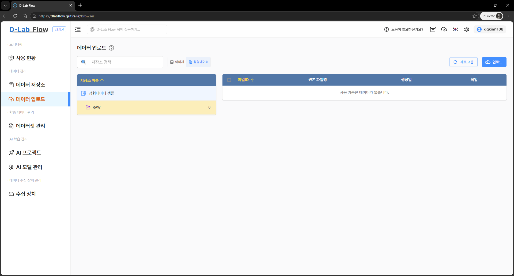

**파일 업로드**는 하나 이상의 파일을 선택하여 한 번에 업로드할 수 있습니다.

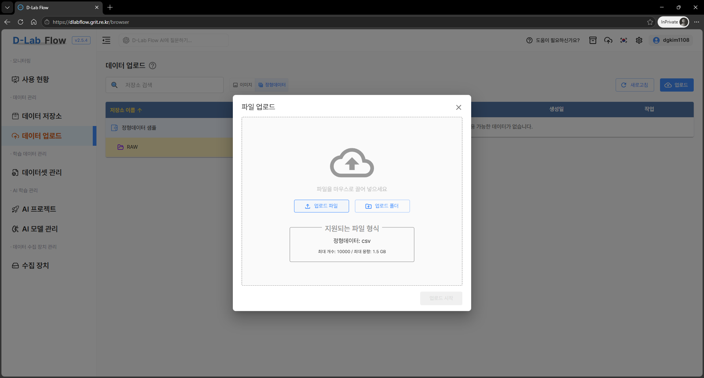

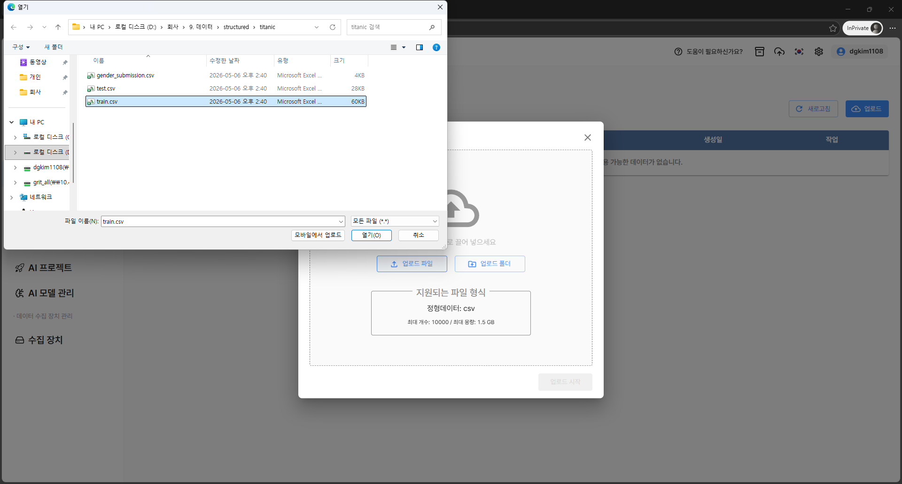

**폴더 업로드**는 폴더 전체를 한 번에 업로드할 수 있어 대량의 이미지 데이터를 등록할 때 유용합니다.

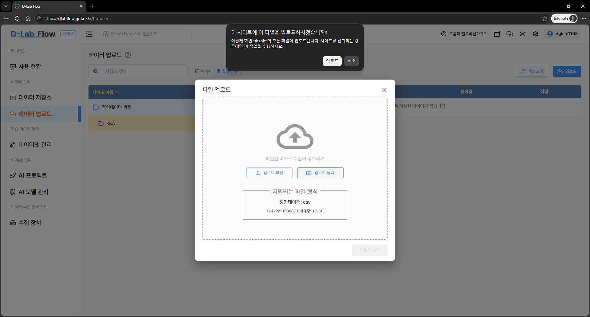

업로드할 파일 또는 폴더를 선택한 후, <Highlight color="rgb(24, 144, 255)">업로드 시작</Highlight> 버튼을 클릭하면 선택한 파일 또는 폴더의 업로드가 시작됩니다.

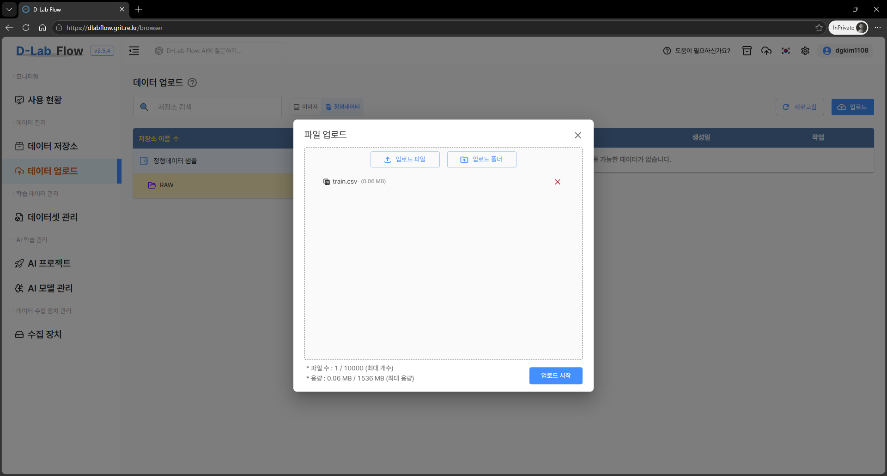

업로드 진행 상황은 우측 상단에서 [
<Highlight color="rgb(24, 144, 255)"></Highlight>
 : 데이터 전송 목록 ] 버튼을 눌러 확인이 가능하며, 완료시 <Highlight color="rgb(24, 144, 255)">새로고침</Highlight> 버튼을 눌러 업로드된 파일을 확인할 수 있습니다.

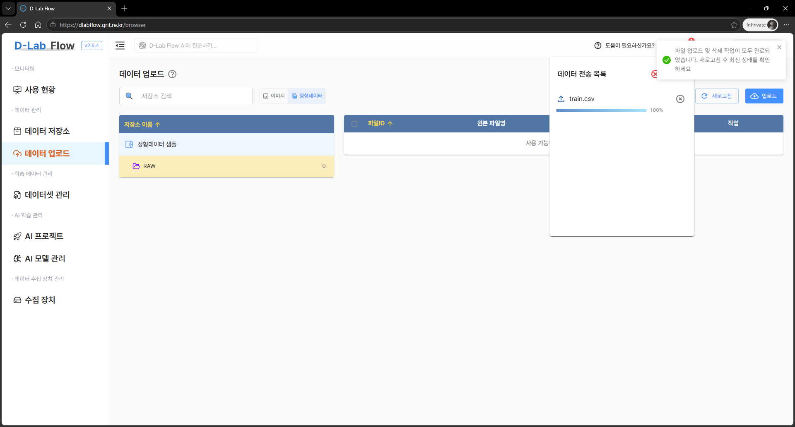

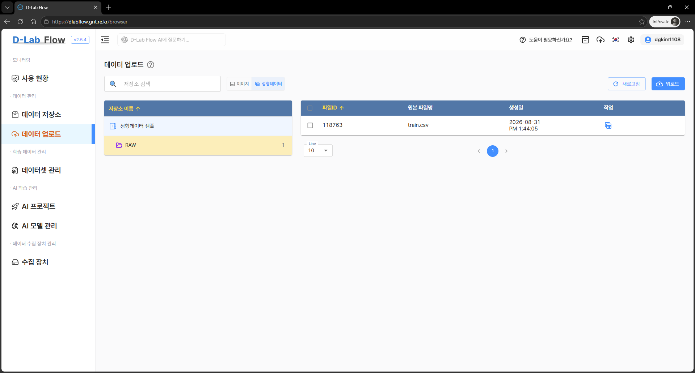

알림은 이미지의 알림에 대한 설명과 동일합니다.

## 삭제 기능은

**삭제 기능**은 이미지와 정형 데이터 모두 동일한 방식으로 사용할 수 있습니다.

삭제할 파일의 체크박스를 선택하면 선택한 파일의 개수가 표시됩니다. 이후 <Highlight color="rgb(24, 144, 255)">삭제</Highlight> 버튼을 클릭하면 선택한 파일을 한 번에 삭제할 수 있습니다.

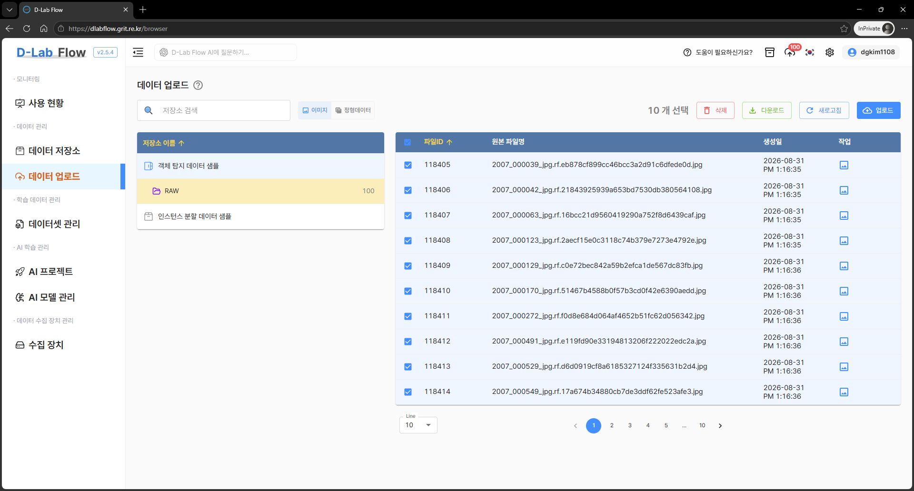

삭제 목록에서 삭제 파일 정보를 확인하고 <Highlight color="rgb(24, 144, 255)">예</Highlight> 버튼을 클릭하여 삭제를 진행합니다.

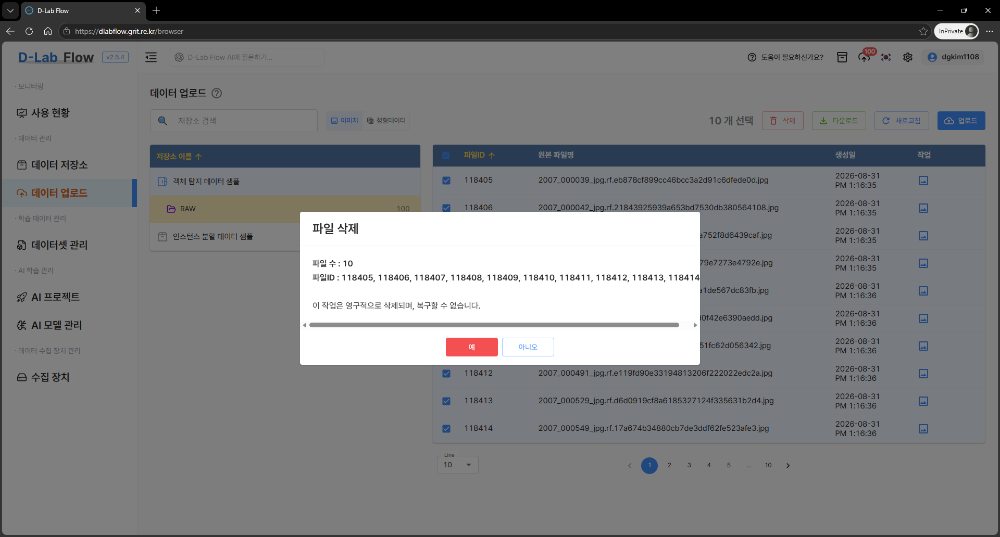

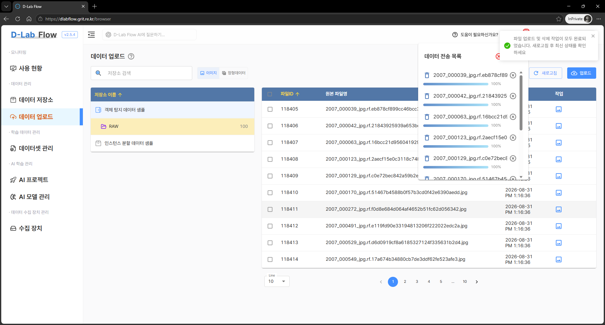

## 다운로드 기능

**다운로드 기능**은 이미지와 정형 데이터 모두 동일한 방식으로 사용할 수 있습니다.

체크박스를 선택하면 다운로드할 파일의 개수가 표시되며, <Highlight color="rgb(24, 144, 255)">다운로드</Highlight> 버튼을 통해 선택한 파일을 한 번에 다운로드할 수 있으며, 다운로드된 파일은 브라우저의 최근 다운로드 기록이나 내 pc -> 다운로드 에서 확인 확인할 수 있습니다.

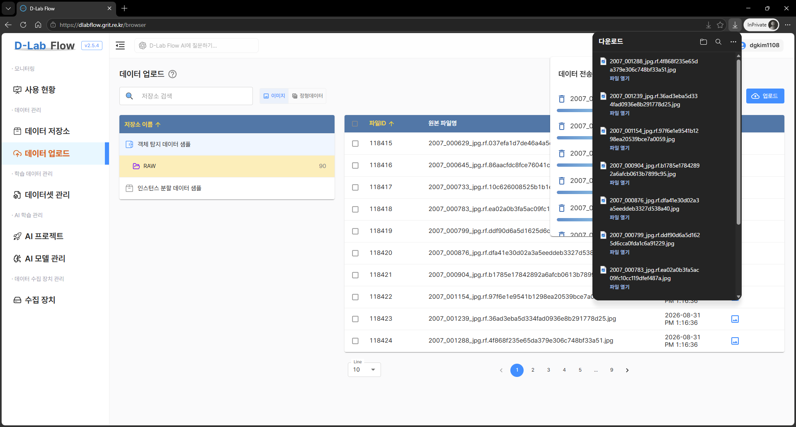

## 미리보기 기능

### 이미지 미리보기

[ <Highlight color="rgb(24, 144, 255)"></Highlight> 
 : 미리보기 ] 버튼을 클릭하면 모달 창이 열리며, 미리보기 기능이 제공됩니다. 이를 통해 업로드된 파일을 확인할 수 있고, 다운로드하기 전에 파일을 확인할수 있습니다.

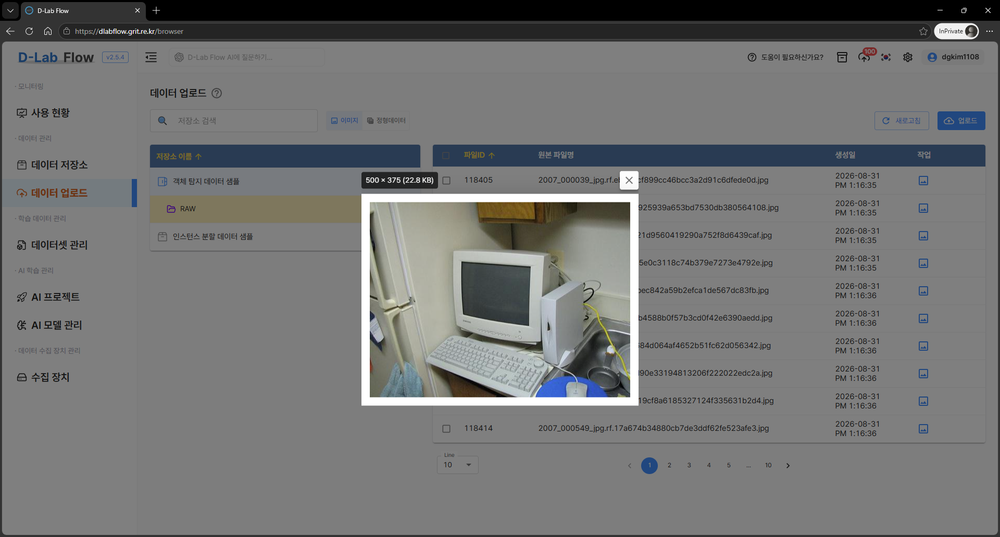

### 정형 데이터 미리보기

[ <Highlight color="rgb(24, 144, 255)"></Highlight> 
 : 미리보기 ] 버튼을 클릭하면 모달 창이 열리며, 미리보기 기능이 제공됩니다. 이를 통해 업로드된 파일을 확인할 수 있고, 다운로드하기 전에 파일을 확인할수 있습니다.

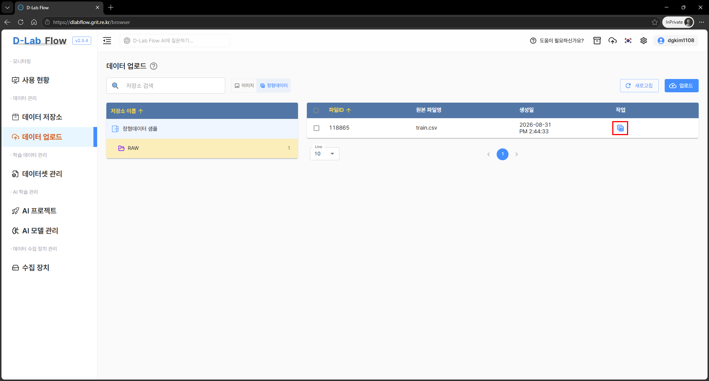

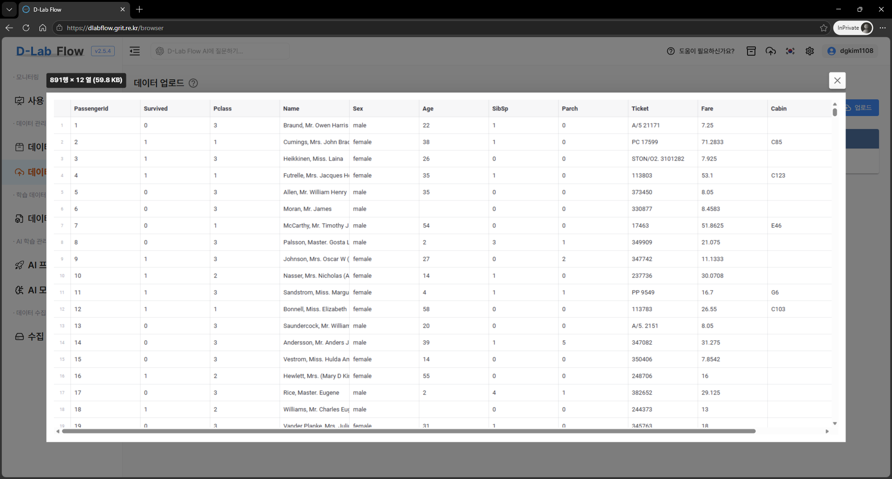

export const Highlight = ({children, color}) => (

{children}

);