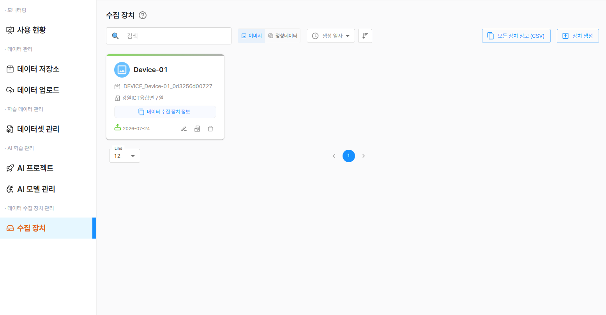
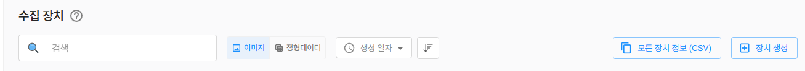
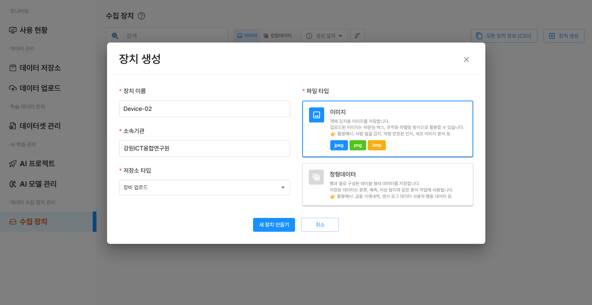
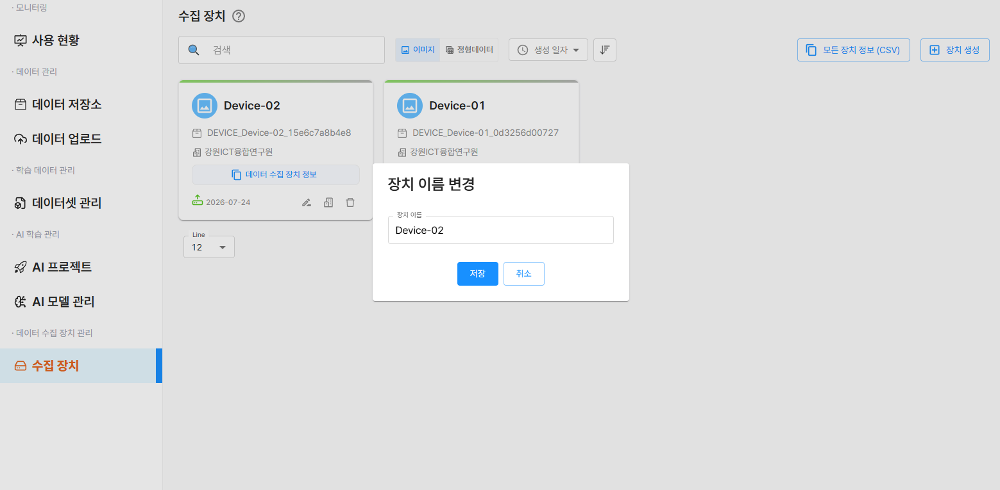
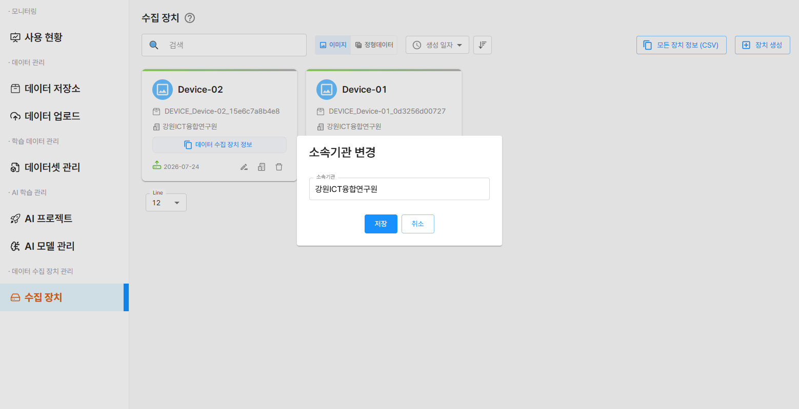
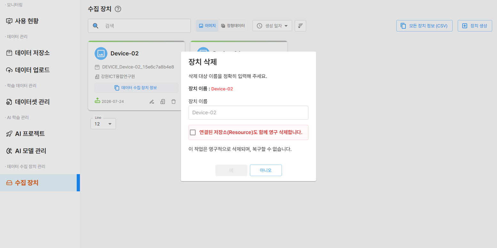

# 수집 장치

**수집 장치**는 현장의 각종 장비(카메라, IoT 기기, 센서 등)와 D-Lab Flow 플랫폼을 연결하기 위한 **인증 및 연동 정보를 제공**하는 역할을 합니다.
수집 장치를 생성하면 장치에 대한 저장소가 생성되며 고유한 **인증키**가 발급됩니다. 이를 통해 외부 환경에서 REST API 요청을 보냄으로써, AI 학습용 파일(이미지, 정형데이터 등)을 플랫폼으로 간편하게 **업로드**할 수 있습니다.



:::info 장치 목록 및 정보
수집 장치들은 **카드 형태**로 제공되며, 각 장치의 **정보**를 한눈에 확인할 수 있습니다.
- 장치 이름
- 저장소 이름
- 소속 기관명
- 데이터 수집 장치 정보 (발급된 인증키 정보 포함)
- 생성일
:::

## 검색 및 필터 (Toolbar)

수집 장치 목록 상단의 제어바를 활용해 원하는 장치를 빠르게 검색하거나 정렬할 수 있습니다.



- **키워드 검색창**: 장치 이름, 저장소 이름, 소속 기관을 입력하여 원하는 장치를 검색합니다.
- **데이터 유형 필터**: `이미지`, `정형데이터` 탭을 클릭하여 해당 데이터 타입의 장치만 모아봅니다.
- **정렬 기준 및 순서**: `생성 일자` 등 기준을 선택하고, 정렬 방향 버튼(↕️)을 통해 오름차순/내림차순으로 목록을 재정렬합니다.
- **모든 장치 정보**: `모든 장치 정보 (CSV)` 버튼을 클릭하면 등록된 모든 장치 목록을 CSV 형식으로 복사합니다.
  :::info 복사되는 CSV 데이터 예시
  `이미지`, `정형데이터` 타입이 모두 포함되어 아래와 같은 CSV 형태로 클립보드에 복사됩니다.

  ```csv title="클립보드 복사 예시"
  Device Name,Resource Name,Organization Name,Device ID,Access Key,Secret Key
  csv-01,DEVICE_csv-01_4bfbc2673504,강원ICT융합연구원,3f30124b-2f71-4798-b23b-4bfbc2673504,89f16a16-45cd-406e-8bcd-5520ce6a0b70,776f8e8b-8617-46d2-af81-b60331a213d3
  Device-01,DEVICE_Device-01_0d3256d00727,강원ICT융합연구원,f328b8be-81f2-49a6-b37b-0d3256d00727,1a1329fc-24ce-416e-bb06-e2e2943706ee,457b37b8-2cfb-4623-b683-dfc49541662e
  ```
  :::


## 장치 생성

현장 장비에 전달할 인증키를 발급하고 저장소를 연동하기 위해 우측 상단의 `장치 생성` 버튼을 클릭합니다.  
장치 생성에 필요한 정보를 입력 및 선택하고, `새 장치 만들기` 버튼을 클릭하여 장치를 생성합니다.
:::tip 저장소 생성
- 장치 생성 시 저장소가 자동으로 생성되며, `데이터 저장소` 메뉴에서 확인할 수 있습니다.
- 카드 형태의 장치를 클릭하여 `데이터 업로드` 페이지로 이동하여 업로드된 파일을 확인할 수 있습니다.
- 저장소 이름에는 장치 이름이 포함되기 때문에 생성 시 구분이 명확한 이름을 정하는 것을 추천드립니다.
  :::




## 인증 정보 발급 및 예제

장치 생성이 완료되면 외부 환경에서 D-Lab Flow 서비스에 접근할 때 필요한 인증키가 자동 발급됩니다.

카드 내부의 `데이터 수집 장치 정보` 버튼을 클릭하여 해당 장치의 정보를 복사합니다.
```csv title="클립보드 복사 예시"
  Device Name = Device-02
  Resource Name = DEVICE_Device-02_15e6c7a8b4e8
  Organization Name = 강원ICT융합연구원
  Device ID = a4592473-e13d-4f9f-90ae-15e6c7a8b4e8
  Access Key = 2598c37e-85b3-49cd-bb31-9e2b7759defc
  Secret Key = 5611d0d8-9169-43d3-a464-b49da7572268
```
:::warning 보안 주의
  접속 키와 비밀 키는 시스템 접근 자격 정보이므로 외부에 유출되지 않도록 안전하게 관리해야 합니다.
:::


### 예시: 학습 파일 업로드 API

아래는 발급받은 키를 사용하여 데이터를 업로드하는 API 예시입니다.

- **Method:** `POST`
- **URL:** `/api/v1/device/whope/data`
- **인증 방식:** API Key (Header)

#### 요청 구조

| 구분 | Key           | 설명                | Type  |
|------|---------------|-------------------|--------|
| header | `accessKey`    | 발급받은 Access Key 사용 | `text` |
| header | `accessSecret` | 발급받은 Secret Key 사용 | `text` |
| body (form-data) | `whopeImage` | 전송할 학습용 파일        | `file` |


#### Python 예제 코드

```md title="Python"
import requests

# API URL 및 헤더 설정
url = "https://dlabflow.grit.re.kr/api/v1/device/whope/data"
headers = {
    'accessKey': '2598c37e-85b3-49cd-bb31-9e2b7759defc',
    'accessSecret': '5611d0d8-9169-43d3-a464-b49da7572268'
}

# 업로드할 파일 경로
file_path = "/경로/파일이름.jpg"

# 파일 업로드 요청
with open(file_path, 'rb') as file:
    files = {
        'whopeImage': (
            file_path.split("/")[-1],
            file,
            'application/octet-stream'
        )
    }
    response = requests.post(url, files=files, headers=headers)

# 응답 출력
print("Response Code:", response.status_code)
print("Response Text:", response.text)
```


## 장치 이름 변경

카드 내부 우측 하단에서 **연필 아이콘(✏️)** 을 클릭하여 팝업에서 장치 이름을 수정할 수 있습니다.




:::info
 - 장치 이름 변경 시 저장소 이름에는 영향을 주지 않습니다.
:::


## 소속 기관 변경

카드 내부 우측 하단에서 **건물 아이콘(🏢)** 을 클릭하여 팝업에서 소속 기관을 수정할 수 있습니다.




## 장치 삭제

카드 내부 우측 하단에서 **휴지통 아이콘(🗑️)** 을 클릭하여 팝업에서 장치를 삭제할 수 있습니다.

 - 연결된 저장소도 함께 영구 삭제 `체크박스`를 선택 시 해당 **장치**와 **저장소** **모두 삭제**됩니다.
 - 체크하지 않을 시 장치 정보만 삭제되며 저장소는 `데이터 업로드` 메뉴에서 업로드 기능을 통해 추가적으로 파일을 업로드하거나 모델 학습에 유용하게 사용할 수 있습니다.
:::warning
 - 장치만 삭제하더라도 해당 저장소는 더 이상 다른 장치에서 연동할 수 없습니다.
:::

