# 빠르게 시작하기

D-Lab Flow는 이미지와 정형데이터를 관리하고, 데이터셋 구성부터 AI 모델 학습·평가·다운로드까지 지원하는 AI 개발·운영 플랫폼입니다. 이 문서에서는 처음 사용하는 사용자가 전체 업무 흐름을 빠르게 파악할 수 있도록 핵심 단계만 안내합니다.

- **적용 버전:** v2.5.0
- **대상:** D-Lab Flow를 처음 사용하는 일반 사용자
- **문서 목적:** 전체 업무 흐름 파악 및 상세 가이드 안내

## 사용자 가이드

D-Lab Flow v2.5.0의 데이터 저장소 구성부터 데이터셋·라벨링, AI 프로젝트 생성, 모델 학습·평가·다운로드와 관리자 기능까지의 전체 흐름을 영상으로 확인할 수 있습니다.

  <iframe
    src="https://www.youtube.com/embed/2TtR36Yo8T8"
    title="D-Lab Flow v2.5.0 핵심 사용자 가이드"
    className="intro-video__frame"
    allow="accelerometer; autoplay; clipboard-write; encrypted-media; gyroscope; picture-in-picture; web-share"
    allowFullScreen
  />

<a
  href="https://www.youtube.com/watch?v=2TtR36Yo8T8"
  target="_blank"
  rel="noopener noreferrer"
>
  YouTube에서 영상 보기
</a>

영상으로 전체 흐름을 먼저 확인한 뒤, 아래 단계에 따라 필요한 기능을 자세히 살펴보세요.

## 시작 전 확인

:::tip 시작하기 전에

- 사용할 계정과 권한을 확인합니다.
- 준비한 데이터가 이미지인지 정형데이터인지 확인합니다.
- 사용자 업로드와 장비 업로드 중 사용할 방식을 결정합니다.
- 이미지 학습용 클래스와 라벨링 정보를 준비합니다.
- 모델을 사용할 최종 실행 환경을 확인합니다.

:::

## 전체 업무 흐름

  

    1
    
<strong>사용 현황 확인</strong> <small>저장소와 GPU 사용량, 최근 작업 상태를 확인합니다.</small>

  

  

    2
    
<strong>데이터 준비</strong> <small>데이터 저장소를 만들고 원본 파일을 등록합니다.</small>

  

  

    3
    
<strong>데이터셋 구성</strong> <small>학습에 사용할 파일과 정답 정보를 구성합니다.</small>

  

  

    4
    
<strong>AI 프로젝트 생성</strong> <small>프로젝트 유형을 선택하고 데이터셋을 연결합니다.</small>

  

  

    5
    
<strong>학습 버전 생성</strong> <small>전처리와 하이퍼파라미터를 설정해 버전을 만듭니다.</small>

  

  

    6
    
<strong>모델 학습과 평가</strong> <small>모델을 학습시키고 성능과 예측 결과를 확인합니다.</small>

  

  

    7
    
<strong>모델 다운로드 및 활용</strong> <small>실행 환경에 맞는 형식으로 모델을 내보내 활용합니다.</small>

  

### 1. 사용 현황 확인

저장소, 데이터셋, AI 프로젝트와 학습 버전, 파일 현황을 확인합니다. 누적 GPU 사용 시간과 최근 학습 이력도 점검해 새 작업에 필요한 자원과 작업 상태를 파악합니다.

<!-- 이미지 삽입 위치: 사용 현황 화면 -->
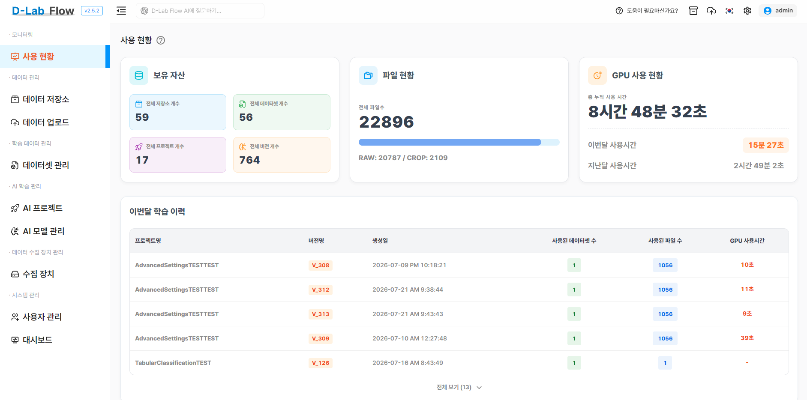

### 2. 데이터 준비

데이터 저장소는 원본 파일을 보관하는 기본 공간입니다. 저장소를 생성할 때 이름, 해시태그, 저장소 타입과 파일 타입을 설정한 뒤, 사용자가 직접 파일을 등록하는 **사용자 업로드**와 수집 장치가 데이터를 전송하는 **장비 업로드** 중 목적에 맞는 방식을 선택합니다.

<!-- 이미지 삽입 위치: 데이터 저장소 및 데이터 업로드 화면 -->
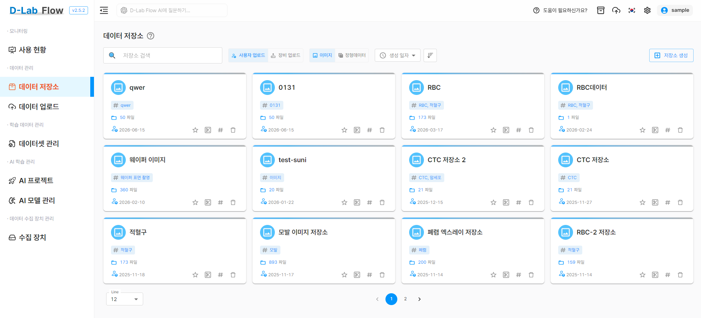

이미지는 파일과 폴더를 RAW 저장소에 등록하고, 정형데이터는 사용하는 데이터 형식에 맞춰 저장합니다. 장비 업로드를 사용할 때는 외부 장비에서 데이터를 자동 전송한 뒤 소량의 테스트 데이터로 연결 상태를 확인합니다. 자세한 설정은 [데이터 저장소 관리](/docs/data_management/data_storage), [데이터 업로드](/docs/data_management/data_upload)와 [수집 장치 관리](/docs/device_management/acquisition_device)에서 확인할 수 있습니다.

<!-- 이미지 삽입 위치: 수집 장치 관리 화면 -->
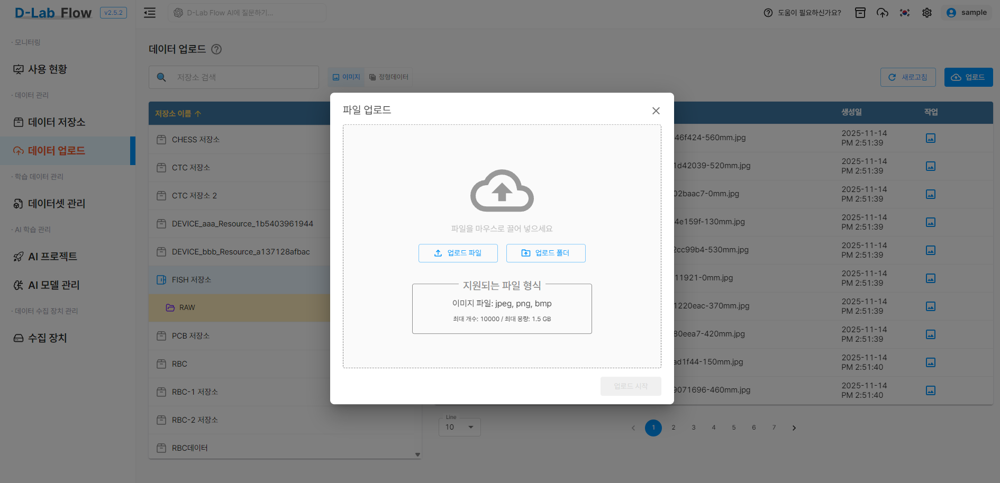

:::info 이미지 업로드 참고
이미지 업로드는 JPEG, PNG, BMP 형식을 지원하며, 한 번에 최대 10,000개, 총 1.5GB까지 등록할 수 있습니다.
:::

### 3. 데이터셋 구성

데이터 저장소가 원본 파일을 보관하는 공간이라면, 데이터셋은 학습에 사용할 파일과 정답 정보를 구성하는 단위입니다. 저장소의 데이터를 데이터셋에 연결하고, 이미지 또는 정형데이터의 학습 목적에 맞게 구성합니다.

<!-- 이미지 삽입 위치: 데이터셋 구성 및 라벨링 화면 -->
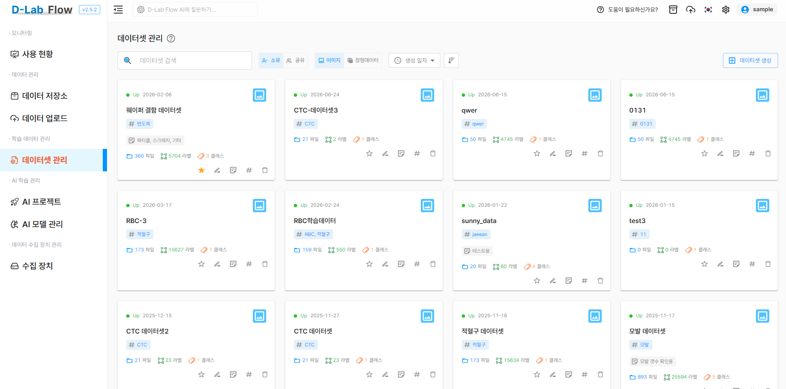

이미지 데이터셋은 다음 순서로 준비합니다.

저장소 선택 → 탐지 클래스 관리 → 라벨링 작업 → 통계 정보 확인

사람, 자동차, 세포, 불량 부위와 같은 클래스를 정의하고 바운딩 박스 또는 폴리곤으로 라벨링합니다. 팀원을 초대해 작업을 나눌 수 있으며, 통계 정보에서 파일 수, 라벨 수와 클래스별 분포를 확인해 부족한 데이터를 보완합니다. 정형데이터 데이터셋은 학습에 사용할 컬럼과 목표값을 기준으로 구성합니다.

<!-- 이미지 삽입 위치: 데이터셋 구성 및 라벨링 화면 -->
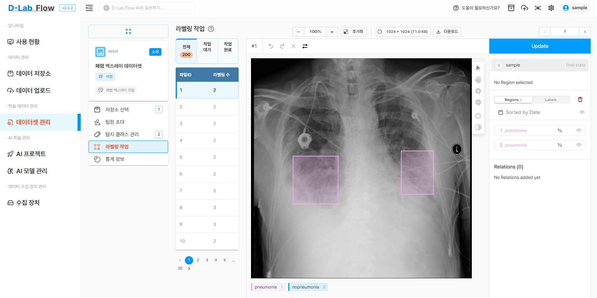

자세한 내용은 [데이터셋 관리](/docs/manage_dataset/manage_dataset), [클래스 관리](/docs/manage_dataset/manage_class), [라벨링 작업](/docs/manage_dataset/manage_labeling)과 [데이터셋 통계](/docs/manage_dataset/manage_statistics)에서 확인할 수 있습니다.

### 4. AI 프로젝트 생성

프로젝트 유형을 선택하고, 해당 유형과 호환되는 데이터셋을 연결한 뒤 학습 버전을 생성합니다. v2.5.0에서는 다음 AI 프로젝트 유형을 사용할 수 있습니다.

<!-- 이미지 삽입 위치: AI 프로젝트 생성 화면 -->
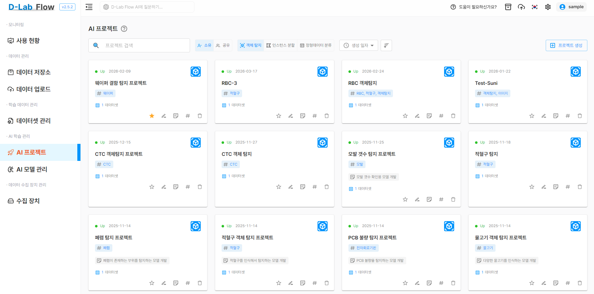

- **객체 탐지:** 이미지에서 대상의 위치와 종류를 찾습니다.
- **인스턴스 분할:** 객체의 실제 외곽선을 픽셀 단위로 구분합니다.
- **정형데이터 분류:** 행과 열로 구성된 데이터를 정해진 종류로 분류합니다.

<!-- 이미지 삽입 위치: AI 프로젝트 생성 화면 -->
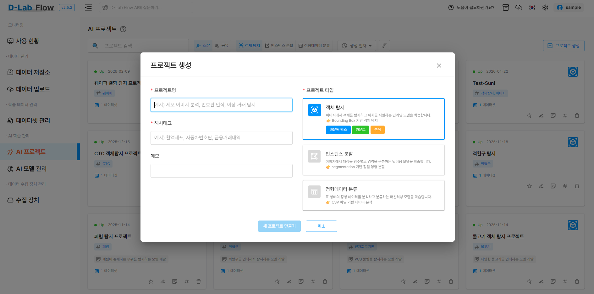

프로젝트 생성 방법은 [AI 프로젝트 생성](/docs/manage_ai_learning/ai_project/generate_project)에서 확인할 수 있습니다.

### 5. 학습 버전 생성

하나의 AI 프로젝트에서 여러 학습 버전을 만들고, 버전별로 전처리, 데이터 증강과 하이퍼파라미터를 다르게 적용할 수 있습니다. 버전별 성능을 비교해 적절한 설정을 선택합니다.

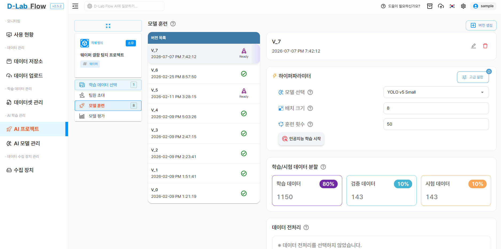

처음에는 기본값 또는 권장 설정으로 기준 모델을 만든 뒤, 이미지 크기, 최적화 알고리즘, 학습률과 데이터 증강을 한두 가지씩 바꾸며 비교합니다. 자세한 내용은 [학습 버전 생성](/docs/manage_ai_learning/ai_project/generate_version)에서 확인할 수 있습니다.

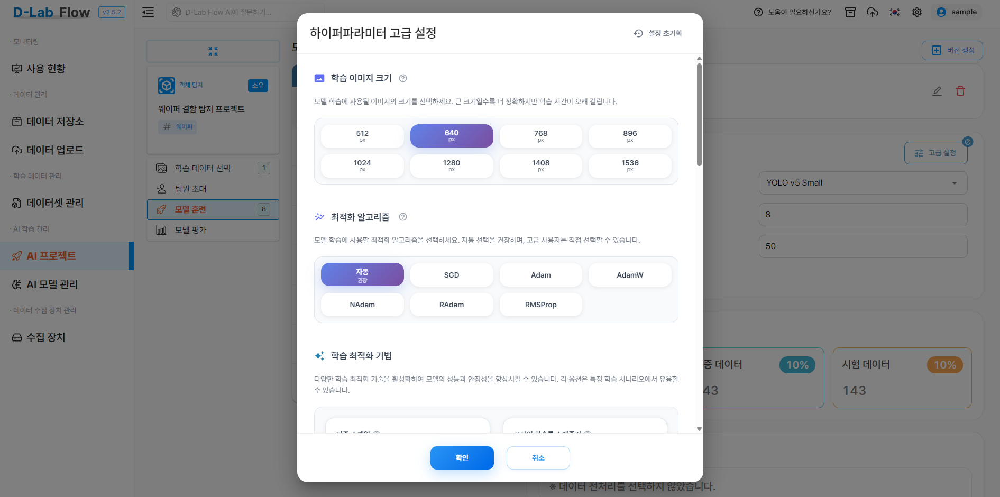

### 6. 모델 학습과 평가

학습 시간은 파일 수, 이미지 크기, 모델 종류와 GPU 성능에 따라 달라집니다. 학습이 끝나면 평가 지표와 실제 예측 결과를 함께 확인해 모델의 사용 가능성을 판단합니다.

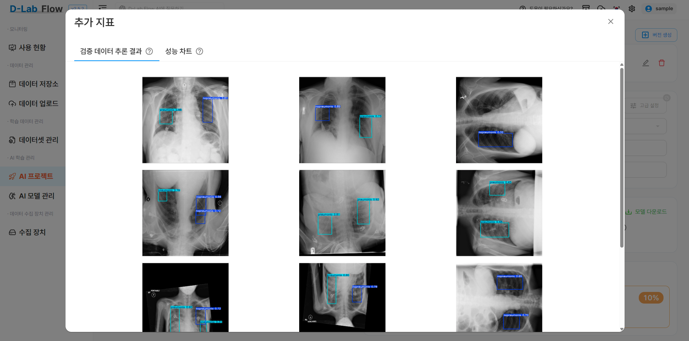

객체 탐지 모델에서는 다음 지표를 주로 확인합니다.

- **평균정밀도:** 객체 탐지 모델의 전반적인 탐지 성능입니다.
- **정밀도:** 모델이 탐지한 결과 중 실제 정답의 비율입니다.
- **재현율:** 실제 정답 중 모델이 찾아낸 비율입니다.

한 가지 지표만으로 판단하지 말고 결과 이미지와 함께 비교합니다. 자세한 내용은 [모델 학습](/docs/manage_ai_learning/ai_project/train_model)과 [모델 평가](/docs/manage_ai_learning/ai_project/evaluate_model)에서 확인할 수 있습니다.

<!-- 이미지 삽입 위치: 모델 학습 결과 및 성능 평가 화면 -->

### 7. 모델 다운로드 및 활용

학습과 평가가 끝난 모델은 실행 환경에 맞는 형식으로 다운로드합니다.

- **PyTorch:** 원본 모델을 활용한 추가 개발과 검증에 사용합니다.
- **ONNX:** 다양한 서버와 엣지 환경에 활용합니다.
- **OpenVINO:** 인텔 CPU, GPU, VPU 환경에 활용합니다.

ONNX와 OpenVINO로 내보낼 때 이미지 크기, 배치 크기와 FP16·INT8·Dynamic·NMS 같은 최적화 옵션을 실행 환경에 맞게 선택할 수 있습니다. 내보낸 모델은 실제 운영 장비에서 정상적으로 실행되는지와 성능이 유지되는지를 다시 확인해야 합니다. 자세한 내용은 [AI 모델 관리](/docs/manage_ai_learning/manage_ai_model)에서 확인할 수 있습니다.

<!-- 이미지 삽입 위치: AI 모델 관리 및 다운로드 화면 -->
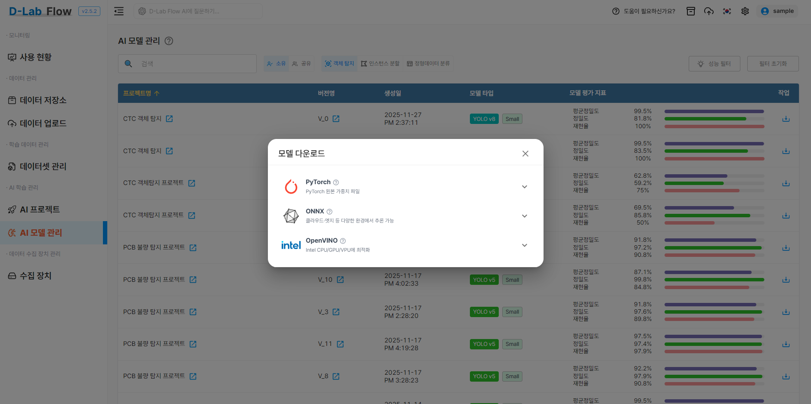
