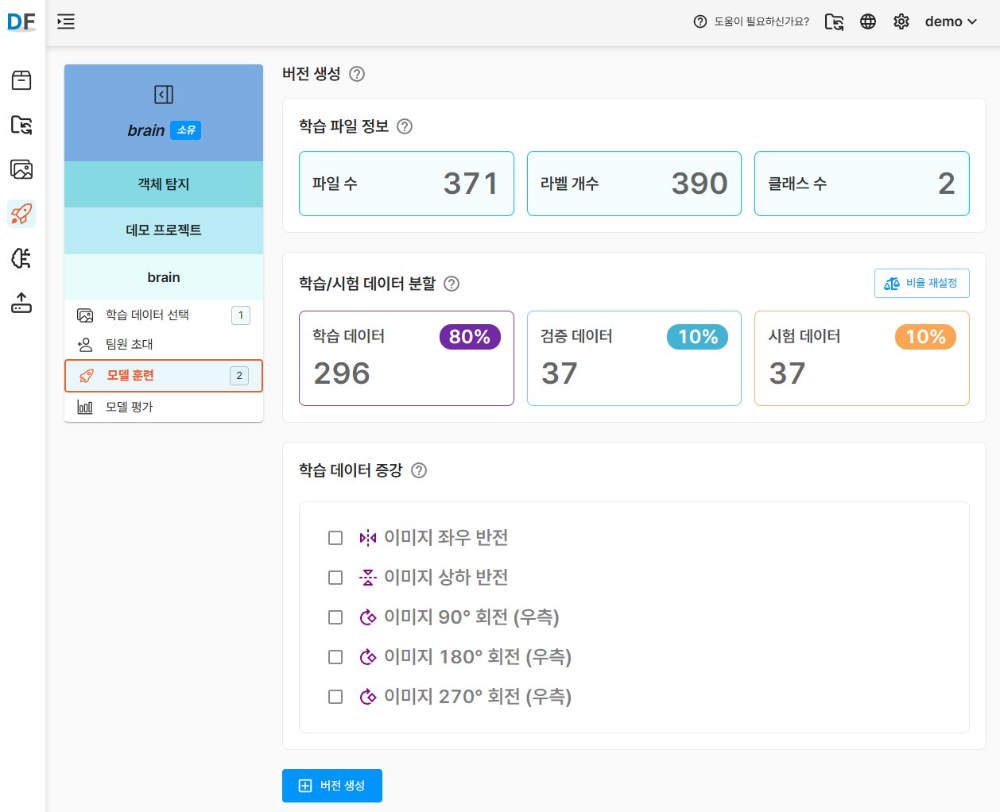

# 빠르게 시작하기

**D-Lab-Flow**는 컴퓨터 비전 솔루션을 구축하는 데 필요한 라벨링, 학습, 배포 기능을 모두 제공합니다.

이 가이드를 통해 귀하의 사용 사례에 최적화된 컴퓨터 비전 모델을 손쉽게 만들 수 있습니다.

이번 빠른 시작 튜토리얼은 약 4분 분량의 영상으로, 비전 모델을 사용해 여러 객체를 식별하는 방법을 단계별로 안내합니다.

지금 바로 따라 하며, 컴퓨터 비전의 첫걸음을 시작해 보세요.

## 빠른 시작 튜토리얼 (4분)
---

<iframe width="100%" height="540" src="https://www.youtube.com/embed/ff7eLBVBEbE" frameborder="0" allow="accelerometer; autoplay; clipboard-write; encrypted-media; gyroscope; picture-in-picture; web-share" referrerpolicy="strict-origin-when-cross-origin" allowfullscreen></iframe>

이거 예전꺼라 다시 만들어야함...

### 데이터 저장소 생성
---

D-Lab Flow에서는 학습 데이터를 체계적으로 관리하기 위해 데이터 저장소를 먼저 생성해야 합니다.

데이터 저장소는 학습에 필요한 파일을 업로드하고 관리하는 공간입니다.

:::tip tip

<Highlight color="rgb(24, 144, 255)">저장소 생성</Highlight>버튼을 클릭한 후 아래 정보를 입력하여 새로운 저장소를 생성합니다.

- `저장소 이름(필수)` 저장소를 구분할 수 있는 명확한 이름을 입력합니다
- `해시태그(필수)` 저장소를 식별하거나 검색할 수 있는 키워드를 입력합니다.
- `파일 타입` 현재는 이미지 파일만 업로드가 가능합니다.

:::

### 이미지파일 업로드
---

생성한 데이터 저장소에 학습에 사용할 이미지 파일을 업로드합니다.

지원 포맷은 .jpg, .png, .bmp 이며, 여러 장을 동시에 업로드할 수 있습니다.

:::tip tip

<Highlight color="rgb(24, 144, 255)">업로드</Highlight>버튼을 클릭한 후 학습에 사용할 이미지 파일을 업로드하세요.

- `업로드 파일` 파일을 개별로 선택하여 업로드합니다.
- `업로드 폴더` 하위 이미지 파일을 포함한 폴더 전체를 선택하여 업로드합니다. 

:::

### 데이터셋 생성
---

데이터 저장소를 바탕으로 데이터셋을 생성합니다.

데이터셋은 모델 학습에 사용될 이미지와 라벨을 하나의 단위로 묶어 관리하는 구조입니다.

:::tip tip

<Highlight color="rgb(24, 144, 255)">데이터셋 생성</Highlight>버튼을 클릭한 후 아래 정보를 입력하여 새로운 데이터셋을 생성합니다.

- `데이터셋 이름(필수)` 데이터셋를 구분할 수 있는 명확한 이름을 입력합니다
- `해시태그(필수)` 데이터셋을 식별하거나 나중에 검색하기 쉬운 키워드를 입력합니다.
- `메모` 데이터셋의 특징, 목적, 포함된 데이터의 조건 등을 자유롭게 기록할 수 있습니다.

:::

### 라벨링정보 파일 업로드
---

라벨링 정보 파일은 이미지 안에 어떤 객체가 있고, 그 위치가 어디인지 등을 정의하는 파일입니다.

D-Lab Flow는 현재 `Pascal VOC 포맷(XML)`을 지원합니다.

업로드한 라벨 파일은 이미지와 자동으로 매칭되며, 매칭된 정보는 라벨링 도구에서 바로 확인하고 편집할 수 있습니다.

:::tip tip

  아이콘 을 클릭한 후 라벨링 정보 파일을 업로드합니다.

- 라벨링 정보 파일은 저장소가 선택된 상태에서만 업로드할 수 있습니다.
- 파일 단위 또는 폴더 단위로 업로드할 수 있습니다.
- 라벨 파일 이름은 해당 이미지 파일 이름과 정확히 일치해야 매칭이 정상적으로 이루어집니다.
- `자동 클래스 생성` 옵션을 체크하면, 라벨 파일에 정의된 클래스가 사전에 등록되어 있지 않더라도 자동으로 클래스 목록에 추가됩니다.

:::

### 라벨링 작업
---

업로드한 라벨링 정보가 없거나 부족할 경우, `라벨링 작업` 에서 직접 라벨링 작업을 수행할 수 있습니다.

직관적인 라벨링 도구를 사용하여 이미지 내 객체의 경계 상자(Bounding Box)를 그릴 수 있으며, 클래스(Label)도 지정할 수 있습니다.

라벨 작업을 모두 마친 후에는 `업데이트(Update)` 버튼을 클릭해 변경된 라벨 정보를 저장해 주세요.

:::tip tip

- 라벨링 도구는 마우스로 드래그하여 경계 상자를 설정하는 방식입니다.
- 클래스(Label)는 클래스 설정 메뉴에서 직접 추가하거나 수정할 수 있습니다.
- 이미지 확대/축소 기능을 통해 정밀한 라벨링 작업이 가능합니다.
- 이미지 파일은 로컬로 다운로드하여 백업하거나 별도 작업에 활용할 수 있습니다.

:::

### 프로젝트 생성
---

데이터셋을 기반으로 프로젝트를 생성하고, 원하는 AI 모델을 선택하여 학습을 시작합니다.

기본 제공되는 사전 설정 모델을 선택하여 손쉽게 학습을 진행할 수 있습니다.

:::tip tip

<Highlight color="rgb(24, 144, 255)">프로젝트 생성</Highlight>버튼을 클릭한 후 아래 정보를 입력하여 새로운 프로젝트를 생성합니다.

- `프로젝트명(필수)` 프로젝트를 명확하게 구분할 수 있는 이름을 입력합니다.
- `프로젝트 타입(필수)` 분류, 객체 탐지 등 프로젝트의 유형을 선택합니다.
- `해시태그(필수)` 프로젝트를 식별하거나 검색할 수 있도록 관련 키워드를 입력합니다.
- `메모` 프로젝트의 목적, 데이터 특성 등을 자유롭게 기록할 수 있습니다.

:::

### 버전 생성
---

새로운 버전을 손쉽게 생성하고 관리할 수 있습니다.

버전 이력은 데이터의 변경 사항을 추적하고, 이전 버전과의 차이를 비교할 수 있도록 도와줍니다.

:::tip tip

<Highlight color="rgb(24, 144, 255)">버전 생성</Highlight> 버튼을 클릭하여 버전 생성 페이지로 이동합니다.

:::

---

다양한 설정 옵션을 통해 목적에 맞는 최적의 버전을 생성할 수 있습니다.

:::tip tip

<Highlight color="rgb(24, 144, 255)">버전 생성</Highlight> 버튼을 클릭하여 새로운 버전을 생성합니다.

- `학습 파일 정보` 파일 수, 라벨 개수, 클래스 수 등 주요 정보를 확인할 수 있습니다.
- `학습/시험 데이터 분할` 학습 데이터, 검증 데이터, 시험 데이터 비율을 자유롭게 설정할 수 있습니다.
- `학습 데이터 증강` 이미지 좌우 반전, 상하 반전, 회전 등 다양한 증강 옵션을 활용할 수 있습니다.

:::

### 모델 훈련
---

데이터 전처리 작업이 완료되면, `인공지능 학습 시작` 버튼이 활성화 됩니다.

이제 원하는 설정을 적용해 모델 훈련을 시작할 수 있습니다.

:::tip tip

- `모델 선택` 학습에 사용할 모델을 선택합니다.
- `배치 크기` 한 번에 학습에 사용하는 데이터의 양을 설정합니다. 값이 클수록 학습 속도는 빨라지지만, 메모리 사용량이 증가합니다.
- `훈련 횟수` 전체 데이터를 몇 번 반복해서 학습할지 설정합니다. 값이 높을수록 성능이 향상될 수 있지만 과적합에 주의해야 합니다.

:::

### 모델 평가
---

모델 학습이 완료되면, 테스트 이미지를 활용해 성능을 평가할 수 있습니다.

모델은 테스트 이미지에 대한 예측 결과를 시각적으로 제공하며, 실제 라벨과 비교하여 정확도를 확인할 수 있습니다.

:::tip tip

- `평균정밀도 (mAP)` 전체 클래스에 대한 정밀도의 평균으로, 모델의 전반적인 성능을 나타냅니다.
- `정밀도 (Precision)` 예측한 정답 중 실제로 맞은 비율로, 오탐지율을 확인할 수 있습니다.
- `재현율 (Recall)` 실제 정답 중 모델이 맞춘 비율로, 누락된 항목 없이 얼마나 잘 찾았는지를 나타냅니다.

:::

export const Highlight = ({children, color}) => (

{children}

);

