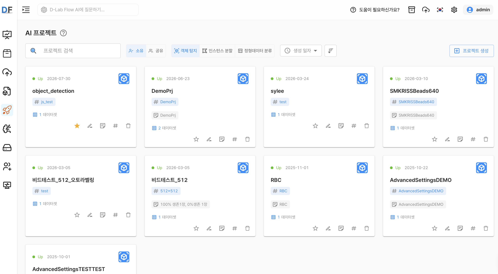
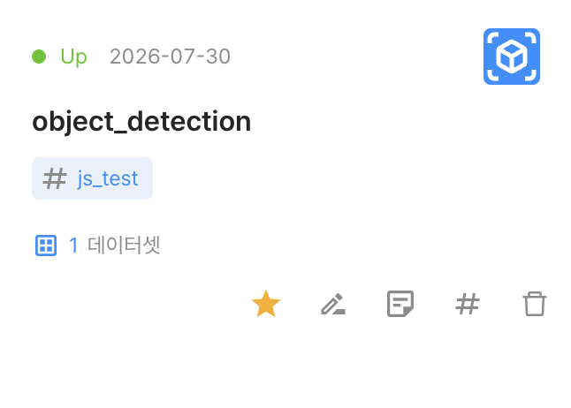
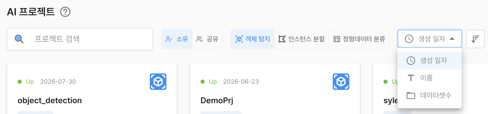

# AI 프로젝트

AI 프로젝트는 데이터셋과 학습 알고리즘을 조합하여 AI 모델을 학습하고, 학습 결과를 확인하는 기능입니다. D-Lab Flow의 핵심 기능으로, 프로젝트 유형에 따라 사용할 수 있는 데이터셋과 학습 설정이 달라집니다.

사용자는 프로젝트를 생성한 후 데이터셋과 알고리즘을 선택하여 모델을 학습할 수 있습니다. 학습이 완료되면 평가 지표를 통해 모델의 성능을 확인할 수 있습니다.

## AI 프로젝트 유형

AI 프로젝트는 데이터셋 유형과 학습 목적에 따라 구분됩니다. D-Lab Flow에서는 정형 데이터와 비정형 이미지 데이터를 기반으로 다음 프로젝트 유형을 제공합니다.

| 프로젝트 유형 | 설명 | 필요한 데이터셋 |
|---|---|---|
| 객체 탐지 | 이미지에서 객체의 종류와 위치를 식별하는 모델을 학습합니다. | 비정형 이미지 데이터셋 |
| 인스턴스 분할 | 이미지에서 객체를 식별하고 객체별 영역을 분할하는 모델을 학습합니다. | 비정형 이미지 데이터셋 |
| 정형 데이터 분류 | 표 형태의 데이터를 기준으로 대상의 분류를 예측하는 모델을 학습합니다. | 정형 데이터셋 |

프로젝트 유형에 따라 선택할 수 있는 데이터셋이 달라집니다. 객체 탐지와 인스턴스 분할에는 `UNSTRUCTURED_IMAGE` 데이터셋이 필요하며, 정형 데이터 분류에는 `STRUCTURED_TABULAR` 데이터셋이 필요합니다.

프로젝트를 생성하거나 학습 데이터를 선택할 때는 프로젝트 유형에 맞는 데이터셋만 목록에 표시됩니다.

자세한 학습 설정과 결과 확인 방법은 다음 문서를 참고하세요.

- [AI 프로젝트 공통 사항](./2_ai_project_common.md)
- [객체 탐지 프로젝트](./3_ai_project_object_detection.md)
- [인스턴스 분할 프로젝트](./4_ai_project_segmentation_.md)
- [정형 데이터 분류 프로젝트](./5_ai_project_classification.md)

## AI 프로젝트 탐색

AI 프로젝트는 카드 형태의 목록으로 표시됩니다. 목록에서 사용자가 소유한 프로젝트와 다른 사용자로부터 공유받은 프로젝트를 확인할 수 있습니다.

  
  
그림 1. AI 프로젝트 목록 화면

각 프로젝트 카드는 다음과 같은 기본 정보를 제공합니다.

  
  
그림 2. 프로젝트 카드에 표시되는 정보와 관리 기능

- 프로젝트 유형
- 이름
- 생성일
- 해시태그
- 메모
- 선택한 데이터셋 개수

각 카드 하단에서는 프로젝트 정보를 관리할 수 있습니다.

- 즐겨찾기
- 이름 변경
- 메모 변경
- 해시태그 변경
- 프로젝트 삭제

원하는 프로젝트를 찾기 위해 다음 기능을 사용할 수 있습니다.

  
  
그림 3. AI 프로젝트 검색, 필터 및 정렬 기능

- 검색
- 정렬: 생성일, 이름, 데이터셋 개수
- 프로젝트 유형별 필터
- 소유 또는 공유 상태별 필터
- 즐겨찾기

## 프로젝트 생성

우측 상단의 `프로젝트 생성` 버튼을 선택하면 AI 프로젝트를 생성할 수 있습니다.

프로젝트를 생성하려면 기본 정보를 입력하고 프로젝트 유형을 선택해야 합니다. 프로젝트 유형에 따라 학습에 사용할 수 있는 데이터셋과 이후의 학습 설정이 결정됩니다.

프로젝트 생성 과정은 다음과 같습니다.

- `프로젝트 생성` 버튼 선택
- 프로젝트 기본 정보 입력
- 프로젝트 유형 선택
- 프로젝트 생성 완료

프로젝트가 생성되면 프로젝트 상세 화면에서 데이터셋을 선택하고, 프로젝트 유형에 맞는 학습 설정을 진행할 수 있습니다. 공통 설정은 [AI 프로젝트 공통 사항](./2_ai_project_common.md)을 참고하세요.
