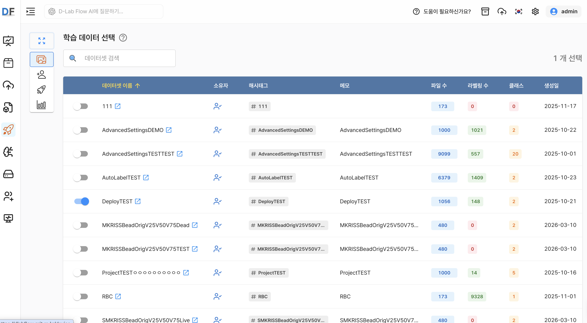
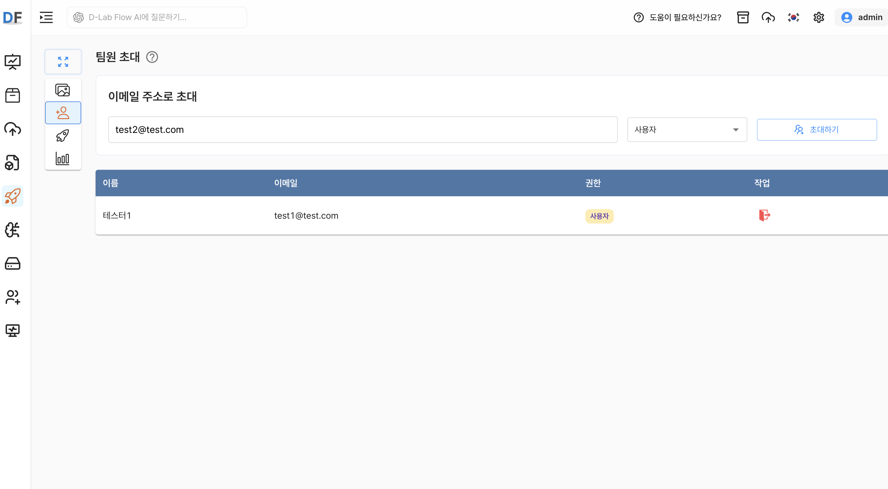

# AI 프로젝트 공통 사항

이 문서에서는 객체 탐지, 인스턴스 분할, 정형 데이터 분류 프로젝트에서 공통으로 사용하는 데이터 선택, 팀원 관리, 버전 관리 기능을 설명합니다.

AI 프로젝트를 생성한 후에는 학습에 사용할 데이터를 선택하고, 필요한 경우 팀원을 초대할 수 있습니다. 선택한 데이터와 학습 설정을 바탕으로 버전을 생성하면 모델 학습을 진행할 수 있습니다.

## 학습 데이터 선택

버전을 생성하기 전에 `학습 데이터 선택` 화면에서 모델 학습에 사용할 데이터셋을 선택합니다.

프로젝트 유형에 따라 선택할 수 있는 데이터셋의 종류가 달라집니다.

| 프로젝트 유형 | 선택 가능한 데이터셋 |
|---|---|
| 객체 탐지 | 비정형 이미지 데이터셋 |
| 인스턴스 분할 | 비정형 이미지 데이터셋 |
| 정형 데이터 분류 | 정형 데이터셋 |

`학습 데이터 선택` 화면에는 프로젝트 유형에 맞는 데이터셋만 표시됩니다. 데이터셋을 검색하거나 목록의 정렬 기준을 선택하여 원하는 데이터셋을 찾을 수 있습니다.

각 데이터셋에는 데이터셋 이름, 소유자, 해시태그, 메모, 생성일과 함께 프로젝트 유형에 따른 데이터 규모 정보가 표시됩니다.

| 데이터셋 유형 | 표시되는 주요 규모 정보 |
|:---:|---|
| 비정형 이미지 데이터셋 | 파일 수, 라벨링 수, 클래스 수 |
| 정형 데이터셋 | 파일 수, 행(Row) 개수, 열(Column) 개수 |

데이터셋 왼쪽의 토글 스위치를 켜면 해당 데이터셋이 학습 데이터로 선택됩니다. 선택된 데이터셋은 화면 우측 상단의 선택 개수에서 확인할 수 있으며, 토글 스위치를 끄면 선택에서 제외됩니다.

버전 생성 시 선택한 데이터셋의 파일과 설정이 학습에 사용되므로, 학습 목적과 프로젝트 유형에 맞는 데이터셋을 선택해야 합니다.

## 팀원 초대

`팀원 초대`에서는 AI 프로젝트의 학습 결과를 확인하거나 프로젝트를 활용할 사용자를 관리할 수 있습니다. 프로젝트를 공유하면 초대된 팀원은 부여된 권한 범위에서 프로젝트에 접근할 수 있습니다.

프로젝트의 데이터셋 소유자만 팀원을 초대할 수 있습니다. 초대할 사용자의 시스템 등록 이메일 주소를 입력하고 `권한`을 선택한 다음 `초대하기` 버튼을 선택합니다.

현재 화면에서는 초대 대상의 권한으로 `사용자`를 선택할 수 있습니다. 사용자 권한은 프로젝트의 학습 결과를 확인하고 모델 평가 기능을 활용할 수 있는 권한입니다.

초대된 팀원은 팀원 목록에서 다음 정보를 확인할 수 있습니다.

- 이름
- 이메일
- 권한
- 작업

초대된 팀원은 `작업` 열의 나가기 아이콘을 통해 공유받은 프로젝트에서 나갈 수 있습니다. 공유받은 프로젝트에서는 데이터셋 선택, 팀원 초대, 모델 학습 기능이 제한될 수 있으며, 권한에 따라 학습 결과와 모델 평가 기능을 사용할 수 있습니다.

## 모델 학습과 버전 관리

`모델 학습`에서는 해당 프로젝트에서 생성한 버전과 학습 진행 상태를 확인할 수 있습니다. 각 버전은 선택한 데이터셋과 학습 설정을 기준으로 생성되는 하나의 학습 이력입니다.

모델 학습은 일반적으로 다음 순서로 진행됩니다.

1. 학습 데이터 선택
2. 버전 생성
3. 데이터 전처리
4. 하이퍼파라미터 설정
5. 모델 학습 시작
6. 학습 결과 및 평가 지표 확인

프로젝트에 생성된 버전이 없는 경우, 버전을 생성할 수 있는 안내 화면이 표시됩니다. 버전이 생성되면 왼쪽에 버전 목록이 표시되고, 각 버전의 학습 상태를 확인할 수 있습니다.

버전을 선택하면 오른쪽에 해당 버전의 상세 정보가 표시됩니다. 버전의 상태는 학습 과정에 따라 다음과 같이 변경됩니다.

| 상태 | 설명 |
|---|---|
| 데이터 전처리 중 | 선택한 데이터를 학습에 사용할 수 있는 형태로 전처리합니다. |
| 학습 준비 | 데이터 전처리가 완료되어 모델 학습을 시작할 수 있는 상태입니다. |
| 학습 인프라 구성 중 | 모델 학습에 필요한 실행 환경을 준비합니다. |
| 학습 중 | 모델 학습이 진행되는 상태이며 화면에서 진행 상태를 확인할 수 있습니다. |
| 학습 완료 | 학습 결과와 평가 지표를 확인할 수 있는 상태입니다. |

프로젝트 유형별 학습 설정은 다음 문서를 참고하세요.

- [객체 탐지 프로젝트](./3_ai_project_object_detection.md)
- [인스턴스 분할 프로젝트](./4_ai_project_segmentation_.md)
- [정형 데이터 분류 프로젝트](./5_ai_project_classification.md)
