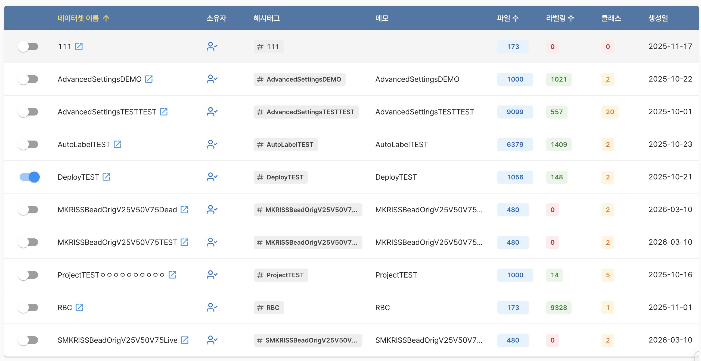
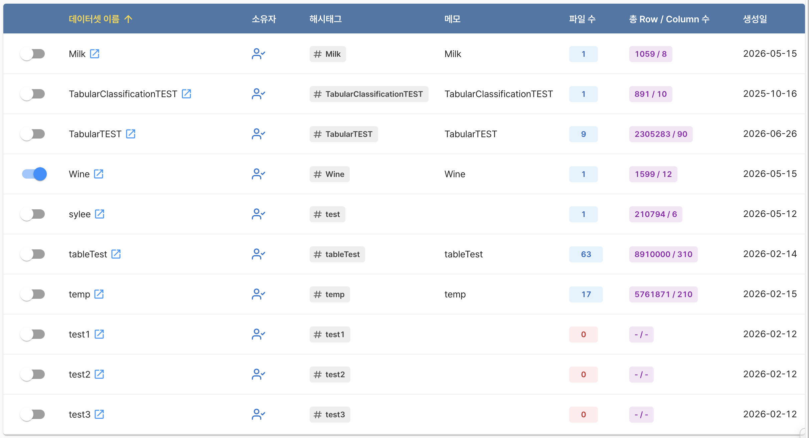

# AI 프로젝트 공통 사항

이 문서에서는 객체 탐지, 인스턴스 분할, 정형 데이터 분류 프로젝트에서 공통으로 사용하는 데이터 선택, 팀원 관리, 버전 관리 기능을 설명합니다.

## 학습 데이터 선택

버전을 생성하기 전에 `학습 데이터 선택` 화면에서 모델 학습에 사용할 데이터셋을 선택합니다.

프로젝트 유형에 따라 선택할 수 있는 데이터셋의 종류가 달라집니다.

| 프로젝트 유형 | 선택 가능한 데이터셋 |
|---|---|
| 객체 탐지 | 비정형 이미지 데이터셋 |
| 인스턴스 분할 | 비정형 이미지 데이터셋 |
| 정형 데이터 분류 | 정형 데이터셋 |

:::info 프로젝트 유형에 따른 데이터셋 표기
학습 데이터를 선택할 때는 프로젝트 유형에 맞는 데이터셋만 목록에 표시됩니다.
:::

각 데이터셋에는 데이터셋 이름, 소유자, 해시태그, 메모, 생성일과 함께 프로젝트 유형에 따른 데이터 규모 정보가 표시됩니다.

|                  비정형 이미지 데이터셋                  | 정형 데이터셋                                           |
|:--------------------------------------------------------:|---------------------------------------------------------|
|              파일 수, 라벨링 수, 클래스 수               | 파일 수, 행(Row) 개수, 열(Column) 개수                  |
|  |  |

:::tip 데이터셋 선택 및 사용
데이터셋 왼쪽의 토글 스위치를 켜면 해당 데이터셋이 학습 데이터로 선택됩니다.

토글 스위치를 끄면 선택에서 제외됩니다.

버전 생성 시 선택한 데이터셋의 파일과 설정이 학습에 사용되므로, 학습 목적과 프로젝트 유형에 맞는 데이터셋을 선택해야 합니다.
:::

## 팀원 초대

`팀원 초대`에서는 AI 프로젝트의 학습 결과를 확인하거나 프로젝트를 활용할 사용자를 관리할 수 있습니다. 

프로젝트를 공유하면 초대된 팀원은 부여된 권한 범위에서 프로젝트에 접근할 수 있습니다.

프로젝트 소유자만 팀원을 초대할 수 있습니다. 초대할 사용자의 시스템 등록 이메일 주소를 입력하고 `권한`을 선택한 다음 `초대하기` 버튼을 선택합니다.

:::info 초대된 팀원은 팀원 목록에서 다음 정보를 확인할 수 있습니다.
- 이름
- 이메일
- 권한
:::

초대된 팀원은 나가기 아이콘을 통해 공유받은 프로젝트에서 나갈 수 있습니다.

## 모델 학습과 버전 관리

`모델 학습`에서는 해당 프로젝트에서 생성한 버전과 학습 진행 상태를 확인할 수 있습니다. 각 버전은 선택한 데이터셋과 학습 설정을 기준으로 생성되는 하나의 학습 이력입니다.

:::info 모델 학습은 일반적으로 다음 순서로 진행됩니다.
1. 버전 생성
2. 데이터 전처리
3. 하이퍼파라미터 설정
4. 모델 학습 시작
5. 학습 결과 및 평가 지표 확인
:::

:::tip 
프로젝트에 생성된 버전이 없는 경우, 버전을 생성할 수 있는 안내 화면이 표시됩니다. 
:::

### 버전 상태 값 및 설명

| 상태                | 설명                                                                   |
|---------------------|------------------------------------------------------------------------|
| 데이터 전처리 중    | 선택한 데이터를 학습에 사용할 수 있는 형태로 전처리합니다.             |
| 학습 준비           | 데이터 전처리가 완료되어 모델 학습을 시작할 수 있는 상태입니다.        |
| 학습 인프라 구성 중 | 모델 학습에 필요한 실행 환경을 준비합니다.                             |
| 학습 중             | 모델 학습이 진행되는 상태이며 화면에서 진행 상태를 확인할 수 있습니다. |
| 학습 완료           | 학습 결과와 평가 지표를 확인할 수 있는 상태입니다.                     |

프로젝트 유형별 학습 설정은 다음 문서를 참고하세요.

- [객체 탐지 프로젝트](./3_ai_project_object_detection.md)
- [인스턴스 분할 프로젝트](./4_ai_project_segmentation.md)
- [정형 데이터 분류 프로젝트](./5_ai_project_classification.md)
