# AI 프로젝트 (객체 탐지)

이미지에서 객체의 종류와 위치를 식별하는 딥러닝 모델을 학습합니다. 예를 들어 이미지 안의 사람, 차량, 제품과 같은 여러 객체를 찾아 객체의 클래스와 위치를 예측할 수 있습니다.

`모델 훈련` 화면의 기본 구성은 아래와 같습니다.

왼쪽에서 전처리 또는 학습이 완료된 버전 목록을 확인할 수 있으며, 버전을 선택하면 오른쪽에 해당 버전의 설정과 결과가 표시됩니다.

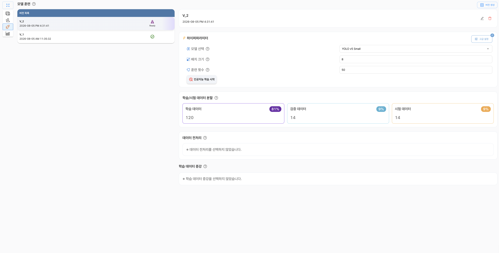

## 버전 생성

버전 생성은 선택한 데이터셋과 학습 설정을 바탕으로 모델 학습을 준비하는 과정입니다. 버전을 생성하면 학습에 사용할 파일이 학습 공간으로 이동하고, 설정한 데이터 전처리와 데이터 증강이 함께 적용됩니다.

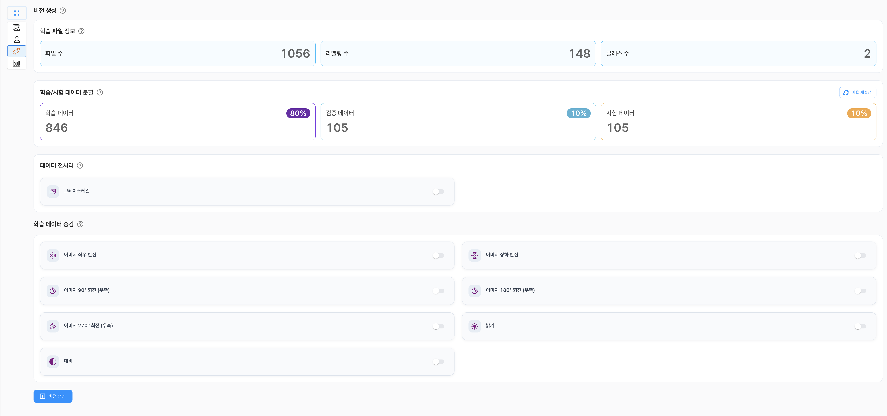

버전 생성 전에 다음 항목을 확인하고 설정할 수 있습니다.

- 학습 파일 정보
- 학습·검증·시험 데이터 분할
- 데이터 전처리
- 학습 데이터 증강

### 학습 파일 정보

| 구분 | 내용                                                                                   |
|:---:|----------------------------------------------------------------------------------------|
| **파일 수** | 선택한 데이터셋에 포함된 파일 수입니다. 실제 학습에 사용할 수 있는 파일 수와는 다를 수 있습니다. |
| **라벨링 수** | 선택한 데이터셋에 포함된 객체 라벨링의 수입니다. |
| **클래스 수** | 선택한 데이터셋에 포함된 객체 클래스의 수입니다. |

학습 파일 정보는 프로젝트에서 사용할 데이터셋의 규모와 라벨링 상태를 확인하기 위한 참고 정보입니다. 실제 학습에 사용되는 파일 수는 데이터 형식이나 라벨링 상태에 따라 달라질 수 있습니다.

### 학습·검증·시험 데이터 분할

학습에 사용할 데이터를 학습 데이터, 검증 데이터, 시험 데이터로 나누어 사용합니다.

| 구분 | 내용 |
|:---:|---|
| **학습 데이터** | 모델의 가중치를 학습하는 데 사용하는 데이터입니다. |
| **검증 데이터** | 학습 중 모델의 성능을 확인하고 설정을 조정하는 데 사용하는 데이터입니다. |
| **시험 데이터** | 학습이 완료된 모델의 최종 성능을 평가하는 데 사용하는 데이터입니다. |

`비율 재설정`을 선택하면 각 데이터에 할당할 비율을 조정할 수 있습니다. 데이터 분할 비율은 모델의 학습과 평가 결과에 영향을 줄 수 있으므로 데이터의 양과 목적을 고려하여 설정해야 합니다.

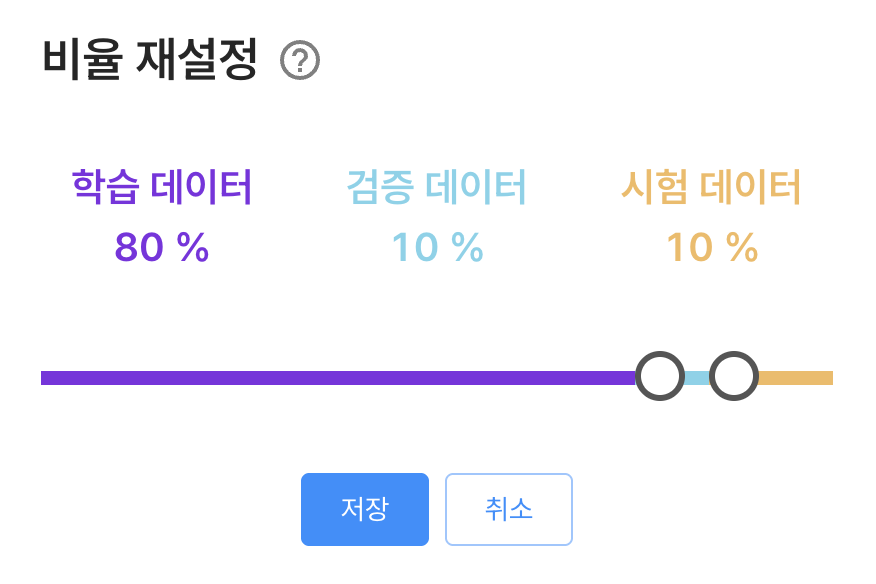

### 데이터 전처리

데이터 전처리는 학습 전에 이미지의 형식이나 특성을 조정하는 과정입니다. 전처리를 통해 데이터의 입력 형식을 맞추고 모델이 학습하기 좋은 형태로 데이터를 준비할 수 있습니다.

- **그레이스케일**: 컬러 이미지를 명암 정보로 변환합니다. 색상 정보가 중요하지 않은 경우 입력 정보를 단순화할 수 있지만, 색상에 따라 객체를 구분해야 하는 데이터에서는 신중하게 사용해야 합니다.

### 학습 데이터 증강

데이터 증강(Data Augmentation)은 원본 이미지에 변형을 적용하여 학습 데이터의 다양성을 높이는 기능입니다. 다양한 변형 이미지를 학습하면 특정 각도, 밝기 또는 방향에 과도하게 맞춰지는 것을 줄이고 모델의 일반화 성능을 높이는 데 도움이 될 수 있습니다.

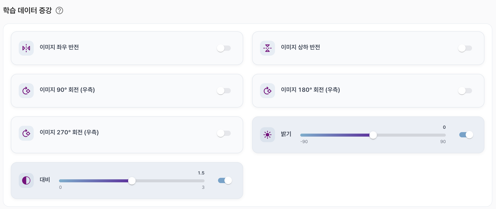

제공되는 데이터 증강 항목은 다음과 같습니다.

- **이미지 좌우 반전**: 이미지를 좌우로 뒤집습니다.
- **이미지 상하 반전**: 이미지를 상하로 뒤집습니다.
- **이미지 90° 회전(우측)**: 이미지를 시계 방향으로 90도 회전합니다.
- **이미지 180° 회전(우측)**: 이미지를 시계 방향으로 180도 회전합니다.
- **이미지 270° 회전(우측)**: 이미지를 시계 방향으로 270도 회전합니다.
- **밝기**: 이미지의 밝기를 조정합니다. 설정 범위는 `-90 ~ 90`입니다.
- **대비**: 이미지의 명암 대비를 조정합니다. 설정 범위는 `0.0 ~ 3.0`입니다.

데이터의 실제 촬영 환경과 관계없는 변형을 과도하게 적용하면 오히려 학습 성능이 떨어질 수 있으므로, 데이터 특성에 맞는 항목을 선택해야 합니다.

## 인공지능 학습

버전 생성이 완료되면 하이퍼파라미터를 설정하고 모델 학습을 시작할 수 있습니다.

### 하이퍼파라미터

| 구분 | 내용 |
|:---:|---|
| **모델 선택** | 객체 탐지 학습에 사용할 모델을 선택합니다. |
| **배치 크기** | 한 번의 학습 단계에서 함께 처리할 이미지 수를 설정합니다. |
| **학습 횟수** | 전체 학습 데이터를 반복해서 학습할 횟수(Epoch)를 설정합니다. |

#### 모델 목록

| 모델 | 내용 |
|:---:|---|
| **YOLO v5** | 널리 사용되는 YOLO 계열 모델로, 기존 학습 사례와 참고 자료가 많아 기본적인 객체 탐지 실험에 적합합니다. |
| **YOLO v8** | 객체 탐지 작업에서 널리 활용되는 모델로, 다양한 데이터셋과 학습 설정을 시험하기에 적합합니다. |
| **YOLO v10** | 실시간 객체 탐지를 고려한 YOLO 계열 모델로, 추론 속도와 탐지 성능의 균형을 확인할 때 사용할 수 있습니다. |
| **YOLO v11** | 객체 탐지 성능과 모델 효율을 함께 고려할 수 있는 최신 YOLO 계열 모델 중 하나입니다. |
| **YOLO v12** | 최신 YOLO 계열의 학습 구조를 사용하는 모델로, 새로운 학습 구조를 적용한 객체 탐지 결과를 비교할 때 사용할 수 있습니다. |
| **YOLO v26** | 최신 객체 탐지 학습 구조를 사용하는 모델로, 최신 환경에서의 탐지 성능과 추론 방식을 확인할 때 사용할 수 있습니다. |

### 하이퍼파라미터 고급 설정

#### 학습 이미지 크기

모델 학습에 사용할 이미지의 입력 크기를 선택합니다. 이미지 크기가 클수록 작은 객체의 특징을 학습하는 데 유리할 수 있지만, 학습 시간과 메모리 사용량이 증가할 수 있습니다.

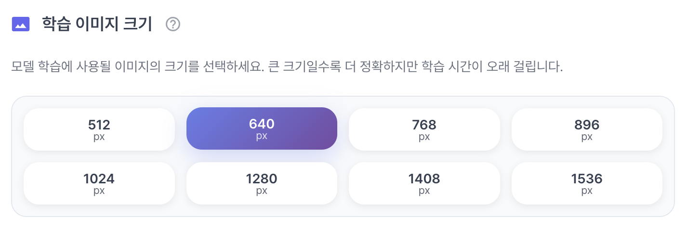

#### 최적화 알고리즘

최적화 알고리즘은 학습 과정에서 모델의 가중치를 업데이트하는 방법을 결정합니다. 데이터와 모델에 따라 적합한 알고리즘이 다를 수 있으므로, 기본 설정으로 학습한 결과를 기준으로 조정하는 것이 좋습니다.

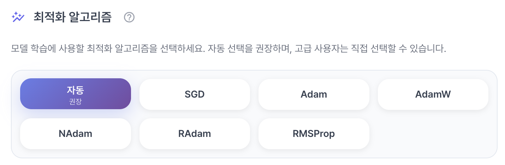

| 알고리즘 | 설명 |
|:---:|---|
| **SGD** | 현재 기울기를 기반으로 가중치를 업데이트하는 기본적인 최적화 알고리즘입니다. |
| **Adam** | 각 파라미터의 기울기와 변화량을 함께 고려하여 학습률을 조정합니다. |
| **AdamW** | Adam에 가중치 감소를 분리하여 적용하는 알고리즘입니다. |
| **NAdam** | Adam에 모멘텀 조정 방식을 결합한 알고리즘입니다. |
| **RAdam** | 학습 초기에 학습률이 불안정해지는 문제를 줄이도록 조정한 Adam 계열 알고리즘입니다. |
| **RMSProp** | 기울기의 이동 평균을 이용하여 파라미터별 학습률을 조정합니다. |

##### 주요 용어

최적화 알고리즘을 이해하기 위해 자주 사용되는 용어는 다음과 같습니다.

- **가중치(Weight)**: 입력 데이터의 특징이 결과에 얼마나 영향을 줄지 나타내는 모델의 내부 값입니다. 모델은 학습 과정에서 가중치를 조금씩 조정합니다.
- **파라미터(Parameter)**: 모델이 학습을 통해 자동으로 조정하는 값을 의미합니다. 가중치는 대표적인 파라미터입니다.
- **기울기(Gradient)**: 현재 모델의 예측이 정답과 얼마나 다른지에 따라 가중치를 어느 방향으로 얼마나 조정해야 하는지 나타내는 값입니다.
- **학습률(Learning Rate)**: 기울기를 반영하여 가중치를 한 번에 얼마나 변경할지 결정하는 값입니다. 너무 크면 학습이 불안정해질 수 있고, 너무 작으면 학습이 오래 걸릴 수 있습니다.
- **모멘텀(Momentum)**: 이전 학습 단계에서 계산된 변경 방향을 일부 기억하여, 가중치가 일정한 방향으로 더 안정적으로 이동하도록 돕는 방식입니다.
- **이동 평균(Moving Average)**: 최근 여러 학습 단계의 값을 평균 내어 급격한 변화의 영향을 줄이는 방식입니다. RMSProp은 기울기의 이동 평균을 활용하여 파라미터별 학습률을 조정합니다.

#### 학습 최적화 기법

학습 최적화 기법은 학습 속도와 안정성, 모델의 일반화 성능을 조정하는 옵션입니다.

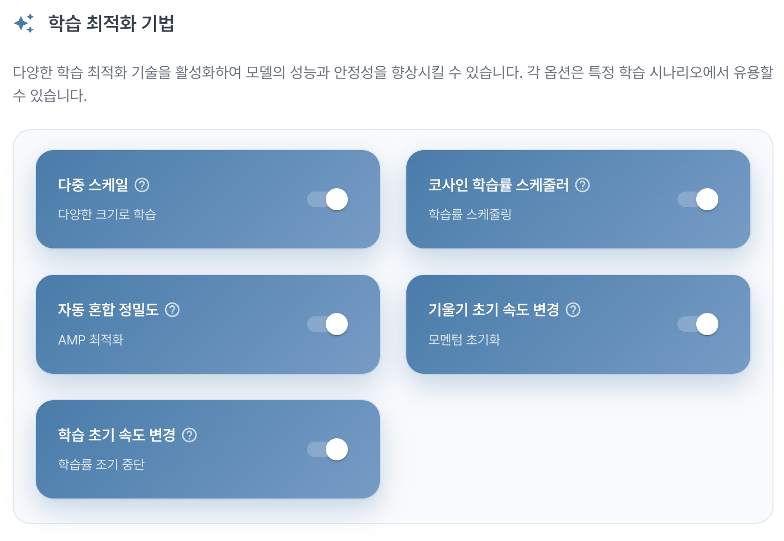

| 기법 | 설명 |
|:---:|---|
| **다중 스케일** | 다양한 크기의 입력 이미지를 사용하여 여러 크기의 객체를 탐지하도록 학습합니다. |
| **코사인 학습률 스케줄러** | 학습 진행률에 따라 학습률을 코사인 곡선 형태로 조정합니다. |
| **자동 혼합 정밀도** | 일부 연산에 낮은 정밀도를 사용하여 학습 속도와 메모리 효율을 개선합니다. |
| **기울기 초기 속도 변경** | 학습 초기 단계의 기울기 적용 속도를 조정합니다. |
| **학습 초기 속도 변경** | 학습 초기에 적용되는 학습률의 변화 방식을 조정합니다. |

#### 학습률 설정

학습률은 모델의 가중치를 업데이트하는 정도를 결정하는 값입니다. 너무 크면 학습이 불안정해질 수 있고, 너무 작으면 학습 시간이 길어질 수 있습니다. 학습 과정에서는 현재 예측과 정답의 차이를 바탕으로 기울기를 계산하고, 학습률을 적용하여 가중치를 조정합니다.

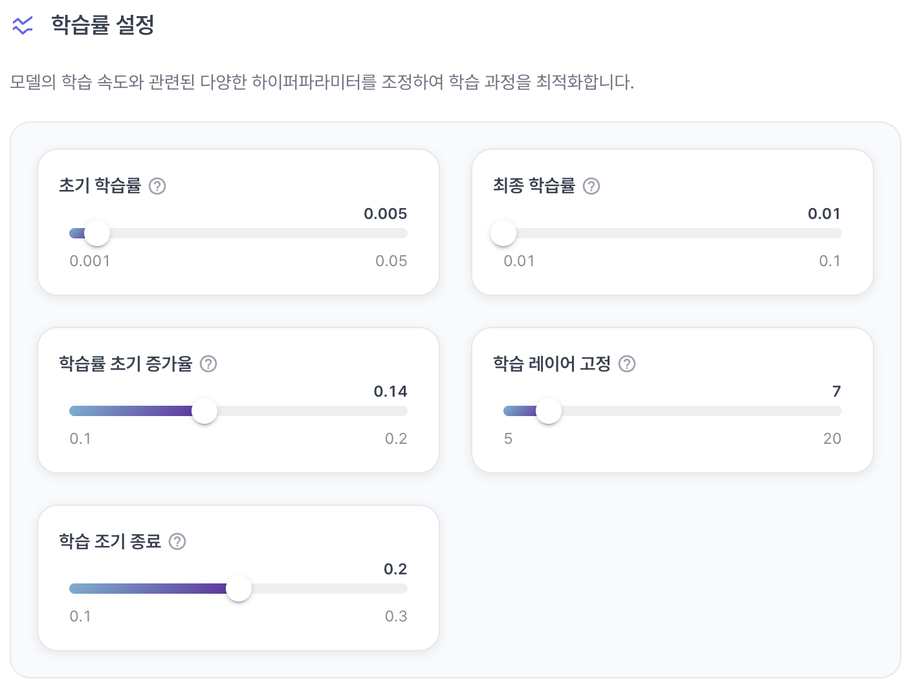

| 항목 | 설명 | 설정 유형 |
|:---:|---|:---:|
| **초기 학습률** | 학습 시작 시 적용할 학습률입니다. | 수치 |
| **최종 학습률** | 학습 종료 시점에 적용할 학습률입니다. | 수치 |
| **학습률 초기 증가율** | 학습 초기에 학습률을 증가시키는 비율입니다. | 비율 |
| **학습 레이어 고정** | 선택한 레이어의 가중치를 고정하여 해당 레이어를 업데이트하지 않습니다. | 선택 또는 수치 |
| **학습 조기 종료** | 일정 조건을 만족하면 학습을 중단하여 불필요한 학습과 과적합을 줄입니다. | 선택 또는 수치 |

#### 정규화 및 데이터 증강

정규화와 데이터 증강 관련 옵션을 설정하여 모델의 일반화 성능을 높이고 과적합을 줄일 수 있습니다. 일반화 성능은 학습에 사용하지 않은 새로운 이미지에서도 객체를 잘 탐지하는 능력을 의미합니다. 과적합은 모델이 학습 데이터의 특징을 지나치게 외워 새로운 데이터에 대한 탐지 성능이 떨어지는 현상입니다.

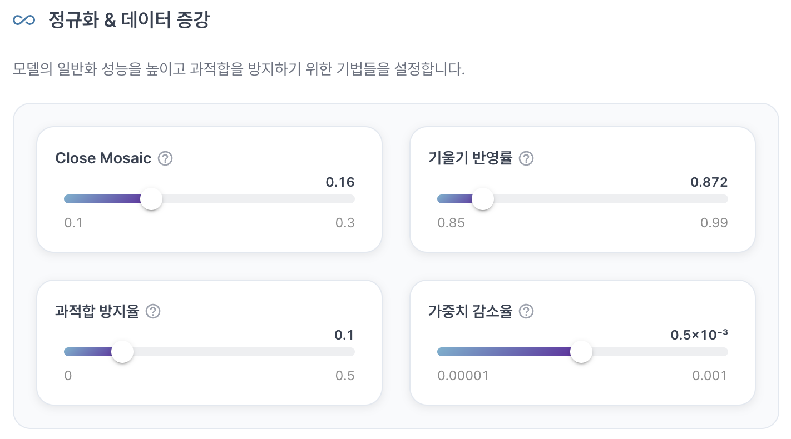

| 구분 | 설명 | 설정 유형 |
|:---:|---|:---:|
| **Close Mosaic** | 학습 후반부에 Mosaic 증강을 종료할 시점을 설정합니다. | 수치 |
| **기울기 반영률** | 학습 과정에서 계산된 기울기를 가중치에 반영하는 정도를 설정합니다. | 비율 |
| **과적합 방지율** | 학습 데이터에 과도하게 맞춰지는 것을 줄이기 위한 비율을 설정합니다. | 비율 |
| **가중치 감소율** | 가중치가 지나치게 커지는 것을 방지하기 위해 감소를 적용하는 비율입니다. | 비율 |

#### 손실 함수 설정

손실 함수(Loss Function)는 모델의 예측과 정답의 차이를 수치로 나타내는 기준입니다. 손실 값이 작을수록 모델의 예측이 정답에 가깝다는 의미입니다. 손실 함수별 가중치를 조정하여 객체 위치와 클래스 분류 중 어느 항목에 더 큰 비중을 둘지 설정할 수 있습니다.

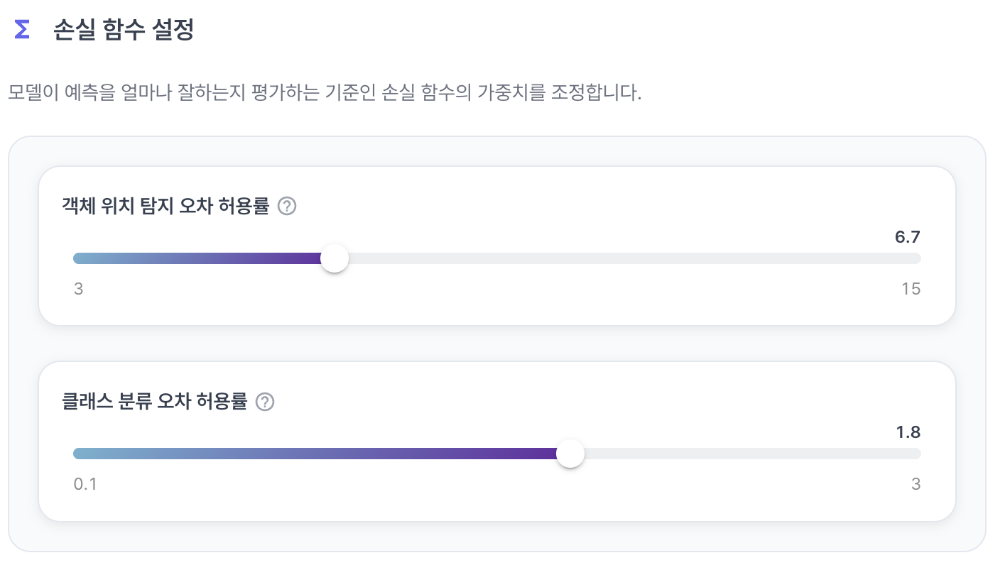

| 구분 | 설명 | 설정 유형 |
|:---:|---|:---:|
| **객체 위치 탐지 오차 허용률** | 예측한 객체 위치와 실제 위치의 차이를 계산하는 손실에 적용할 가중치입니다. | 수치 |
| **클래스 분류 오차 허용률** | 예측한 객체 클래스와 실제 클래스의 차이를 계산하는 손실에 적용할 가중치입니다. | 수치 |

## 학습 결과

모델 학습이 완료되면 학습 결과 화면에서 평가 지표와 추가 분석 정보를 확인할 수 있습니다.

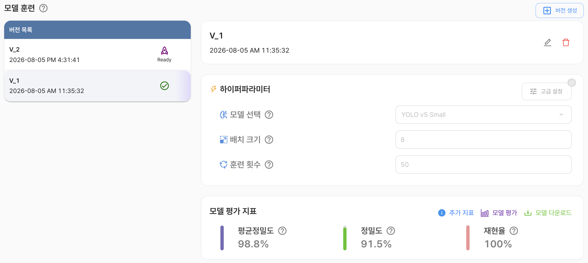

### 모델 평가 지표

| 구분 | 내용 |
|:---:|---|
| **평균 정밀도(mAP)** | 클래스별 평균 정밀도(AP)를 평균화한 지표입니다. 객체의 위치와 클래스를 얼마나 정확하게 탐지하는지 종합적으로 확인할 수 있습니다. |
| **정밀도(Precision)** | 모델이 객체라고 예측한 항목 중 실제 객체인 항목의 비율입니다. 높을수록 잘못된 탐지를 적게 수행했다는 의미입니다. |
| **재현율(Recall)** | 실제 객체 중 모델이 올바르게 탐지한 객체의 비율입니다. 높을수록 실제 객체를 놓치지 않고 탐지했다는 의미입니다. |

### 추가 지표

`추가 지표`에서는 검증 데이터 추론 결과와 학습 과정의 성능 차트를 확인할 수 있습니다.

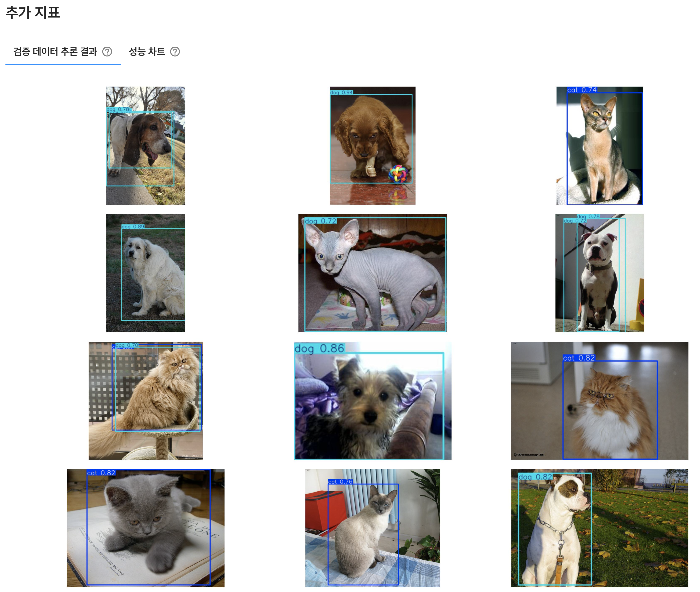

|           구분            | 내용                                                                                                                             |
|:-------------------------:|----------------------------------------------------------------------------------------------------------------------------------|
| **검증 데이터 추론 결과** | 검증 데이터에 모델을 적용한 결과를 확인합니다. 예측한 객체의 위치, 클래스, 신뢰도 등을 통해 탐지 결과를 직접 검토할 수 있습니다. |
|       **성능 차트**       | 학습 과정에서 계산된 손실과 평가 지표의 변화를 차트로 확인합니다.                                                                |

### 성능 차트

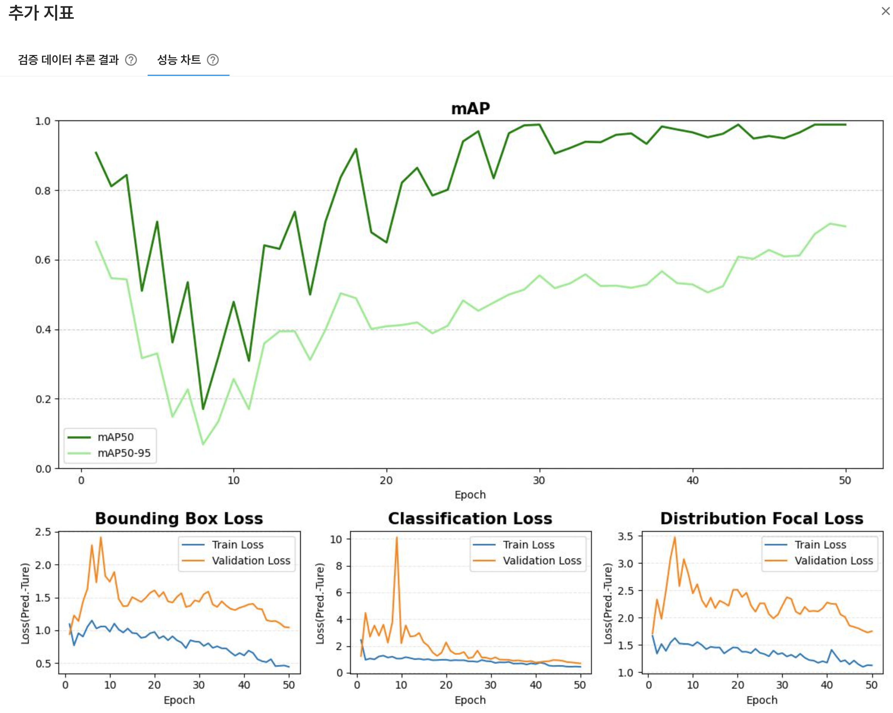

- **mAP**: 객체의 위치와 클래스 예측을 종합하여 모델의 탐지 성능을 나타내는 지표입니다. 일반적으로 값이 높을수록 성능이 좋습니다.
- **Bounding Box Loss**: 예측한 객체 위치와 실제 객체 위치의 차이를 나타내는 손실입니다. 일반적으로 값이 낮을수록 위치 예측 오차가 작습니다.
- **Classification Loss**: 예측한 객체 클래스와 실제 클래스의 차이를 나타내는 손실입니다. 일반적으로 값이 낮을수록 클래스 분류 오차가 작습니다.
- **Distribution Focal Loss**: 객체 위치를 더 정밀하게 예측하기 위한 손실 항목입니다. 일반적으로 값이 낮을수록 위치 분포 예측 오차가 작습니다.

### 모델 평가

학습이 완료된 모델은 모델 평가 기능을 통해 새로운 이미지에 적용하고 추론 결과를 확인할 수 있습니다. 실제 사용 환경이 충분히 반영된 이미지를 사용해야 평가 결과를 실제 성능에 가깝게 해석할 수 있습니다.

### 모델 다운로드

학습이 완료된 모델은 필요한 실행 환경에 맞는 형식으로 다운로드할 수 있습니다.

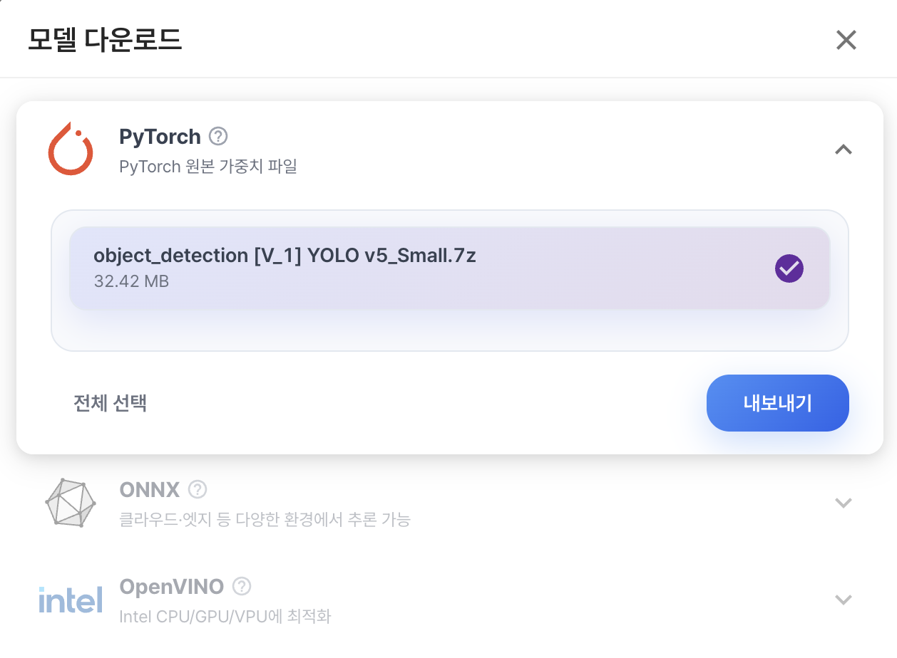

| 실행 형식 | 설명 |
|:---:|---|
| **PyTorch** | PyTorch에서 학습한 모델을 저장하고 PyTorch 환경에서 학습을 이어가거나 추론할 때 사용하는 형식입니다. |
| **ONNX** | 모델 구조와 가중치를 표준 형식으로 저장하여, PyTorch를 비롯한 다양한 딥러닝 프레임워크와 추론 엔진에서 사용할 수 있는 교환 형식입니다. |
| **OpenVINO** | ONNX 모델을 OpenVINO 추론 엔진에 맞게 변환한 형식으로, Intel CPU·GPU·VPU 등 지원되는 하드웨어에서 효율적으로 추론할 수 있습니다. |

#### ONNX 세부 설정

ONNX 형식으로 변환할 때 모델 입력과 연산 방식을 설정할 수 있습니다.

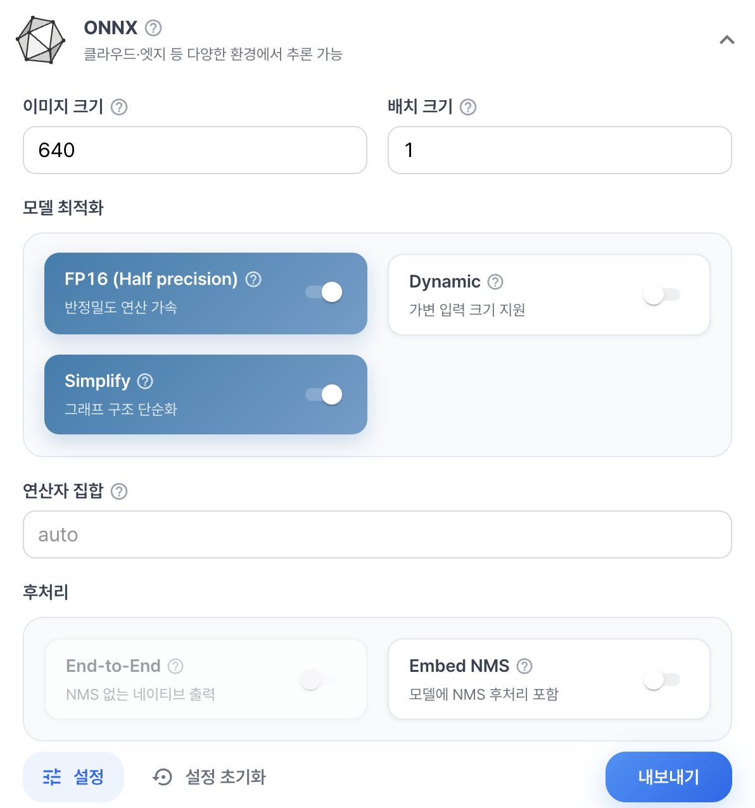

| 항목 | 설명 |
|:---:|---|
| **이미지 크기** | 모델 입력 이미지의 크기를 설정합니다. |
| **배치 크기** | 한 번에 처리할 이미지 수를 설정합니다. |
| **FP16(Half precision)** | 16비트 부동소수점 형식을 사용하여 모델 크기와 메모리 사용량을 줄일 수 있습니다. 대상 추론 환경이 FP16을 지원하는지 확인해야 합니다. |
| **Dynamic** | 입력 이미지 크기나 배치 크기를 고정하지 않고 동적으로 처리할 수 있도록 설정합니다. |
| **Simplify** | ONNX 그래프를 단순화하여 추론 과정의 호환성과 효율을 개선합니다. |
| **연산자 집합** | ONNX 모델에서 사용할 연산자 집합(Opset) 버전을 선택합니다. 대상 추론 환경이 지원하는 버전을 선택해야 합니다. |
| **End-to-End** | 전처리와 후처리를 포함한 형태로 모델을 내보낼지 설정합니다. |
| **Embed NMS** | 비최대 억제(NMS) 연산을 모델에 포함할지 설정합니다. |

#### OpenVINO 세부 설정

OpenVINO 형식으로 변환할 때 사용할 정밀도와 추론 방식을 설정할 수 있습니다.

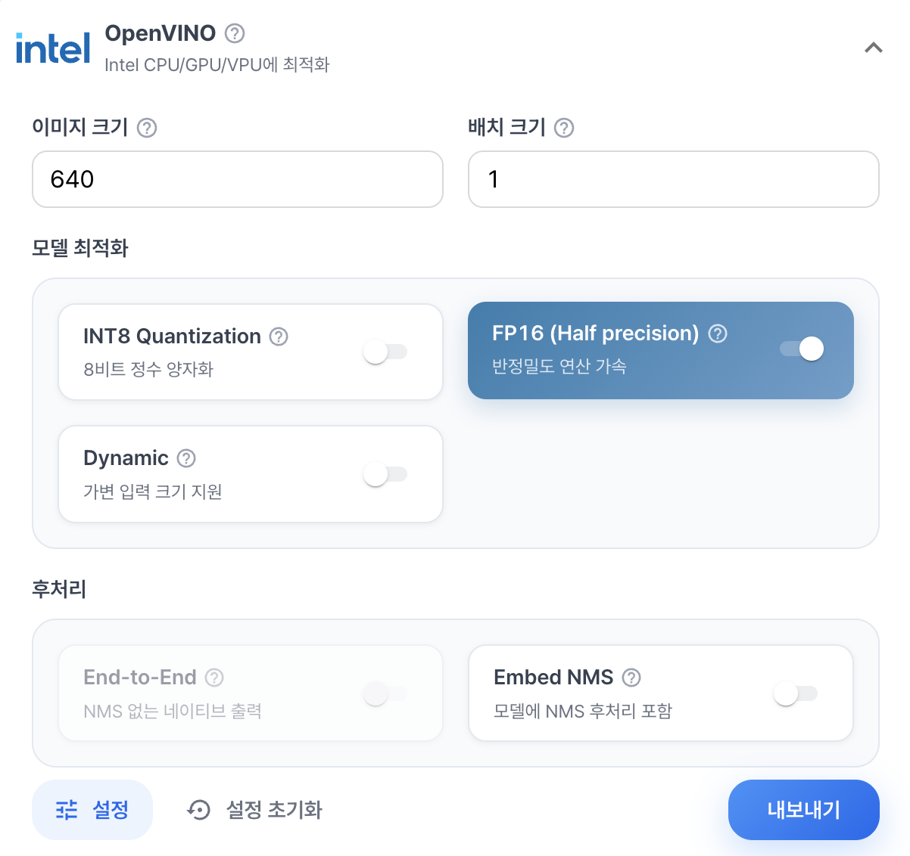

| 항목 | 설명 |
|:---:|---|
| **이미지 크기** | 모델 입력 이미지의 크기를 설정합니다. |
| **배치 크기** | 한 번에 처리할 이미지 수를 설정합니다. |
| **INT8 Quantization** | 8비트 정수 양자화를 적용하여 모델 크기와 추론 비용을 줄일 수 있습니다. 양자화로 인해 정확도가 달라질 수 있습니다. |
| **FP16(Half precision)** | 16비트 부동소수점 형식을 사용하여 모델 크기와 메모리 사용량을 줄일 수 있습니다. |
| **Dynamic** | 입력 이미지 크기나 배치 크기를 동적으로 처리할 수 있도록 설정합니다. |
| **End-to-End** | 전처리와 후처리를 포함한 형태로 모델을 내보낼지 설정합니다. |
| **Embed NMS** | 비최대 억제(NMS) 연산을 모델에 포함할지 설정합니다. |
