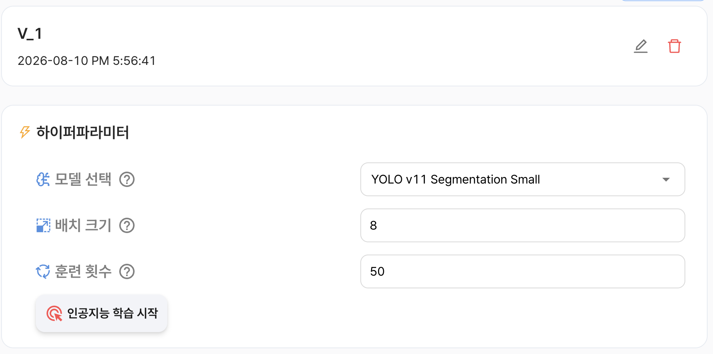

# AI 프로젝트 (인스턴스 분할)

이미지에 포함된 객체의 종류와 위치를 식별하고, 객체별 영역을 픽셀 단위의 마스크로 분할하는 딥러닝 모델을 학습합니다.

객체 탐지는 객체를 사각형 영역으로 표시하지만, 인스턴스 분할은 객체의 실제 모양에 맞춰 각 객체의 영역을 마스크로 표시합니다. 따라서 서로 겹쳐 있는 객체도 개별 객체 단위로 구분할 수 있습니다.

:::warning 학습 포인트 
본 시스템에서 `인스턴스 분할`은 `객체탐지`와 모델 구성 및 하이퍼파라미터의 고급설정 기능을 제외하고 동일합니다.

동일한 기능에 대한 설명은 `객체 탐지`를 참고하세요.
:::

## 인공지능 학습

버전 생성이 완료되면 하이퍼파라미터를 설정하고 모델 학습을 시작할 수 있습니다.

:::info 하이퍼파라미터

|     구분      | 내용                                                         |
|:-------------:|--------------------------------------------------------------|
| **모델 선택** | 인스턴스 분할 학습에 사용할 모델을 선택합니다.               |
| **배치 크기** | 한 번의 학습 단계에서 함께 처리할 이미지 수를 설정합니다.    |
| **훈련 횟수** | 전체 학습 데이터를 반복해서 학습할 횟수(Epoch)를 설정합니다. |

#### 모델 목록

| 모델 | 내용 |
|:---:|---|
| **YOLO v11 Segmentation** | 객체별 마스크를 생성하여 객체의 클래스와 실제 영역을 함께 예측하는 인스턴스 분할 모델입니다. |
| **YOLO v26 Segmentation** | 최신 인스턴스 분할 학습 구조를 사용하는 모델로, 객체별 마스크 생성 성능과 추론 방식을 비교할 때 사용할 수 있습니다. |

각 모델 버전은 Small, Medium, Large, XLarge 등 다양한 크기로 제공될 수 있습니다. 모델 크기가 클수록 더 많은 연산 자원과 학습 시간이 필요할 수 있으므로, 데이터의 복잡도와 필요한 분할 정확도, 사용 가능한 GPU 메모리를 함께 고려하여 선택해야 합니다.
:::

### 하이퍼파라미터 고급 설정

:::warning 하이퍼파라미터 고급설정 미지원
현재 인스턴스 분할 프로젝트에서는 고급 하이퍼파라미터 설정을 제공하지 않습니다.

모델 선택, 배치 크기, 훈련 횟수만 설정할 수 있습니다.
:::

## 학습 결과

모델 학습이 완료되면 학습 결과 화면에서 평가 지표와 추가 분석 정보를 확인할 수 있습니다.

### 모델 평가 지표

| 구분 | 내용 |
|:---:|---|
| **평균 정밀도(mAP)** | 클래스별 평균 정밀도(AP)를 평균화한 지표입니다. 객체의 클래스와 마스크 영역을 얼마나 정확하게 예측하는지 종합적으로 확인할 수 있습니다. |
| **정밀도(Precision)** | 모델이 객체로 예측한 항목 중 실제 객체에 해당하는 항목의 비율입니다. 높을수록 잘못된 객체 예측이 적다는 의미입니다. |
| **재현율(Recall)** | 실제 객체 중 모델이 올바르게 예측한 객체의 비율입니다. 높을수록 실제 객체를 놓치는 경우가 적다는 의미입니다. |

인스턴스 분할에서는 객체의 클래스뿐 아니라 예측한 마스크가 실제 객체 영역과 얼마나 겹치는지도 함께 평가합니다. 마스크는 이미지에서 객체에 해당하는 픽셀 영역을 의미합니다.

:::info 추가 지표
검증 데이터 추론 결과와 학습 과정의 성능 차트를 확인할 수 있습니다.
:::

|                                                      검증 데이터 추론 결과                                                       | 성능 차트                                                         |
|:--------------------------------------------------------------------------------------------------------------------------------:|-------------------------------------------------------------------|
| 검증 데이터에 모델을 적용한 결과를 확인합니다. 예측한 객체의 위치, 클래스, 신뢰도 등을 통해 탐지 결과를 직접 검토할 수 있습니다. | 학습 과정에서 계산된 손실과 평가 지표의 변화를 차트로 확인합니다. |
|                                                                                                     |                                      |

:::tip
- **IoU**: IoU는 예측한 객체 영역과 실제 객체 영역이 얼마나 겹치는지 나타내는 지표입니다. `IoU = 겹치는 영역의 넓이 ÷ 두 영역을 합친 전체 넓이` IoU 값은 0에서 1 사이이며, 1에 가까울수록 예측 영역과 실제 영역이 정확하게 일치한다는 의미입니다.
- **mAP50**: IoU 기준을 0.5로 설정하여 계산한 평균 정밀도입니다. 예측 마스크와 실제 마스크가 일정 수준 이상 겹치는지를 기준으로 성능을 평가합니다.
- **mAP50-95**: IoU 기준을 0.5부터 0.95까지 변경하며 계산한 평균 정밀도입니다. 여러 기준에서 마스크가 실제 영역과 얼마나 정확하게 일치하는지 확인할 수 있습니다.
- **Segmentation Loss**: 모델이 예측한 객체 마스크와 실제 마스크의 차이를 나타내는 손실입니다. 일반적으로 값이 낮을수록 객체 영역을 실제 형태에 가깝게 분할했다는 의미입니다.
- **Classification Loss**: 예측한 객체 클래스와 실제 클래스의 차이를 나타내는 손실입니다. 일반적으로 값이 낮을수록 클래스 분류 오차가 작습니다.
- **Distribution Focal Loss**: 객체 위치의 경계를 더 정밀하게 예측하기 위한 손실 항목입니다. 일반적으로 값이 낮을수록 위치 예측 오차가 작습니다.
:::