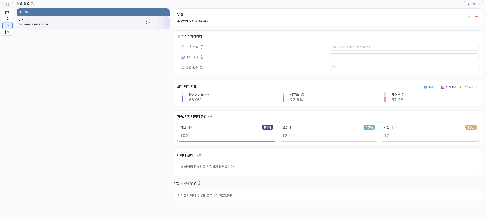
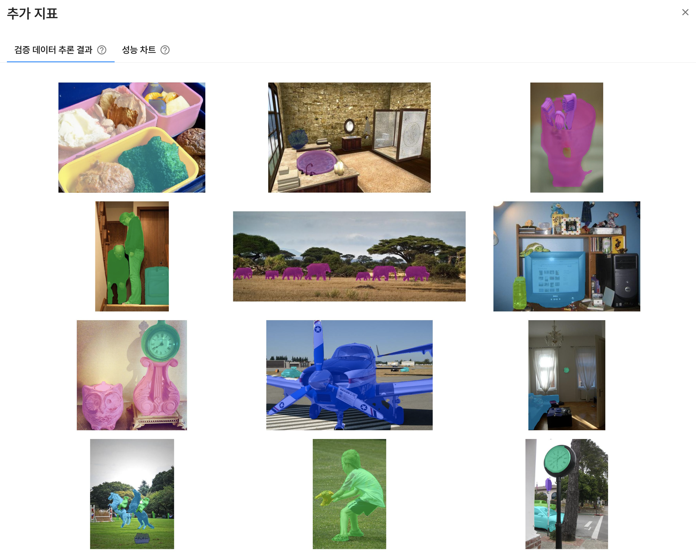
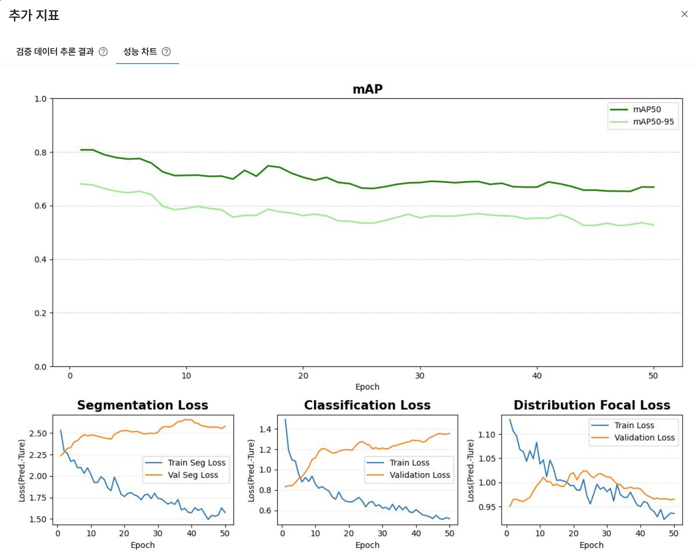

# AI 프로젝트 인스턴스 분할

이미지에 포함된 각 객체의 종류와 위치를 식별하고, 객체별 영역을 픽셀 단위로 분할하는 딥러닝 모델을 학습합니다.

객체 탐지가 객체의 위치를 사각형 영역으로 표시하는 기능이라면, 인스턴스 분할은 객체의 실제 모양에 맞춰 각 객체의 영역을 마스크로 표시합니다. 따라서 서로 겹쳐 있는 객체도 개별 객체 단위로 구분할 수 있습니다.

## 버전 생성

버전 생성은 선택한 데이터셋과 학습 설정을 바탕으로 모델 학습을 준비하는 과정입니다. 버전을 생성하면 학습에 사용할 파일이 학습 공간으로 이동하고, 설정한 데이터 전처리와 데이터 증강이 함께 적용됩니다.

버전 생성 전에 다음 항목을 확인하고 설정할 수 있습니다.

- 학습 파일 정보
- 학습·검증·시험 데이터 분할
- 데이터 전처리
- 학습 데이터 증강

### 학습 파일 정보

| 구분 | 내용 |
|:---:|---|
| **파일 수** | 선택한 데이터셋에 포함된 파일 수입니다. 실제 학습 가능한 파일 수와는 다를 수 있습니다. |
| **라벨링 수** | 선택한 데이터셋에 포함된 객체 라벨링의 수입니다. |
| **클래스 수** | 선택한 데이터셋에 포함된 객체 클래스의 수입니다. |

학습 파일 정보는 프로젝트에서 사용할 데이터셋의 규모와 라벨링 상태를 확인하기 위한 참고 정보입니다. 실제 학습에 사용되는 파일 수는 데이터 형식이나 라벨링 상태에 따라 달라질 수 있습니다.

### 학습·검증·시험 데이터 분할

학습에 사용할 데이터를 학습 데이터, 검증 데이터, 시험 데이터로 나누어 사용합니다.

| 구분 | 내용 |
|:---:|---|
| **학습 데이터** | 모델의 가중치를 학습하는 데 사용하는 데이터입니다. |
| **검증 데이터** | 학습 중 모델의 성능을 확인하고 설정을 조정하는 데 사용하는 데이터입니다. |
| **시험 데이터** | 학습이 완료된 모델의 최종 성능을 평가하는 데 사용하는 데이터입니다. |

`비율 재설정`을 선택하면 각 데이터에 할당할 비율을 조정할 수 있습니다. 데이터 분할 비율은 모델의 학습과 평가 결과에 영향을 줄 수 있으므로 데이터의 양과 목적을 고려하여 설정해야 합니다.

### 데이터 전처리

데이터 전처리는 학습 전에 이미지의 형식이나 특성을 조정하는 과정입니다. 전처리를 통해 데이터의 입력 형식을 맞추고 모델이 학습하기 좋은 형태로 데이터를 준비할 수 있습니다.

- **그레이스케일**: 컬러 이미지를 명암 정보로 변환합니다. 색상 정보가 중요하지 않은 경우 입력 정보를 단순화할 수 있지만, 색상에 따라 객체를 구분해야 하는 데이터에서는 신중하게 사용해야 합니다.

### 학습 데이터 증강

데이터 증강(Data Augmentation)은 원본 이미지에 변형을 적용하여 학습 데이터의 다양성을 높이는 기능입니다. 다양한 변형 이미지를 학습하면 특정 각도, 밝기 또는 방향에 과도하게 맞춰지는 것을 줄이고 모델의 일반화 성능을 높이는 데 도움이 될 수 있습니다.

제공되는 데이터 증강 항목은 다음과 같습니다.

- **이미지 좌우 반전**: 이미지를 좌우로 뒤집습니다.
- **이미지 상하 반전**: 이미지를 상하로 뒤집습니다.
- **이미지 90° 회전(우측)**: 이미지를 시계 방향으로 90도 회전합니다.
- **이미지 180° 회전(우측)**: 이미지를 시계 방향으로 180도 회전합니다.
- **이미지 270° 회전(우측)**: 이미지를 시계 방향으로 270도 회전합니다.
- **밝기**: 이미지의 밝기를 조정합니다. 설정 범위는 `-90 ~ 90`입니다.
- **대비**: 이미지의 명암 대비를 조정합니다. 설정 범위는 `0.0 ~ 3.0`입니다.

데이터의 실제 촬영 환경과 관계없는 변형을 과도하게 적용하면 오히려 학습 성능이 떨어질 수 있으므로, 데이터 특성에 맞는 항목을 선택해야 합니다.

## 인공지능 학습

버전 생성이 완료되면 하이퍼파라미터를 설정하고 모델 학습을 시작할 수 있습니다.

### 하이퍼파라미터

| 구분 | 내용 |
|:---:|---|
| **모델 선택** | 인스턴스 분할 학습에 사용할 모델을 선택합니다. |
| **배치 크기** | 한 번의 학습 단계에서 함께 처리할 이미지 수를 설정합니다. |
| **훈련 횟수** | 전체 학습 데이터를 반복해서 학습할 횟수(Epoch)를 설정합니다. |

#### 모델 목록

| 모델 | 내용 |
|:---:|---|
| **YOLO v11 Segmentation** | 인스턴스 분할 전용 모델로, 객체별 마스크를 생성하여 객체의 종류와 실제 영역을 함께 예측합니다. |
| **YOLO v26 Segmentation** | 최신 인스턴스 분할 학습 구조를 사용하는 모델로, 객체별 마스크 생성 성능과 추론 방식을 비교할 때 사용할 수 있습니다. |

각 모델 버전은 Small, Medium, Large, XLarge 등 다양한 크기로 제공됩니다. 모델 크기가 클수록 더 많은 연산 자원과 학습 시간이 필요할 수 있으므로, 데이터의 복잡도와 필요한 분할 정확도, 사용 가능한 GPU 메모리를 함께 고려하여 선택해야 합니다.

### 하이퍼파라미터 고급 설정

현재 인스턴스 분할 프로젝트에서는 고급 하이퍼파라미터 설정을 제공하지 않습니다. 모델 선택, 배치 크기, 훈련 횟수만 설정할 수 있습니다.

## 학습 결과

모델 학습이 완료되면 학습 결과 화면에서 평가 지표와 추가 분석 정보를 확인할 수 있습니다.

### 모델 평가 지표

| 구분 | 내용 |
|:---:|---|
| **평균 정밀도(mAP)** | 예측한 객체의 클래스와 마스크 영역을 종합하여 모델의 분할 성능을 평가하는 지표입니다. 일반적으로 값이 높을수록 성능이 좋습니다. |
| **정밀도(Precision)** | 모델이 객체로 예측한 항목 중 실제 객체에 해당하는 항목의 비율입니다. 높을수록 잘못된 객체 예측이 적다는 의미입니다. |
| **재현율(Recall)** | 실제 객체 중 모델이 올바르게 예측한 객체의 비율입니다. 높을수록 실제 객체를 놓치는 경우가 적다는 의미입니다. |

인스턴스 분할에서는 객체의 클래스뿐 아니라 예측한 마스크가 실제 객체 영역과 얼마나 겹치는지도 함께 평가합니다. 마스크는 이미지에서 객체에 해당하는 픽셀 영역을 의미합니다.

### 추가 지표

`추가 지표`에서는 검증 데이터 추론 결과와 성능 차트를 확인할 수 있습니다.

|           구분            | 내용                                                                                                                             |
|:-------------------------:|----------------------------------------------------------------------------------------------------------------------------------|
| **검증 데이터 추론 결과** | 검증 데이터에 모델을 적용한 결과를 확인합니다. 객체별 마스크, 클래스, 신뢰도 등을 통해 분할 결과를 직접 검토할 수 있습니다. |
|       **성능 차트**       | 학습 과정에서 계산된 손실과 평가 지표의 변화를 차트로 확인합니다.                                                                |

### 성능 차트

- **mAP50**: IoU 기준을 0.5로 설정하여 계산한 평균 정밀도입니다. 예측 마스크와 실제 마스크가 일정 수준 이상 겹치는지를 기준으로 성능을 평가합니다.
- **mAP50-95**: IoU 기준을 0.5부터 0.95까지 변경하며 계산한 평균 정밀도입니다. 여러 기준에서 마스크가 실제 영역과 얼마나 정확하게 일치하는지 확인할 수 있습니다.
- **Segmentation Loss**: 모델이 예측한 객체 마스크와 실제 마스크의 차이를 나타내는 손실입니다. 일반적으로 값이 낮을수록 객체 영역을 실제 형태에 가깝게 분할했다는 의미입니다.
- **Classification Loss**: 예측한 객체 클래스와 실제 클래스의 차이를 나타내는 손실입니다. 일반적으로 값이 낮을수록 클래스 분류 오차가 작습니다.
- **Distribution Focal Loss**: 객체 위치의 경계를 더 정밀하게 예측하기 위한 손실 항목입니다. 일반적으로 값이 낮을수록 위치 예측 오차가 작습니다.

#### IoU(Intersection over Union)

IoU는 예측한 객체 영역과 실제 객체 영역이 얼마나 겹치는지 나타내는 지표입니다. 두 영역이 겹치는 부분의 넓이를 두 영역을 합친 전체 넓이로 나누어 계산합니다.

`IoU = 겹치는 영역의 넓이 ÷ 두 영역을 합친 전체 넓이`

IoU 값은 0에서 1 사이이며, 1에 가까울수록 예측 영역과 실제 영역이 정확하게 일치한다는 의미입니다. 예를 들어 예측 마스크와 실제 마스크가 겹치는 영역이 넓으면 IoU가 높아지고, 예측 위치가 크게 다르거나 마스크 형태가 실제 객체와 다르면 IoU가 낮아집니다. mAP50은 IoU 기준을 0.5로, mAP50-95는 IoU 기준을 0.5부터 0.95까지 변경하여 모델 성능을 평가합니다.

### 모델 평가

학습이 완료된 모델은 모델 평가 기능을 통해 새로운 이미지에 적용하고 추론 결과를 확인할 수 있습니다. 인스턴스 분할 모델의 평가 결과에서는 다음 정보를 확인할 수 있습니다.

- 객체별 마스크 영역
- 객체 클래스
- 예측 신뢰도
- 서로 겹쳐 있는 객체의 개별 분할 결과

### 모델 다운로드

학습이 완료된 모델은 필요한 실행 환경에 맞는 형식으로 다운로드할 수 있습니다. 모델을 내보낸 뒤에도 인스턴스별 마스크 출력이 필요한 경우에는 선택한 실행 형식이 마스크 출력을 지원하는지 확인해야 합니다.

| 실행 형식 | 설명 |
|:---:|---|
| **PyTorch** | PyTorch 환경에서 사용할 수 있는 모델 형식입니다. |
| **ONNX** | 다양한 딥러닝 프레임워크와 추론 환경에서 사용할 수 있는 교환 형식입니다. |
| **OpenVINO** | OpenVINO 추론 환경에 맞게 변환된 모델 형식입니다. |

#### ONNX 세부 설정

ONNX 형식으로 변환할 때 모델 입력과 연산 방식을 설정할 수 있습니다.

| 항목 | 설명 |
|:---:|---|
| **이미지 크기** | 모델 입력 이미지의 크기를 설정합니다. |
| **배치 크기** | 한 번에 처리할 이미지 수를 설정합니다. |
| **FP16(Half precision)** | 16비트 부동소수점 형식을 사용하여 모델 크기와 연산량을 줄일 수 있습니다. |
| **Dynamic** | 입력 이미지 크기나 배치 크기를 고정하지 않고 동적으로 처리할 수 있도록 설정합니다. |
| **Simplify** | ONNX 그래프를 단순화하여 추론 과정의 호환성과 효율을 개선합니다. |
| **연산 집합자** | ONNX 모델에서 사용할 연산 집합 버전을 선택합니다. |
| **End-to-End** | 전처리와 후처리를 포함한 형태로 모델을 내보낼지 설정합니다. |
| **Embed NMS** | 비최대 억제(NMS) 연산을 모델에 포함할지 설정합니다. |

#### OpenVINO 세부 설정

OpenVINO 형식으로 변환할 때 사용할 정밀도와 추론 방식을 설정할 수 있습니다.

| 항목 | 설명 |
|:---:|---|
| **이미지 크기** | 모델 입력 이미지의 크기를 설정합니다. |
| **배치 크기** | 한 번에 처리할 이미지 수를 설정합니다. |
| **INT8 Quantization** | 8비트 정수 양자화를 적용하여 모델 크기와 추론 비용을 줄일 수 있습니다. |
| **FP16(Half precision)** | 16비트 부동소수점 형식을 사용하여 모델 크기와 연산량을 줄일 수 있습니다. |
| **Dynamic** | 입력 이미지 크기나 배치 크기를 동적으로 처리할 수 있도록 설정합니다. |
| **End-to-End** | 전처리와 후처리를 포함한 형태로 모델을 내보낼지 설정합니다. |
| **Embed NMS** | 비최대 억제(NMS) 연산을 모델에 포함할지 설정합니다. |
