# AI 프로젝트 (정형 데이터 분류)

표 형태의 정형 데이터를 분석하여 각 데이터가 어떤 클래스에 속하는지 예측하는 머신러닝 모델을 학습합니다. 예를 들어 제품 상태, 고객 유형 또는 품질 등급과 같이 하나의 행을 하나의 샘플로 보고 분류할 수 있습니다.

:::info `모델 훈련` 화면의 기본 구성은 아래와 같습니다.
왼쪽에서 전처리 또는 학습이 완료된 버전 목록을 확인할 수 있으며, 버전을 선택하면 오른쪽에 해당 버전의 설정과 결과가 표시됩니다.
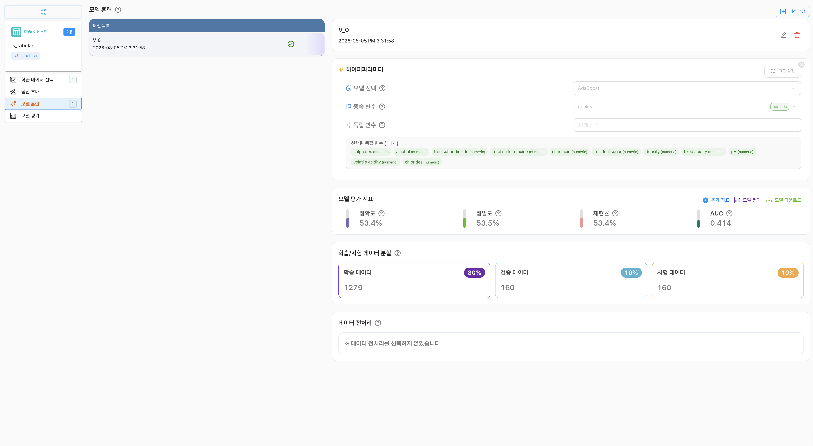
:::

## 버전 생성

버전 생성은 선택한 데이터셋과 전처리 설정을 바탕으로 학습을 준비하는 과정입니다. 버전이 생성되면 학습에 사용할 파일과 설정이 해당 버전에 저장됩니다.

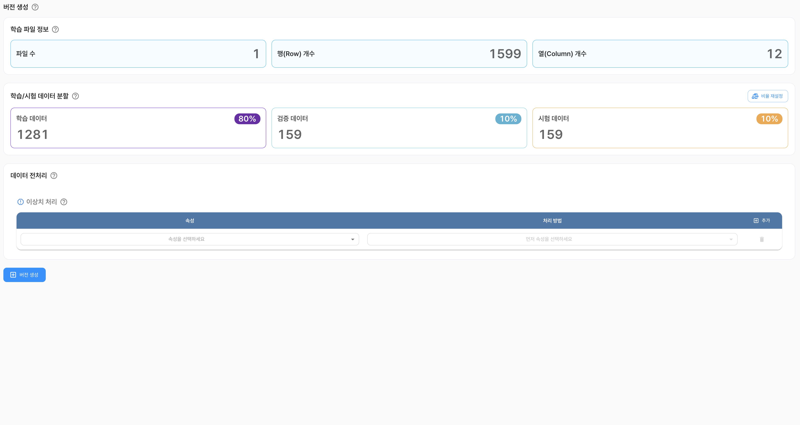

:::info 버전 생성 전에 다음 항목을 확인하고 설정할 수 있습니다.

- 학습 파일 정보
- 학습·검증·시험 데이터 분할
- 데이터 전처리
:::

:::tip 학습 파일 정보
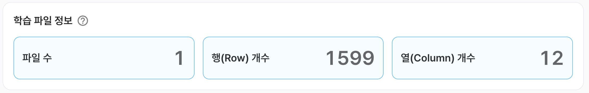
| 구분 | 내용 |
|:---:|---|
| **파일 수** | 선택한 데이터셋에 포함된 파일 수입니다. 파일 안의 행 수와는 별도로 계산됩니다. |
| **행(Row) 개수** | 선택한 데이터셋에 포함된 데이터 행의 수입니다. 일반적으로 각 행은 하나의 학습 샘플에 해당합니다. |
| **열(Column) 개수** | 선택한 데이터셋에 포함된 열의 수입니다. 종속 변수와 독립 변수 열을 모두 포함합니다. |

학습 파일 정보는 데이터셋의 규모를 확인하기 위한 참고 정보입니다. 실제 학습에 사용할 수 있는 행 수는 결측값, 데이터 형식 또는 전처리 설정에 따라 달라질 수 있습니다.
:::

:::info 학습·검증·시험 데이터 분할
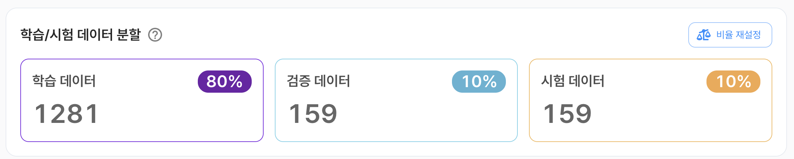
데이터를 학습 데이터, 검증 데이터, 시험 데이터로 나누어 사용합니다. 각 데이터는 모델 학습, 설정 조정, 최종 성능 평가에 사용됩니다.

| 구분 | 내용 |
|:---:|---|
| **학습 데이터** | 모델이 패턴을 학습하고 가중치를 조정하는 데 사용하는 데이터입니다. |
| **검증 데이터** | 학습 중 모델의 성능을 확인하고 하이퍼파라미터를 조정하는 데 사용하는 데이터입니다. |
| **시험 데이터** | 학습과 설정 조정에 사용하지 않고, 학습이 완료된 모델의 최종 성능을 평가하는 데 사용하는 데이터입니다. |

`비율 재설정`을 선택하면 각 데이터에 할당할 비율을 조정할 수 있습니다. 시험 데이터는 모델 설정에 사용하지 않고 최종 평가에만 사용하는 것이 좋습니다.
:::

:::info 데이터 전처리
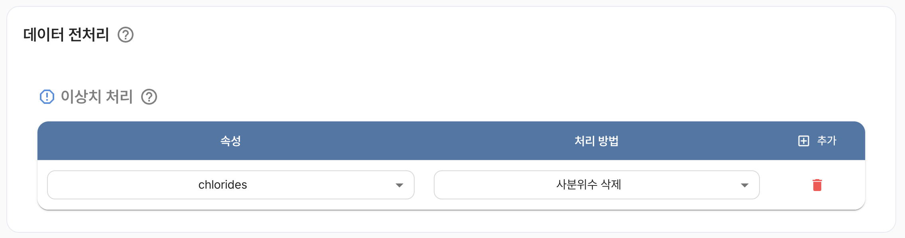
데이터 전처리는 학습 전에 데이터의 이상값을 확인하고 정리하는 과정입니다. 전처리 방법은 데이터의 특성과 분석 목적을 고려하여 선택해야 하며, 지나치게 많은 행을 제거하면 학습에 사용할 데이터가 부족해질 수 있습니다.
::::tip 이상치 처리

이상치는 다른 데이터와 비교하여 비정상적으로 크거나 작은 값입니다. 이상치 처리에서는 대상 속성을 선택하고 해당 속성에 적용할 처리 방법을 설정합니다.

현재 제공되는 처리 방법은 **사분위수 삭제**입니다. 사분위수 범위를 기준으로 일반적인 범위를 벗어나는 값을 이상치로 판단하여 해당 행을 제거합니다. 이상치가 실제 현상을 나타내는 데이터라면 삭제하기 전에 처리 결과를 확인해야 합니다.

`추가`를 선택하면 속성과 처리 방법을 지정하는 항목을 추가할 수 있습니다. 이미 추가한 항목은 삭제할 수 있습니다.

:::

## 인공지능 학습

버전 생성이 완료되면 종속 변수와 독립 변수를 지정하고 모델 학습을 시작할 수 있습니다.

:::info 하이퍼파라미터

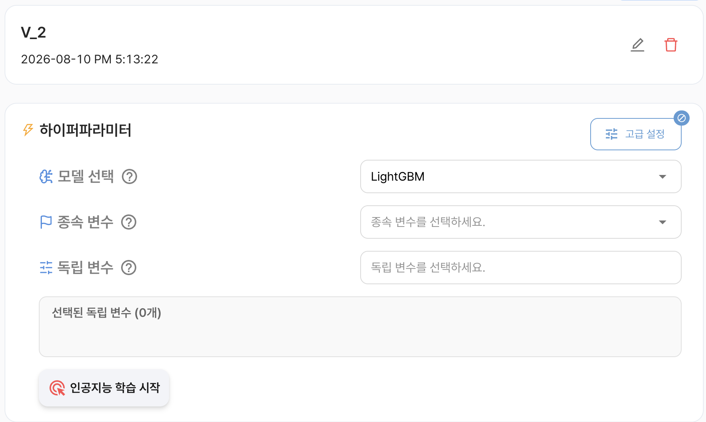

| 구분 | 내용                                                                                                                                  |
|:---:|---------------------------------------------------------------------------------------------------------------------------------------|
| **모델 선택** | 학습에 사용할 머신러닝 모델을 선택합니다.                                                                                             |
| **종속 변수** | 모델이 예측할 대상 열을 선택합니다. 분류에서는 예측할 클래스 정보가 포함된 열을 사용합니다.                                           |
| **독립 변수** | 종속 변수를 예측하는 데 사용할 입력 열을 선택합니다.  종속 변수와 중복되거나 예측 시점에 알 수 없는 열은 선택하지 않는 것이 좋습니다. |
:::
#### 모델 목록

| 모델 | 내용 |
|:---:|---|
| **LightGBM** | 여러 결정 트리를 순차적으로 학습하는 그래디언트 부스팅 계열 모델입니다. 정형 데이터에서 빠른 학습과 높은 예측 성능을 기대할 수 있습니다. |
| **Gradient Boosting** | 이전 모델의 오류를 보완하도록 결정 트리를 순차적으로 학습하는 앙상블 모델입니다. |
| **AdaBoost** | 이전 단계에서 잘못 분류된 샘플에 더 큰 가중치를 부여하여 여러 약한 학습기를 결합하는 앙상블 모델입니다. |

## 하이퍼파라미터 고급 설정

하이퍼파라미터 고급 설정에서는 탐색 방법과 평가 기준, 학습률 및 최적화 탐색 범위를 설정할 수 있습니다. 설정을 변경한 후 `확인`을 선택하면 학습 화면에 적용됩니다. `취소` 또는 `설정 초기화`를 사용하면 변경 내용을 되돌릴 수 있습니다.

:::info 최적화 알고리즘

| 알고리즘 | 설명 |
|:---:|---|
| **Scikit-learn** | Scikit-learn 기반의 일반적인 탐색 방식을 사용합니다. 설정이 단순하고 비교적 빠르게 결과를 확인할 수 있습니다. |
| **Optuna** | 여러 하이퍼파라미터 조합을 시도하면서 유망한 조합을 우선적으로 탐색하는 최적화 프레임워크입니다. 탐색 시간이 늘어날 수 있지만 더 다양한 조합을 확인할 수 있습니다. |
:::

:::info 최적화 평가지표
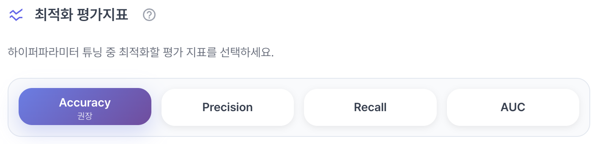
하이퍼파라미터 탐색 중 모델 조합을 비교할 때 사용할 평가 지표를 선택합니다.

| 평가지표 | 설명 |
|:---:|---|
| **Accuracy** | 전체 샘플 중 올바르게 분류한 샘플의 비율입니다. 클래스별 데이터 수가 크게 차이 나지 않을 때 유용합니다. |
| **Precision** | 특정 클래스로 예측한 샘플 중 실제로 해당 클래스인 샘플의 비율입니다. 잘못된 긍정 예측을 줄이는 것이 중요할 때 참고합니다. |
| **Recall** | 실제 특정 클래스에 속하는 샘플 중 해당 클래스로 올바르게 예측한 샘플의 비율입니다. 대상 샘플을 놓치지 않는 것이 중요할 때 참고합니다. |
| **AUC** | 분류 임계값을 바꾸어 가며 모델이 클래스를 구분하는 능력을 나타내는 지표입니다. 일반적으로 값이 클수록 구분 성능이 좋습니다. |
:::

:::info 학습률 세분화

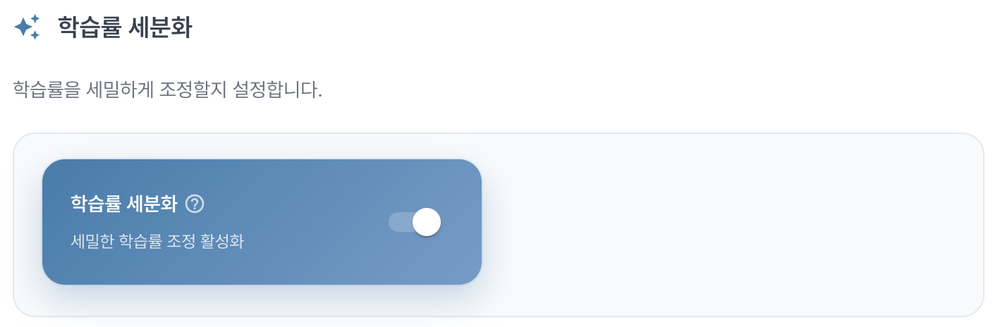

`학습률 세분화`를 활성화하면 학습률을 정해진 범위 안에서 더 세밀하게 탐색합니다. 탐색할 조합이 늘어나므로 최적의 설정을 찾는 데 도움이 될 수 있지만 학습 시간이 길어질 수 있습니다.

:::

:::info 최적화 설정
하이퍼파라미터 탐색 횟수와 학습 중단 조건, 학습률 범위를 설정합니다.

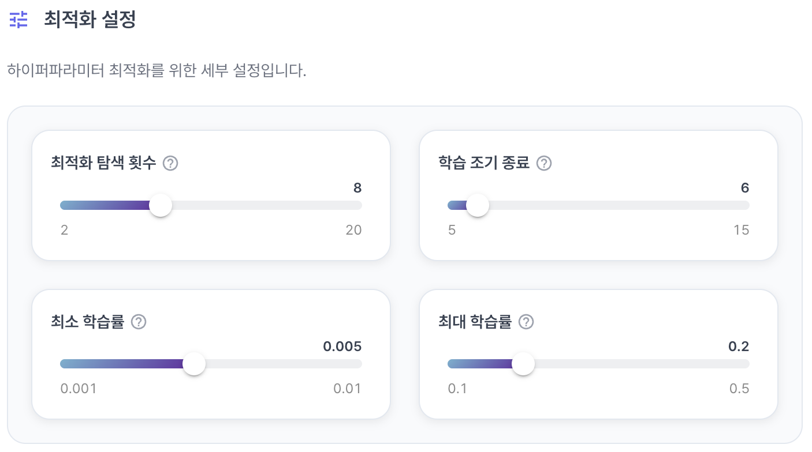

| 항목 | 설명 |  설정 유형   |
|:---:|---|:------------:|
| **최적화 탐색 횟수** | 평가할 하이퍼파라미터 조합의 수입니다.  값이 클수록 더 많은 조합을 확인하지만 탐색 시간이 늘어납니다. |    2 ~ 20    |
| **학습 조기 종료** | 성능이 일정 횟수 동안 개선되지 않을 때 학습을 중단하는 기준입니다.  불필요한 학습 시간과 과적합을 줄이는 데 도움이 됩니다. |    5 ~ 15    |
| **최소 학습률** | 탐색할 학습률의 최솟값입니다. | 0.001 ~ 0.01 |
| **최대 학습률** | 탐색할 학습률의 최댓값입니다. |  0.1 ~ 0.5   |

:::

## 학습 결과

학습이 완료되면 학습 결과 화면에서 평가 지표와 분석 자료를 확인할 수 있습니다.

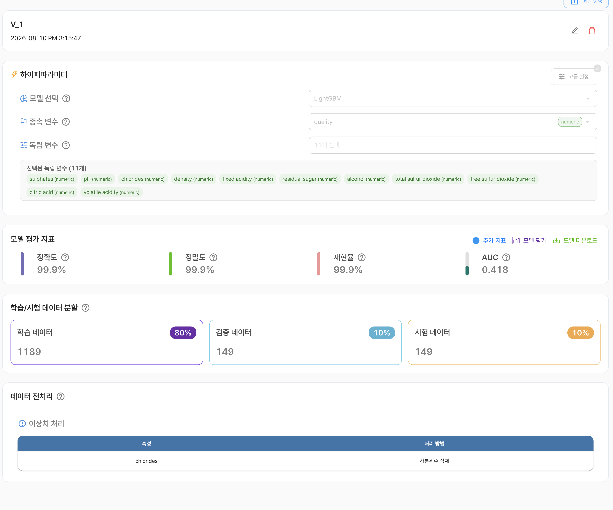

### 모델 평가 지표

| 구분 | 내용 |
|:---:|---|
| **정확도(Accuracy)** | 전체 샘플 중 모델이 올바르게 분류한 샘플의 비율입니다. |
| **정밀도(Precision)** | 모델이 특정 클래스로 예측한 샘플 중 실제로 해당 클래스인 샘플의 비율입니다. |
| **재현율(Recall)** | 실제 특정 클래스에 속하는 샘플 중 모델이 해당 클래스로 올바르게 예측한 샘플의 비율입니다. |
| **AUC** | 분류 임계값의 변화에 따른 모델의 클래스 구분 성능을 나타내는 지표입니다. |

데이터의 클래스 비율이 불균형한 경우에는 정확도만으로 모델을 판단하지 말고 정밀도, 재현율, AUC를 함께 확인해야 합니다.

:::info 추가 지표

추가 지표에서는 학습 과정과 데이터 특성을 분석할 수 있는 차트를 확인합니다.
:::

:::tip 훈련 정확도와 검증 정확도

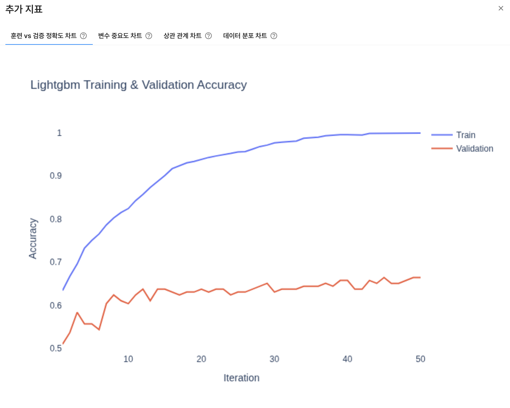

훈련 데이터와 검증 데이터에 대한 정확도의 변화를 비교합니다. 두 정확도의 차이가 지나치게 크면 과적합 가능성을, 두 값이 모두 낮으면 데이터나 모델 설정의 개선 필요성을 확인할 수 있습니다.
:::
:::tip 변수 중요도

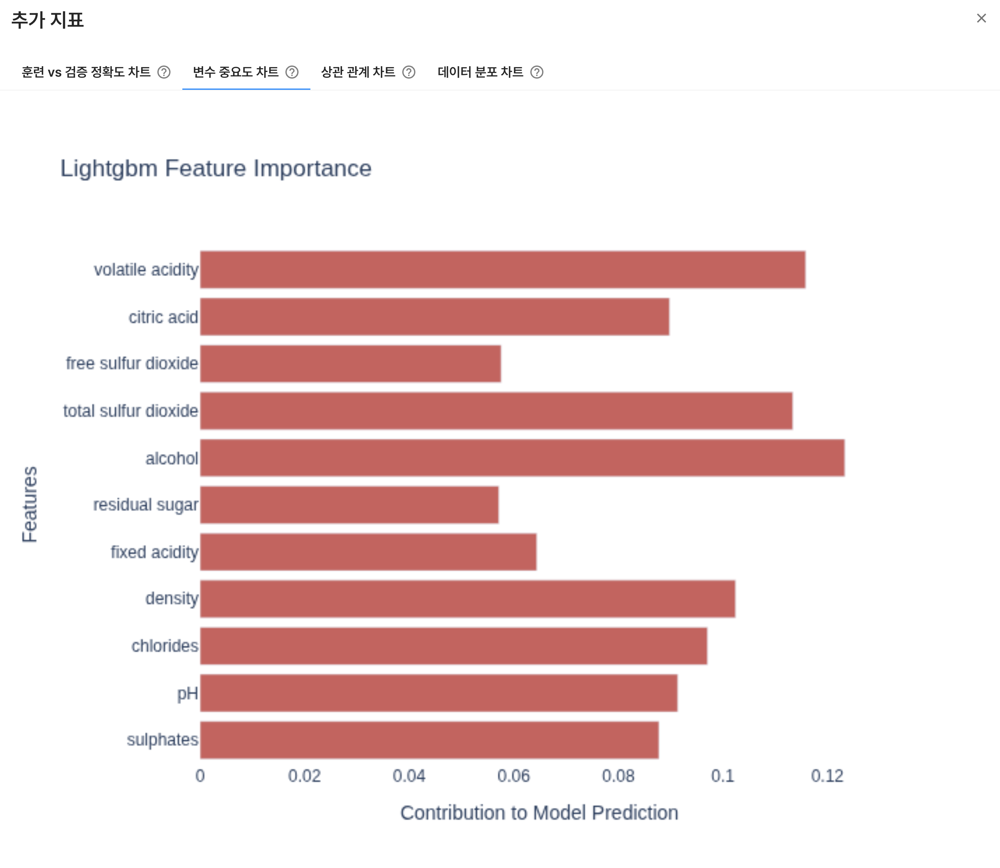

각 독립 변수가 모델의 예측에 기여한 정도를 확인합니다. 변수 중요도가 높다고 해서 인과관계가 입증되는 것은 아니므로, 도메인 지식과 함께 해석해야 합니다.
:::
:::tip 상관관계

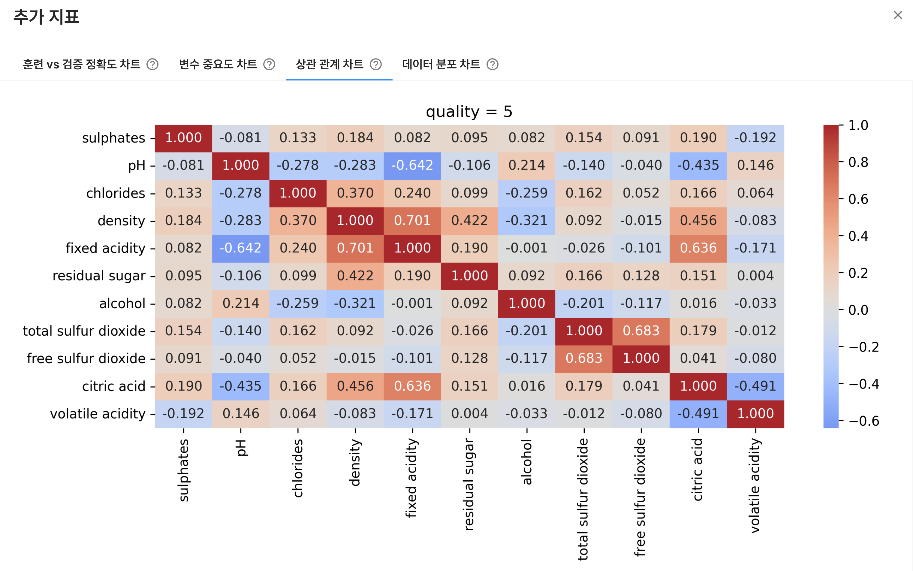

변수 간 상관관계를 확인합니다. 상관관계가 높은 변수들이 함께 포함되어 있는지, 특정 변수 간 관계가 강한지 등을 파악하는 데 사용할 수 있습니다. 상관관계가 높다고 해서 한 변수가 다른 변수의 원인이라는 의미는 아닙니다.
:::
:::tip 데이터 분포

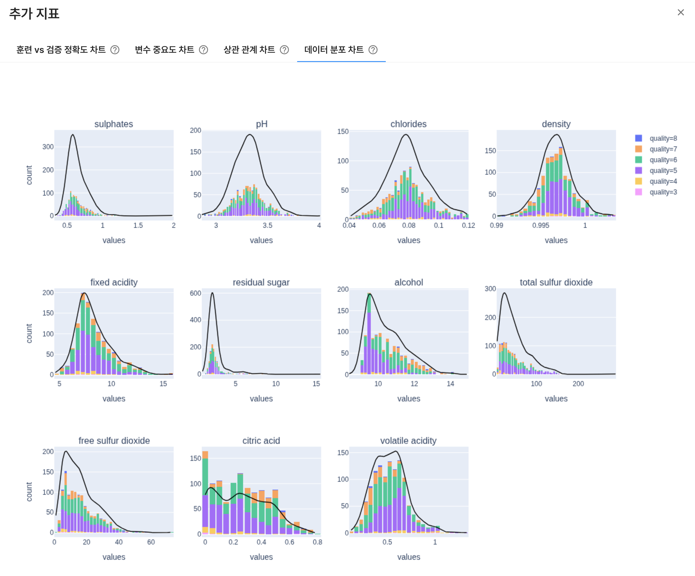

변수별 값의 분포를 확인합니다. 값의 범위가 지나치게 넓거나 특정 구간에 데이터가 몰려 있는지 확인하여 전처리와 변수 선택에 참고할 수 있습니다.
:::

### 모델 다운로드

학습이 완료된 모델은 필요한 실행 환경에 맞는 형식으로 다운로드할 수 있습니다.

|                                        Scikit-learn                                          | ONNX                          | 
|:----------------------------------------------------------------------------------------------------:|-------------------------------|
| Scikit-learn 호환 모델을 Python에서 불러와 추론할 수 있는 `.pkl` 형식으로 다운로드합니다. | 모델을 표준 교환 형식으로 변환하여 ONNX Runtime 등 다양한 추론 환경에서 사용할 수 있습니다. | 
|                                    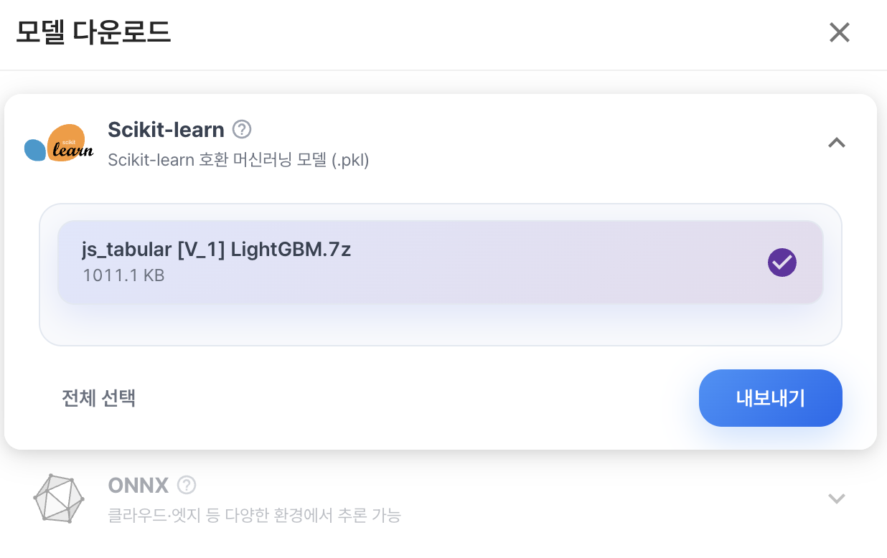                                     | 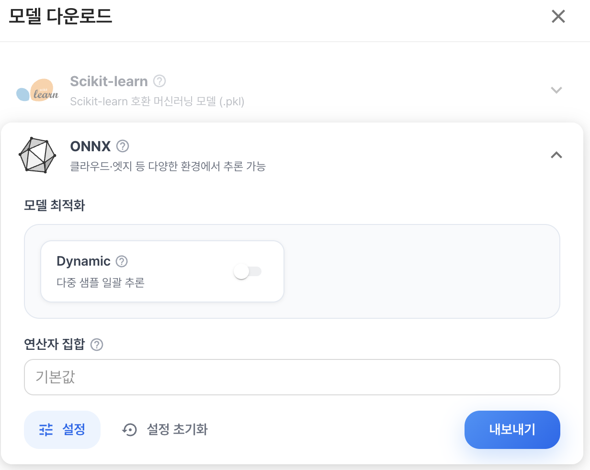 |

:::info `ONNX` 세부 설정
`Dynamic`을 활성화하면 여러 샘플을 한 번에 처리하는 입력 형태를 동적으로 사용할 수 있습니다. `연산자 집합`은 대상 추론 환경이 지원하는 ONNX 연산자 집합 버전에 맞게 선택해야 합니다.
:::

