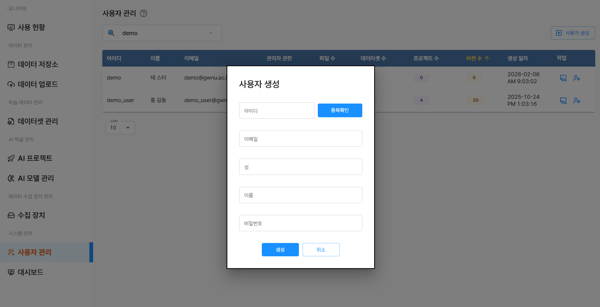
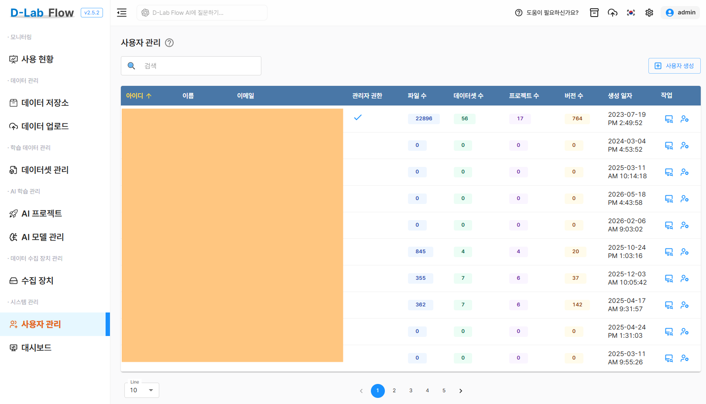
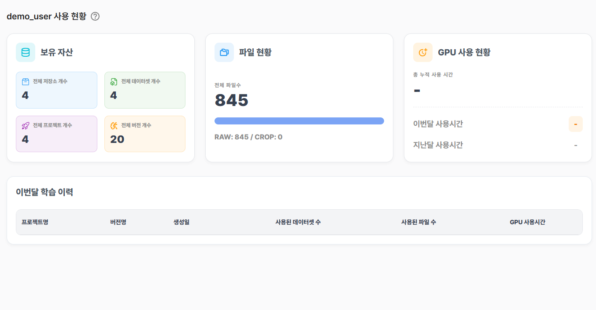
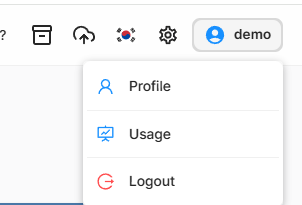
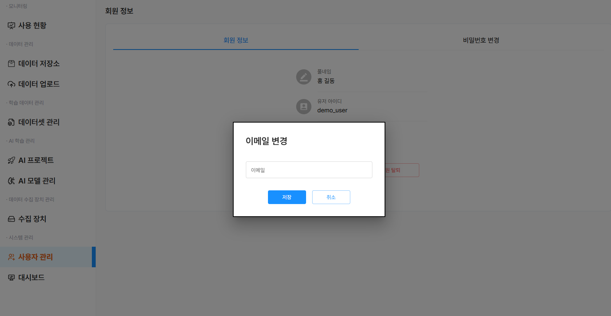
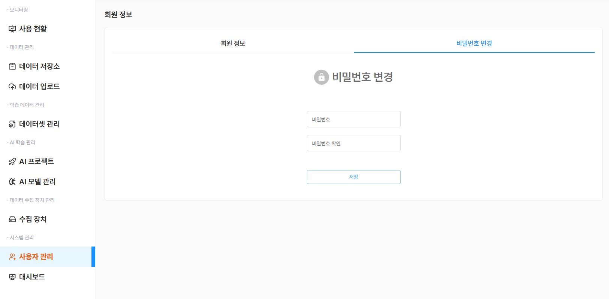
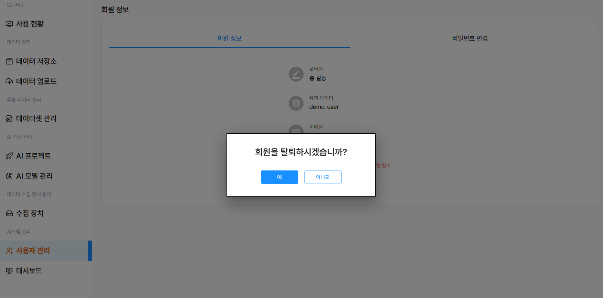

# 사용자 관리

**사용자 관리 페이지**는 **관리자 권한**을 가진 계정만 접근할 수 있는 기능입니다.  
이 페이지에서는 전체 사용자의 정보를 확인하고 관리할 수 있습니다.

## 검색 및 사용자 생성

사용자 관리 상단의 **검색** 및 `사용자 생성` 버튼을 통해 원하는 사용자를 검색하거나 새롭게 추가할 수 있습니다.

:::tip
- **검색 필터**를 이용해 아이디, 이름, 이메일 등을 입력하여 사용자를 빠르게 찾을 수 있습니다.
- 상단의 **`사용자 생성` 버튼**을 클릭하여 사용자를 직접 추가할 수 있습니다.  
    👉 아이디, 이름, 이메일, 성, 이름, 비밀번호를 입력합니다.  
    👉 **`중복 확인`** 버튼을 통해 아이디 존재 여부를 확인합니다.  
    👉 **`생성`** 버튼을 눌러 새로운 사용자를 등록합니다.
:::

## 사용자 정보 테이블

사용자의 주요 정보를 한눈에 확인할 수 있도록 **테이블** 형태로 구성되어 있습니다.

- **아이디**: 사용자의 고유한 계정 ID
- **이름**: 사용자 이름
- **이메일**: 계정 등록 이메일
- **관리자 권한**: 사용자가 관리자 권한을 보유했는지 여부
- **파일 수**: 사용자가 업로드한 파일 수 (RAW + CROP)
- **데이터셋 수**: 사용자가 소유한 전체 데이터셋 수
- **프로젝트 수**: 사용자가 소유한 전체 프로젝트 수
- **버전 수**: 사용자가 생성한 전체 버전 수
- **생성일자**: 계정의 생성일
- **작업**: `데이터 통계` 및 `설정`과 같은 추가 기능을 제공하는 아이콘 버튼

## 사용자 데이터 통계 확인

관리자는 `데이터 통계 버튼`을 사용하여 모든 사용자의 사용 현황 정보를 확인할 수 있습니다.

## 사용자 계정 설정

관리자는 테이블의 `설정` 버튼을 사용하여 특정 사용자의 계정 정보를 수정할 수 있습니다.  
    :::info 일반 사용자의 정보 변경
        일반 사용자의 경우에도 우측 상단의 `Profile` 버튼을 클릭하여 본인의 계정을 설정할 수 있습니다.
    
    :::

설정 메뉴에서 제공하는 기능은 아래와 같습니다.
### 이메일 변경

- 사용자의 이메일 주소를 수정할 수 있습니다.

### 비밀번호 변경

- 사용자가 사용할 새로운 비밀번호로 변경할 수 있습니다.
- 비밀번호를 변경하면 기존 세션이 자동으로 만료될 수 있습니다.

### 회원 탈퇴 (계정 삭제)

- 사용자의 계정을 영구 삭제할 수 있습니다.
- 삭제된 계정과 관련된 모든 데이터는 복구할 수 없으므로 주의해야 합니다.

:::warning 주의 사항
삭제된 계정은 복구할 수 없습니다. 조치 전에 반드시 신중하게 확인하세요.
:::

