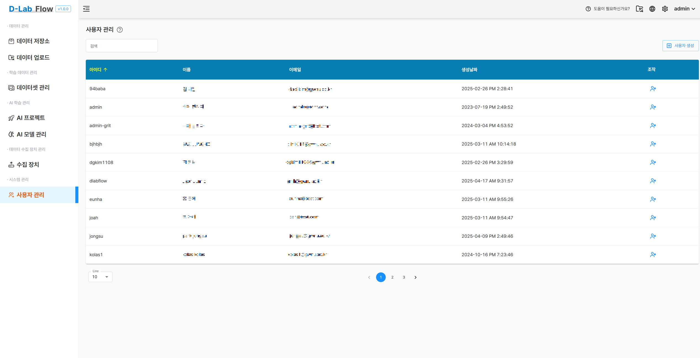
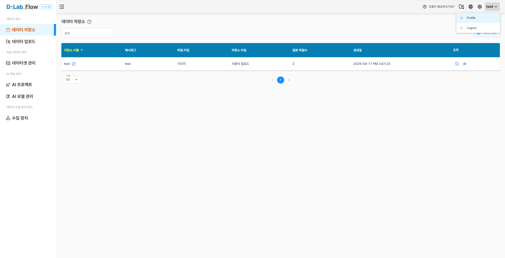
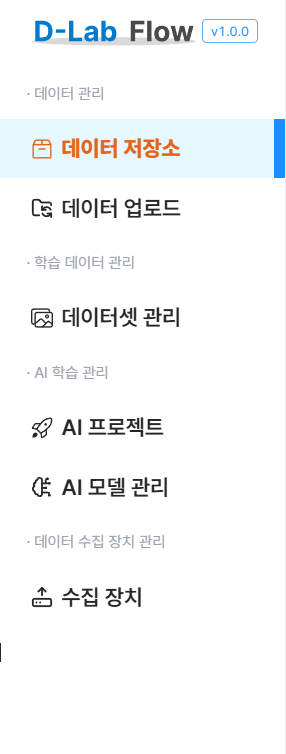
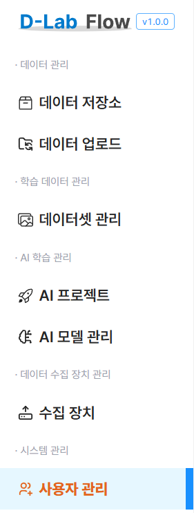
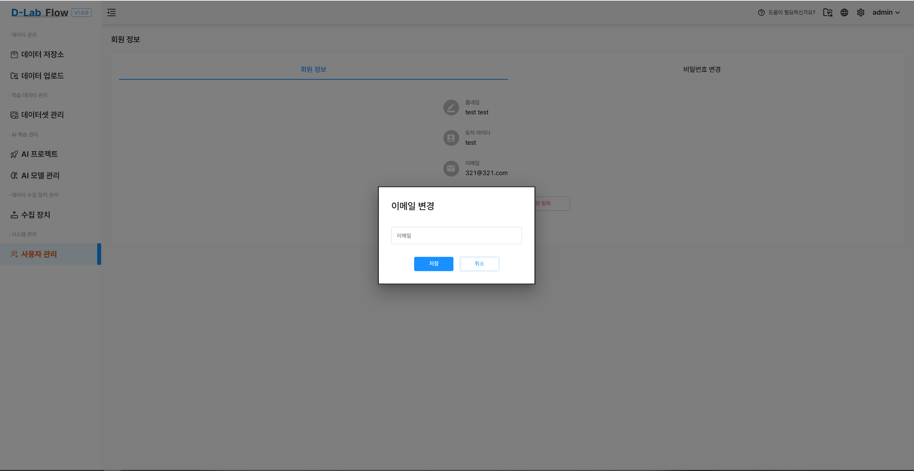
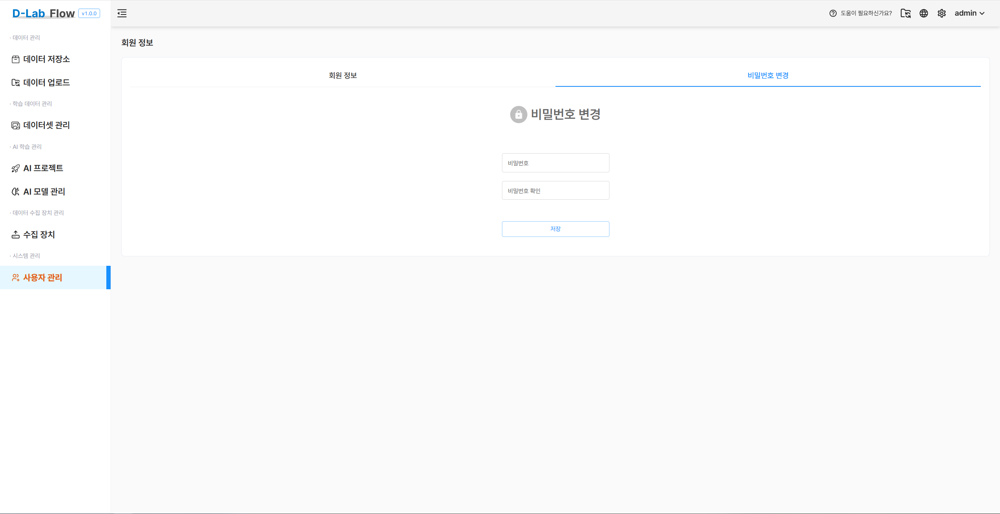
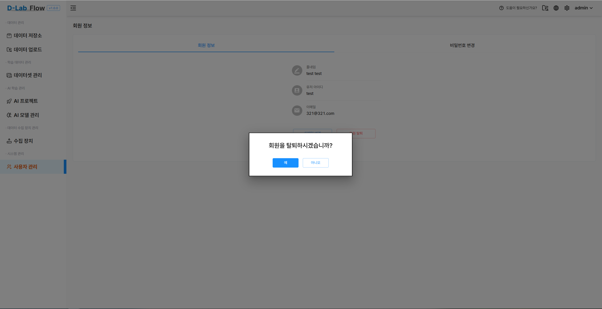

# 사용자 관리

**사용자 관리 페이지**는 **관리자 계정**만 접근할 수 있는 기능입니다.  
이 페이지에서는 사용자 계정에 대한 기본적인 설정 및 관리가 가능합니다.

## 일반 사용자 계정 정보 확인

일반 사용자 계정은 **우측 상단에 표시되는 본인의 아이디를 클릭**하면  
`profile` 버튼이 나타나며, 이를 통해 본인의 정보를 확인할 수 있습니다.

> ✅ 이 기능은 **모든 사용자**가 접근 가능하며,  
> 관리자 외의 사용자는 이 경로를 통해서만 자신의 정보를 확인할 수 있습니다.

## 접근 권한
- 사용자 관리 기능은 **관리자(Admin)** 권한이 있는 계정만 접근할 수 있습니다.
- 일반 사용자는 해당 페이지를 열 수 없습니다.

  

    
<strong>일반 사용자 화면</strong>

  

  

    
<strong>관리자 화면</strong>

  

## 기능 안내

### ✉️ 이메일 변경

- 관리자는 사용자의 이메일 주소를 수정할 수 있습니다.

### 🔒 비밀번호 변경

- 관리자는 사용자의 비밀번호를 변경할 수 있습니다.
- 비밀번호 변경 시, 기존 세션은 자동으로 만료될 수 있습니다.

### 🗑️ 회원 탈퇴 (계정 삭제)

- 관리자는 특정 사용자의 계정을 영구 삭제할 수 있습니다.
- 삭제된 계정은 복구할 수 없으며, 모든 관련 데이터는 제거됩니다.
- 삭제 전, 확인 창을 통해 재확인 절차가 진행됩니다.

### ⚠️ 주의 사항

- 중요한 변경(이메일, 비밀번호, 탈퇴 등)은 감사 로그에 기록됩니다.
- 사용자 데이터 보호를 위해, 계정 삭제 전에 **백업 여부**를 확인하시기 바랍니다.

---

