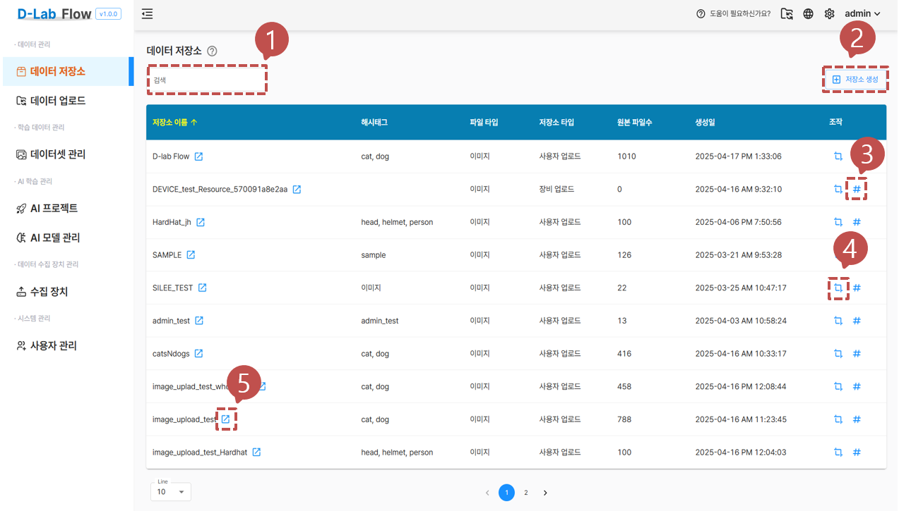

# 데이터 저장소

사용자와 장치로부터 생성된 저장소 목록을 보여주고 저장소 생성, 이미지 크롭기능, 해시태그 변경 기능을 사용할 수 있습니다.

## 1. 검색 기능

사용자는 테이블 상단에 위치한 검색창을 통해 원하는 항목을 손쉽게 찾을 수 있습니다. 입력한 키워드를 기준으로 테이블에 표시된 데이터가 실시간으로 필터링되어, 관련 있는 항목만 화면에 표시됩니다.

## 2. 저장소 생성

저장소 생성 버튼 클릭시 모달이 열리고 저장소 이름, 해시태그, 파일 타입을 입력 후 생성 버튼을 클릭하여 저장소를 생성합니다.

생성 완료 후 목록에서 즉시 생성된 저장소 확인이 가능합니다.

## 3. 해시태그 변경 기능

해시태그 버튼을 클릭시 모달이 열리고 각 저장소의 해시태그 수정이 가능합니다.

저장 버튼을 클릭하여 수정작업을 완료하고 즉시 반영된 해시태그 확인이 가능합니다.

## 4. 이미지 크롭 관리 기능

크롭 관리 버튼을 클릭시 모달이 열리고 크롭의 폭과 높이, 중첩 길이, 확장 여부를 입력하여 새로운 이미지를 생성합니다.

- 중첩 길이 : 이미지 분할시에 중첩 사이즈 만큼 중첩시켜 분할합니다.
- 확장 옵션 : 이미지를 크롭후 남는 영역을 내부로 포함할지 외부로 확장할지 지정합니다.

이미지 크롭 설정 추가 버튼을 클릭하면 분할된 이미지를 생성하고 활성화 버튼을 눌러 사용합니다.

## 5. 이동하기 버튼

버튼을 클릭시 해당 저장소의 데이터 업로드 페이지로 바로 이동하게 되며 RAW에 해당하는 데이터를 우측에 보여줍니다.

