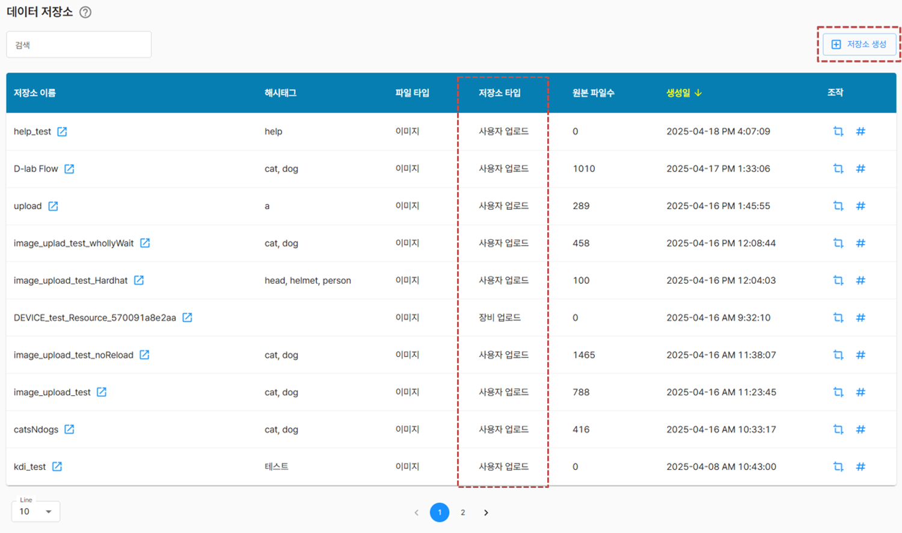

# 데이터 저장소

데이터 저장소는 이 플랫폼에서 모든 작업이 시작되는 출발점입니다.

사용자가 업로드한 데이터, 장치로부터 수집된 데이터가 이곳에 저장되며, 단순히 데이터가 저장되는 공간이 아닌 데이터셋을 구성하고 라벨링 이미지로 활용되는 중요한 역할을 합니다.

테이블을 통해 사용자와 장치로부터 생성된 저장소 목록을 보여주고 검색 기능, 저장소 생성, 이미지 크롭기능, 해시태그 변경 기능, 바로가기 기능을 제공합니다.

## 1. 검색 기능

사용자는 테이블 상단에 위치한 검색창을 통해 원하는 항목을 손쉽게 찾을 수 있습니다. 입력한 키워드를 기준으로 테이블에 표시된 데이터가 실시간으로 필터링되어, 관련 있는 항목만 화면에 표시됩니다.

## 2. 저장소 생성

저장소 타입은 사용자 업로드용과 장비 업로드용 으로 구분되며, 이 페이지에서는 사용자 업로드용 저장소를 생성합니다. 장비 업로드용 저장소를 생성하려면 [ 데이터 수집 장치 관리 > 수집 장치 ]에서 등록 가능하며 데이터 저장소에서도 확인이 가능합니다.

저장소 생성 버튼 클릭시 모달이 열리고 저장소 이름, 해시태그, 파일 타입을 입력 후 생성 버튼을 클릭하여 저장소를 생성합니다.

생성 완료 후 목록에서 즉시 생성된 저장소 확인이 가능합니다.

## 3. 해시태그 변경 기능

저장소의 해시태그는 데이터를 분류하고 검색하는 데 유용하게 사용됩니다.

해시태그를 변경하려면 해당 저장소 항목의 [해시태그 변경] 버튼을 클릭하세요.
버튼을 클릭시 모달이 열리고 각 저장소의 해시태그 수정이 가능합니다.

저장 버튼을 클릭하여 수정작업을 완료하고 즉시 반영된 해시태그 확인이 가능합니다.

## 4. 이미지 크롭 관리 기능

이미지 크롭 기능은 업로드된 원본 이미지를 일정한 크기로 분할하여, 라벨링 또는 학습에 더 적합한 형태로 가공할 수 있는 기능입니다.
해당 저장소 항목의 [크롭 관리] 버튼을 클릭하면 모달 창이 열리며, 다음과 같은 항목을 입력하여 크롭 작업을 설정할 수 있습니다.

- 크롭 폭 / 높이: 분할될 이미지의 가로 세로 크기
- 중첩 길이: 크롭 간 영역이 겹치는 정도 (중복 영역 설정)
- 확장 여부: 이미지가 설정된 크기로 나누어지지 않을 경우, 크롭후 남는 영역을 내부로 포함할지 외부로 확장할지 선택

이미지 크롭 설정 추가 버튼을 클릭하면 분할된 이미지를 생성하고 활성화 버튼을 눌러 사용합니다.

## 5. 이동하기 버튼

[이동하기] 버튼은 선택한 저장소의 데이터 업로드 페이지로 바로 이동할 수 있는 기능입니다. 

저장소 목록에서 해당 버튼을 클릭하면, 현재 선택된 저장소에 대한 데이터 업로드 화면으로 전환되며 화면 우측에서는 이 저장소에 포함된 RAW 데이터 목록이 함께 표시됩니다. (RAW : 전체 데이터)

