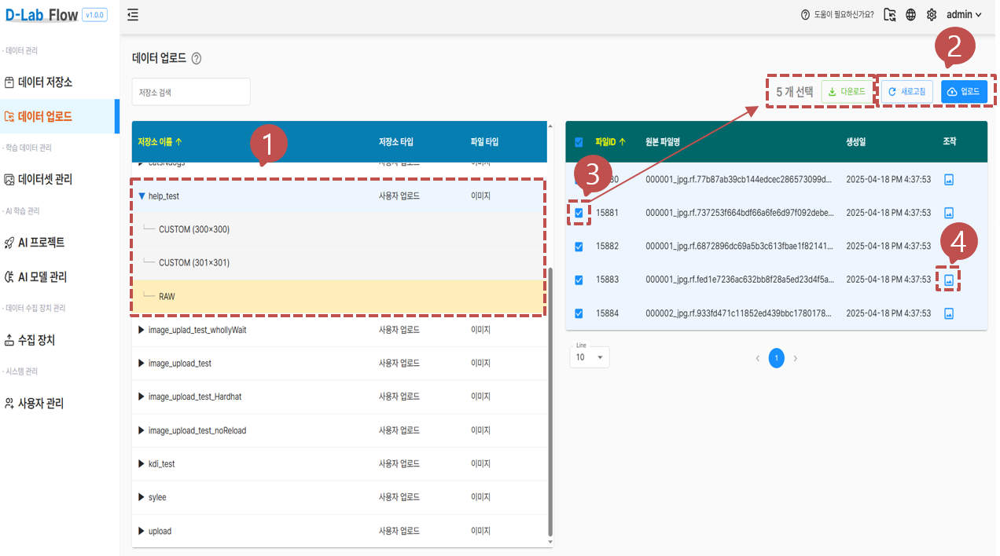
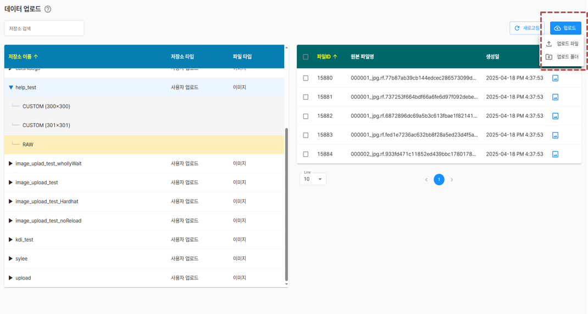
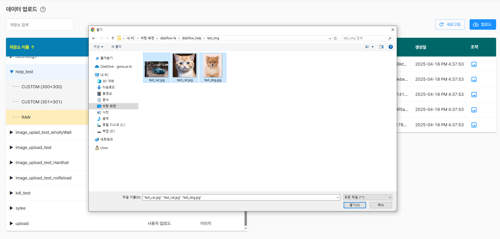
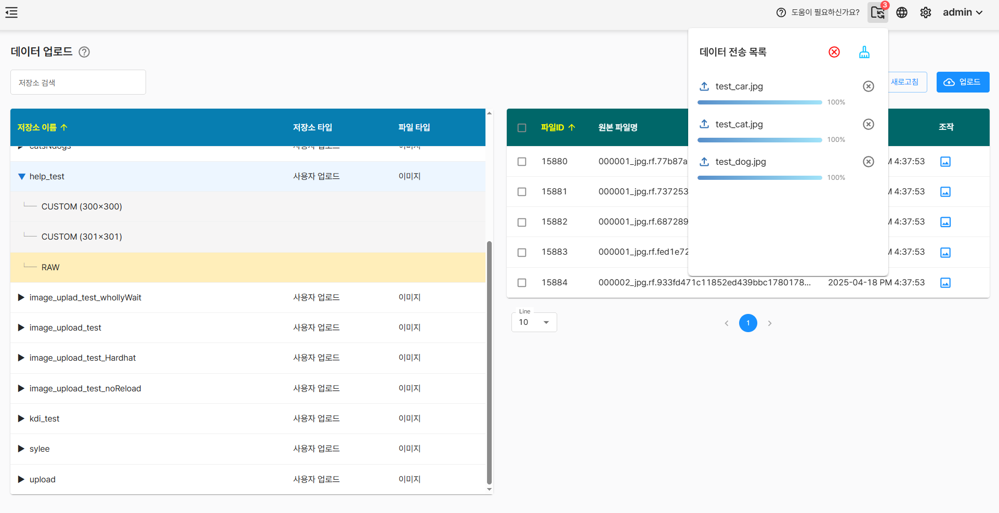
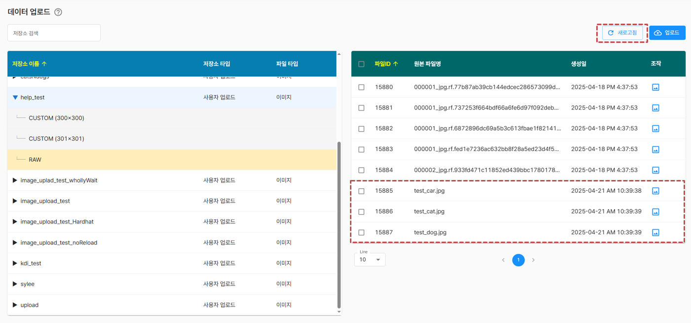
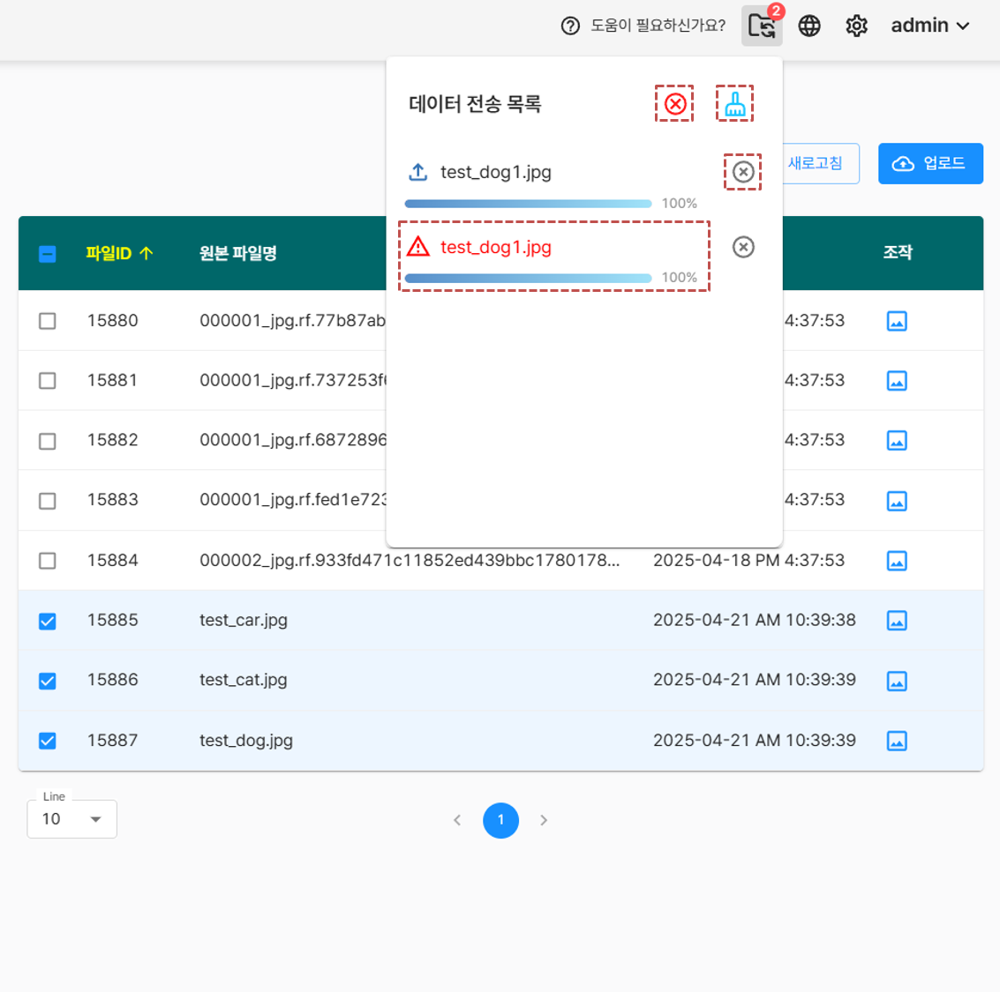
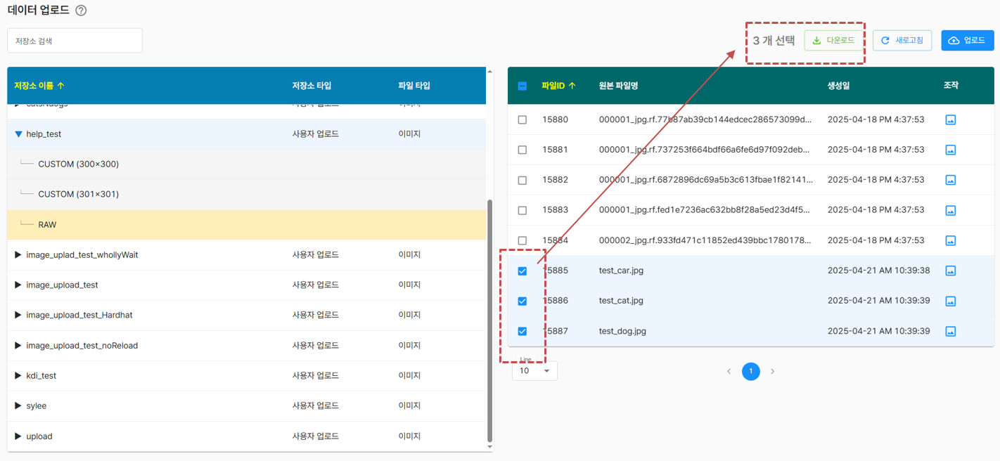
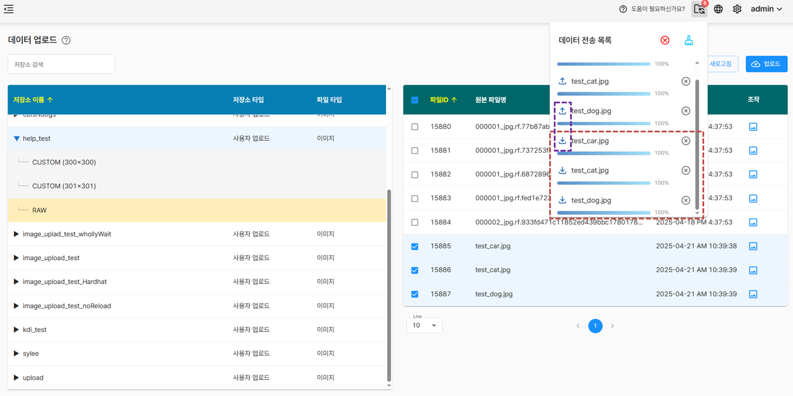
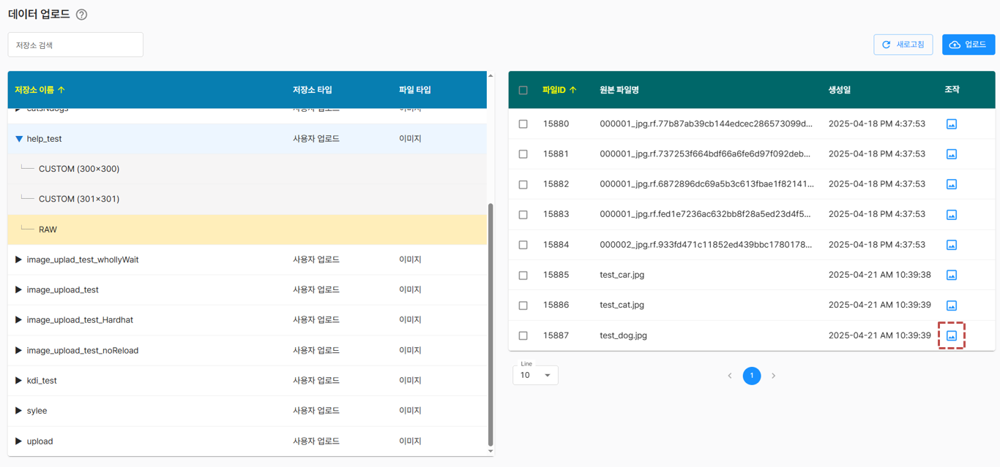
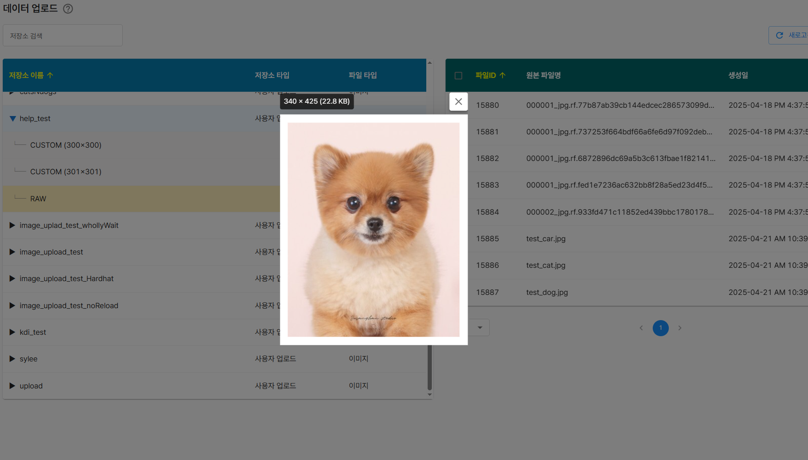

# 데이터 업로드

저장소에 있는 파일 목록을 확인하고 pc에서 파일 업로드와 다운로드, 미리보기 기능을 사용할 수 있습니다.

## 1. 저장소 정보 표시
저장소 목록을 보여주고 해당 저장소를 클릭시 파일 목록을 화면 우측에 표시합니다.

- CUSTOM(300x300) : 데이터 저장소에서 크롭 기능을 통해 만든 분할된 이미지 파일 목록
- RAW : 해당 저장소의 전체 파일 목록

## 2. 업로드 기능

해당 저장소를 클릭시 새로고침과 업로드 버튼이 나타나며 업로드는 파일/폴더를 구분하여 업로드할 수 있습니다.

업로드 할 파일은 단일 또는 다중선택이 가능합니다.

업로드 진행 상황은 우측 상단에서 확인이 가능하며, 완료시 새로고침 버튼을 눌러 업로드된 파일을 확인할 수 있습니다.

알림에 대한 설명은 다음과 같습니다.
- 우측상단 빨간 X 버튼 : 전체취소 버튼으로 클릭시점 기준으로 더이상 업로드가 진행되지 않습니다.
- 빗자루 모양 아이콘 : 클릭시 전체 알림을 제거합니다.
- 파일 우측의 회색 X버튼 : 클릭시 완료된 해당 항목의 알림을 제거 합니다.
- 오류 아이콘 : 중복된 파일명은 업로드가 불가능 하며 오류 아이콘을 표시 합니다.

## 3. 다운로드 기능

체크박스를 눌러 파일을 선택하면 파일의 개수와 다운로드 버튼을 보여줍니다.

다운로드 버튼 클릭시 우측 상단에 다운로드 상태가 표시되며 아이콘으로 업로드와 다운로드를 구분하여 나타냅니다.
- 다운로드 파일은 브라우저의 최근 다운로드 기록이나 내 pc -> 다운로드 에서 확인 확인할 수 있습니다.

## 4. 미리보기 기능

버튼을 클릭하면 모달을 통해 미리보기 기능을 제공합니다.

