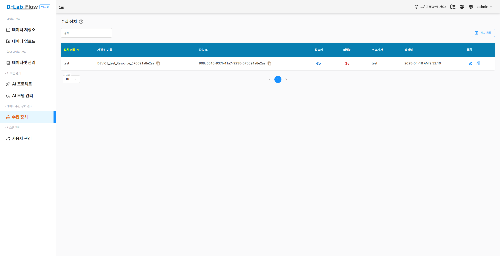
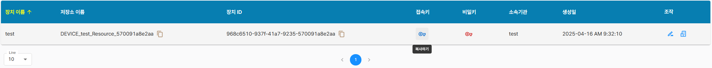
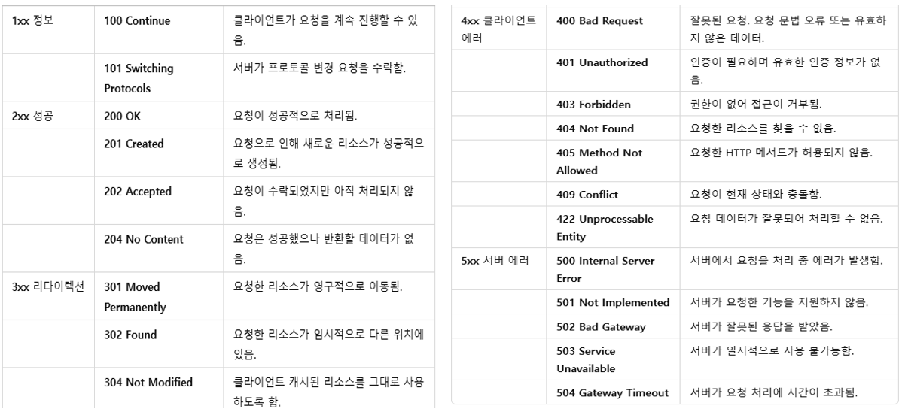
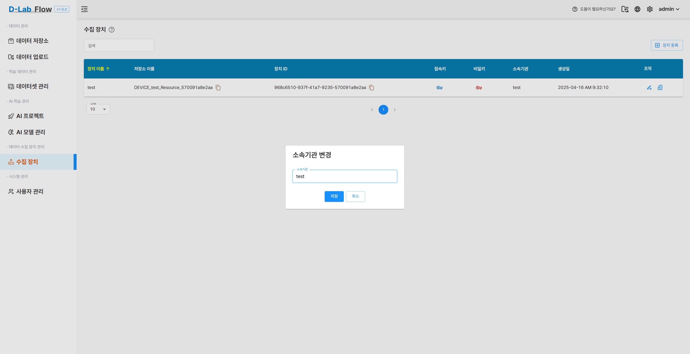

# 수집 장치

수집 장치 페이지에서는 새로운 장치를 등록하고, 등록된 장치를 관리할 수 있습니다.  
등록된 장치는 인공지능 학습용 데이터를 전송하는 데 사용 할 수 있습니다.



## 장치 등록

새로운 장치를 등록하려면 우측 상단의 **장치 등록** 버튼을 클릭합니다.  
장치 등록 창에서 아래의 정보를 입력해야 합니다:

- **장치 이름** (필수)
- **파일 타입** (예: 이미지, 텍스트 등)
- **소속 기관** (필수)


---

## 장치 목록

등록된 장치는 아래와 같은 정보와 함께 목록으로 제공됩니다:

| 항목 | 설명 |
|------|------|
| 장치 이름 | 사용자가 입력한 장치의 이름 |
| 저장소 이름 | 연동된 데이터 저장소 이름 |
| 장치 ID | 시스템이 자동 생성한 고유 식별자 |
| 접속 키 / 비밀 키 | 인증 키로 클릭 시 복사 기능 제공 |
| 생성일 | 장치가 등록된 날짜 및 시간 |
| 소속 기관 | 해당 장치가 속한 기관명 |
| 조작 | 수정 또는 삭제 기능 버튼 |

---

## 🔑 키 발급 및 사용

장치 등록이 완료되면 다음과 같은 정보가 자동 발급됩니다.

- **장치 ID**  
  → 장치를 고유하게 식별하는 UUID 형식의 고유 값입니다.

- **접속 키**
- **비밀 키**

> 접속 키 및 비밀 키는 보안 인증을 위한 자격 정보로 사용되며,  
> **아이콘을 클릭하면 자동으로 복사**되어 붙여넣기에 사용할 수 있습니다. 
> 이후 API 요청 시 header에 포함시켜야 합니다.




> ⚠️ 주의: 접속 키와 비밀 키는 외부에 노출되지 않도록 주의하세요.  
> 유출 시 시스템 접근 위험이 있습니다.

---

## 🛠️ 예시: 학습 파일 업로드 API

아래는 발급받은 키를 사용하여 데이터를 업로드하는 API 예시입니다.

- **Method:** `POST`
- **URL:** `/api/v1/device/whope/data`
- **인증 방식:** API Key (Header)

### ✅ 요청 구조

| 구분 | Key           | 설명                                      | Type  |
|------|---------------|-------------------------------------------|--------|
| header | `accessKey`    | 장치 관리 메뉴에서 발급받은 키 사용         | `text` |
| header | `accessSecret` | 장치 관리 메뉴에서 발급받은 키 사용         | `text` |
| body (form-data) | `whopeImage` | 전송할 학습용 파일                         | `file` |

### 📡 응답 구조

| 구분 | 설명          |
|------|----------------|
| status code | 요청 처리 결과 상태 코드 |
| header      | 응답 메타데이터         |
| body        | 응답 본문 내용           |

---

### 📤 Python 예제 코드

```md title="Python"
---
import requests

# API URL 및 헤더 설정
url = "https://dlabflow.grit.re.kr/api/v1/device/whope/data"
headers = {
    'accessKey': 'ACCESSKEY_FORM_DEVICE',
    'accessSecret': ACCESSKEYSECRET_FORM_DEVICE'
}

# 업로드할 파일 경로
file_path = "/경로/파일이름.jpg"

# 파일 업로드 요청
with open(file_path, 'rb') as file:
    files = {
        'whopeImage': (
            file_path.split("/")[-1],
            file,
            'application/octet-stream'
        )
    }
    response = requests.post(url, files=files, headers=headers)

# 응답 출력
print("Response Code:", response.status_code)
print("Response Text:", response.text)

```
### 📬 REST API 상태 코드



---

## ✏️ 장치 이름 변경

- 장치 목록에서 **연필 아이콘(✏️)** 을 클릭하면 장치 이름을 수정할 수 있는 창이 열립니다.
- 장치 이름 변경 입력 창에서 새로운 장치를 입력 후 저장하면 변경됩니다.
- 변경된 장치 이름은 목록 및 관련 데이터와 자동 연동됩니다.


> ⚠️ 변경된 장치 이름은 시스템 내부에서는 영향을 주지 않지만,  
> 사용자 인터페이스에서의 구분을 위해 명확하게 지정하는 것이 좋습니다.

---

## 🏢 소속 기관 변경

- 장치 목록에서 **건물 아이콘(🏢)** 을 클릭하면 소속 기관을 수정할 수 있는 창이 열립니다.
- 소속 기관 입력 창에서 새로운 기관명을 입력 후 저장하면 변경됩니다.



> ✅ 소속 기관 변경은 **데이터 관리 주체를 명확히 하기 위한 용도**이며,  
> 변경 이력은 시스템 로그에 기록됩니다.

---
