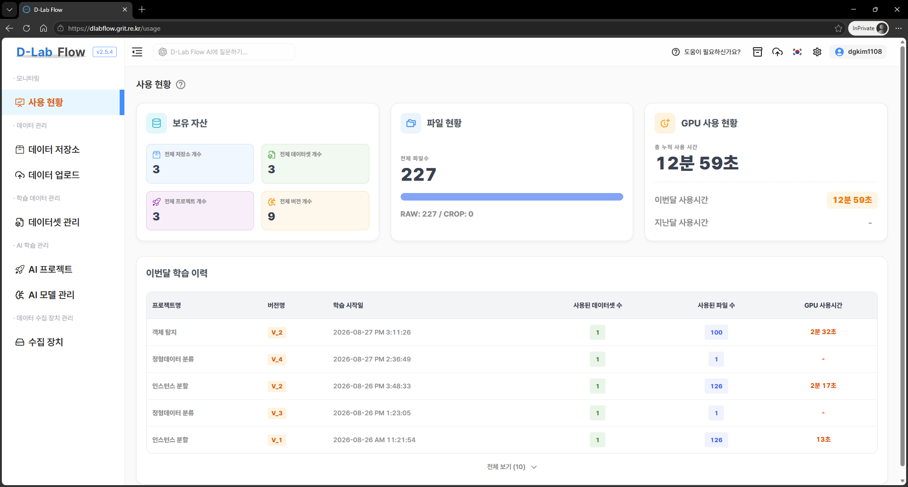

# 사용 현황

**사용 현황**은 보유한 자산과 GPU 사용 시간 등의 정보를 한눈에 확인할 수 있는 기능입니다.
이 페이지에서는 **보유 자산**, **파일 현황**, **GPU 사용 현황**, **이번 달 학습 이력**을 확인할 수 있습니다.

## 보유 자산

사용 현황의 **보유 자산**에서는 현재 보유하고 있는 저장소, 데이터셋, 프로젝트, 버전의 개수를 확인할 수 있습니다.

각 자산의 전체 개수를 통해 현재 생성되어 관리되고 있는 리소스의 규모를 한눈에 파악할 수 있습니다. 프로젝트나 데이터셋 등이 얼마나 생성되어 있는지 확인할 때 활용할 수 있습니다.

:::tip
- 보유 자산에서 확인할 수 있는 항목입니다.
    👉 전체 저장소 개수: 현재 생성되어 있는 저장소의 전체 개수입니다.
    👉 전체 데이터셋 개수: 현재 보유하고 있는 데이터셋의 전체 개수입니다.
    👉 전체 프로젝트 개수: 현재 생성되어 있는 프로젝트의 전체 개수입니다.
    👉 전체 버전 개수: 프로젝트에서 생성된 버전의 전체 개수입니다.
:::

## 파일 현황

사용 현황의 **파일 현황**에서는 현재 보유하고 있는 전체 파일 수를 확인할 수 있습니다.

프로젝트나 데이터셋 등에 등록되어 있는 파일의 전체 개수를 제공하므로, 현재 관리하고 있는 파일의 규모를 확인할 수 있습니다.

## GPU 사용 현황

사용 현황의 **GPU 사용 현황**에서는 GPU를 얼마나 사용했는지 누적 및 월별 사용 시간으로 확인할 수 있습니다.

전체 누적 사용 시간뿐만 아니라 이번 달과 지난달의 사용 시간을 함께 제공하여, 최근 GPU 사용량의 변화를 확인하고 사용 현황을 비교할 수 있습니다.

:::tip
- GPU 사용 현황에서 확인할 수 있는 항목입니다.
    👉 총 누적 사용 시간: 지금까지 학습 및 작업에 사용한 GPU의 전체 누적 사용 시간입니다.
    👉 이번 달 사용 시간: 이번 달에 사용한 GPU의 총 사용 시간입니다.
    👉 지난달 사용 시간: 지난달에 사용한 GPU의 총 사용 시간입니다.
:::

## 이번달 학습 이력

사용 현황의 **이번 달 학습 이력**에서는 이번 달에 진행한 학습 작업의 상세 정보를 확인할 수 있습니다.

학습에 사용된 프로젝트와 버전, 학습 시작일, 데이터셋 및 파일 수, GPU 사용 시간을 함께 제공하여 어떤 학습 작업을 수행했으며 해당 학습에 어느 정도의 리소스가 사용되었는지 확인할 수 있습니다.

:::tip
- 학습 이력에서는 다음 정보를 확인할 수 있습니다.
    👉 프로젝트명: 학습에 사용된 프로젝트의 이름입니다.
    👉 버전명: 학습에 사용된 프로젝트 버전의 이름입니다.
    👉 학습 시작일: 해당 학습 작업을 시작한 날짜입니다.
    👉 사용된 데이터셋 수: 해당 학습 작업에 사용된 데이터셋의 개수입니다.
    👉 사용된 파일 수: 해당 학습 작업에 사용된 파일의 개수입니다.
    👉 GPU 사용 시간: 해당 학습 작업에서 사용한 GPU의 총 사용 시간입니다.
:::	